# 使用 AI 公式產生器 {#create-ranking-formulas}

**排名公式**&#x200B;可讓您定義規則，這些規則將決定應首先顯示哪個優惠，而不是考慮優先順序分數。

若要建立這些規則，**[!UICONTROL Adobe Journey Optimizer]**&#x200B;中的AI公式產生器可提供更大的彈性，並可控制優惠的排名方式。 您現在可以定義自訂排名公式，這些公式透過引導式介面組合AI模型分數、優惠方案優先順序、設定檔屬性、優惠方案屬性和內容訊號，而不是僅仰賴靜態優惠方案優先順序。

此方法可讓您根據AI驅動的傾向、業務價值和即時內容的任意組合，動態調整優惠方案排名，讓您更輕鬆地根據行銷目標和客戶需求做出決策。 AI公式產生器支援簡單或進階公式，視您要套用多少控制項而定。

建立排名公式後，您可以將其指派給[選取策略](../selection-strategies.md)。 如果使用此選擇策略時多個優惠方案都符合呈現的條件，決策引擎會使用選取的公式來計算要先傳送哪個優惠方案。

## 建立排名公式 {#create-ranking-formula}

>[!CONTEXTUALHELP]
>id="ajo_exd_config_formulas"
>title="建立排名公式"
>abstract="排名公式可讓您定義規則，將決定應先呈現的決定項目，而不是考慮項目的優先順序分數。一旦建立排名公式，您即可將其指派至選取策略。"

若要建立排名公式，請遵循下列步驟。

1. 存取&#x200B;**[!UICONTROL 策略設定]**&#x200B;功能表，然後選取&#x200B;**[!UICONTROL 排名公式]**&#x200B;索引標籤。 此時會顯示先前建立的公式清單。

   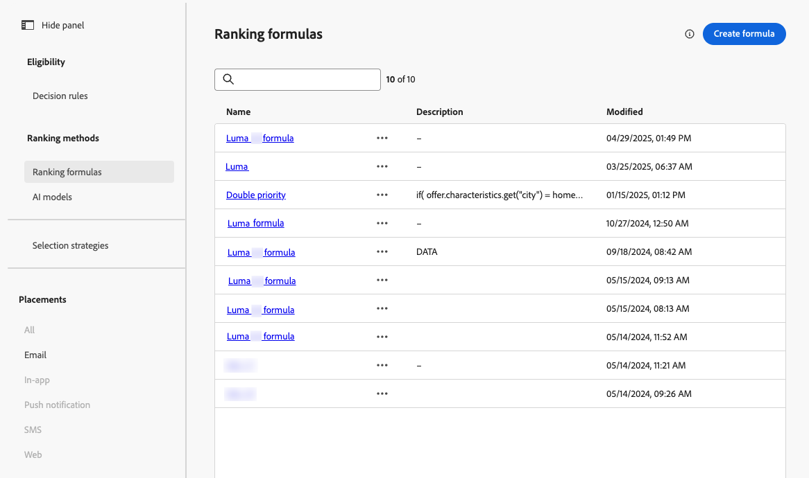

1. 按一下&#x200B;**[!UICONTROL 建立公式]**。

1. 指定公式名稱，並視需要新增說明。

   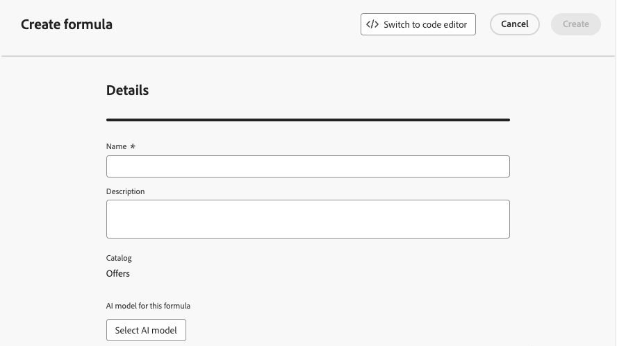{width="80%"}

1. 或者，按一下&#x200B;**[!UICONTROL 選取AI模型]**&#x200B;以設定模型，此模型將作為建立排名公式的參考。

   >[!NOTE]
   >
   >[AI公式產生器不支援使用連續量度的個人化最佳化模型](personalized-optimization-model.md)。

   當您在下方定義公式時每次參考模型分數時，將會使用您選取的AI模型。

   >[!CAUTION]
   >
   >使用納入排名公式的AI模型時，資料不會反映在保留和模型驅動流量的[轉換率](../../reports/campaign-global-report-cja-code.md#conversion-rate)報表中。

1. 定義將決定相符決策專案排名分數的條件。 您可以

   * 從&#x200B;**[!UICONTROL 使用者介面]**&#x200B;填入[條件](#ranking-select-criteria)區段，
   * 或切換至[程式碼編輯器](#ranking-code-editor)。

   >[!NOTE]
   >
   >排名公式中的巢狀深度限製為30個層級。 這是透過計算PQL字串中的`)`個右括弧來測量。 規則字串的大小最多可達8KB （UTF-8編碼字元）。 這相當於8,000個ASCII字元（每個1個位元組），或2,000-4,000個非ASCII字元（每個2-4個位元組）。 [進一步瞭解Decisioning護欄和限制](../decisioning-guardrails.md#ranking-formulas)

1. 您也可以使用Adobe Experience Platform中的資料來動態調整排名邏輯，以反映真實世界的條件。 這對於經常變更的屬性（例如產品可用性或即時定價）特別有用。

   所有客戶都可在公開測試版中，使用此功能。如果您想要存取許可權，請聯絡您的客戶代表。 [瞭解如何將Adobe Experience Platform資料用於決策](../aep-data-exd.md)

<!--## Select an ELS dataset {#els-dataset}

Journey Optimizer allows you to leverage data from Adobe Experience Platform. [Learn more](../data/aep-data-perso.md)

To leverage data from an AEP dataset, follow the steps below.

1. From the **[!UICONTROL ELS settings]** section, select an ELS dataset from the list.

1. Select a decision attribute.

    >[!NOTE]
    >
    >This action is mandatory.

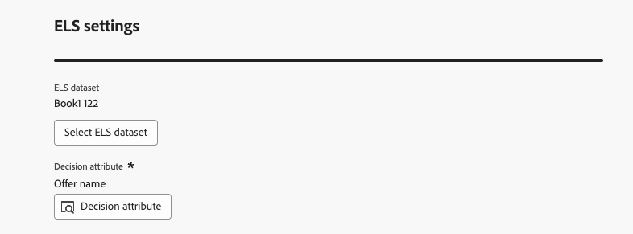{width="80%"-->

## 使用公式產生器定義條件 {#ranking-select-criteria}

透過直覺式介面，您可以透過調整AI分數（傾向）、選件值（優先順序）、情境槓桿和外部設定檔傾向來微調決策，以個別或結合方式最佳化每個互動。<!--Whether you are maximizing revenue, promoting strategic offers, or balancing business goals with real-time context, the formula builder gives you total control in defining ranking strategies.-->

若要直接從介面定義條件，請遵循下列步驟。

<!--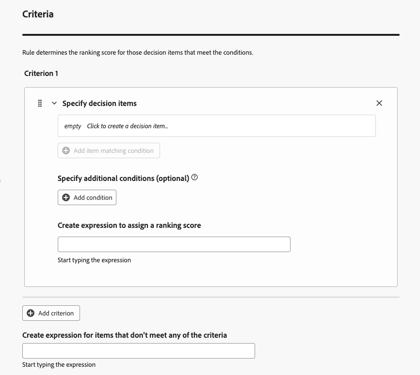{width="80%"}-->

1. 在&#x200B;**[!UICONTROL 條件1]**&#x200B;區段中，執行下列動作，指定您要套用排名分數的決定專案：
   * 選取[決定專案屬性](../items.md#attributes)，
   * 選取邏輯運運算元，
   * 新增符合條件 — 您可以輸入值、選取設定檔屬性或[內容資料](../context-data.md)。

   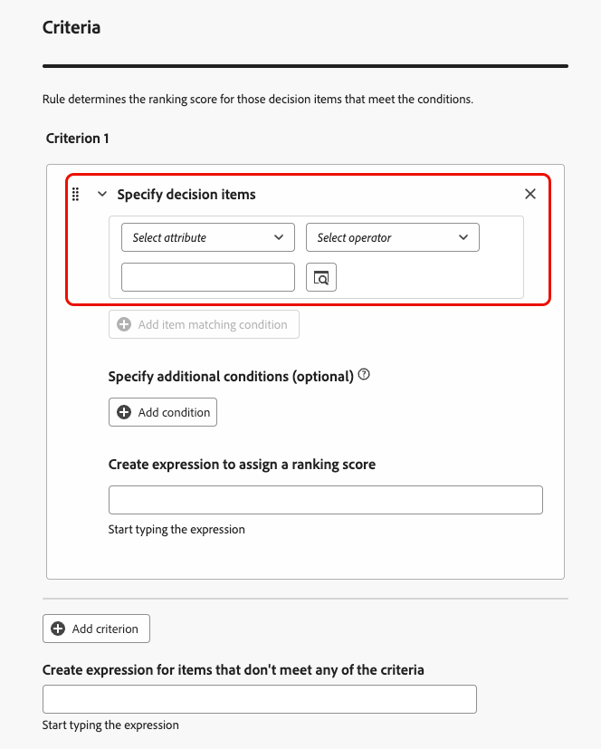{width="70%"}

1. 或者，您可以指定其他元素，將條件的符合條件調整為true。

   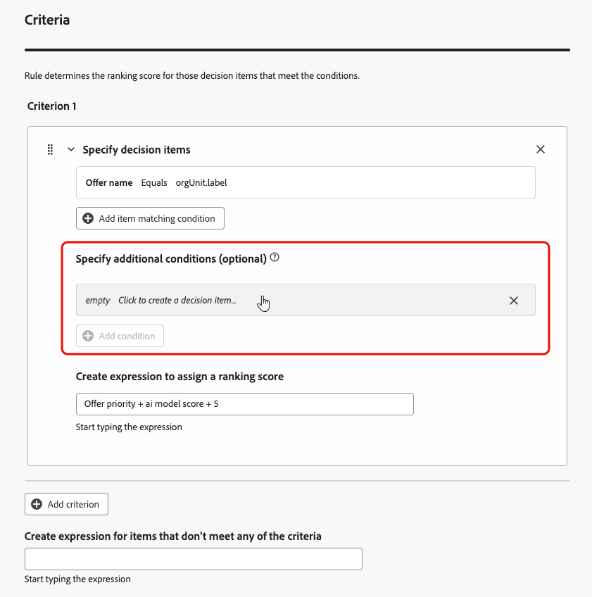{width="80%"}

   例如，您定義了條件1，例如&#x200B;*天氣*&#x200B;自訂屬性&#x200B;*等於* *溫暖*&#x200B;條件。 此外，您可以新增其他條件，例如，如果滿足第一個條件，而且請求時的溫度超過75度，則條件1為true。<!--Add a screenshot with the example-->

1. 建立運算式，將排名分數指派給符合上述條件之決定專案。 您可以參考下列任一專案：

   * 來自於您在&#x200B;**[!UICONTROL 詳細資料]**&#x200B;區段[以上](#create-ranking-formula)中選擇的AI模型；
   * 決定專案的優先順序，這是在[建立決定專案](../items.md#attributes)時手動指派的值；<!--If a profile qualifies for multiple decision items, a higher priority grants the item precedence over others.-->
   * 可能存在於設定檔上的任何屬性，例如任何外部衍生的傾向分數；
   * 能以自由格式指派的靜態值；
   * 以上各項的任意組合。

   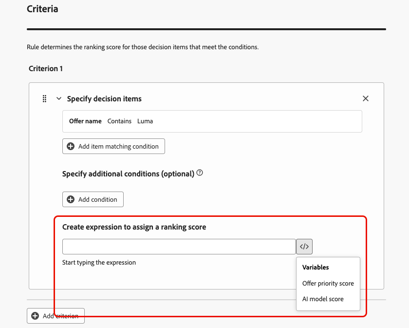{width="70%"}

   >[!NOTE]
   >
   >按一下欄位旁的圖示，新增預先定義的變數。

1. 按一下[新增條件]****，視需要多次新增一或多個條件。 邏輯如下：
   * 如果指定決策專案的第一個條件為true，則其優先於下一個條件。
   * 如果不為true，則決策引擎會繼續執行第二個標準，以此類推。

1. 在最後一個欄位中，您可以建立運算式，該運算式將被指派給不符合上述條件的所有決定專案。

   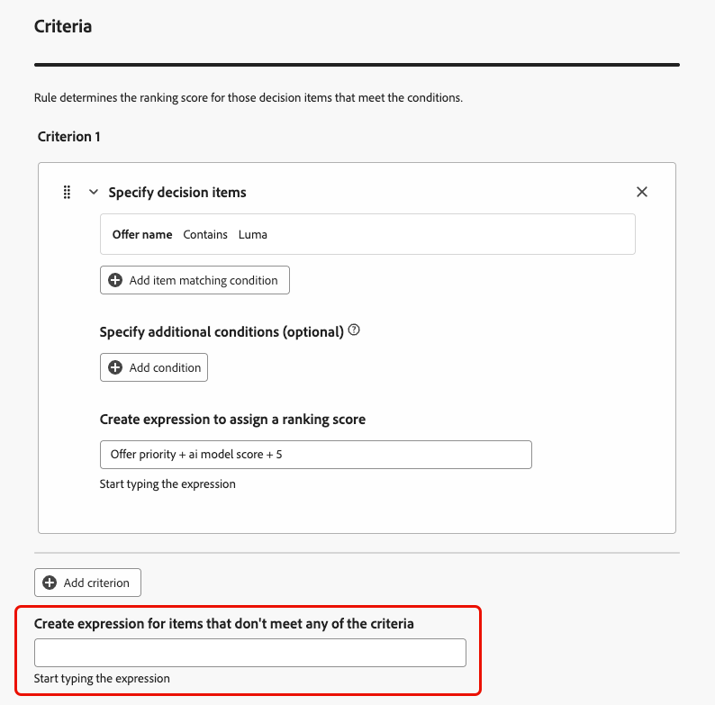{width="70%"}

1. 按一下&#x200B;**[!UICONTROL 建立]**&#x200B;以完成您的排名公式。 您現在可以從清單中選取它以檢視其詳細資訊，並編輯或刪除它。 已準備好在[選取策略](../selection-strategies.md)中使用它來排名合格的決定專案。

### 排名公式範例

考量下列範例：

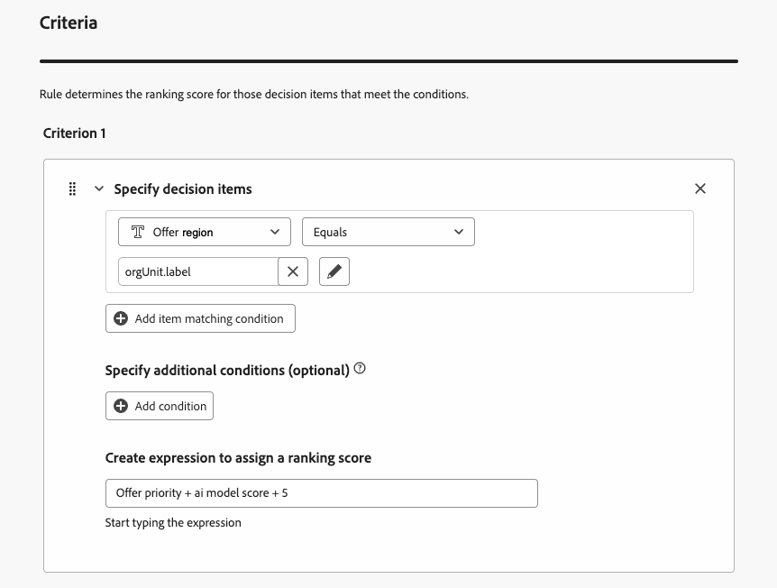{width="80%"}

如果決策專案的區域（自訂屬性）等於設定檔的地理標籤（設定檔屬性），此處表示的排名分數（決策專案優先順序、AI模型分數和靜態值的組合）將套用至符合該條件的所有決策專案。

## 使用程式碼編輯器 {#ranking-code-editor}

若要以&#x200B;**PQL語法**&#x200B;表示排名公式，請使用熒幕右上角的專用按鈕切換至程式碼編輯器。 如需如何使用PQL語法的詳細資訊，請參閱[專屬檔案](https://experienceleague.adobe.com/docs/experience-platform/segmentation/pql/overview.html?lang=zh-Hant)。

>[!CAUTION]
>
>此動作將阻止您返回此公式的預設產生器檢視。

然後，您就可以運用設定檔屬性、[內容資料](../context-data.md)和[決定專案屬性](../items.md#attributes)。

例如，如果實際天氣炎熱，您想要提高所有具有「炎熱」屬性之選件的優先順序。 若要這麼做，已在決策呼叫中傳遞&#x200B;**contextData.weather=hot**。<!--[Learn how to work with context data](context-data.md)-->

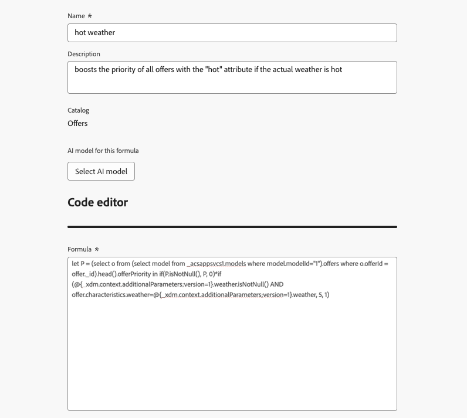{width="80%"}

>[!IMPORTANT]
>
>建立排名公式時，不支援回顧過去時段，例如將上個月發生的體驗事件新增為公式的元件。 在公式建立期間任何包含回顧期間的嘗試將在儲存時觸發錯誤。

若要在公式中運用與決策專案相關的屬性，請務必遵循排名公式程式碼中的正確語法。 展開每個區段以取得詳細資訊：

+++利用決策專案標準屬性

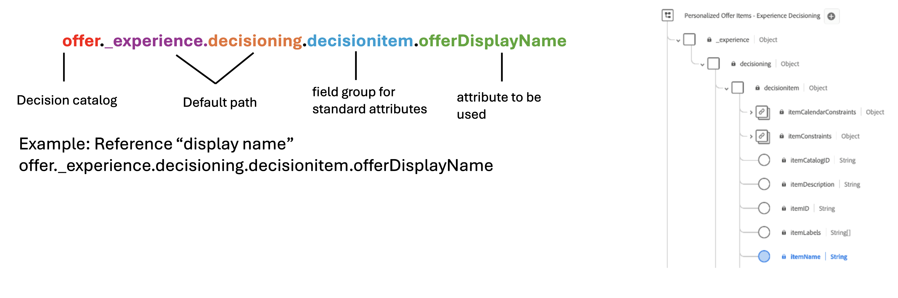

+++

+++利用決策專案自訂屬性

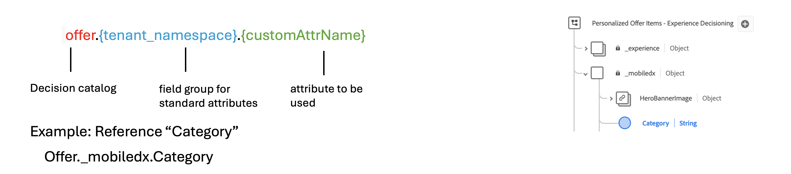

+++

### 排名公式PQL範例 {#ranking-formula-examples}

您可以視需要建立許多不同的排名公式。 以下是一些範例。

+++根據設定檔屬性，以特定優惠方案屬性提升優惠方案

如果設定檔位在與優惠方案對應的城市，則將該城市中所有優惠方案的優先順序加倍。

**排名公式：**

```
if( offer.characteristics.get("city") = homeAddress.city, offer.rank.priority * 2, offer.rank.priority)
```

+++

+++結束日期距離現在不足24小時的提升選件

**排名公式：**

```
if( offer.selectionConstraint.endDate occurs <= 24 hours after now, offer.rank.priority * 3, offer.rank.priority)
```

+++

+++根據客戶購買所提供產品的傾向提升優惠方案

您可以根據客戶傾向分數來提升優惠方案的分數。

在此範例中，執行個體租使用者是&#x200B;*_salesvelocity*，而且設定檔結構描述包含儲存在陣列中的分數範圍：


有鑑於此，對於設定檔，例如：

```
{"_salesvelocity": {"individualScoring": [
                    {"core": {
                            "category":"insurance",
                            "propensityScore": 96.9
                        }},
                    {"core": {
                            "category":"personalLoan",
                            "propensityScore": 45.3
                        }},
                    {"core": {
                            "category":"creditCard",
                            "propensityScore": 78.1
                        }}
                    ]}
}
```

+++

+++根據內容資料提升優惠方案

[!DNL Journey Optimizer]可讓您根據呼叫中傳遞的內容資料，提升某些優惠方案。 例如，如果傳遞`contextData.weather=hot`，則必須提升所有具有`attribute=hot`的優惠方案的優先順序。

>[!NOTE]
>
>如需有關如何傳遞內容資料<!-- using the **Edge Decisioning** and **Decisioning** APIs-->的詳細資訊，請參閱[本節](../context-data.md)。

請注意，使用&#x200B;**決策** API時，內容資料會新增至請求內文中的設定檔元素，如下例所示：

```
"xdm:profiles": [
{
    "xdm:identityMap": {
        "crmid": [
            {
            "xdm:id": "CRMID1"
            }
        ]
    },
    "xdm:contextData": [
        {
            "@type":"_xdm.context.additionalParameters;version=1",
            "xdm:data":{
                "xdm:weather":"hot"
            }
        }
    ]
    
}],
```

+++
