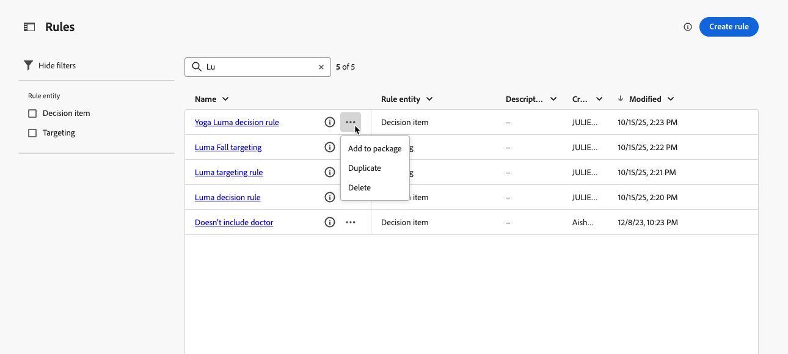
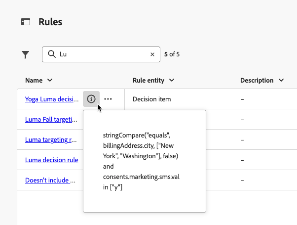
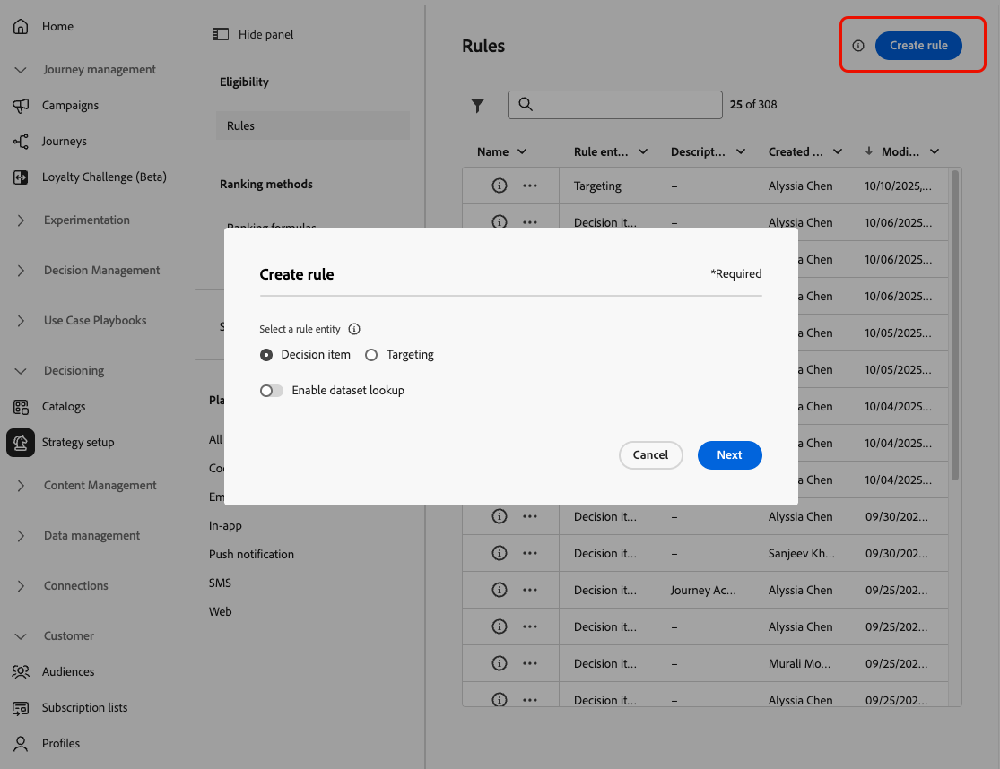
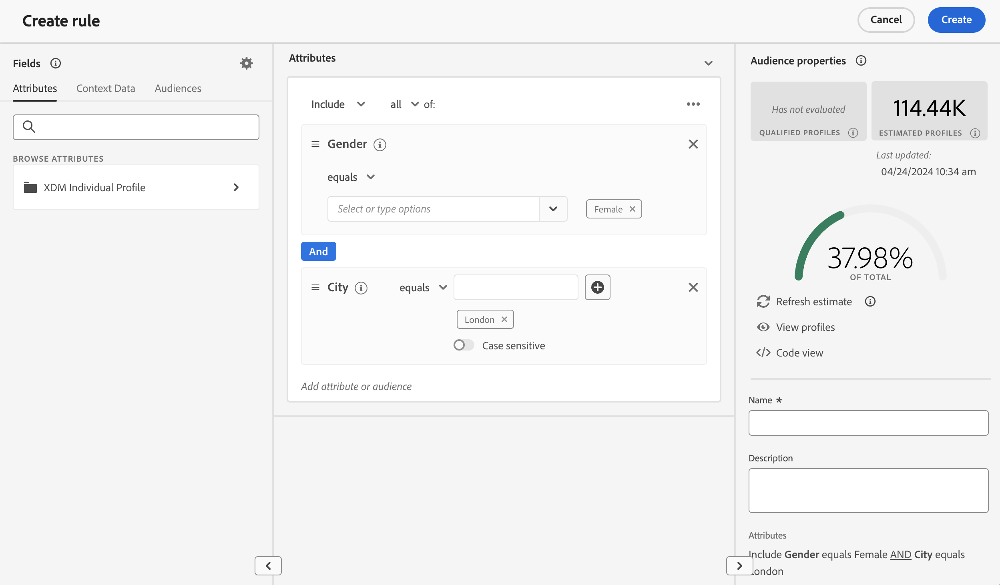
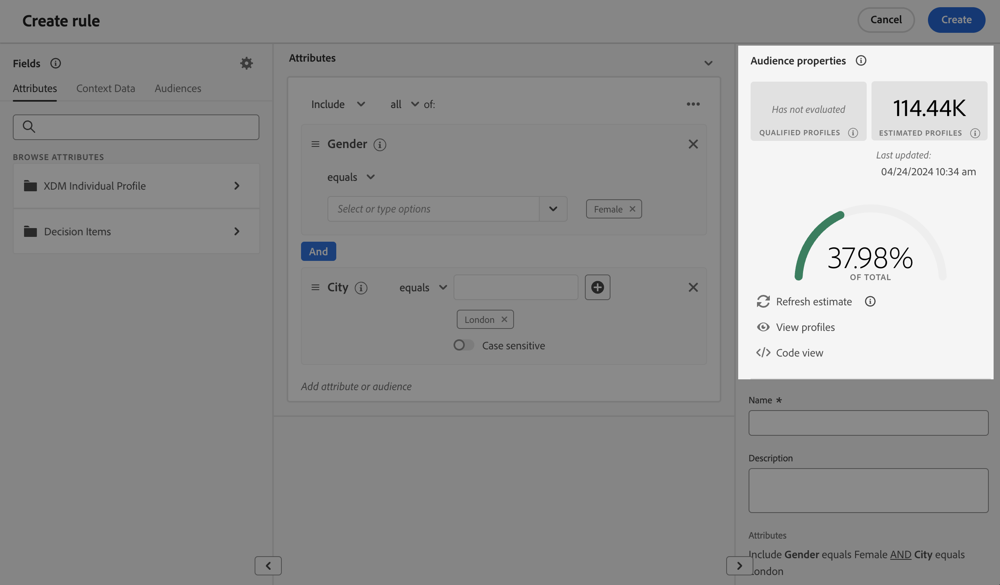

# 建置規則 {#rules}

>[!CONTEXTUALHELP]
>id="ajo_exd_config_rules"
>title="建立規則"
>abstract="您可以建立兩種型別的規則： **決定規則** （可用於決定專案或選擇策略）、控制應該向哪些對象呈現哪些專案，或&#x200B;**目標規則** （用於決定符合接收個人化內容資格的特定對象區段，或輸入特定歷程路徑）。  建立決定規則時，您可以選取&#x200B;**[!UICONTROL 啟用資料集查詢]**&#x200B;以使用Adobe Experience Platform資料。 這可讓您根據動態的外部屬性來定義適用性條件，確保決定項目只會在相關時顯示。"

## 關於規則 {#about}

在[!DNL Journey Optimizer]中，您可以建立兩種可重複使用的規則：

* [決定規則](#decision-rules)
* [鎖定目標規則](#targeting-rules)

### 決定規則 {#decision-rules}

決定規則可讓您透過直接在決定專案層級或在特定選擇策略中套用限制，來定義決定專案的對象。 這能讓您精確控制應向誰呈現哪些項目。

例如，假設您的決策專案為女性設計，其中含有瑜伽相關產品。 透過決定規則，您可以指定只向性別為「女性」且已在「瑜伽」中指明「地標」的個人檔案顯示這些專案。

>[!NOTE]
>
>除了專案與選擇策略層級的決定規則之外，您也可以在行銷活動層級定義您打算的對象。 [了解更多](../campaigns/create-campaign.md#audience)

### 鎖定目標規則 {#targeting-rules}

>[!AVAILABILITY]
>
>目標定位規則目前處於「有限可用性」。請聯絡您的 Adobe 代表以取得存取權。
>
>請注意，此功能僅適用於已購買&#x200B;**決策**&#x200B;附加元件產品的組織。 此功能將逐步向所有客戶推出。

鎖定目標規則可讓您根據特定受眾區段，決定客戶必須符合哪些特定資格，才能有資格接收個人化內容或進入特定歷程路徑，這可讓您鎖定歷程和行銷活動中的子受眾。

很多時候，除了客戶行為事件和內容資料之外，這些事件也是多個屬性的組合。 為了節省您的時間和精力，您可以建立一次目標定位規則，並在您的歷程和行銷活動中重複使用，還可以在編寫時快速內嵌修改規則。

您可以使用下列任一規則：

* 在歷程或行銷活動中建立[內容最佳化目標](../content-management/optimization-targeting.md)時；
* 建置[歷程路徑最佳化](../building-journeys/optimize.md#targeting)時。

➡️ [在影片中探索此功能](#video)

## 存取權規則 {#access}

可在&#x200B;**[!UICONTROL 決策]** > **[!UICONTROL 策略設定]**&#x200B;功能表中存取規則清單。

下列動作可供使用：

* 您可以篩選規則實體（**[!UICONTROL 決定專案]**&#x200B;或&#x200B;**[!UICONTROL 鎖定目標]** - [瞭解更多](#about)）。

* 按一下規則名稱以選取規則，並使用規則產生器加以編輯。 [了解作法](#create)

* 從每個專案旁的&#x200B;**[!UICONTROL 更多動作]**&#x200B;按鈕，您可以：

   * 如果您選取了&#x200B;**[!UICONTROL 決定專案]**&#x200B;實體，請將規則新增至套件，以便將其匯出至另一個沙箱。 瞭解如何[將物件匯出至另一個沙箱](../configuration/copy-objects-to-sandbox.md)。
   * 複製規則。
   * 刪除規則。

{width=100%}

* 按一下&#x200B;**[!UICONTROL 更多資訊]**&#x200B;圖示以顯示組成規則的公式。

{width=60%}

## 建立規則 {#create}

若要建立規則，請遵循下列步驟：

1. 導覽至&#x200B;**[!UICONTROL 決策]** > **[!UICONTROL 策略設定]** > **[!UICONTROL 規則]**，然後按一下&#x200B;**[!UICONTROL 建立規則]**&#x200B;按鈕。

1. 選取規則實體，以指定要為其建立規則的物件型別。

   {width=90%}

   * **[!UICONTROL 決定專案]** — 規則可以套用至決策內容中的[決定專案](#decision-rules)；
   * **[!UICONTROL 鎖定目標]** — 建置[鎖定目標](#targeting-rules)規則時，可使用此規則，做為行銷活動中[內容最佳化](../content-management/optimization-targeting.md)的一部分，或在[最佳化歷程活動](../building-journeys/optimize.md#targeting)中的歷程。

1. 如果您建立&#x200B;**[!UICONTROL 決定專案]**&#x200B;規則，可以選取&#x200B;**[!UICONTROL 啟用資料集查閱]**，以使用來自Adobe Experience Platform的資料，以使用外部資料擴充您的決定邏輯。 這對於經常變更的屬性（例如產品可用性或即時定價）特別有用。

   >[!AVAILABILITY]
   >
   >所有客戶都可在公開測試版中，使用此功能。如果您想要存取許可權，請聯絡您的客戶代表。 [瞭解如何將Adobe Experience Platform資料用於決策](../experience-decisioning/aep-data-exd.md)

1. 規則建立畫面隨即開啟。 為規則命名並提供說明。

1. 使用Adobe Experience Platform區段產生器建立符合您需求的規則。 為此，您可以利用各種資料來源，例如：
   * 設定檔屬性；
   * 決定專案屬性 — 僅在建立&#x200B;**[!UICONTROL 決定專案]**&#x200B;規則時可用；
   * 受眾；
   * 來自Adobe Experience Platform的內容資料。 [瞭解如何運用內容資料](context-data.md)

   {width=85%}

   >[!NOTE]
   >
   >與Adobe Experience Platform區段服務所使用的區段產生器相比，用來建立規則的區段產生器呈現出一些特性。 但是，檔案中說明的全域程式對於在[!DNL Journey Optimizer]中建置規則是有效的。 [瞭解如何建立區段定義](../audience/creating-a-segment-definition.md)

1. 當您在工作區中新增及設定新欄位時，**[!UICONTROL 對象屬性]**&#x200B;窗格會顯示屬於該對象的預估設定檔資訊。 按一下&#x200B;**[!UICONTROL 重新整理預估值]**&#x200B;以更新資料。

   {width=85%}

   >[!NOTE]
   >
   >當規則引數包含未儲存在設定檔中的資料（例如內容資料）時，設定檔預估無法使用。

1. 一旦您的規則準備就緒，請按一下[建立]。**&#x200B;** 建立的規則會顯示在清單中，而且會根據您建立的實體而可供使用：

   * 在&#x200B;**個決定專案**&#x200B;和&#x200B;**選取策略**&#x200B;中，用來控管將決定專案呈現給設定檔；
   * 或在內容最佳化或路徑最佳化中建置&#x200B;**目標**&#x200B;時。

>[!NOTE]
>
>規則中的巢狀深度限製為30個層級。 這是透過計算PQL字串中的右括弧`)`來測量。
>
>規則字串的大小最多可達15KB （UTF-8編碼字元）。 這相當於15,000個ASCII字元（每個1個位元組），或3,750-7,500個非ASCII字元（每個2-4個位元組）。
>
>[進一步瞭解適用性規則護欄和限制](decisioning-guardrails.md#eligibility-rules)

## 作法影片 {#video}

瞭解如何在Adobe Journey Optimizer中建立、複製和套用可重複使用的&#x200B;**目標定位規則**，以根據客戶屬性（例如地區、語言和行為）有效率地個人化行銷活動 — 在提高對象精確度的同時節省時間。

>[!VIDEO](https://video.tv.adobe.com/v/3476138/?captions=chi_hant&quality=12)
