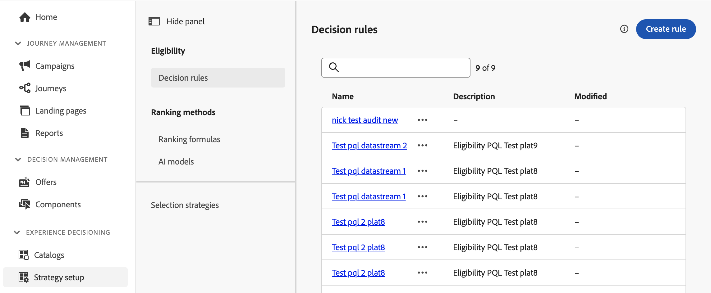

# 決定規則 {#rules}

>[!CONTEXTUALHELP]
>id="ajo_exd_config_rules"
>title="建立決策規則"
>abstract="決定規則可讓您透過直接在決定項目層級或在特定選擇策略內套用限制來定義決定項目的客群。 這能讓您精確控制應向誰呈現哪些項目。  選取&#x200B;**[!UICONTROL 使用資料集]**&#x200B;建立規則，以在決定規則中使用Adobe Experience Platform資料。 這可讓您根據動態的外部屬性定義資格標準，確保僅在相關時顯示決策專案。"

## 關於決定規則 {#about}

決定規則可讓您透過直接在決定項目層級或在特定選擇策略內套用限制來定義決定項目的客群。 這能讓您精確控制應向誰呈現哪些項目。

例如，假設您的決策專案為女性設計，其中含有瑜伽相關產品。 透過決定規則，您可以指定只向性別為「女性」且已在「瑜伽」中指明「地標」的個人檔案顯示這些專案。

>[!NOTE]
>
>除了專案與選擇策略層級的決定規則之外，您也可以在行銷活動層級定義您打算的對象。 [了解更多](../campaigns/create-campaign.md#audience)

決定規則清單可在&#x200B;**[!UICONTROL 策略設定]**&#x200B;功能表中存取。

## 建立決定規則 {#create}

若要建立決定規則，請遵循下列步驟：

1. 導覽至&#x200B;**[!UICONTROL 策略設定]** / **[!UICONTROL 決定規則]**，然後按一下&#x200B;**[!UICONTROL 建立規則]**&#x200B;按鈕。

   >[!NOTE]
   >
   >您也可以使用來自Adobe Experience Platform的資料，透過外部資料讓您的決策邏輯更為豐富。 這對於經常變更的屬性（例如產品可用性或即時定價）特別有用。 所有客戶都可在公開測試版中，使用此功能。如果您想要存取許可權，請聯絡您的客戶代表。 [瞭解如何將Adobe Experience Platform資料用於決策](../experience-decisioning/aep-data-exd.md)

1. 決定規則建立畫面隨即開啟。 為規則命名並提供說明。

1. 使用Adobe Experience Platform區段產生器建立符合您需求的決定規則。 為此，您可以利用各種資料來源，例如：
   * 設定檔和決定專案屬性，
   * 受眾，
   * 來自Adobe Experience Platform的內容資料。 [瞭解如何運用內容資料](context-data.md)

   

   >[!NOTE]
   >
   >相較於Adobe Experience Platform區段服務使用的區段產生器，用來建立決定規則的區段產生器呈現出一些特性。 不過，檔案中描述的全域程式對於建置決定規則仍然有效。 [瞭解如何建立區段定義](../audience/creating-a-segment-definition.md)

1. 當您在工作區中新增及設定新欄位時，**[!UICONTROL 對象屬性]**&#x200B;窗格會顯示屬於該對象的預估設定檔資訊。 按一下&#x200B;**[!UICONTROL 重新整理預估值]**&#x200B;以更新資料。

   >[!NOTE]
   >
   >當規則引數包含不在設定檔中的資料（例如內容資料）時，設定檔預估無法使用。

1. 決定規則準備就緒後，按一下&#x200B;**[!UICONTROL 儲存]**。 建立的規則會顯示在清單中，並可用於決定專案和選取策略，以控管將決定專案呈現給設定檔。

   >[!NOTE]
   >
   >適用性規則中的巢狀深度限製為30個層級。 這是透過計算PQL字串中的`)`個右括弧來測量。 規則字串的大小最多可達15KB （UTF-8編碼字元）。 這相當於15,000個ASCII字元（每個1個位元組），或3,750-7,500個非ASCII字元（每個2-4個位元組）。 [進一步瞭解Decisioning護欄和限制](gs-experience-decisioning.md#guardrails)
