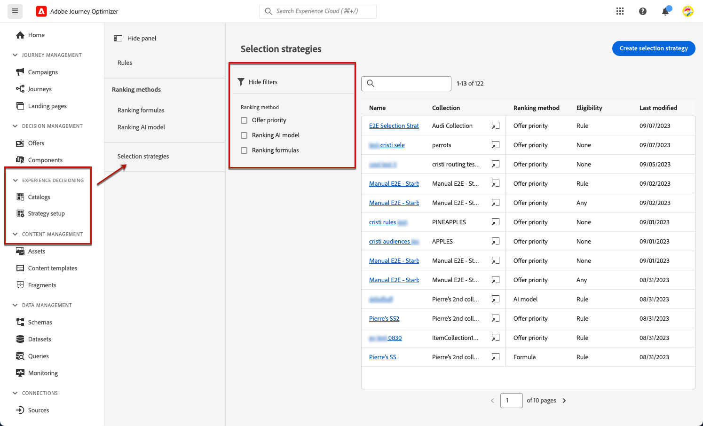
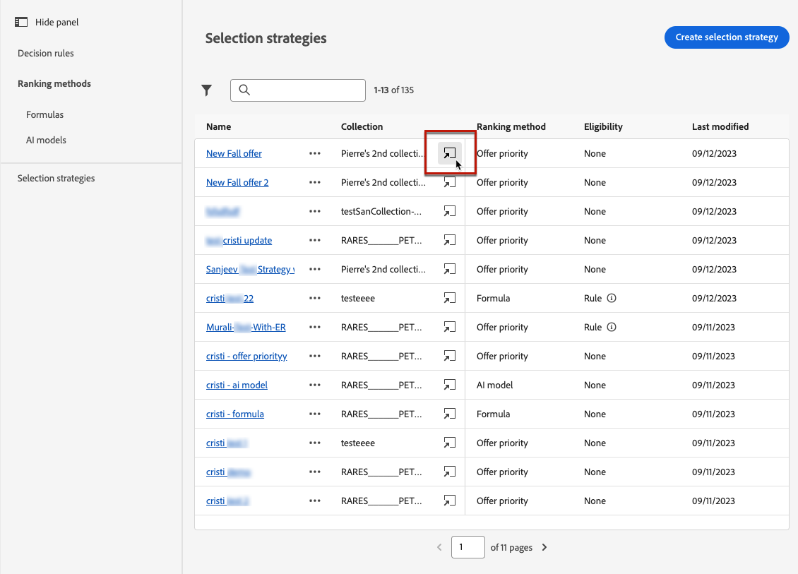
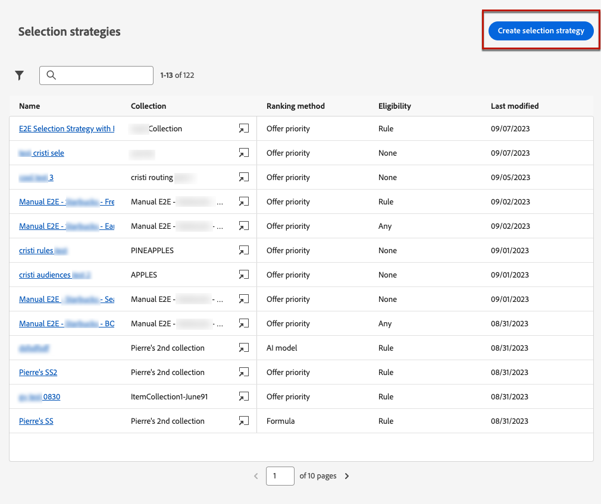

# 建立選擇策略 {#selection-strategies}

>[!CONTEXTUALHELP]
>id="ajo_exd_config_strategies"
>title="定義您的選擇策略"
>abstract="選擇策略可重複使用，並包括與適用性限制和排名方法相關聯的集合，用以確定在選取某個決定原則時要顯示的產品建議。"
>additional-url="https://experienceleague.adobe.com/zh-hant/docs/journey-optimizer/using/decisioning/experience-decisioning/create-decision" text="建立決定原則"

>[!CONTEXTUALHELP]
>id="ajo_exd_strategy_eligibility"
>title="限制符合資格的設定檔"
>abstract="您可以限制此選擇策略的產品建議選擇。 預設情況下，所有設定檔都符合資格，但您可以使用對象或規則將產品建議選擇限制為僅限特定設定檔。"
>additional-url="https://experienceleague.adobe.com/zh-hant/docs/journey-optimizer/using/audiences-profiles-identities/audiences/about-audiences" text="使用對象"
>additional-url="https://experienceleague.adobe.com/zh-hant/docs/journey-optimizer/using/decisioning/experience-decisioning/rules" text="使用決定規則"

選取策略可重複使用，包含與適用性限制關聯的集合，以及決定在[決定原則](create-decision.md)中選取時顯示的優惠的排名方法。

## 存取及管理選擇策略

1. 移至&#x200B;**[!UICONTROL 決策]** > **[!UICONTROL 策略設定]** > **[!UICONTROL 選取策略]**。

1. 目前建立的所有選取策略都會列在清單中。 篩選器可協助您根據排名方法擷取策略。

   

1. 按一下選取策略名稱以進行編輯。

1. 也會顯示針對每個策略選取的集合、排名方法及資格。 您可以按一下每個收藏集名稱旁的圖示，直接編輯收藏集。

   

## 建立選取策略 {#create-selection-strategy}

若要建立選取策略，請遵循下列步驟。

1. 從&#x200B;**[!UICONTROL 選取策略]**&#x200B;詳細目錄，按一下&#x200B;**[!UICONTROL 建立選取策略]**。

   

1. 為您的策略新增名稱。

   >[!NOTE]
   >
   >目前僅提供預設的&#x200B;**[!UICONTROL 選件]**&#x200B;目錄。

1. 從名稱開始，填寫選擇策略的詳細資訊。

   

1. 選取包含要考量之優惠方案的[集合](collections.md)。

1. 使用&#x200B;**[!UICONTROL 資格]**&#x200B;欄位來限制此選取策略的優惠方案選取。

   

   * 若要將優惠方案的選擇限制在Experience Platform對象的成員，請選取「**[!UICONTROL 對象]**」，然後從清單中選擇對象。 [學習如何使用客群](../audience/about-audiences.md)

   * 如果您想要新增具有決定規則的選擇限制，請使用&#x200B;**[!UICONTROL 決定規則]**&#x200B;選項並選取您選擇的規則。 [瞭解如何建立規則](rules.md)

1. 定義您要用來為每個設定檔選取最佳優惠方案的排名方法。 [了解更多](#select-ranking-method)

   

   * 根據預設，如果有多個優惠方案符合此策略的條件，[優惠方案優先順序](#offer-priority)方法會使用優惠方案中定義的值。

   * 如果您想要使用特定的計算分數來選擇要傳遞的合格優惠方案，請選取[公式](#ranking-formula)或[AI模型](#ai-ranking)。

1. 按一下 **[!UICONTROL 建立]**。現在已準備好在[決定原則](create-decision.md)中使用

## 選取排名方法 {#select-ranking-method}

>[!CONTEXTUALHELP]
>id="ajo_exd_strategy_ranking"
>title="定義如何對產品建議進行排名"
>abstract="如果多個產品建議符合特定的選擇策略，請在建立選擇策略時選擇為每個設定檔選取最佳產品建議的方法：優先順序或排名公式。"
>additional-url="https://experienceleague.adobe.com/docs/journey-optimizer/using/decisioning/experience-decisioning/create-decision.html?lang=zh-Hant" text="建立決定原則"

如果數個優惠方案符合指定的選取策略資格，您可以選擇在建立選取策略時，用來選取每個設定檔之最佳優惠方案的方法。 您可以依下列方式排名優惠方案：

* [優惠優先順序](#offer-priority)
* [公式](#ranking-formula)
* [AI 排名](#ai-ranking)

### 優惠優先順序 {#offer-priority}

根據預設，當決策原則中有數個優惠方案符合資格時，具有最高&#x200B;**優先順序**&#x200B;的專案將會先傳遞給客戶。

{width=85%}

建立[決定專案](items.md)時，會指派優惠方案的優先順序分數。

### 排名公式 {#ranking-formula}

除了優惠優先順序之外，Journey Optimizer還可讓您建立&#x200B;**排名公式**。 這些公式可決定應先針對指定位置顯示哪個優惠，而不是考慮優惠的優先順序分數。

例如，您可以提升結束日期距離現在不足24小時的所有優惠方案的優先順序，或如果設定檔的興趣點為「執行中」，則提升「執行中」類別的優惠方案。 瞭解如何在[本節](ranking/ranking-formulas.md)中建立排名公式。

建立之後，您可以在選擇策略中使用此公式。 使用此選取策略時，如果多個優惠方案符合呈現的條件，決策將使用選取的公式來計算要先傳送哪個優惠方案。

### AI 排名 {#ai-ranking}

您也可以使用經過訓練的模型系統，藉由選取AI模型，自動排名要針對指定設定檔顯示的優惠方案。 在[本節](ranking/create-ai-models.md)中瞭解如何建立AI模型。

建立AI模型後，您即可在選取策略中使用它。 如果多個優惠方案都符合條件，經過訓練的模型系統將決定應該首先針對此選擇策略顯示哪個優惠方案。

>[!NOTE]
>
>目前[提升度測量](ranking/auto-optimization-model.md#lift)報告僅適用於[個人化最佳化](ranking/personalized-optimization-model.md) AI模型。

