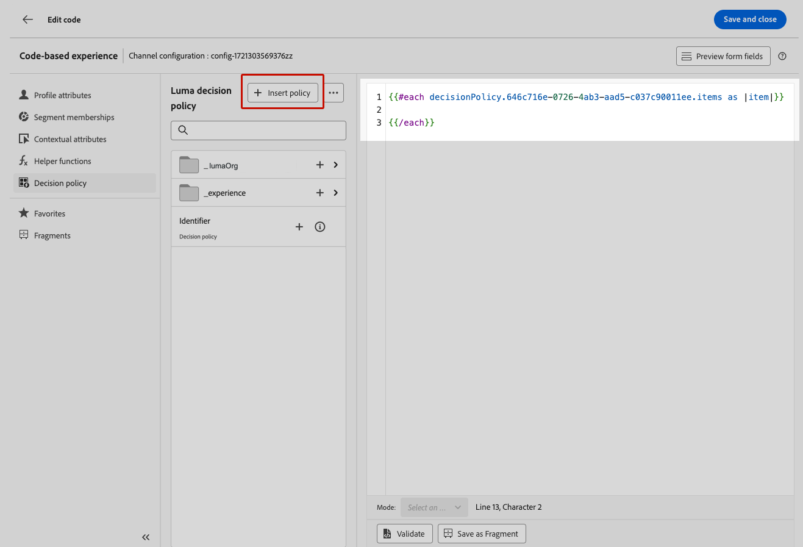
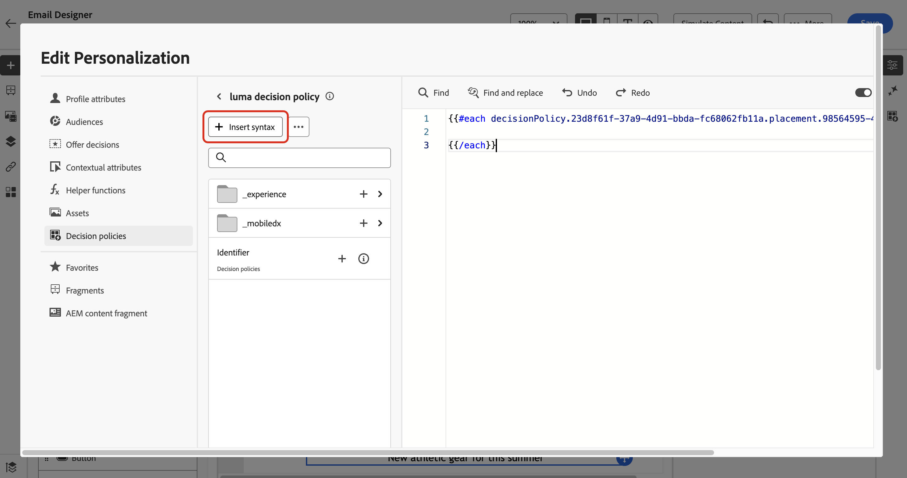
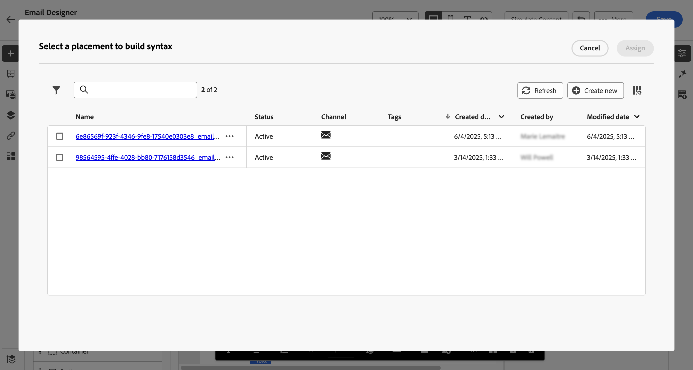
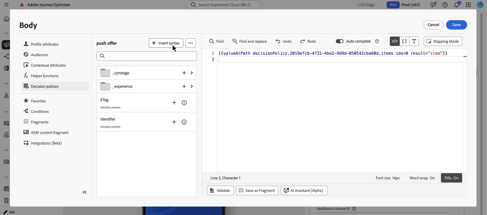
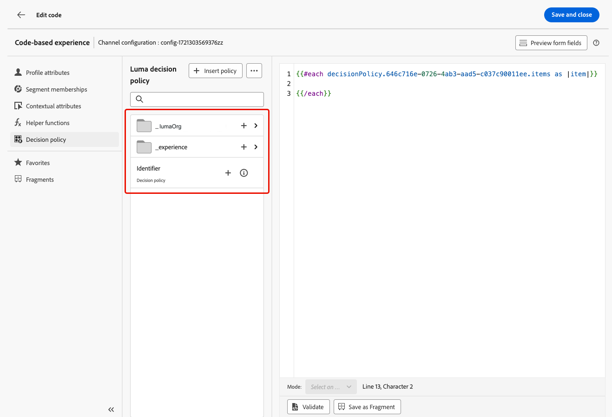
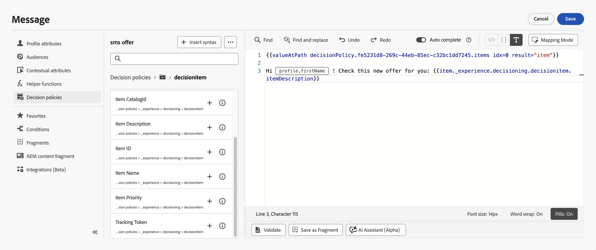
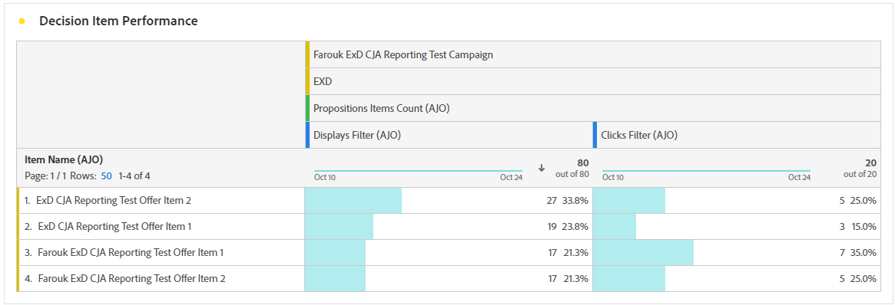

# 在訊息中使用決定原則 {#create-decision}

將決定原則新增至內容後，您就可以使用傳回決定專案的屬性進行個人化。 若要這麼做，請先將決定原則程式碼插入內容中。

>[!CAUTION]
>
>決定原則適用於&#x200B;**程式碼型體驗**、**簡訊**&#x200B;及&#x200B;**推播通知**&#x200B;管道的所有客戶。
>
>**電子郵件**&#x200B;管道的決策功能僅在「有限可用性」中提供。 若要要求存取權，請聯絡您的Adobe代表。 深入瞭解[可用性標籤](../rn/releases.md#availability-labels)。

## 插入決定原則代碼 {#insert}

>[!BEGINTABS]

>[!TAB 程式碼型體驗]

1. 編輯您的程式碼型體驗，並導覽至&#x200B;**[!UICONTROL 決定原則]**。

2. 選取&#x200B;**[!UICONTROL 插入原則]**&#x200B;以新增決定原則代碼。

   

>[!NOTE]
>
>針對程式碼型體驗，如果您的決定原則包含決定專案（包括片段），您可以在決定原則程式碼中利用這些片段。 [瞭解如何利用片段](../experience-decisioning/fragments-decision-policies.md)

>[!TAB 電子郵件]

1. 開啟&#x200B;**Personalization編輯器**&#x200B;並導覽至&#x200B;**[!UICONTROL 決定原則]**。

2. 選取&#x200B;**[!UICONTROL 插入語法]**&#x200B;以新增決策原則的程式碼。

   

   >[!NOTE]
   >
   >如果未顯示插入選項，則可能已針對上層元件設定決定原則。

3. 如果尚未指派位置給元件，請從清單中選取一個位置，然後按一下&#x200B;**[!UICONTROL 指派]**。

   

>[!TAB 簡訊]

1. 開啟&#x200B;**Personalization編輯器**&#x200B;並導覽至&#x200B;**[!UICONTROL 決定原則]**。

2. 選取&#x200B;**[!UICONTROL 插入語法]**&#x200B;以新增決策原則的程式碼。

   

>[!TAB 推播]

1. 開啟&#x200B;**Personalization編輯器**&#x200B;並導覽至&#x200B;**[!UICONTROL 決定原則]**。

2. 選取&#x200B;**[!UICONTROL 插入語法]**&#x200B;以新增決策原則的程式碼。

   

>[!IMPORTANT]
>
>具有推播通知的Experience Decisioning需要特定版本的Mobile SDK。 在實作此功能之前，請檢查[發行說明](https://developer.adobe.com/client-sdks/home/release-notes/){target="_blank"}以識別所需的版本，並確定您已相應地升級。 您也可以在[本節](https://developer.adobe.com/client-sdks/home/current-sdk-versions/){target="_blank"}中檢視您平台的所有可用SDK版本。

>[!ENDTABS]

已新增決定原則代碼。 您現在可以使用傳回決定專案的屬性來個人化您的內容。

>[!NOTE]
>
>針對程式碼型體驗和電子郵件管道，針對您要傳回的每個決定專案重複此順序一次。 例如，如果您選擇在[建立決定](create-decision-policy.md)時傳回2個專案，請重複該順序兩次。 對於簡訊和推播頻道，只能傳回一個決定專案。

## 使用決策專案屬性個人化 {#attributes}

在內容中新增決策原則的程式碼後，傳回決策專案中的所有屬性都可用於個人化。 [瞭解如何使用個人化](../personalization/personalize.md)。

屬性儲存在「優惠方案」[目錄結構描述](catalogs.md)中。 它們會顯示在個人化編輯器的下列資料夾中：
* **自訂屬性**： `_\<imsOrg\>`資料夾
* **標準屬性**： `_experience`資料夾

[!DNL Journey Optimizer]片段預設不支援決定專案屬性和內容屬性。 不過，您可以改用全域變數，如下所述。

若要新增屬性，請按一下屬性旁的&#x200B;**`+`**&#x200B;圖示。 您可以視需要新增任意數量的屬性。 您也可以包含其他個人化屬性，例如設定檔資料。

* 對於&#x200B;**電子郵件**&#x200B;和&#x200B;**程式碼型**&#x200B;管道，請使用方括弧`#each`將屬性包裝在`[ ]`回圈中，並在結尾的`/each`標籤前加上逗號。

  +++檢視範例

  

  +++

* 對於&#x200B;**簡訊**&#x200B;和&#x200B;**推播**&#x200B;管道，請務必在決定原則的語法程式碼之後插入屬性。 此語法應一律保留在第1行。

  +++檢視範例

  

  +++

  >[!NOTE]
  >如果您在SMS或推播內容（例如在標題或內文中）中插入影像資產屬性，屬性值會顯示為URL。 影像本身不會在這些欄位中轉譯。

* 若要啟用決定專案追蹤，請新增`trackingToken`屬性： `trackingToken: {{item._experience.decisioning.decisionitem.trackingToken}}`

## 預覽並測試您的內容

建置內容後，在啟用歷程或行銷活動之前先預覽及測試。 決策專案會根據模擬介面中選取的設定檔來呈現。 [瞭解如何預覽和測試內容](../content-management/preview-test.md)。

## 後續步驟 {#final-steps}

內容準備就緒後，請檢閱並發佈行銷活動或歷程：

* [發佈歷程](../building-journeys/publish-journey.md)
* [檢閱及啟動行銷活動](../campaigns/review-activate-campaign.md)

針對程式碼型體驗，當您的開發人員發出API或SDK呼叫，擷取您頻道設定中定義之表面的內容時，變更就會套用至您的網頁或應用程式。

>[!NOTE]
>
>您目前無法針對[程式碼型體驗](../code-based/create-code-based.md)行銷活動或歷程模擬決策型內容。 [這裡](../code-based/code-based-decisioning-implementations.md)有因應措施。

## 使用報告儀表板

若要檢視決策的效能如何，您可以在行銷活動或歷程報告中檢視現成的決策量度，或建立自訂Customer Journey Analytics儀表板，以測量效能並深入瞭解如何傳遞決策政策和優惠並與其互動。 [進一步瞭解Decisioning報告](cja-reporting.md)。

