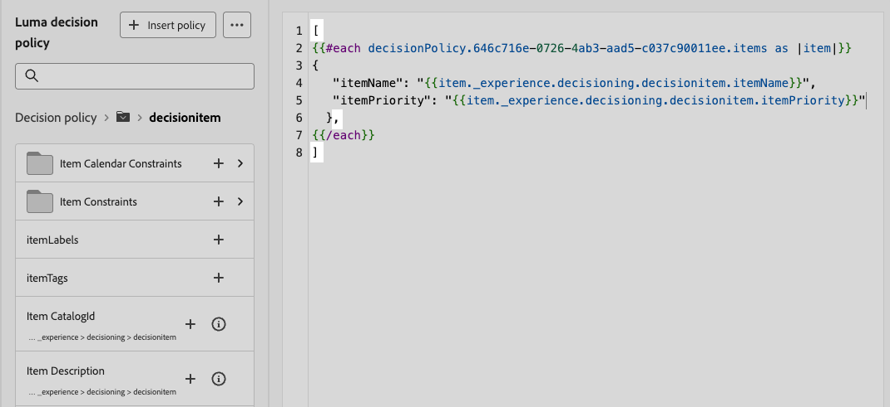
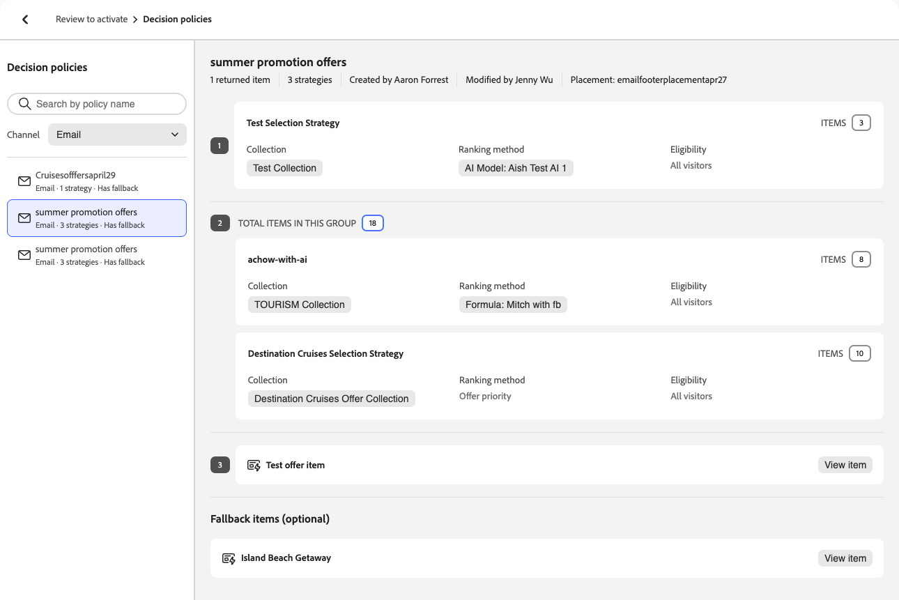

# 在訊息中使用決定原則 {#create-decision}

將決定原則新增至內容後，您就可以使用傳回決定專案的屬性進行個人化。 若要這麼做，請先將決定原則程式碼插入內容中。

>[!CAUTION]
>
>決定原則適用於&#x200B;**程式碼型體驗**、**電子郵件**、**簡訊**、**推播通知**&#x200B;和&#x200B;**直接郵件**&#x200B;管道的所有客戶。

## 插入決定原則代碼 {#insert}

>[!BEGINTABS]

>[!TAB 程式碼型體驗]

1. 編輯您的程式碼型體驗，並導覽至&#x200B;**[!UICONTROL 決定原則]**。

2. 選取&#x200B;**[!UICONTROL 插入原則]**&#x200B;以新增決定原則代碼。

   

>[!NOTE]
>
>針對程式碼型體驗，如果您的決定原則包含決定專案（包括片段），您可以在決定原則程式碼中利用這些片段。 [瞭解如何利用片段](fragments-decision-policies.md)

>[!TAB 電子郵件]

1. 開啟&#x200B;**Personalization編輯器**&#x200B;並導覽至&#x200B;**[!UICONTROL 決定原則]**。

2. 選取&#x200B;**[!UICONTROL 插入語法]**&#x200B;以新增決策原則的程式碼。

   

   >[!NOTE]
   >
   >如果未顯示插入選項，則可能已針對上層元件設定決定原則。

3. 如果尚未指派位置給元件，請從清單中選取一個位置，然後按一下&#x200B;**[!UICONTROL 指派]**。

   

   >[!NOTE]
   >
   >如果您在相同的電子郵件中使用多個決定原則（例如，一個用於頁首，一個用於頁尾），相同的選件會在各個版位中重複刪除：不會轉譯兩次。 第二個決定原則不會傳回任何內容，且會顯示空白字元，除非您已設定遞補優惠，在此情況下，將會改為顯示遞補優惠。

當您在電子郵件Designer中使用&#x200B;**[!UICONTROL 編碼您自己的]**&#x200B;模式時，也可以插入決定原則代碼。 導覽至&#x200B;**[!UICONTROL 決定原則]**&#x200B;並選取&#x200B;**[!UICONTROL 插入語法]** — 會出現位置選擇UI，讓您直接指派位置。 [瞭解如何編碼您自己的電子郵件內容](../email/code-content.md)。

>[!AVAILABILITY]
>
>以&#x200B;**[!UICONTROL 編碼方式插入決定原則]**&#x200B;模式為受限可用性。

>[!NOTE]
>
>在&#x200B;**[!UICONTROL 編碼您自己的]**&#x200B;模式中，每個原則只能傳回一個決定專案，因為&#x200B;**[!UICONTROL 重複網格]**&#x200B;元件無法使用。

>[!TAB 簡訊]

1. 開啟&#x200B;**Personalization編輯器**&#x200B;並導覽至&#x200B;**[!UICONTROL 決定原則]**。

2. 選取&#x200B;**[!UICONTROL 插入語法]**&#x200B;以新增決策原則的程式碼。

   

>[!TAB 推播]

1. 開啟&#x200B;**Personalization編輯器**&#x200B;並導覽至&#x200B;**[!UICONTROL 決定原則]**。

2. 選取&#x200B;**[!UICONTROL 插入語法]**&#x200B;以新增決策原則的程式碼。

   

>[!IMPORTANT]
>
>具有推播通知的Experience Decisioning需要特定版本的Mobile SDK。 在實作此功能之前，請檢查[發行說明](https://developer.adobe.com/client-sdks/home/release-notes){target="_blank"}以識別所需的版本，並確定您已相應地升級。 您也可以在[本節](https://developer.adobe.com/client-sdks/home/current-sdk-versions){target="_blank"}中檢視您平台的所有可用SDK版本。

>[!TAB 直接郵件]

1. 從擷取檔案設定中，開啟&#x200B;**Personalization編輯器** （例如，在欄的&#x200B;**[!UICONTROL Data]**&#x200B;欄位中）。

2. 瀏覽至&#x200B;**[!UICONTROL 決定原則]**&#x200B;並選取&#x200B;**[!UICONTROL 插入原則]**，為您的決定原則新增代碼。

   

3. 使用傳回的決策專案屬性作為欄資料，以便所選的優惠資訊包含在每個設定檔的擷取檔案中。

>[!ENDTABS]

已新增決定原則代碼。 您現在可以使用傳回決定專案的屬性來個人化您的內容。

>[!NOTE]
>
>針對程式碼型體驗、電子郵件和直接郵件頻道，針對您想要傳回的每個決定專案重複此順序一次。 例如，如果您選擇在[建立決定](create-decision-policy.md)時傳回2個專案，請重複該順序兩次。 對於簡訊和推播頻道，只能傳回一個決定專案。

## 使用決策專案屬性個人化 {#attributes}

在內容中新增決策原則的程式碼後，傳回決策專案中的所有屬性都可用於個人化。 [瞭解如何使用個人化](../personalization/personalize.md)。

屬性儲存在「優惠方案」[目錄結構描述](catalogs.md)中。 它們會顯示在個人化編輯器的下列資料夾中：
* **自訂屬性**： `_\<imsOrg\>`資料夾
* **標準屬性**： `_experience`資料夾

[!DNL Journey Optimizer]片段預設不支援決定專案屬性和內容屬性。 不過，您可以改用全域變數，如下所述。

若要新增屬性，請按一下屬性旁的&#x200B;**`+`**&#x200B;圖示。 您可以視需要新增任意數量的屬性。 您也可以包含其他個人化屬性，例如設定檔資料。

* 針對&#x200B;**電子郵件**、**程式碼型**&#x200B;和&#x200B;**直接郵件**&#x200B;管道，請使用方括弧`[ ]`將`#each`回圈中的屬性換行，並在結尾的`/each`標籤前加上逗號。

  +++檢視範例

  

  +++

* 對於&#x200B;**簡訊**&#x200B;和&#x200B;**推播**&#x200B;管道，請務必在決定原則的語法程式碼之後插入屬性。 此語法應一律保留在第1行。

  +++檢視範例

  

  +++

  >[!NOTE]
  >如果您在SMS或推播內容（例如在標題或內文中）中插入影像資產屬性，屬性值會顯示為URL。 影像本身不會在這些欄位中轉譯。

* 若要啟用決定專案追蹤，請新增`trackingToken`屬性： `trackingToken: {{item._experience.decisioning.decisionitem.trackingToken}}`

## 預覽並測試您的內容

建置內容後，在啟用歷程或行銷活動之前先預覽及測試。 決策專案會根據模擬介面中選取的設定檔來呈現。 [瞭解如何預覽和測試內容](../content-management/preview-test.md)。

## 後續步驟 {#final-steps}

內容準備就緒後，請檢閱並發佈行銷活動或歷程：

* [發佈歷程](../building-journeys/publish-journey.md)
* [檢閱及啟動行銷活動](../campaigns/review-activate-campaign.md)

針對程式碼型體驗，當您的開發人員發出API或SDK呼叫，擷取您頻道設定中定義之表面的內容時，變更就會套用至您的網頁或應用程式。

## 從行銷活動摘要檢視決定原則詳細資訊 {#decision-policy-summary}

當動作或API觸發的[行銷活動](../campaigns/get-started-with-campaigns.md)在其內容中使用決策原則時，行銷活動摘要頁面會顯示&#x200B;**[!UICONTROL 決策原則]**&#x200B;區段，其中列出行銷活動中使用的所有原則。

您也可以存取每個決定原則的技術詳細資訊，並將其複製到剪貼簿，這對於疑難排解Adobe支援或您的工程團隊的問題很有用。

+++ 若要存取決定原則詳細資訊和技術資訊，請遵循下列步驟。

1. 在[設定](../campaigns/review-activate-campaign.md#action-campaign-review)期間按一下&#x200B;**[!UICONTROL 檢閱以啟用]**，或從&#x200B;**[!UICONTROL 行銷活動]**&#x200B;清單中開啟行銷活動以開啟行銷活動摘要。

1. 在&#x200B;**[!UICONTROL 決定原則]**&#x200B;區段中，會列出行銷活動中使用的所有原則。

   

1. 選取決定原則或按一下&#x200B;**[!UICONTROL 全部檢視]**。 您可以檢閱每個原則的詳細資訊，包括：

   * 決策原則中使用的策略
   * 要傳回的專案數
   * 用於每個選擇策略的集合、排名方法和適用性規則
   * 如果沒有符合資格的決策專案，則會使用遞補優惠

   

1. 按一下集合以顯示其包含的所有決定專案。

1. 按一下決定專案以存取其詳細資訊，並視需要加以編輯，它會在新的瀏覽器標籤中開啟。 或者，按一下&#x200B;**[!UICONTROL 檢視專案]**&#x200B;以顯示不在集合中的決定專案。

   

1. 您也可以檢視用於每個選取策略的排名方法和適用性規則的相關資訊。

   {width="80%"}

1. 回到行銷活動摘要，您也可以從&#x200B;**[!UICONTROL 動作]**&#x200B;區段選取決定原則，然後按一下&#x200B;**資訊**&#x200B;圖示以存取決定原則的技術詳細資訊。

   

1. 按一下&#x200B;**複製到剪貼簿**&#x200B;圖示，將決定原則的JSON表示形式複製到剪貼簿。

   複製的JSON包含您的組織名稱和ID、沙箱名稱、決定原則ID和完整的決定原則結構。 您可以與Adobe支援或您的工程團隊共用這些資訊，以更快疑難排解決策原則問題。

+++

## 使用報告儀表板

若要檢視決策的效能如何，您可以在行銷活動或歷程報告中檢視現成的決策量度，或建立自訂Customer Journey Analytics儀表板，以測量效能並深入瞭解如何傳遞決策政策和優惠並與其互動。 [進一步瞭解Decisioning報告](cja-reporting.md)。

