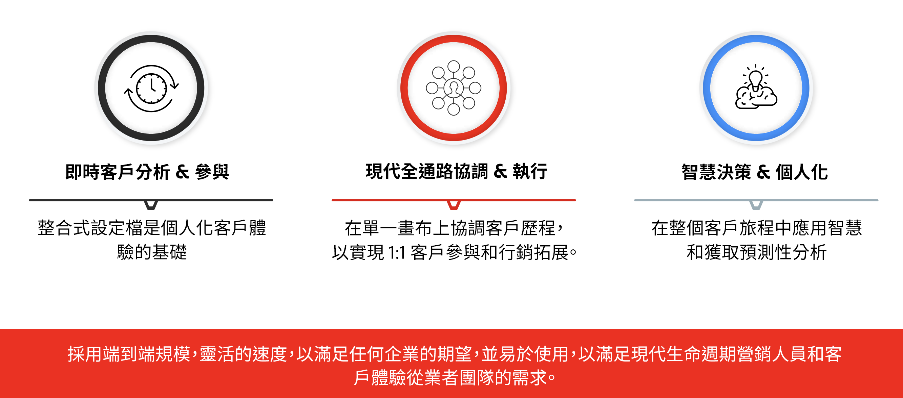

# 開始使用 Journey Optimizer {#cjm-gs}

>[!CONTEXTUALHELP]
>id="test_id"
>title="某些測試內容"
>abstract="測試內容，以將內容說明整合至AJO。"

## 什麼是 [!DNL Adobe Journey Optimizer]？{#about-cjm}

[!DNL Adobe Journey Optimizer] 協助公司向其客戶傳遞連通、情境式和個人化的體驗。客戶歷程是從第一次接觸直至客戶離開，客戶與品牌互動的整個過程。 從認知階段開始，客戶在這個階段瞭解品牌並開始參與。 然後，客戶將進一步與品牌互動、造訪線上和實體網站，並進行購買、傳送訊息或貼文檢視。

[!DNL Adobe Journey Optimizer] 是以原生方式建 [!DNL Adobe Experience Platform] 置，並結合統一的即時客戶設定檔、API優先開放架構、集中式offer decisioning、人工智慧(AI)和機器學習(ML)，以進行個人化和最佳化。Journey Optimizer可讓品牌在整個客戶歷程中，以規模、速度和彈性的方式，聰明地決定下一個最佳的互動方式。 透過[!DNL Adobe Journey Optimizer]，公司可以在相同應用程式中建立並傳送排程行銷活動（例如零售商店的每週促銷活動）和量身打造的個別通訊（例如忠誠應用程式客戶可能已查看過該項目且該項目先前無存貨的推播通知）。

## 使用個案

* 行銷人員可使用[!DNL Adobe Journey Optimizer]來傳送個人化通訊和受眾批次通訊。 例如，服裝商店通常會傳送購買後調查給在上週購買過產品的所有客戶。 由於天氣惡劣，少數貨物出現延誤。 看到哪些客戶尚未收到發貨，服裝店可以將他們排除在預定客戶滿意度發送之外，而是發送一封個性化的電子郵件，對延遲表示歉意，並根據客戶過去的購買情況，提供產品建議的折扣代碼。

   行銷人員也可以使用應用程式來傳送即時行為型通訊。 例如，同一家零售商可傳送推播通知，告訴對方一件毛衣是以客戶的存貨量存回，讓該客戶即時拉進商店停車場。

* 參與客戶體驗的非行銷人員（例如營運團隊和客戶支援）可使用[!DNL Adobe Journey Optimizer]管理各種工作，例如營運通知，甚至監控上線流程。 舉例來說，遊樂園是公園訪客下載行動應用程式作為其公園體驗的一部分。 維護人員可使用[!DNL Adobe Journey Optimizer]通知公園訪客因維護而當前關閉的騎行。

## 主要功能

[!DNL Adobe Journey Optimizer] 是靈活且可擴充的應用程式，可跨任何應用程式、裝置或通道建立及提供個人化、連線且及時的客戶體驗。

主要功能包括：

* **即時客戶分析與參與**  — 整合式設定檔會融合客戶接觸點上所有來源的即時資料，包括行為、交易、財務和營運資料，以最佳化客戶在其時間內的個人和情境式體驗。

* **現代全通路協調與執行**  — 在單一畫布上協調並最佳化客戶歷程，以實現1:1客戶參與和行銷外展，以協助品牌在客戶生命週期中提供更多價值。在[!DNL Adobe Journey Optimizer]中設計的客戶歷程可以是動態且以事件為基礎，以協助品牌對即時訊號做出反應，並將這些互動與已排程的行銷活動進行連結，以便針對要傳送客戶的通訊、傳送時間及透過哪些管道做出正確的決策。

* **智慧決策與個人化**  — 品牌可套用集中決策，並整合人工智慧和機器學習，以在客戶體驗中呈現預測性深入分析，更輕鬆自動化決策並大規模最佳化體驗。offer decisioning可通過[!DNL Adobe Journey Optimizer]大規模提供跨通道的集中式優惠。

>[!NOTE]
>
> Adobe Experience Cloud 的一般隱私權准則和流程適用於 [!DNL Journey Optimizer]。 [進一步瞭解 Adobe Experience Cloud 隱私權](https://www.adobe.com/tw/privacy/experience-cloud.html)。
> 在啟動](https://experienceleague.adobe.com/docs/experience-platform/profile/guardrails.html)之前，您還需要注意即時客戶配置檔案資料的[護欄。

**另請參閱**

* [啟動的重要步驟](quick-start.md)
* [建立您的第一條訊息](get-started-content.md)
* [設計歷程並傳送訊息](building-journeys/journey-gs.md)
* [即時報告](reports/live-report.md)
* [Journey Optimizer常見問題集](assets/do-not-localize/AJO-FAQ.pdf) (PDF)
