# 設定網頁應用程式內頻道 {#configure-in-app-web}

## 先決條件 {#prerequisites}

* 確定您使用的是您&#x200B;**Adobe Experience Platform Web SDK**&#x200B;擴充功能的最新版本。

* 在您的&#x200B;**標籤屬性**&#x200B;中安裝&#x200B;**Adobe Experience Platform Web SDK**&#x200B;擴充功能，並啟用&#x200B;**Personalization儲存空間**&#x200B;選項。

  此設定對於在使用者端上儲存事件歷史記錄是必要的，這是在規則產生器中實作頻率規則的先決條件。 [了解更多](https://experienceleague.adobe.com/docs/experience-platform/tags/extensions/client/web-sdk/web-sdk-extension-configuration.html?lang=zh-Hant){target="_blank"}

  

## 設定傳送資料至平台規則 {#configure-sent-data-trigger}

1. 存取您的&#x200B;**Adobe Experience Platform Data Collection**&#x200B;執行個體，並導覽至以&#x200B;**Adobe Experience Platform Web SDK**&#x200B;擴充功能設定的&#x200B;**標籤屬性**。

1. 從&#x200B;**製作**&#x200B;功能表中，選取&#x200B;**規則**，然後&#x200B;**建立新規則**&#x200B;或&#x200B;**新增規則**。

   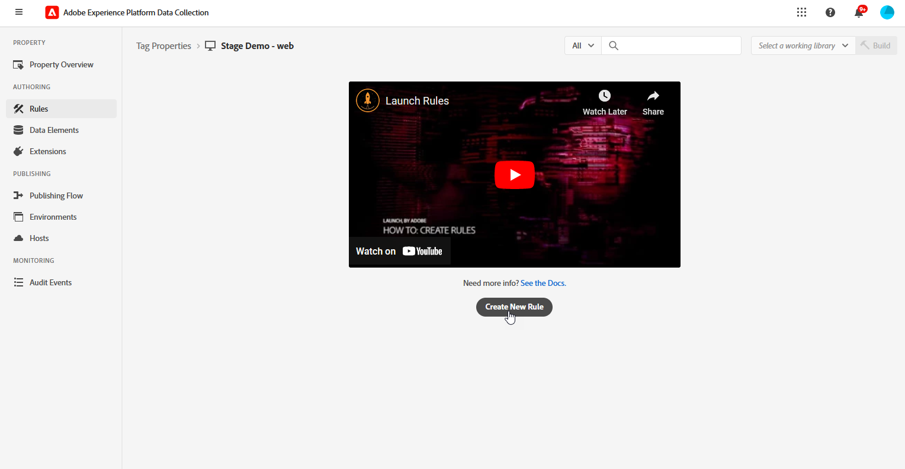

1. 在&#x200B;**事件**&#x200B;區段中，按一下&#x200B;**新增**，然後依照下列方式設定：

   * **延伸模組**：核心

   * **事件型別**：已載入程式庫（頁面頂端）。

   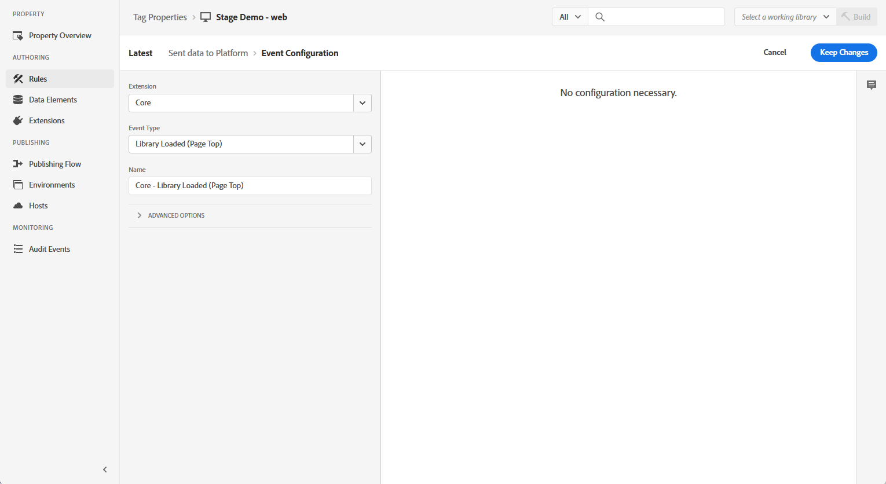

1. 按一下&#x200B;**保留變更**&#x200B;以儲存事件設定。

1. 在&#x200B;**動作**&#x200B;區段中，按一下&#x200B;**新增**，然後依照下列方式設定：

   * **擴充功能**： Adobe Experience Platform Web SDK

   * **動作型別**：傳送事件

   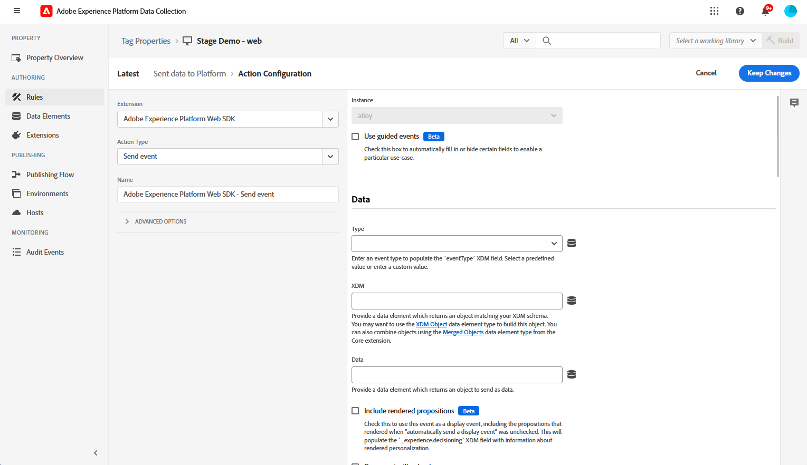

1. 在您&#x200B;**動作**&#x200B;型別的&#x200B;**Personalization**&#x200B;區段中，啟用&#x200B;**呈現視覺個人化決策**&#x200B;選項。

   

1. 在&#x200B;**決定內容**&#x200B;區段中，定義決定要傳送哪個體驗的&#x200B;**索引鍵**&#x200B;和&#x200B;**值**&#x200B;配對。

   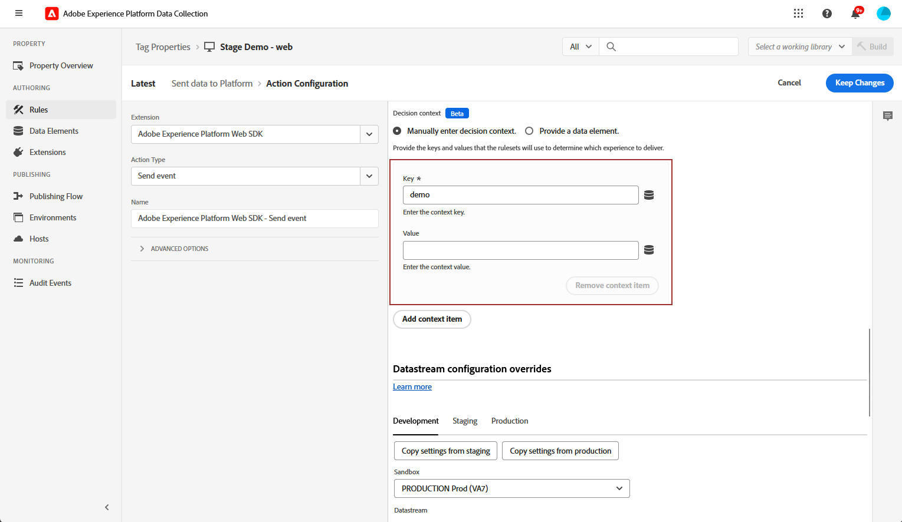

1. 按一下&#x200B;**保留變更**&#x200B;以儲存您的&#x200B;**動作**&#x200B;設定。

1. 導覽至&#x200B;**發佈流程**&#x200B;功能表。 建立新的&#x200B;**資料庫**&#x200B;或選取現有的&#x200B;**資料庫**，並將您新建立的&#x200B;**規則**&#x200B;新增至資料庫。 [了解更多](https://experienceleague.adobe.com/docs/experience-platform/tags/publish/libraries.html?lang=zh-Hant#create-a-library){target="_blank"}

1. 從您的&#x200B;**資料庫**，選取&#x200B;**儲存並建置至開發**。

   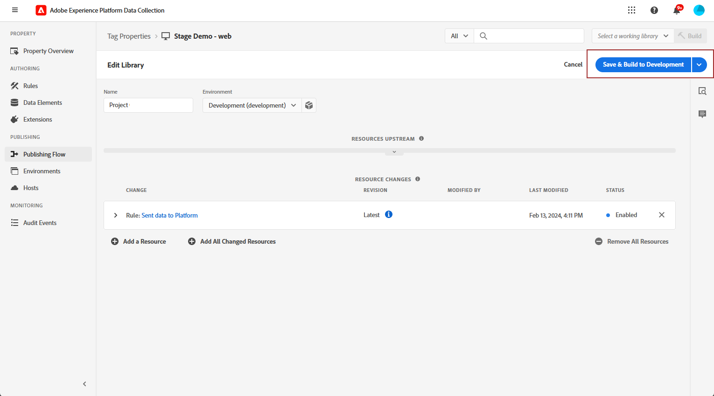

## 設定手動規則 {#configure-manual-trigger}

1. 存取您的&#x200B;**Adobe Experience Platform Data Collection**&#x200B;執行個體，並導覽至以&#x200B;**Adobe Experience Platform Web SDK**&#x200B;擴充功能設定的&#x200B;**標籤屬性**。

1. 從&#x200B;**製作**&#x200B;功能表中，選取&#x200B;**規則**，然後&#x200B;**建立新規則**&#x200B;或&#x200B;**新增規則**。

   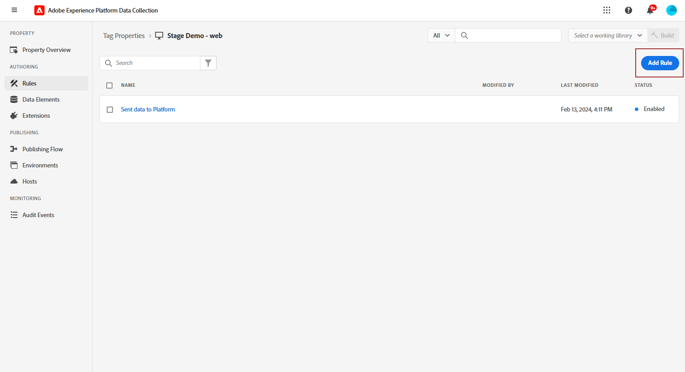

1. 在&#x200B;**事件**&#x200B;區段中，按一下&#x200B;**新增**，然後依照下列方式設定：

   * **延伸模組**：核心

   * **事件型別**：按一下

   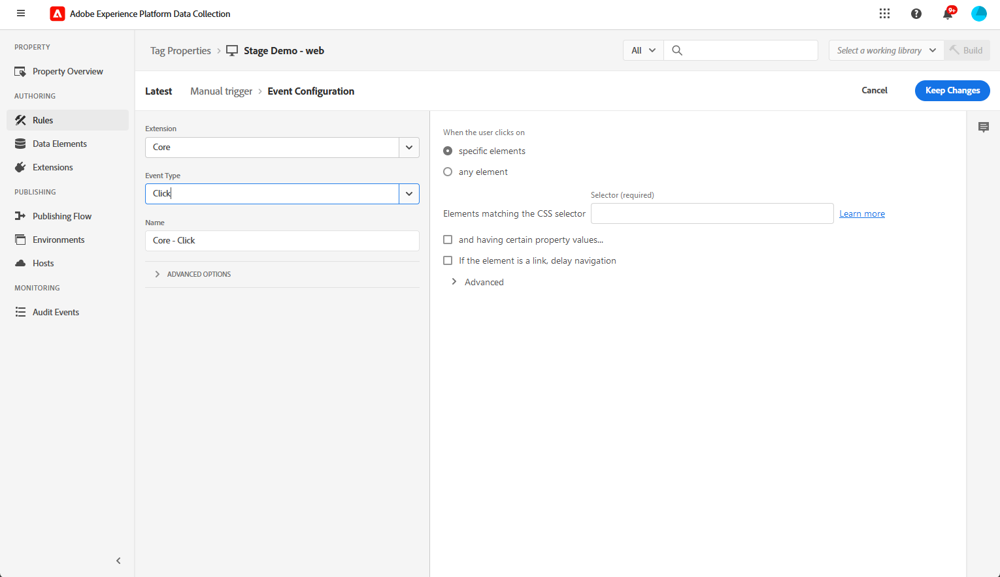

1. 在&#x200B;**Click設定**&#x200B;中，定義要評估的&#x200B;**選取器**。

   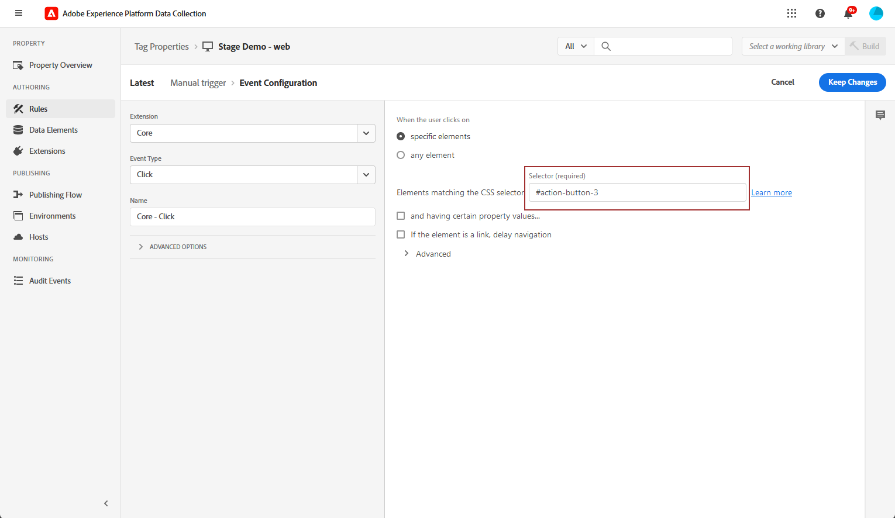

1. 按一下&#x200B;**保留變更**&#x200B;以儲存&#x200B;**事件**&#x200B;設定。

1. 在&#x200B;**動作**&#x200B;區段中，按一下&#x200B;**新增**，然後依照下列方式設定：

   * **擴充功能**： Adobe Experience Platform Web SDK

   * **動作型別**：評估規則集

   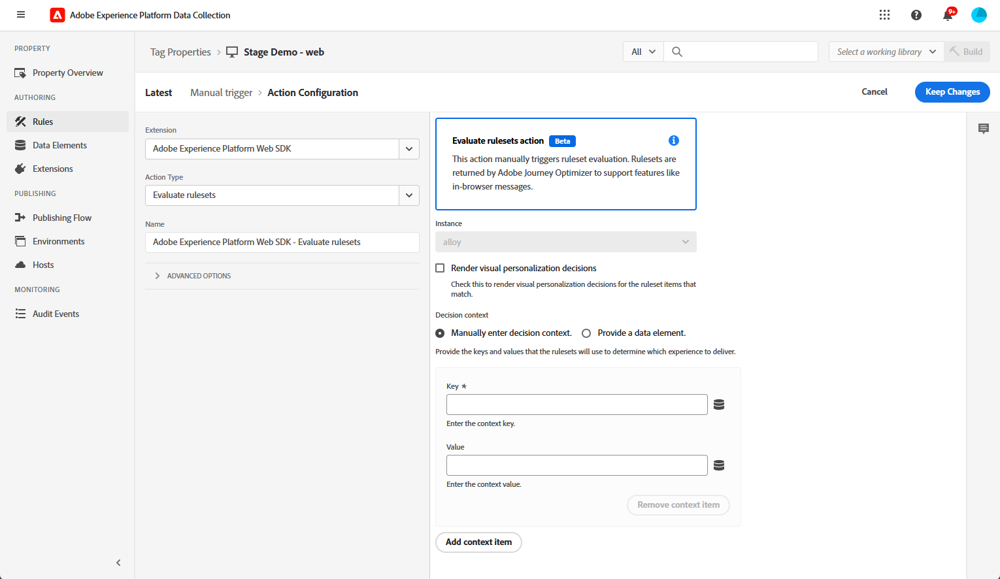

1. 在您&#x200B;**動作**&#x200B;型別的&#x200B;**評估規則集動作**&#x200B;區段中，啟用&#x200B;**呈現視覺個人化決定**&#x200B;選項。

   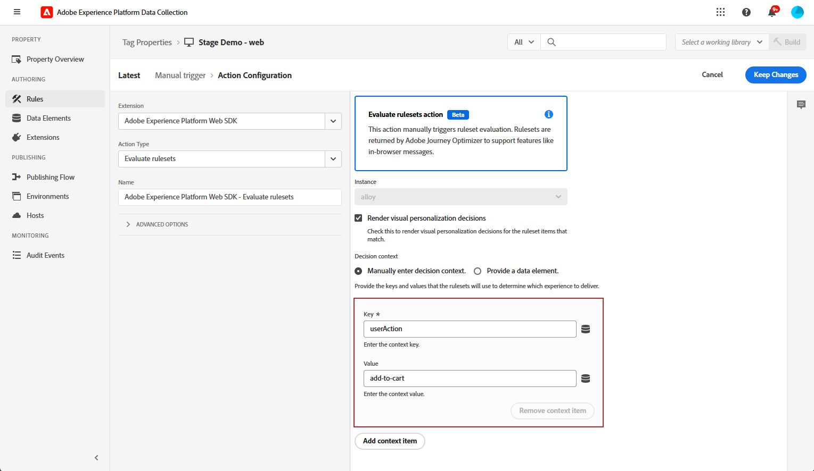

1. 在&#x200B;**決定內容**&#x200B;區段中，定義決定要傳送哪個體驗的&#x200B;**索引鍵**&#x200B;和&#x200B;**值**&#x200B;配對。

1. 存取&#x200B;**發佈流程**&#x200B;功能表、建立新的&#x200B;**資料庫**&#x200B;或選取現有的&#x200B;**資料庫**，並新增您新建立的&#x200B;**規則**。 [了解更多](https://experienceleague.adobe.com/docs/experience-platform/tags/publish/libraries.html?lang=zh-Hant#create-a-library){target="_blank"}

1. 從您的&#x200B;**資料庫**，選取&#x200B;**儲存並建置至開發**。

   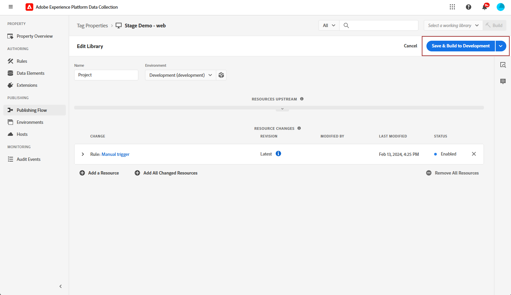

## 建立應用程式內網頁設定 {#in-app-config}

1. 存取&#x200B;**[!UICONTROL 頻道]** > **[!UICONTROL 一般設定]** > **[!UICONTROL 頻道設定]**&#x200B;功能表，然後按一下&#x200B;**[!UICONTROL 建立頻道設定]**。

   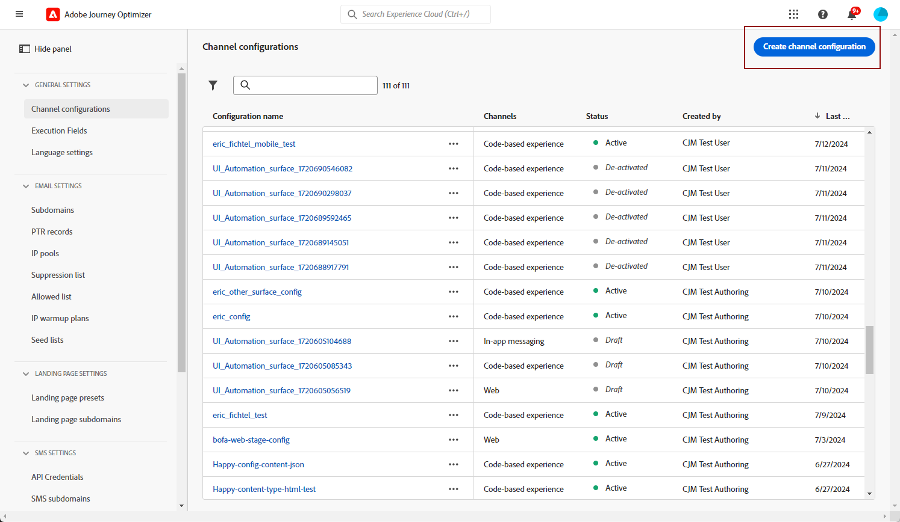

1. 輸入設定的名稱和說明（選擇性），然後選取要設定的通道。

   >[!NOTE]
   >
   > 名稱必須以字母(A-Z)開頭。 它只能包含英數字元。 您也可以使用底線 `_`、點 `.` 和連字號 `-` 字元。

1. 若要將自訂或核心資料使用標籤指派給組態，您可以選取&#x200B;**[!UICONTROL 管理存取權]**。 [進一步瞭解物件層級存取控制(OLAC)](../administration/object-based-access.md)。

1. 選取&#x200B;**[!UICONTROL 行銷動作]**，以使用此設定將同意原則與訊息相關聯。 系統會運用與行銷動作相關的所有同意政策，以尊重客戶的偏好設定。 [了解更多](../action/consent.md#surface-marketing-actions)

1. 選取&#x200B;**應用程式內傳訊**&#x200B;頻道。

1. 定義應用程式設定。 進行變更有兩個選項：

   * 您可以輸入&#x200B;**[!UICONTROL 頁面URL]**，將變更套用至特定頁面。

   * 您可以建立規則來鎖定遵循相同模式的多個URL。

     +++ 如何建置頁面比對規則。

      1. 選取&#x200B;**[!UICONTROL 符合規則]**&#x200B;的頁面作為應用程式設定，並輸入您的&#x200B;**[!UICONTROL 頁面URL]**。

      1. 在&#x200B;**[!UICONTROL 編輯設定規則]**&#x200B;視窗中，定義&#x200B;**[!UICONTROL 網域]**&#x200B;和&#x200B;**[!UICONTROL 頁面]**&#x200B;欄位的條件。
      1. 從條件下拉式清單，進一步個人化您的條件。

         舉例來說，若要編輯顯示在您Luma網站所有銷售產品頁面上的元素，請選取「網域>開頭為> Luma和頁面>包含>銷售」 。

         

      1. 視需要按一下&#x200B;**[!UICONTROL 新增其他頁面規則]**&#x200B;以建立其他規則。

      1. 選取&#x200B;**[!UICONTROL 預設撰寫與預覽URL]**。

      1. 儲存您的變更。規則會顯示在&#x200B;**[!UICONTROL 建立行銷活動]**&#x200B;畫面中。

     +++

1. 提交您的應用程式內Web設定。

您現在可以在行銷活動中[建立網頁應用程式內](../in-app/create-in-app-web.md)。
