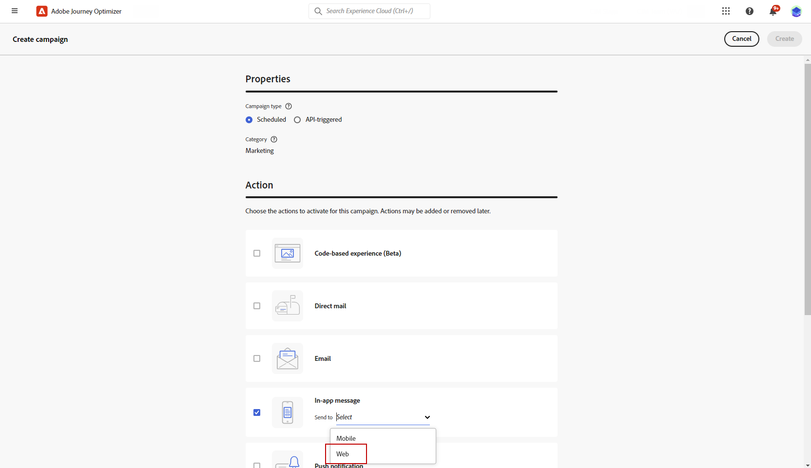
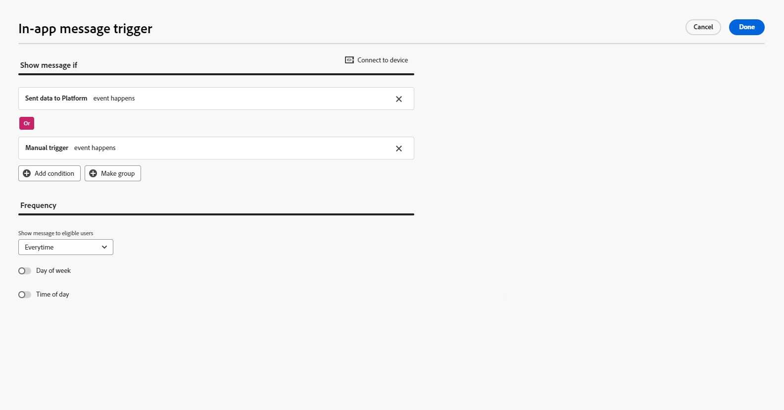
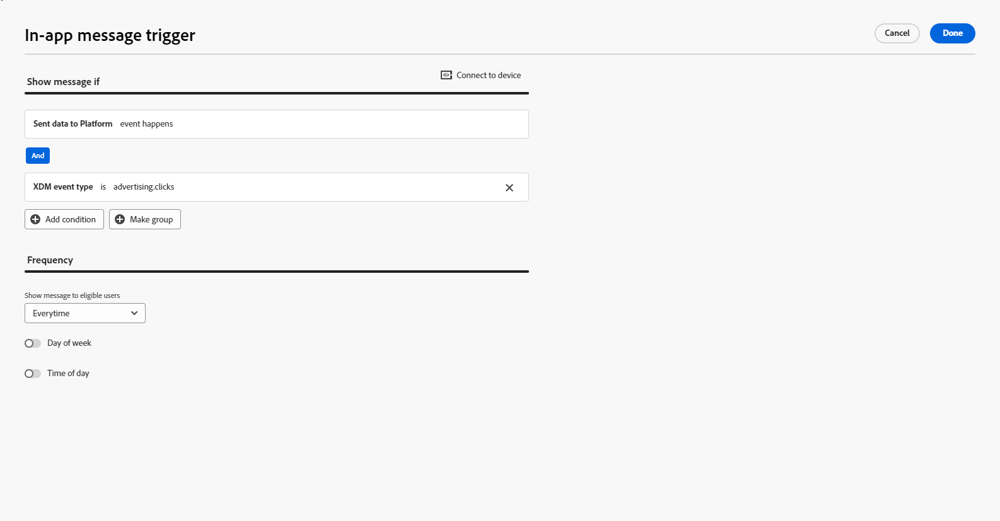
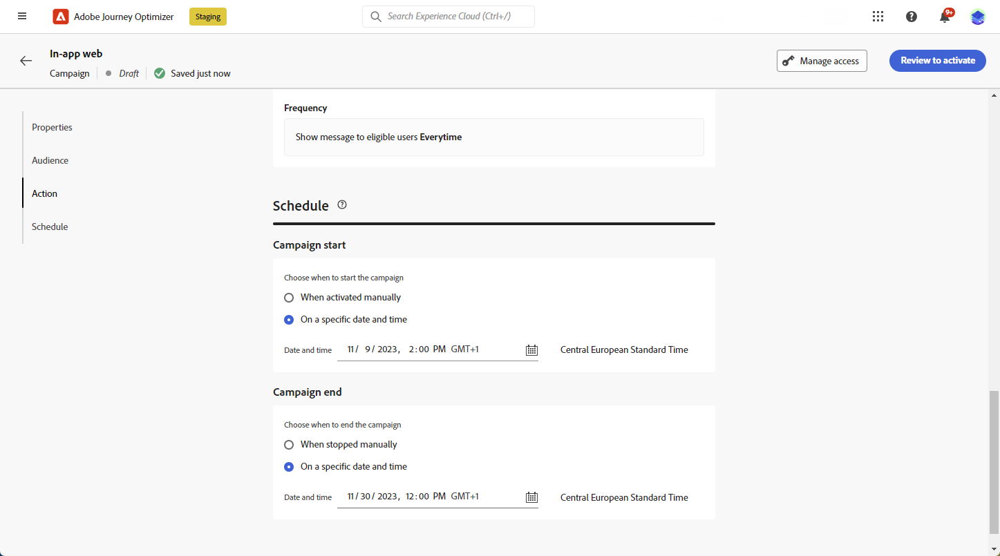
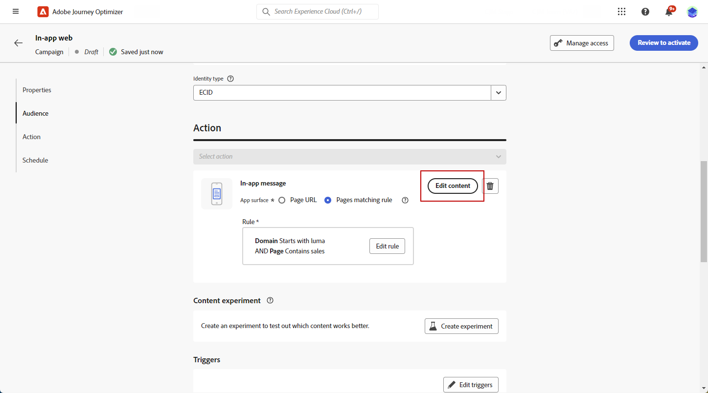

# 建立網頁應用程式內訊息 {#create-in-app-web}

## 設定網頁應用程式內頻道 {#configure-web-inapp}

若要設定網頁應用程式內頻道，請遵循下列步驟：

* 安裝Web SDK標籤擴充功能以支援Web應用程式內傳訊。 [了解更多](https://experienceleague.adobe.com/docs/experience-platform/tags/extensions/client/web-sdk/web-sdk-extension-configuration.html?lang=zh-Hant){target="_blank"}

* 自訂您的觸發器。 Web應用程式內傳訊支援兩種型別的觸發器：將資料傳送至平台和手動觸發器。 [了解更多](https://experienceleague.adobe.com/docs/experience-platform/edge/personalization/ajo/web-in-app-messaging.html?lang=zh-Hant){target="_blank"}

* 建立您的網頁應用程式內設定。 [了解更多](inapp-configuration.md)

## 建立您的網頁應用程式內訊息行銷活動 {#create-inapp-web-campaign}

1. 存取&#x200B;**[!UICONTROL 促銷活動]**&#x200B;功能表，然後按一下&#x200B;**[!UICONTROL 建立促銷活動]**。

1. 選擇您的行銷活動執行型別：排程或API觸發。 在[此頁面](../campaigns/create-campaign.md#campaigntype)上進一步瞭解行銷活動型別。

1. 從&#x200B;**[!UICONTROL 動作]**&#x200B;下拉式清單中選擇&#x200B;**[!UICONTROL 應用程式內訊息]**。

   

1. 選擇或建立您的應用程式設定。 [了解更多](inapp-configuration.md#channel-prerequisites)

## 定義您的網頁應用程式內訊息行銷活動 {#configure-inapp}

1. 從&#x200B;**[!UICONTROL Properties]**&#x200B;區段中，輸入&#x200B;**[!UICONTROL Title]**&#x200B;和&#x200B;**[!UICONTROL Description]**&#x200B;描述。

1. 若要指派自訂或核心資料使用標籤給應用程式內訊息，請選取&#x200B;**[!UICONTROL 管理存取權]**。 [了解更多](../administration/object-based-access.md)。

1. 按一下&#x200B;**[!UICONTROL 選取對象]**&#x200B;按鈕，從可用的Adobe Experience Platform對象清單中定義要定位的對象。 [了解更多](../audience/about-audiences.md)。

   

1. 在&#x200B;**[!UICONTROL 身分識別名稱空間]**&#x200B;欄位中，選擇要使用的名稱空間，以識別所選對象中的個人。 [了解更多](../event/about-creating.md#select-the-namespace)。

1. 在&#x200B;**[!UICONTROL 動作]**&#x200B;功能表中，您可以找到先前設定為&#x200B;**[!UICONTROL 應用程式組態]**&#x200B;的設定。 您可以視需要在此進行變更，或按一下&#x200B;**[!UICONTROL 編輯規則]**&#x200B;來更新您的規則。

1. 按一下&#x200B;**[!UICONTROL 建立實驗]**&#x200B;以開始設定您的內容實驗，並建立處理以測量其效能，並為您的目標對象識別最佳選項。 [了解更多](../content-management/content-experiment.md)

1. 按一下&#x200B;**[!UICONTROL 編輯觸發程式]**，選擇將觸發訊息的事件和條件。 規則產生器可讓使用者指定條件和值，在符合條件時會觸發一組動作，例如傳送應用程式內訊息。

   1. 視需要按一下事件下拉式清單，以變更您的觸發器。

      +++請參閱可用的觸發器。

      | 套件 | 觸發 | 定義 |
      |---|---|---|
      | 平台 | 已將資料傳送至Platform | 在行動應用程式發出邊緣體驗事件以將資料傳送至Adobe Experience Platform時觸發。 API通常會從AEP Edge擴充功能呼叫[sendEvent](https://developer.adobe.com/client-sdks/documentation/edge-network/api-reference/#sendevent){target="_blank"}。 |
      | 手動 | 手動觸發 | 兩個相關聯的資料元素：索引鍵（定義資料集的常數，例如，性別、顏色、價格）和值（屬於資料集的變數，例如，男性/女性、綠色、100）。 |

      +++

   1. 如果要讓觸發程式考慮多個事件或條件，請按一下[新增條件]。**&#x200B;**

   1. 若要新增更多&#x200B;**[!UICONTROL 觸發器]**，請選擇&#x200B;**[!UICONTROL 或]**&#x200B;條件，以進一步展開規則。

      

   1. 如果您想要新增自訂&#x200B;**[!UICONTROL 特徵]**，並更精確地調整規則，請選擇&#x200B;**[!UICONTROL 和]**&#x200B;條件。

      +++檢視可用的特徵。

      | 套件 | 特徵 | 定義 |
      |---|---|---|
      | 平台 | XDM事件型別 | 當符合指定的事件型別時觸發。 |
      | 平台 | XDM值 | 當符合指定的XDM值時觸發。 |

      +++

      

   1. 按一下&#x200B;**[!UICONTROL 建立群組]**，將觸發程式群組在一起。

1. 選擇應用程式內訊息生效時的觸發頻率。 提供下列選項：

   * **[!UICONTROL Everytime]**：當在&#x200B;**[!UICONTROL 行動應用程式觸發程式]**&#x200B;下拉式清單中選取的事件發生時，一律顯示訊息。
   * **[!UICONTROL 一次]**：只有在第一次在&#x200B;**[!UICONTROL 行動應用程式觸發程式]**&#x200B;下拉式清單中選取的事件發生時，才會顯示此訊息。
   * **[!UICONTROL 直到點進為止]**：當&#x200B;**[!UICONTROL 行動應用程式觸發程式]**&#x200B;下拉式清單中選取的事件發生時，顯示此訊息，直到SDK傳送互動事件且動作「已點按」為止。
   * **[!UICONTROL X次]**：顯示此訊息X次。

1. 如有需要，請選擇要顯示應用程式內訊息的&#x200B;**[!UICONTROL 一週中的哪一天]**&#x200B;或&#x200B;**[!UICONTROL 一天中的哪個時間]**。

1. 行銷活動旨在特定日期或循環頻率執行。 在&#x200B;**[!UICONTROL 本節]**&#x200B;中瞭解如何設定行銷活動的[排程](../campaigns/create-campaign.md#schedule)。

   

1. 您現在可以使用&#x200B;**[!UICONTROL 編輯內容]**&#x200B;按鈕開始設計您的內容。 [了解更多](design-in-app.md)

   

**相關主題：**

* [測試並傳送您的應用程式內訊息](send-in-app.md)
* [應用程式內報告](../reports/campaign-global-report-cja-inapp.md)
* [應用程式內設定](inapp-configuration.md)
