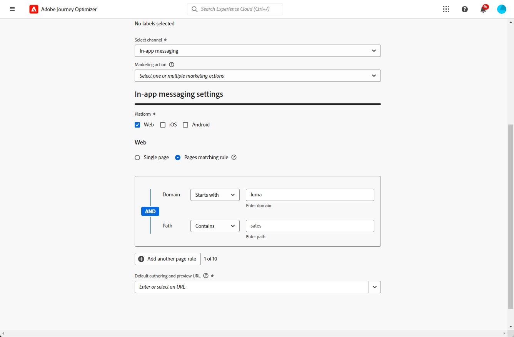

# 建立網頁應用程式內訊息 {#create-in-app-web}

## 設定網頁應用程式內頻道 {#configure-web-inapp}

若要設定網頁應用程式內頻道，請遵循下列步驟：

* 安裝Web SDK標籤擴充功能以支援網頁應用程式內傳訊。 [了解更多](https://experienceleague.adobe.com/docs/experience-platform/tags/extensions/client/web-sdk/web-sdk-extension-configuration.html?lang=en)

* 自訂您的觸發器。 Web應用程式內傳訊支援兩種型別的觸發器：將資料傳送至平台和手動觸發器。 [了解更多](https://experienceleague.adobe.com/docs/experience-platform/edge/personalization/ajo/web-in-app-messaging.html)

## 建立您的網頁應用程式內訊息行銷活動 {#create-inapp-web-campaign}

1. 存取 **[!UICONTROL 行銷活動]** 功能表，然後按一下 **[!UICONTROL 建立行銷活動]**.

1. 在 **[!UICONTROL 屬性]** 區段，選取行銷活動執行型別的時機：排程或API觸發。 進一步瞭解中的行銷活動型別 [此頁面](../campaigns/create-campaign.md#campaigntype).

1. 在 **[!UICONTROL 動作]** 區段，選擇 **[!UICONTROL 應用程式內訊息]**. 從 **[!UICONTROL 傳送至]** 在下拉式清單中，選取Web。

   

1. 定義應用程式表面。 進行變更有兩個選項：

   * 您可以輸入 **[!UICONTROL 頁面URL]** 將變更套用至特定頁面。

   * 您可以建立規則來鎖定遵循相同模式的多個URL。

+++ 如何建置頁面比對規則。

      1. 選取 **[!UICONTROL 頁面比對規則]** 作為應用程式表面。
      1. 按一下 **[!UICONTROL 建立規則]**.

         

      1. 在 **[!UICONTROL 編輯表面規則]** 視窗，定義您的條件 **[!UICONTROL 網域]** 和 **[!UICONTROL 頁面]** 欄位。
      1. 從條件下拉式清單，進一步個人化您的條件。

         舉例來說，若要編輯顯示在您Luma網站所有銷售產品頁面上的元素，請選取「網域>開頭為> Luma和頁面>包含>銷售」 。

         

      1. 儲存您的變更。此規則會顯示在 **[!UICONTROL 建立行銷活動]** 畫面。

+++

   

1. 選取並設定您的應用程式表面後，請按一下 **[!UICONTROL 建立]**.

## 定義您的網頁應用程式內訊息行銷活動 {#configure-inapp}

1. 從 **[!UICONTROL 屬性]** 區段，輸入 **[!UICONTROL 標題]** 和 **[!UICONTROL 說明]** 說明。

1. 若要將自訂或核心資料使用標籤指派給應用程式內訊息，請選取 **[!UICONTROL 管理存取權]**. [了解更多](../administration/object-based-access.md)。

1. 按一下 **[!UICONTROL 選取對象]** 按鈕，從可用的Adobe Experience Platform對象清單定義要定位的對象。 [了解更多](../audience/about-audiences.md)。

   

1. 在 **[!UICONTROL 身分名稱空間]** 欄位，選擇要使用的名稱空間，以識別所選對象中的個人。 [了解更多](../event/about-creating.md#select-the-namespace)。

1. 在 **[!UICONTROL 動作]** 功能表，您可以找到先前設定為 **[!UICONTROL 應用程式表面]**. 如有需要，您可以在此處進行變更，或按一下以更新規則 **[!UICONTROL 編輯規則]**.

1. 按一下 **[!UICONTROL 建立實驗]** 開始設定內容實驗並建立處理方式，以測量其效能並識別目標對象的最佳選項。 [了解更多](../content-management/content-experiment.md)

1. 按一下 **[!UICONTROL 編輯觸發程式]** 以選擇將觸發訊息的事件和條件。 規則產生器可讓使用者指定條件和值，在符合條件時會觸發一組動作，例如傳送應用程式內訊息。

   1. 視需要按一下事件下拉式清單，以變更您的觸發器。

      +++請參閱可用的觸發器。

      | 套件 | 觸發 | 定義 |
      |---|---|---|
      | 平台 | 已將資料傳送至Platform | 在行動應用程式發出邊緣體驗事件以將資料傳送至Adobe Experience Platform時觸發。 通常是API呼叫 [sendEvent](https://developer.adobe.com/client-sdks/documentation/edge-network/api-reference/#sendevent) 從AEP Edge擴充功能。 |
      | 手動 | 手動觸發 | 兩個相關聯的資料元素：索引鍵（定義資料集的常數，例如，性別、顏色、價格）和值（屬於資料集的變數，例如，男性/女性、綠色、100）。 |

+++

   1. 按一下 **[!UICONTROL 新增條件]** 是否希望觸發器考量多個事件或條件。

   1. 選擇 **[!UICONTROL 或]** 條件（若您想要新增更多） **[!UICONTROL 觸發器]** 以進一步展開規則。

      

   1. 選擇 **[!UICONTROL 與]** 條件（若您想要新增自訂） **[!UICONTROL 特徵]** 更進一步微調規則。

      +++檢視可用的特徵。

      | 套件 | 特徵 | 定義 |
      |---|---|---|
      | 平台 | XDM事件型別 | 當符合指定的事件型別時觸發。 |
      | 平台 | XDM值 | 當符合指定的XDM值時觸發。 |
+++

      

   1. 按一下 **[!UICONTROL 建立群組]** 將觸發程式群組在一起。

1. 選擇應用程式內訊息生效時的觸發頻率。 提供下列選項：

   * **[!UICONTROL 每次]**：永遠顯示中選取的事件時的訊息 **[!UICONTROL 行動應用程式觸發器]** 會出現下拉式清單。
   * **[!UICONTROL 一次]**：僅在中選取的事件第一次顯示這則訊息 **[!UICONTROL 行動應用程式觸發器]** 會出現下拉式清單。
   * **[!UICONTROL 直到點進為止]**：當在選取的事件時顯示此訊息 **[!UICONTROL 行動應用程式觸發器]** 下拉式清單會一直出現，直到SDK以「已點按」的動作傳送互動事件為止。
   * **[!UICONTROL X次數]**：此訊息顯示X次。

1. 如有需要，請選擇要 **[!UICONTROL 星期]** 或 **[!UICONTROL 時間]** 將會顯示應用程式內訊息。

1. 行銷活動旨在特定日期或循環頻率執行。 瞭解如何設定 **[!UICONTROL 排程]** 中的行銷活動 [本節](../campaigns/create-campaign.md#schedule).

   

1. 您現在可以開始使用設計內容 **[!UICONTROL 編輯內容]** 按鈕。 [了解更多](design-in-app.md)

   

**相關主題：**

* [測試並傳送您的應用程式內訊息](send-in-app.md)
* [應用程式內報告](../reports/campaign-global-report.md#inapp-report)
* [應用程式內設定](inapp-configuration.md)
