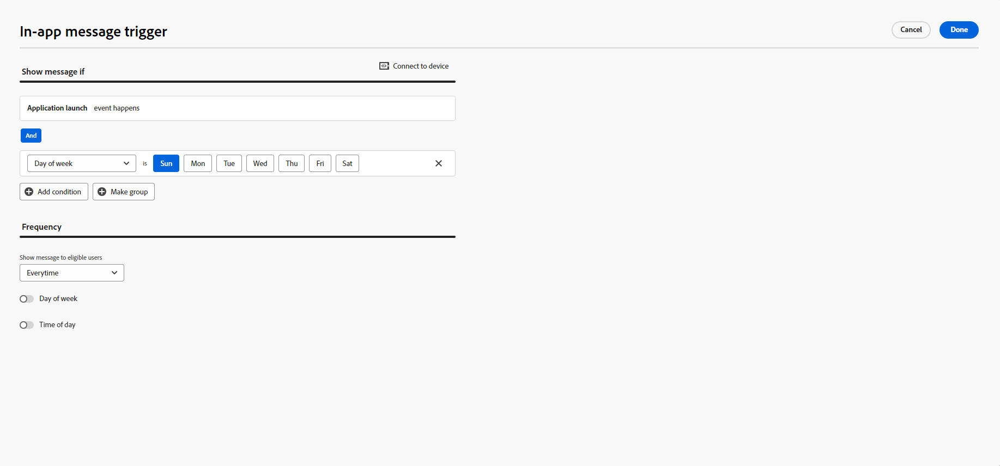

# 建立應用程式內訊息 {#create-in-app}

>[!CONTEXTUALHELP]
>id="ajo_campaigns_inapp_triggers"
>title="管理應用程式內觸發器"
>abstract="透過選取將會啟動訊息的特定活動與條件，有效率地管理觸發器。透過規則產生器，使用者可以定義精確的條件與值。符合這些條件時，就會觸發一系列的動作，包括傳遞應用程式內的訊息。"

您可以在行銷活動或歷程中新增應用程式內訊息。 請依照下列詳細步驟，在兩個內容中建立應用程式內訊息。

請注意，使用者在作業系統上選擇加入或選擇退出推播通知，並不會影響應用程式內訊息。

>[!BEGINTABS]

>[!TAB 新增應用程式內訊息至歷程]

若要在歷程中新增應用程式內訊息，請遵循下列步驟：

1. 開啟您的歷程，然後從浮動視窗的&#x200B;**[!UICONTROL 動作]**&#x200B;區段拖放&#x200B;**[!UICONTROL 應用程式內]**&#x200B;活動。

   當設定檔到達其歷程結尾時，顯示給設定檔的任何應用程式內訊息都會自動過期。 因此，會在應用程式內活動後自動新增等待活動，以確保適當的時機。

   

1. 為您的訊息輸入&#x200B;**[!UICONTROL 標籤]**&#x200B;和&#x200B;**[!UICONTROL 描述]**。

1. 選擇要使用的[應用程式內設定](inapp-configuration.md#channel-prerequisites)。

   

1. 您現在可以使用&#x200B;**[!UICONTROL 編輯內容]**&#x200B;按鈕開始設計您的內容。 [了解更多](design-in-app.md)

1. 按一下&#x200B;**[!UICONTROL 編輯觸發程式]**，選擇將觸發訊息的事件和條件。 規則產生器可讓使用者指定條件和值，在符合條件時會觸發一組動作，例如傳送應用程式內訊息。

   

   1. 視需要按一下事件下拉式清單，以變更您的觸發器。

      +++請參閱可用的觸發器。

      | 套件 | 觸發 | 定義 |
      |---|---|---|
      | 傳送資料至Platform | 已將資料傳送至Platform | 在行動應用程式發出邊緣體驗事件以將資料傳送至Adobe Experience Platform時觸發。 API通常會從AEP Edge擴充功能呼叫[sendEvent](https://developer.adobe.com/client-sdks/documentation/edge-network/api-reference/#sendevent)。 |
      | 核心追蹤 | 追蹤動作 | 呼叫行動程式碼API [trackAction](https://developer.adobe.com/client-sdks/documentation/mobile-core/api-reference/#trackaction)中提供的舊版功能時觸發。 |
      | 核心追蹤 | 追蹤狀態 | 呼叫行動程式碼API [trackState](https://developer.adobe.com/client-sdks/documentation/mobile-core/api-reference/#trackstate)中提供的舊版功能時觸發。 |
      | 核心追蹤 | 收集PII | 呼叫行動程式碼API [collectPII](https://developer.adobe.com/client-sdks/documentation/mobile-core/api-reference/#collectpii)中提供的舊版功能時觸發。 |
      | 應用程式生命週期 | 應用程式啟動 | 在每次執行時觸發，包括當機和安裝。在超過生命週期工作階段逾時的情況下，也會在從背景恢復時觸發。 |
      | 應用程式生命週期 | 應用程式安裝 | 在安裝或重新安裝後首次執行時觸發。 |
      | 應用程式生命週期 | 應用程式更新 | 在升級或版本編號變更後首次執行時觸發。 |
      | 應用程式生命週期 | 應用程式關閉 | 應用程式關閉時觸發。 |
      | 應用程式生命週期 | 應用程式當機 | 於關閉前，應用程式不在背景執行時觸發。事件會在當機後啟動應用程式時傳送。 Adobe Mobile 當機報告不會實施未攔截之例外狀況的全域處理常式。 |
      | 地點 | 輸入POI | 當您的客戶進入您設定的Point of Interest (POI)時，由Places SDK觸發。 |
      | 地點 | 退出POI | 在您的客戶離開您設定的興趣點(POI)時，由Places SDK觸發。 |

      +++

   1. 如果要讓觸發程式考慮多個事件或條件，請按一下[新增條件]。**&#x200B;**

   1. 若要新增更多&#x200B;**[!UICONTROL 觸發器]**，請選擇&#x200B;**[!UICONTROL 或]**&#x200B;條件，以進一步展開規則。

      

   1. 如果您想要新增&#x200B;**[!UICONTROL 特徵]**&#x200B;並更好地微調您的規則，請選擇&#x200B;**[!UICONTROL 和]**&#x200B;條件。

      +++檢視可用的特徵。

      | 套件 | 特徵 | 定義 |
      |---|---|---|
      | 裝置資訊 | 電信業者名稱 | 當符合清單中的其中一個電信業者名稱時觸發。 |
      | 裝置資訊 | 裝置名稱 | 符合其中一個裝置名稱時觸發。 |
      | 裝置資訊 | 地區設定 | 當符合清單中的語言之一時觸發。 |
      | 裝置資訊 | 作業系統版本 | 當符合其中一個指定的作業系統版本時觸發。 |
      | 裝置資訊 | 舊版作業系統 | 符合其中一個指定的先前作業系統版本時觸發。 |
      | 裝置資訊 | 執行模式 | 如果「執行」模式為應用程式或擴充功能，則會觸發。 |
      | 應用程式生命週期 | 應用程式 ID | 符合指定的應用程式ID時觸發。 |
      | 應用程式生命週期 | 星期幾 | 當符合指定的星期幾時觸發。 |
      | 應用程式生命週期 | 首次使用後間隔天數 | 當符合自首次使用以來的指定天數時觸發。 |
      | 應用程式生命週期 | 上次使用後間隔天數 | 當符合自上次使用以來的指定天數時觸發。 |
      | 應用程式生命週期 | 升級後間隔天數 | 當符合自上次升級以來的指定天數時觸發。 |
      | 應用程式生命週期 | 安裝日期 | 當符合指定的安裝日期時觸發。 |
      | 應用程式生命週期 | 啟動 | 當符合指定的啟動次數時觸發。 |
      | 應用程式生命週期 | 時間 | 符合指定的當日時間時觸發。 |
      | 地點 | 目前POI | 當您的客戶進入指定的興趣點(POI)時，由Places SDK觸發。 |
      | 地點 | 上次輸入的POI | 根據您上次進入興趣點(POI)的客戶，由Places SDK觸發。 |
      | 地點 | 上次退出的POI | 根據您的客戶上次退出興趣點(POI)，由Places SDK觸發。 |

      +++

      

   1. 按一下&#x200B;**[!UICONTROL 建立群組]**，將觸發程式群組在一起。

      

   1. 選擇應用程式內訊息生效時的觸發頻率：

      * **[!UICONTROL 每次都顯示]**：在&#x200B;**[!UICONTROL 行動應用程式觸發程式]**&#x200B;下拉式清單中選取的事件發生時，一律顯示訊息。
      * **[!UICONTROL 顯示一次]**：只會在第一次在&#x200B;**[!UICONTROL 行動應用程式觸發程式]**&#x200B;下拉式清單中選取的事件發生時顯示此訊息。
      * **[!UICONTROL 顯示至點進為止]**：當&#x200B;**[!UICONTROL 行動應用程式觸發程式]**&#x200B;下拉式清單中選取的事件發生時，顯示此訊息，直到SDK傳送互動事件並執行「已點按」動作為止。

1. 如有必要，請拖放其他動作或事件以完成您的歷程流程。 [了解更多](../building-journeys/about-journey-activities.md)

1. 應用程式內訊息準備就緒後，請完成設定並發佈您的歷程以將其啟用。

如需如何設定歷程的詳細資訊，請參閱[此頁面](../building-journeys/journey-gs.md)。

>[!NOTE]
>
>如果您想要在傳送推播通知後立即顯示應用程式內訊息，請使用&#x200B;**等待**&#x200B;活動，以允許應用程式內訊息裝載時間傳播。 通常建議等候5至15分鐘，但確切時間會因裝載複雜性和個人化需求而有所不同。

>[!TAB 新增應用程式內訊息至行銷活動]

若要在促銷活動中新增應用程式內訊息，請遵循下列步驟：

1. 存取&#x200B;**[!UICONTROL 促銷活動]**&#x200B;功能表，然後按一下&#x200B;**[!UICONTROL 建立促銷活動]**。

1. 選取您要執行的行銷活動型別

   * **已排程 — 行銷**：立即或在指定日期執行行銷活動。 已排程的行銷活動旨在傳送行銷訊息。 可從使用者介面設定及執行。

   * **API觸發 — 行銷/異動**：使用API呼叫執行行銷活動。 API觸發的行銷活動旨在傳送行銷或交易式訊息，也就是在個人執行動作後傳送的訊息：密碼重設、購物車購買等。

1. 從&#x200B;**[!UICONTROL Properties]**&#x200B;區段中，輸入&#x200B;**[!UICONTROL Title]**&#x200B;和&#x200B;**[!UICONTROL Description]**&#x200B;描述。

1. 若要指派自訂或核心資料使用標籤給應用程式內訊息，請選取&#x200B;**[!UICONTROL 管理存取權]**。 [了解更多](../administration/object-based-access.md)。

1. 按一下&#x200B;**[!UICONTROL 選取對象]**&#x200B;按鈕，從可用的Adobe Experience Platform對象清單中定義要定位的對象。 [了解更多](../audience/about-audiences.md)。

   

1. 在&#x200B;**[!UICONTROL 身分識別名稱空間]**&#x200B;欄位中，選擇要使用的名稱空間，以識別所選對象中的個人。 [了解更多](../event/about-creating.md#select-the-namespace)。

1. 在&#x200B;**[!UICONTROL 動作]**&#x200B;區段中，選擇&#x200B;**[!UICONTROL 應用程式內訊息]**，然後選取或建立新的設定。

   在[此頁面](inapp-configuration.md)上進一步瞭解應用程式內設定。

   

1. 按一下&#x200B;**[!UICONTROL 建立實驗]**&#x200B;以開始設定您的內容實驗，並建立處理以測量其效能，並為您的目標對象識別最佳選項。 [了解更多](../content-management/content-experiment.md)

1. 按一下&#x200B;**[!UICONTROL 編輯觸發程式]**，選擇將觸發訊息的事件和條件。 規則產生器可讓使用者指定條件和值，在符合條件時會觸發一組動作，例如傳送應用程式內訊息。

   1. 視需要按一下事件下拉式清單，以變更您的觸發器。

      +++請參閱可用的觸發器。

      | 套件 | 觸發 | 定義 |
      |---|---|---|
      | 傳送資料至Platform | 已將資料傳送至Platform | 在行動應用程式發出邊緣體驗事件以將資料傳送至Adobe Experience Platform時觸發。 API通常會從AEP Edge擴充功能呼叫[sendEvent](https://developer.adobe.com/client-sdks/documentation/edge-network/api-reference/#sendevent)。 |
      | 核心追蹤 | 追蹤動作 | 呼叫行動程式碼API [trackAction](https://developer.adobe.com/client-sdks/documentation/mobile-core/api-reference/#trackaction)中提供的舊版功能時觸發。 |
      | 核心追蹤 | 追蹤狀態 | 呼叫行動程式碼API [trackState](https://developer.adobe.com/client-sdks/documentation/mobile-core/api-reference/#trackstate)中提供的舊版功能時觸發。 |
      | 核心追蹤 | 收集PII | 呼叫行動程式碼API [collectPII](https://developer.adobe.com/client-sdks/documentation/mobile-core/api-reference/#collectpii)中提供的舊版功能時觸發。 |
      | 應用程式生命週期 | 應用程式啟動 | 在每次執行時觸發，包括當機和安裝。在超過生命週期工作階段逾時的情況下，也會在從背景恢復時觸發。 |
      | 應用程式生命週期 | 應用程式安裝 | 在安裝或重新安裝後首次執行時觸發。 |
      | 應用程式生命週期 | 應用程式更新 | 在升級或版本編號變更後首次執行時觸發。 |
      | 應用程式生命週期 | 應用程式關閉 | 應用程式關閉時觸發。 |
      | 應用程式生命週期 | 應用程式當機 | 於關閉前，應用程式不在背景執行時觸發。事件會在當機後啟動應用程式時傳送。 Adobe Mobile 當機報告不會實施未攔截之例外狀況的全域處理常式。 |
      | 地點 | 輸入POI | 當您的客戶進入您設定的Point of Interest (POI)時，由Places SDK觸發。 |
      | 地點 | 退出POI | 在您的客戶離開您設定的興趣點(POI)時，由Places SDK觸發。 |

      +++

   1. 如果要讓觸發程式考慮多個事件或條件，請按一下[新增條件]。**&#x200B;**

   1. 若要新增更多&#x200B;**[!UICONTROL 觸發器]**，請選擇&#x200B;**[!UICONTROL 或]**&#x200B;條件，以進一步展開規則。

      

   1. 如果您想要新增&#x200B;**[!UICONTROL 特徵]**&#x200B;並更好地微調您的規則，請選擇&#x200B;**[!UICONTROL 和]**&#x200B;條件。

      +++檢視可用的特徵。

      | 套件 | 特徵 | 定義 |
      |---|---|---|
      | 裝置資訊 | 電信業者名稱 | 當符合清單中的其中一個電信業者名稱時觸發。 |
      | 裝置資訊 | 裝置名稱 | 符合其中一個裝置名稱時觸發。 |
      | 裝置資訊 | 地區設定 | 當符合清單中的語言之一時觸發。 |
      | 裝置資訊 | 作業系統版本 | 當符合其中一個指定的作業系統版本時觸發。 |
      | 裝置資訊 | 舊版作業系統 | 符合其中一個指定的先前作業系統版本時觸發。 |
      | 裝置資訊 | 執行模式 | 如果「執行」模式為應用程式或擴充功能，則會觸發。 |
      | 應用程式生命週期 | 應用程式 ID | 符合指定的應用程式ID時觸發。 |
      | 應用程式生命週期 | 星期幾 | 當符合指定的星期幾時觸發。 |
      | 應用程式生命週期 | 首次使用後間隔天數 | 當符合自首次使用以來的指定天數時觸發。 |
      | 應用程式生命週期 | 上次使用後間隔天數 | 當符合自上次使用以來的指定天數時觸發。 |
      | 應用程式生命週期 | 升級後間隔天數 | 當符合自上次升級以來的指定天數時觸發。 |
      | 應用程式生命週期 | 安裝日期 | 當符合指定的安裝日期時觸發。 |
      | 應用程式生命週期 | 啟動 | 當符合指定的啟動次數時觸發。 |
      | 應用程式生命週期 | 時間 | 符合指定的當日時間時觸發。 |
      | 地點 | 目前POI | 當您的客戶進入指定的興趣點(POI)時，由Places SDK觸發。 |
      | 地點 | 上次輸入的POI | 根據您上次進入興趣點(POI)的客戶，由Places SDK觸發。 |
      | 地點 | 上次退出的POI | 根據您的客戶上次退出興趣點(POI)，由Places SDK觸發。 |

      +++

      

   1. 按一下&#x200B;**[!UICONTROL 建立群組]**，將觸發程式群組在一起。

1. 選擇應用程式內訊息生效時的觸發頻率。 提供下列選項：

   * **[!UICONTROL Everytime]**：當在&#x200B;**[!UICONTROL 行動應用程式觸發程式]**&#x200B;下拉式清單中選取的事件發生時，一律顯示訊息。
   * **[!UICONTROL 一次]**：只有在第一次在&#x200B;**[!UICONTROL 行動應用程式觸發程式]**&#x200B;下拉式清單中選取的事件發生時，才會顯示此訊息。
   * **[!UICONTROL 直到點進為止]**：當&#x200B;**[!UICONTROL 行動應用程式觸發程式]**&#x200B;下拉式清單中選取的事件發生時，顯示此訊息，直到SDK傳送互動事件且動作「已點按」為止。
   * **[!UICONTROL X次]**：顯示此訊息X次。

1. 如有需要，請選擇要顯示應用程式內訊息的&#x200B;**[!UICONTROL 一週中的哪一天]**&#x200B;或&#x200B;**[!UICONTROL 一天中的哪個時間]**。

1. 行銷活動旨在特定日期或循環頻率執行。 在&#x200B;**[!UICONTROL 本節]**&#x200B;中瞭解如何設定行銷活動的[排程](../campaigns/create-campaign.md#schedule)。

   

1. 您現在可以使用&#x200B;**[!UICONTROL 編輯內容]**&#x200B;按鈕開始設計您的內容。 [了解更多](design-in-app.md)

   

>[!ENDTABS]

## 作法影片{#video}

* 以下影片說明如何在行銷活動中建立、設定和發佈應用程式內訊息。

  +++請觀看影片

  >[!VIDEO](https://video.tv.adobe.com/v/3451893?quality=12&learn=on&captions=chi_hant)

  +++

* 以下影片說明如何設定和分析A/B測試應用程式內訊息的內容實驗。

  +++請觀看影片

  >[!VIDEO](https://video.tv.adobe.com/v/3445299/?learn=on&autoplay=true&captions=chi_hant)

  +++

* 以下影片說明如何在歷程中建立應用程式內訊息，以及如何測試和發佈您的歷程。

  +++請觀看影片

  >[!VIDEO](https://video.tv.adobe.com/v/3423077/?learn=on&autoplay=true)

  +++

**相關主題：**

* [設計應用程式內訊息](design-in-app.md)
* [測試並傳送您的應用程式內訊息](send-in-app.md)
* [應用程式內報告](../reports/campaign-global-report-cja-inapp.md)
* [應用程式內設定](inapp-configuration.md)