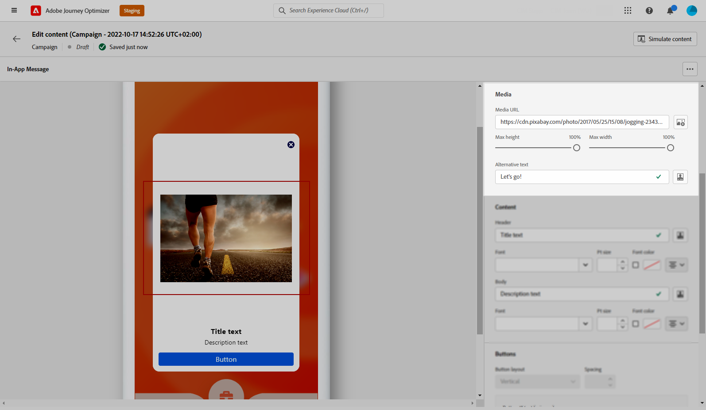
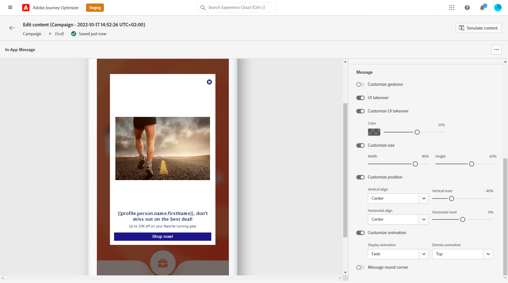

# 設計您的應用程式內內容 {#design-content}

您可以編輯應用程式內內容以設定體驗選項，包括訊息配置和顯示、文字及按鈕選項。

若要設定訊息內容，請按一下 **[!UICONTROL 編輯內容]** 按鈕，然後使用畫面右側的選項來設計您的應用程式內訊息內容。

此 **[!UICONTROL 進階格式]** 切換啟用其他選項以自訂體驗。

建立應用程式內訊息，並定義及個人化其內容後，您就可以檢閱及啟用訊息。 然後會根據促銷活動排程傳送通知。 在[本頁](create-in-app.md#in-app-send)中瞭解更多。

## 訊息配置 {#message-layout}

從 **[!UICONTROL 訊息配置]** 區段中，根據您的訊息需求，選取四種不同版面選項之一。

* **[!UICONTROL 全螢幕]**:此類型的版麵包含對象裝置的整個畫面。

   其支援媒體（影像、影片）、文字及按鈕元件。

* **[!UICONTROL 強制回應]**:此版面會顯示在大型警報樣式視窗中，而您的應用程式仍會顯示在背景中。

   其支援媒體（影像、影片）、文字及按鈕元件。

* **[!UICONTROL 橫幅]**:此類型的版面會以原生作業系統警告訊息的形式顯示。

   您只能新增 **[!UICONTROL 標題]** 和 **[!UICONTROL 主體]** 你的留言。

* **[!UICONTROL 自訂]**:自訂訊息模式可讓您直接匯入和編輯其中一個預先設定的HTML訊息。

   * 選擇 **[!UICONTROL 撰寫]** 來輸入或貼上原始HTML程式碼。

      使用左窗格以運用Journey Optimizer個人化功能。 如需詳細資訊，請參閱[本章節](../personalization/personalize.md)。

   * 選擇 **[!UICONTROL 匯入]** 匯入包含您HTML內容的HTML或.zip檔案。

## 內容標籤 {#content-tab}

從 **內容** 索引標籤，您可以定義並個人化：通知的內容和 **關閉** 按鈕。 您也可以將媒體新增至應用程式內通知，並從此標籤新增動作按鈕。

### 關閉按鈕 {#close-button}

選擇 **[!UICONTROL 樣式]** 您的 **[!UICONTROL 關閉按鈕]**.

可用樣式包括：

* **[!UICONTROL 簡單]**
* **[!UICONTROL 圓]**
* **[!UICONTROL 自訂影像]** 從媒體URL或您的資產。

+++更多具有高級格式的選項

若 **[!UICONTROL 進階格式模式]** 已開啟，您可以檢查 **[!UICONTROL 顏色]** 選項，以選擇按鈕的顏色和不透明度。

+++

### 媒體 {#add-media}

此 **[!UICONTROL 媒體]** 欄位可讓您將媒體新增至應用程式內訊息，為使用者建立引人入勝的體驗。

輸入您的媒體URL，或按一下 **[!UICONTROL 選取資產]** 圖示將儲存在「資產」資料庫中的資產直接新增至應用程式內訊息。 [深入了解資產管理](../email/assets-essentials.md).
您也可以新增 **[!UICONTROL 替代文字]** 用於螢幕讀取應用程式。

+++更多具有高級格式的選項

若 **[!UICONTROL 進階格式模式]** 已開啟，您可以自訂 **[!UICONTROL 最大高度]** 和 **[!UICONTROL 最大寬度]** 你的媒體。

+++

### 標題和內文 {#title-body}

若要撰寫訊息，請在 **[!UICONTROL 標題]** 和 **[!UICONTROL 主體]** 欄位。

使用 **[!UICONTROL 個人化]** 圖示以新增個人化。 進一步了解Adobe Journey Optimizer運算式編輯器中的個人化 [在本節](../personalization/personalize.md).

+++更多具有高級格式的選項

若 **[!UICONTROL 進階格式模式]** 已開啟，您可以選擇 **[!UICONTROL 標題]** 和 **[!UICONTROL 主體]**:

* the **[!UICONTROL 字型]**
* the **[!UICONTROL Pt大小]**
* the **[!UICONTROL 字型顏色]**
* the **[!UICONTROL 對齊方式]**
+++

### 按鈕 {#add-buttons}

新增按鈕，讓使用者與您的應用程式內訊息互動。

若要個人化您的按鈕：

1. 編輯「按鈕#1」文字（主要）欄位。 您也可以使用 **[!UICONTROL 個人化]** 圖示來定義內容和個人化資料。

1. 選擇您的 **[!UICONTROL 互動事件]** 會定義使用者互動後按鈕的動作。

1. 在 **[!UICONTROL 目標]** 欄位。

1. 若要新增多個按鈕，請按一下 **[!UICONTROL 添加按鈕]**.

+++更多具有高級格式的選項

若 **[!UICONTROL 進階格式模式]** 已開啟，您可以選擇 **[!UICONTROL 按鈕]**:

* the **[!UICONTROL 字型]**
* the **[!UICONTROL Pt大小]**
* the **[!UICONTROL 字型顏色]**
* the **[!UICONTROL 對齊方式]**
* the **[!UICONTROL 按鈕樣式]**
* the **[!UICONTROL 半徑]**
* the **[!UICONTROL 按鈕顏色]**

+++

## 設定標籤 {#settings-tab}

從 **設定** 索引標籤，您可以定義訊息配置並預覽應用程式內訊息。 您也可以存取進階格式選項。

### 預覽 {#preview-tab}

此 **[!UICONTROL 應用程式預覽]** 可讓您在應用程式內訊息後面新增背景：

* 來自URL連結的媒體。

* 來自資產資料庫的資產。

* 背景顏色。

### 版面配置 {#layout-options}

此 **[!UICONTROL 背景影像]** 欄位可讓您將背景新增至應用程式內訊息：

* 來自URL連結的媒體。

* 背景顏色。

### 訊息 {#message-tab}

UI接管選項（預設為啟用）可讓您拖曳應用程式內訊息背後的背景，以強調對內容的關注。

+++更多具有高級格式的選項

若 **[!UICONTROL 進階格式模式]** 開啟時，您可以使用下列選項進一步個人化您的訊息：

* **[!UICONTROL 自訂手勢]**:可讓您自訂使用者滑動互動。 如果已選取「關閉」，您可以新增自訂互動事件和/或目標目的地。

* **[!UICONTROL 自訂UI接管]**:可讓您選取要在背景中顯示的顏色及其不透明度。

* **[!UICONTROL 自訂大小]**:可讓您調整應用程式內通知的寬度和高度。

* **[!UICONTROL 自訂位置]**:可讓您自訂應用程式內訊息在使用者畫面上的位置。 您可以變更垂直和水準對齊。

* **[!UICONTROL 自定義動畫]**:可讓您自訂顯示和關閉動畫，例如，您的應用程式內通知會從使用者裝置的左側或上方顯示。

* **[!UICONTROL 訊息圓角]**:可讓您透過變更 **[!UICONTROL 圓角半徑]**.

+++

**相關主題：**

* [建立應用程式內訊息](create-in-app.md)
* [應用程式內報告](inapp-report.md)
* [應用程式內設定](inapp-configuration.md)
