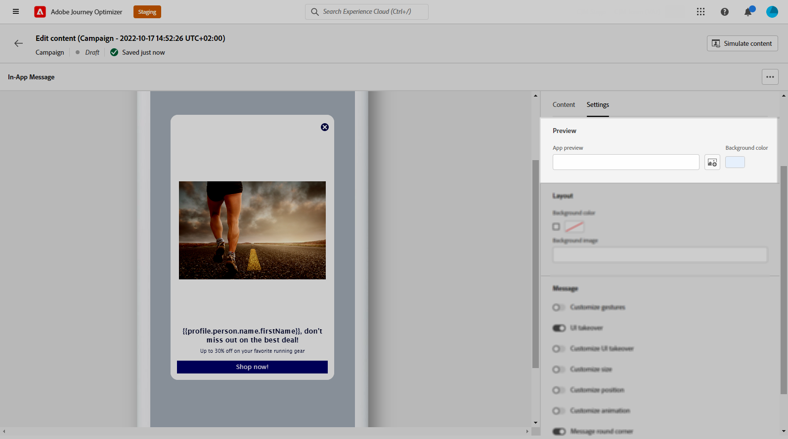

# 設計您的應用程式內內容 {#design-content}

>[!CONTEXTUALHELP]
>id="ajo_campaigns_inapp_content"
>title="定義應用程式內的內容"
>abstract="自訂應用程式內訊息的內容與樣式。您也可以新增媒體與動作按鈕，讓您的訊息更引人入勝且更有成效。"

您可以編輯應用程式內內容以設定體驗選項：

* 在&#x200B;**[!UICONTROL 行銷活動]**&#x200B;中，從&#x200B;**[!UICONTROL 動作]**&#x200B;功能表，按一下&#x200B;**[!UICONTROL 編輯內容]**&#x200B;按鈕以設定訊息內容。

  

* 在&#x200B;**[!UICONTROL 歷程]**&#x200B;中，從應用程式內&#x200B;**[!UICONTROL 動作]**&#x200B;的進階功能表，您可以使用&#x200B;**[!UICONTROL 編輯內容]**&#x200B;按鈕開始設計內容。

  

**[!UICONTROL 進階格式]**&#x200B;切換可啟動其他選項來自訂體驗。

建立應用程式內訊息，並定義內容與個人化後，您就可以檢閱並啟用該訊息。 然後，將根據行銷活動排程傳送通知。 請在[此頁面](send-in-app.md)了解更多。

## 訊息版面 {#message-layout}

>[!CONTEXTUALHELP]
>id="ajo_campaigns_inapp_authoring_message_layout"
>title="定義應用程式內的內容"
>abstract="此訊息版面提供您常用的範本以設定訊息的框架。自訂版面提供上傳或撰寫自訂 HTML 訊息的選項。"

從&#x200B;**[!UICONTROL 訊息配置]**&#x200B;區段中，選取四個不同的配置選項之一，以便根據您的訊息需求進行選擇。

* **[!UICONTROL 全熒幕]**：此型別的版麵包含對象裝置的整個熒幕。

  其支援媒體（影像、影片）、文字及按鈕元件。

* **[!UICONTROL 模型]**：此配置會顯示在大型警示樣式視窗中，而您的應用程式仍會顯示在背景中。

  其支援媒體（影像、影片）、文字及按鈕元件。

* **[!UICONTROL 橫幅]**：此型別的版面會顯示為原生作業系統警示訊息。

  您只能將&#x200B;**[!UICONTROL 標題]**&#x200B;和&#x200B;**[!UICONTROL 內文]**&#x200B;新增至您的訊息。

* **[!UICONTROL 自訂]**：自訂訊息模式可讓您直接匯入及編輯其中一個預先設定的HTML訊息。

   * 選取&#x200B;**[!UICONTROL 撰寫]**&#x200B;以輸入或貼上您的原始HTML程式碼。

     使用左窗格以運用Journey Optimizer個人化功能。 如需詳細資訊，請參閱[本章節](../personalization/personalize.md)。

   * 選取&#x200B;**[!UICONTROL 匯入]**&#x200B;以匯入包含HTML內容的HTML或.zip檔案。

## 內容索引標籤 {#content-tab}

您可以從&#x200B;**Content**&#x200B;索引標籤定義並個人化通知的內容和&#x200B;**關閉**&#x200B;按鈕的樣式。 您也可以新增媒體至應用程式內通知，並在此索引標籤新增動作按鈕。

### 關閉按鈕 {#close-button}

>[!CONTEXTUALHELP]
>id="ajo_campaigns_inapp_authoring_close"
>title="選擇關閉按鈕的樣式。"
>abstract="關閉按鈕部分提供選項讓您選取訊息關閉按鈕的變化，以及上傳自訂影像的選項。"

選擇&#x200B;**[!UICONTROL 關閉按鈕]**&#x200B;的&#x200B;**[!UICONTROL 樣式]**。

可用的樣式包括：

* **[!UICONTROL 簡單]**
* **[!UICONTROL 圓]**
* 來自媒體URL或您的Assets的&#x200B;**[!UICONTROL 自訂影像]**。

+++更多具有進階格式的選項

如果&#x200B;**[!UICONTROL 進階格式模式]**&#x200B;已開啟，您可以核取&#x200B;**[!UICONTROL 色彩]**&#x200B;選項來選擇按鈕的色彩和不透明度。

+++

### 媒體 {#add-media}

>[!CONTEXTUALHELP]
>id="ajo_campaigns_inapp_authoring_media"
>title="新增媒體至您的應用程式內訊息，以建立令一般使用者信服的體驗。"
>abstract="提供至內容的直接連結，或使用資產選擇器從 Asset Essentials 挑選要新增至訊息的媒體。"

**[!UICONTROL 媒體]**&#x200B;欄位可讓您將媒體新增至應用程式內訊息，以為一般使用者建立引人入勝的體驗。

輸入您的媒體URL或按一下&#x200B;**[!UICONTROL 選取Assets]**&#x200B;圖示，直接將儲存在Assets資料庫中的資產新增至您的應用程式內訊息。 [進一步瞭解資產管理](../integrations/assets.md)。
您也可以為熒幕閱讀應用程式新增&#x200B;**[!UICONTROL 替代文字]**。

+++更多具有進階格式的選項

如果&#x200B;**[!UICONTROL 進階格式模式]**&#x200B;已開啟，您可以自訂媒體的&#x200B;**[!UICONTROL 最大高度]**&#x200B;和&#x200B;**[!UICONTROL 最大寬度]**。

+++

### 內容 {#title-body}

>[!CONTEXTUALHELP]
>id="ajo_campaigns_inapp_authoring_content"
>title="若要撰寫訊息，請在「標題」與「本文」欄位輸入內容。"
>abstract="此處可以新增標題與內容文字。若要納入個人化語彙基元，請開啟個人化對話框。"

若要撰寫訊息，請在&#x200B;**[!UICONTROL 標題]**&#x200B;和&#x200B;**[!UICONTROL 內文]**&#x200B;欄位中輸入內容。

使用&#x200B;**[!UICONTROL Personalization]**&#x200B;圖示來新增個人化。 在本節[中進一步瞭解Adobe Journey Optimizer個人化編輯器](../personalization/personalize.md)中的個人化。

+++更多具有進階格式的選項

如果&#x200B;**[!UICONTROL 進階格式模式]**&#x200B;已開啟，您可以為&#x200B;**[!UICONTROL 標題]**&#x200B;和&#x200B;**[!UICONTROL 內文]**&#x200B;選擇：

* **[!UICONTROL 字型]**
* **[!UICONTROL Pt大小]**
* **[!UICONTROL 字型色彩]**
* **[!UICONTROL 對齊]**
+++

### 按鈕 {#add-buttons}

>[!CONTEXTUALHELP]
>id="ajo_campaigns_inapp_authoring_buttons"
>title="新增按鈕讓使用者可以和您的應用程式內訊息互動。"
>abstract="本部份可讓您在訊息中新增召喚行動按鈕。您也可以針對每個按鈕納入自訂的文字與目標。"

新增按鈕讓使用者可以和您的應用程式內訊息互動。

個人化您的按鈕：

1. 編輯按鈕#1文字（主要）欄位。 您也可以使用&#x200B;**[!UICONTROL Personalization]**&#x200B;圖示來定義內容和個人化資料。

1. 選擇您的&#x200B;**[!UICONTROL 互動事件]**，定義使用者與按鈕互動後的按鈕動作。

1. 在&#x200B;**[!UICONTROL 目標]**&#x200B;欄位中輸入您的網頁URL或深層連結。

1. 若要新增多個按鈕，請按一下[新增]按鈕&#x200B;**&#x200B;**。

+++更多具有進階格式的選項

如果&#x200B;**[!UICONTROL 進階格式化模式]**&#x200B;已開啟，您可以為&#x200B;**[!UICONTROL 按鈕]**&#x200B;選擇：

* **[!UICONTROL 字型]**
* **[!UICONTROL Pt大小]**
* **[!UICONTROL 字型色彩]**
* **[!UICONTROL 對齊]**
* **[!UICONTROL 按鈕樣式]**
* **[!UICONTROL 半徑]**
* **[!UICONTROL 按鈕色彩]**

+++

## 設定標籤 {#settings-tab}

您可以從&#x200B;**設定**&#x200B;索引標籤定義訊息版面配置並預覽您的應用程式內訊息。 您也可以存取進階格式選項。

### 預覽 {#preview-tab}

>[!CONTEXTUALHELP]
>id="ajo_campaigns_inapp_authoring_preview"
>title="預覽您的應用程式內訊息。"
>abstract="這是預覽影像，將會在訊息傳送至裝置的訊息摘要時顯示。"

>[!NOTE]
>
>預覽僅適用於行動應用程式內訊息。

**[!UICONTROL 應用程式預覽]**&#x200B;可讓您在應用程式內訊息後面新增背景：

* 來自URL連結的媒體。

* Assets資料庫中的資產。

* 背景顏色。

### 版面配置 {#layout-options}

>[!CONTEXTUALHELP]
>id="ajo_campaigns_inapp_authoring_layout"
>title="定義應用程式內訊息的訊息版面。"
>abstract="本部份可讓您在應用程式內訊息中新增背景。這需要 UI 接管才能啟用。"

**[!UICONTROL 背景影像]**&#x200B;欄位可讓您新增背景至應用程式內訊息：

* 來自URL連結的媒體。

* 背景顏色。

### 訊息 {#message-tab}

>[!CONTEXTUALHELP]
>id="ajo_campaigns_inapp_authoring_message_advanced"
>title="定義訊息進階設定。"
>abstract="本部份讓您可以強化應用程式內的內容個人化，尤其是在啟用「進階格式化」時。"

UI接管選項預設為啟用，可讓您讓應用程式內訊息背後的背景變暗，以強調對內容的關注。

+++更多具有進階格式的選項

如果&#x200B;**[!UICONTROL 進階格式化模式]**&#x200B;已開啟，您可以使用下列選項進一步個人化您的訊息：

* **[!UICONTROL 自訂手勢]**：可讓您自訂使用者滑動互動的內容。 如果選取了關閉，您可以新增自訂互動事件和/或目標目的地。

* **[!UICONTROL 自訂UI接管]**：可讓您選取要在背景顯示的顏色及其不透明度。

* **[!UICONTROL 自訂大小]**：可讓您調整應用程式內通知的寬度和高度。

* **[!UICONTROL 自訂位置]**：可讓您自訂使用者熒幕上的應用程式內訊息位置。 您可以變更垂直和水平對齊。

* **[!UICONTROL 自訂動畫]**：可讓您自訂顯示和解除動畫，例如，若您的應用程式內通知從使用者裝置的左上角顯示。

* **[!UICONTROL 訊息圓角]**：可讓您變更&#x200B;**[!UICONTROL 圓角半徑]**，將圓角新增至應用程式內通知。

+++

## 資料標籤 {#data-tab}

您可以從&#x200B;**資料**&#x200B;索引標籤中定義&#x200B;**[!UICONTROL 索引鍵]**&#x200B;和&#x200B;**[!UICONTROL 值]**，以便在承載中包含自訂變數。 這些索引鍵/值配對可讓您根據特定設定傳遞其他資料。

如需詳細資訊，請參閱[開發人員檔案](https://developer.adobe.com/client-sdks/edge/adobe-journey-optimizer/in-app-message/tutorials/messaging-metadata/)。

1. 從&#x200B;**[!UICONTROL 資料]**&#x200B;索引標籤中，選取&#x200B;**[!UICONTROL 新增索引鍵/值組]**。

   

1. 填寫&#x200B;**[!UICONTROL 索引鍵]**&#x200B;和&#x200B;**[!UICONTROL 值]**&#x200B;欄位。

   

1. 按一下以刪除任何需要的配對。

**相關主題：**

* [建立應用程式內訊息](create-in-app.md)
* [應用程式內報告](../reports/campaign-global-report-cja-inapp.md)
* [應用程式內設定](inapp-configuration.md)

## 作法影片{#video}

以下影片說明如何編寫和測試您的應用程式內訊息。

>[!VIDEO](https://video.tv.adobe.com/v/3410471?quality=12&learn=on)
