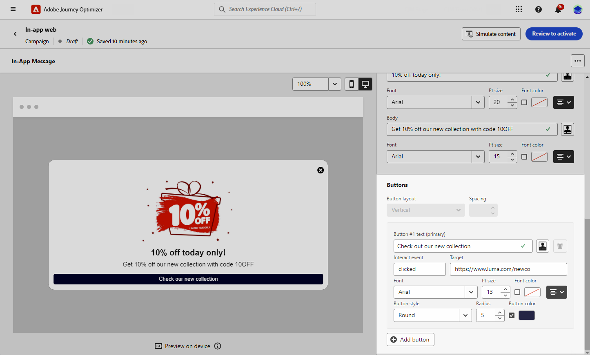

# 設計您的網頁應用程式內內容 {#in-app-web-design}

>[!BEGINSHADEBOX]

**目錄**

* [設定網頁應用程式內頻道](configure-in-app-web.md)
* [建立您的網頁應用程式內訊息行銷活動](create-in-app-web.md)
* **[設計您的網頁應用程式內內容](#in-app-web-design)**

>[!ENDSHADEBOX]

若要編輯應用程式內訊息內容，請按一下 **[!UICONTROL 編輯內容]** 按鈕來自 **[!UICONTROL 動作]** Campaign的功能表。

此 **[!UICONTROL 進階格式]** 切換可啟動其他選項來自訂體驗。

建立應用程式內訊息，並定義內容與個人化後，您就可以檢閱並啟用該訊息。 然後，將根據行銷活動排程傳送通知。 在[本頁](send-in-app.md)中瞭解更多。

## 訊息版面 {#message-layout}

從 **[!UICONTROL 訊息配置]** 區段，根據您的訊息傳送需求，選取四個不同的版面配置選項之一。

* **[!UICONTROL 全熒幕]**：此型別的版麵包含對象裝置的整個熒幕。

  其支援媒體（影像、影片）、文字及按鈕元件。

* **[!UICONTROL 強制回應]**：此版面會顯示在大型警報樣式視窗中，而您的應用程式仍會顯示在背景中。

  其支援媒體（影像、影片）、文字及按鈕元件。

* **[!UICONTROL 橫幅]**：此型別的版面會以原生作業系統警報訊息的形式顯示。

  您只能新增 **[!UICONTROL 頁首]** 和 **[!UICONTROL 內文]** 至您的訊息。

* **[!UICONTROL 自訂]**：自訂訊息模式可讓您直接匯入及編輯其中一個預先設定的HTML訊息。

   * 選取 **[!UICONTROL 撰寫]** 以輸入或貼上您的原始HTML程式碼。

     使用左窗格以運用Journey Optimizer個人化功能。 如需詳細資訊，請參閱[本章節](../personalization/personalize.md)。

   * 選取 **[!UICONTROL 匯入]** 以匯入包含HTML內容的HTML或.zip檔案。

## 內容索引標籤 {#content-tab}

從 **內容** 標籤內，您可以定義並個人化通知的內容和樣式 **關閉** 按鈕。 您也可以新增媒體至應用程式內通知，並在此索引標籤新增動作按鈕。

### 關閉按鈕 {#close-button}

選擇 **[!UICONTROL 樣式]** 的 **[!UICONTROL 關閉按鈕]**.

可用的樣式包括：

* **[!UICONTROL 簡單]**
* **[!UICONTROL 圓形]**
* **[!UICONTROL 自訂影像]** 來自媒體URL或您的資產。

+++更多具有進階格式的選項

如果 **[!UICONTROL 進階格式化模式]** 開啟，您可以檢查 **[!UICONTROL 顏色]** 選項來選擇按鈕的顏色和不透明度。

+++

### 媒體 {#add-media}

此 **[!UICONTROL 媒體]** 欄位可讓您將媒體新增至應用程式內訊息，為一般使用者建立引人入勝的體驗。

輸入您的媒體URL或按一下 **[!UICONTROL 選取資產]** 圖示可將儲存在「資產」程式庫中的資產直接新增至應用程式內訊息。 [進一步瞭解資產管理](../content-management/assets-essentials.md).
您也可以新增 **[!UICONTROL 替代文字]** 適用於熒幕閱讀應用程式。

+++更多具有進階格式的選項

如果 **[!UICONTROL 進階格式化模式]** 開啟，您可以自訂 **[!UICONTROL 最大高度]** 和 **[!UICONTROL 最大寬度]** 媒體的。

+++

### 內容 {#title-body}

若要撰寫訊息，請在 **[!UICONTROL 頁首]** 和 **[!UICONTROL 內文]** 欄位。

使用 **[!UICONTROL 個人化]** 圖示以新增個人化。 進一步瞭解Adobe Journey Optimizer運算式編輯器中的個人化 [在本節中](../personalization/personalize.md).

+++更多具有進階格式的選項

如果 **[!UICONTROL 進階格式化模式]** 已開啟，您可以為以下專案選擇 **[!UICONTROL 頁首]** 和 **[!UICONTROL 內文]**：

* 此 **[!UICONTROL 字型]**
* 此 **[!UICONTROL Pt大小]**
* 此 **[!UICONTROL 字型顏色]**
* 此 **[!UICONTROL 對齊方式]**
+++

### 按鈕 {#add-buttons}

新增按鈕讓使用者可以和您的應用程式內訊息互動。

個人化您的按鈕：

1. 編輯按鈕#1文字（主要）欄位。 您也可以使用 **[!UICONTROL 個人化]** 圖示來定義內容和個人化資料。

1. 選擇您的 **[!UICONTROL 互動事件]** 會定義使用者與按鈕互動後的按鈕動作。

1. 在「 」中輸入您的網頁URL或深層連結 **[!UICONTROL Target]** 欄位。

1. 若要新增多個按鈕，請按一下 **[!UICONTROL 新增按鈕]**.

+++更多具有進階格式的選項

如果 **[!UICONTROL 進階格式化模式]** 已開啟，您可以為以下專案選擇 **[!UICONTROL 按鈕]**：

* 此 **[!UICONTROL 字型]**
* 此 **[!UICONTROL Pt大小]**
* 此 **[!UICONTROL 字型顏色]**
* 此 **[!UICONTROL 對齊方式]**
* 此 **[!UICONTROL 按鈕樣式]**
* 此 **[!UICONTROL 半徑]**
* 此 **[!UICONTROL 按鈕顏色]**

+++

## 設定標籤 {#settings-tab}

從 **設定** 索引標籤上，您可以定義訊息版面並預覽應用程式內訊息。 您也可以存取進階格式選項。

### 版面配置 {#layout-options}

此 **[!UICONTROL 背景影像]** 欄位可讓您將背景新增至應用程式內訊息：

* 來自URL連結的媒體。

* 背景顏色。

### 訊息 {#message-tab}

UI接管選項預設為啟用，可讓您讓應用程式內訊息背後的背景變暗，以強調對內容的關注。

+++更多具有進階格式的選項

如果 **[!UICONTROL 進階格式化模式]** 開啟，您就可以使用下列選項進一步個人化您的訊息：

* **[!UICONTROL 自訂使用者介面接管]**：可讓您選取要在背景顯示的顏色及其不透明度。

* **[!UICONTROL 自訂大小]**：可讓您調整應用程式內通知的寬度和高度。

* **[!UICONTROL 自訂位置]**：可讓您自訂應用程式內訊息在使用者畫面上的位置。 您可以變更垂直和水平對齊。

* **[!UICONTROL 訊息圓角]**：可讓您透過變更 **[!UICONTROL 圓角半徑]**.

+++

**相關主題：**

* [測試並傳送您的應用程式內訊息](send-in-app.md)
* [應用程式內報告](../reports/campaign-global-report.md#inapp-report)
* [應用程式內設定](inapp-configuration.md)