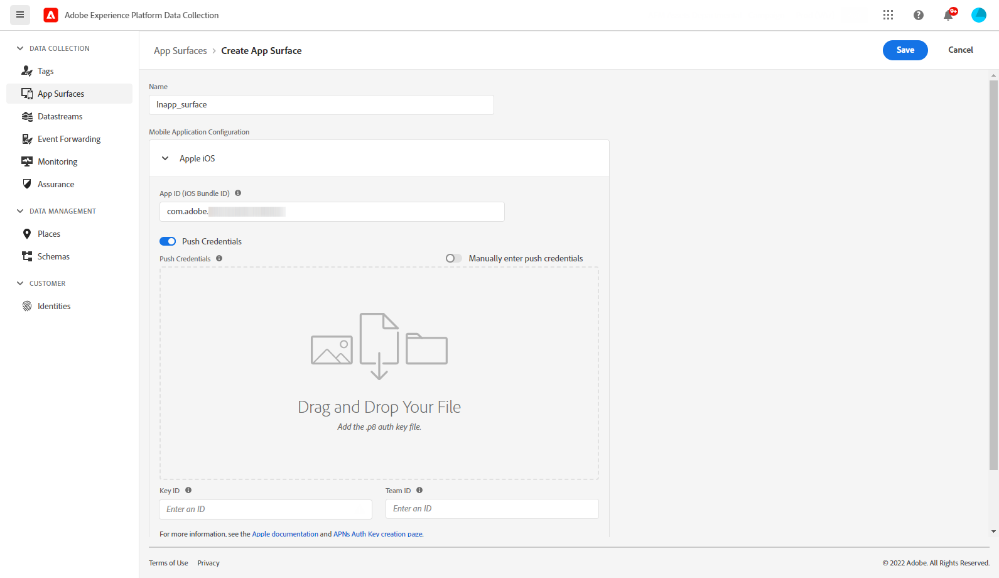
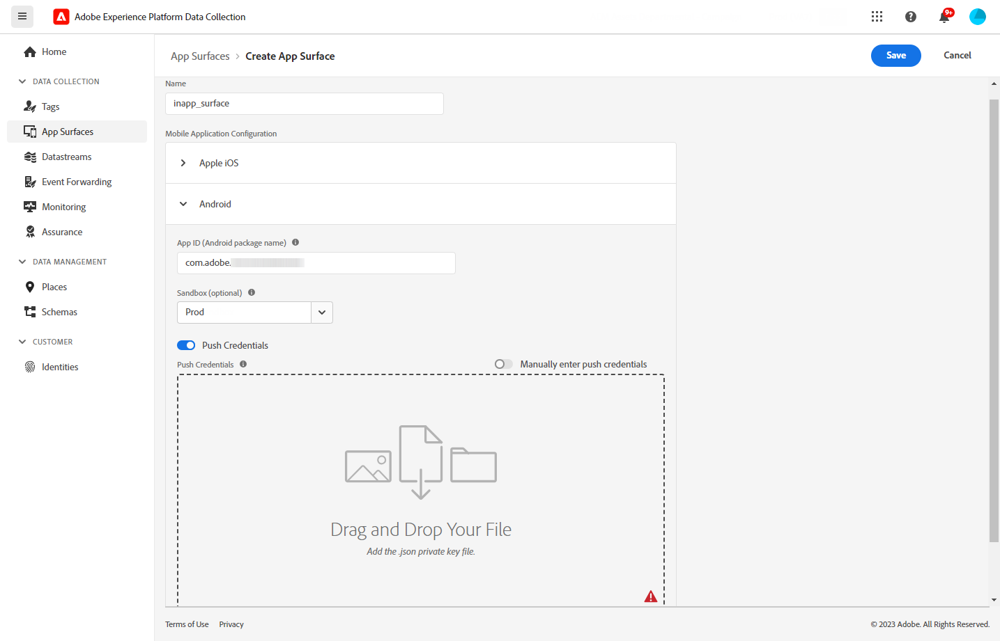

# 先決條件與設定 {#inapp-configuration}

## 設定步驟 {#inapp-steps}

若要在您的歷程和行銷活動中傳送應用程式內訊息，請使用 [!DNL Journey Optimizer]，您必須進行以下設定步驟。

1. 開始之前，請確定您對 Journey Optimizer 行銷活動擁有正確的權限，即使您計劃在歷程中僅使用應用程式內訊息也是如此。 仍需要行銷活動權限。 [瞭解更多](../campaigns/get-started-with-campaigns.md#campaign-prerequisites).
必須授予特定許可權才能存取 **應用程式表面** Adobe Experience Platform Data Collection中的功能表。 進一步瞭解 [此影片](#video).
1. 在您的Adobe Experience Platform資料收集資料串流中啟用Adobe Journey Optimizer，並在Adobe Experience Platform中檢查您的預設合併原則，如以下所述： [傳遞必要條件](#delivery-prerequisites) 底下。
1. 在Adobe Experience Platform資料彙集中建立及設定應用程式表面，詳情請參閱 [本節](#channel-prerequisites).
1. 如果您使用內容實驗，請務必遵循下列要求 [本節](#experiment-prerequisite).

完成後，您可以建立、設定和傳送您的第一個應用程式內訊息。 在[本節](create-in-app.md)中了解如何達成此目的。

## 傳遞必要條件 {#delivery-prerequisites}

為了正確傳遞應用程式內訊息，必須定義下列設定：

* 在 [Adobe Experience Platform資料彙集](https://experienceleague.adobe.com/docs/experience-platform/edge/datastreams/overview.html?lang=zh-Hant){target="_blank"}，確定您有定義的資料流，例如 **[!UICONTROL Adobe Experience Platform]** 服務Adobe Experience Platform Edge和 **[!UICONTROL Adobe Journey Optimizer]** 選項已啟用。

  這可確保Adobe Experience Platform Edge可正確處理Journey Optimizer傳入事件。 [了解更多](https://experienceleague.adobe.com/docs/experience-platform/edge/datastreams/configure.html){target="_blank"}

  

* 在 [Adobe Experience Platform](https://experienceleague.adobe.com/docs/experience-platform/profile/home.html?lang=zh-Hant){target="_blank"}，確定您有預設的合併原則和 **[!UICONTROL Active-On-Edge合併原則]** 選項已啟用。 若要這麼做，請在 **[!UICONTROL 客戶]** > **[!UICONTROL 設定檔]** > **[!UICONTROL 合併原則]** Experience Platform功能表。 [了解更多](https://experienceleague.adobe.com/docs/experience-platform/profile/merge-policies/ui-guide.html#configure){target="_blank"}

  此合併原則的使用者為 [!DNL Journey Optimizer] 傳入頻道，可在邊緣正確啟用和發佈傳入行銷活動。 [了解更多](https://experienceleague.adobe.com/docs/experience-platform/profile/merge-policies/ui-guide.html?lang=zh-Hant){target="_blank"}

  >[!NOTE]
  >
  >使用自訂時 **[!UICONTROL 資料集偏好設定]** 合併原則，請務必新增 **[!UICONTROL 傳入歷程]** 資料集位於指定的合併原則內。

  

* 若要針對Journey Optimizer行動體驗的傳送進行疑難排解，您可使用 **Edge傳遞** 檢視範圍 **Adobe Experience Platform保證**. 此外掛程式可讓您詳細檢查請求呼叫、驗證預期的邊緣呼叫是否如預期發生，以及檢查設定檔資料，包括身分對應、區段會籍和同意設定。 此外，您可以檢閱請求符合資格的活動，並識別未符合資格的活動。

  使用 **Edge傳遞** 外掛程式可協助您取得所需的深入分析，以有效瞭解傳入的實施並疑難排解。

  [深入瞭解邊緣傳遞檢視](https://experienceleague.adobe.com/en/docs/experience-platform/assurance/view/edge-delivery)

## 通道設定先決條件 {#channel-prerequisites}

1. 存取 **[!UICONTROL 應用程式表面]** 功能表並按一下 **[!UICONTROL 建立應用程式表面]**.

1. 將名稱新增至 **[!UICONTROL 應用程式表面]**.

   

1. 從 **[!UICONTROL Apple iOS]** 下拉式清單，為Apple iOS設定您的行動應用程式。

+++ 更多詳情

   1. 輸入您的 **[!UICONTROL iOS套件組合ID]**. 請參閱 [Apple檔案](https://developer.apple.com/documentation/appstoreconnectapi/bundle_ids) 如需詳細資訊，請參閱 **套件ID**.

   1. （選擇性）選擇 **[!UICONTROL Sandbox]** 您要傳送推播通知的來源。 請注意，選擇特定沙箱需要必要的存取許可權。

      如需沙箱管理的詳細資訊，請參閱 [此頁面](../administration/sandboxes.md#assign-sandboxes).

   1. 啟用 **[!UICONTROL 推送認證]** 選項來視需要拖放您的.p8驗證金鑰檔案。

      您也可以啟用 **[!UICONTROL 手動輸入推送認證]** 直接複製並貼上APN驗證金鑰的選項。

   1. 輸入您的 **[!UICONTROL 金鑰ID]** 和 **[!UICONTROL 團隊ID]**.

      

+++

1. 從 **[!UICONTROL Android]** 下拉式清單，為Android設定您的行動應用程式。

+++ 更多詳情

   1. 輸入您的 **[!UICONTROL Android套件名稱]**. 請參閱 [Android檔案](https://support.google.com/admob/answer/9972781?hl=en#:~:text=The%20package%20name%20of%20an,supported%20third%2Dparty%20Android%20stores) 如需詳細資訊，請參閱 **封裝名稱**.

   1. （選擇性）選擇 **[!UICONTROL Sandbox]** 您要傳送推播通知的來源。 請注意，選擇特定沙箱需要必要的存取許可權。

      如需沙箱管理的詳細資訊，請參閱 [此頁面](../administration/sandboxes.md#assign-sandboxes).

   1. 啟用 **[!UICONTROL 推送認證]** 選項，可視需要拖放您的.json私密金鑰檔案。

      您也可以啟用 **[!UICONTROL 手動輸入推送認證]** 直接複製並貼上FCM私密金鑰的選項。

      

1. 按一下 **[!UICONTROL 儲存]** 當您完成設定 **[!UICONTROL 應用程式表面]**.

   

   您的 **[!UICONTROL 應用程式表面]** 現在起，使用應用程式內訊息建立新行銷活動時，即可使用。 [了解更多](create-in-app.md)

1. 建立應用程式表面後，您現在需要建立行動屬性。

   請參閱 [此頁面](https://experienceleague.adobe.com/docs/experience-platform/tags/admin/companies-and-properties.html#for-mobile) 以取得詳細程式。

   

1. 從新建立屬性的「擴充功能」功能表中，安裝下列擴充功能：

   * Adobe Experience Platform Edge Network
   * Adobe Journey Optimizer
   * AEP保證
   * 同意
   * 身分
   * 行動核心
   * 設定檔

   請參閱 [此頁面](https://experienceleague.adobe.com/docs/experience-platform/tags/ui/extensions/overview.html#add-a-new-extension) 以取得詳細程式。

   

應用程式內頻道現已設定。 您可以開始傳送應用程式內訊息給使用者。

## 內容實驗先決條件 {#experiment-prerequisites}

若要啟用應用程式內管道的內容實驗，您必須確定 [資料集](../data/get-started-datasets.md) 用於應用程式內實作 [資料流](https://experienceleague.adobe.com/docs/experience-platform/datastreams/overview.html){target="_blank"} 也包含在您的報告設定中。

換言之，在設定實驗報告時，如果您新增的資料集未出現在網頁資料流中，則網頁資料不會顯示在內容實驗報告中。

瞭解如何在中新增內容實驗報告的資料集 [本節](../content-management/reporting-configuration.md#add-datasets).

>[!NOTE]
>
>資料集是由 [!DNL Journey Optimizer] 報告系統並且不會影響資料收集或資料擷取。

如果您是 **非** 使用以下預先定義的 [欄位群組](https://experienceleague.adobe.com/docs/experience-platform/xdm/tutorials/create-schema-ui.html?lang=zh-Hant#field-group){target="_blank"} 針對您的資料集結構： `AEP Web SDK ExperienceEvent` 和 `Consumer Experience Event` (如中的定義 [此頁面](https://experienceleague.adobe.com/docs/platform-learn/implement-web-sdk/initial-configuration/configure-schemas.html#add-field-groups){target="_blank"})，請務必新增下列欄位群組： `Experience Event - Proposition Interactions`， `Application Details`， `Commerce Details`、和 `Web Details`. 以下專案需要這些選項 [!DNL Journey Optimizer] 內容實驗報告，追蹤每個設定檔參與哪些實驗與處理。

>[!NOTE]
>
>新增這些欄位群組不會影響正常的資料收集。 它僅適用於執行實驗的頁面，而保留所有其他追蹤不變。

## 操作說明影片{#video}

以下影片說明如何指派 **管理應用程式設定** 存取應用程式表面功能表的許可權。

>[!VIDEO](https://video.tv.adobe.com/v/3421607)

**相關主題：**

* [建立應用程式內訊息](create-in-app.md)
* [建立行銷活動](../campaigns/create-campaign.md)
* [設計應用程式內訊息](design-in-app.md)
* [應用程式內報告](../reports/campaign-global-report.md#inapp-report)

