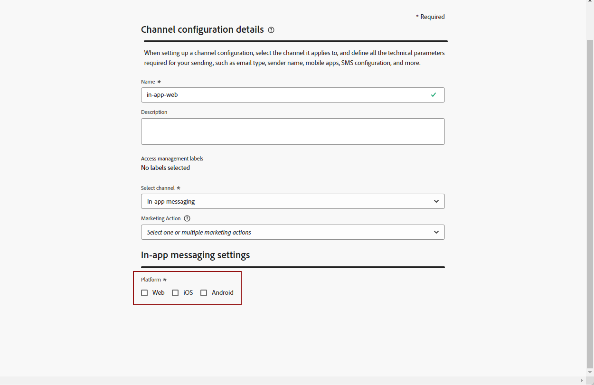

# 先決條件與設定 {#inapp-configuration}

## 設定步驟 {#inapp-steps}

若要使用[!DNL Journey Optimizer]在歷程與行銷活動中傳送應用程式內訊息，您必須完成下列設定步驟。

1. 開始之前，請確定您對 Journey Optimizer 行銷活動擁有正確的權限，即使您計劃在歷程中僅使用應用程式內訊息也是如此。 仍需要行銷活動權限。 [了解更多](../campaigns/get-started-with-campaigns.md#prerequisites)。
1. 在Adobe Experience Platform資料收集資料串流中啟用Adobe Journey Optimizer，並檢查Adobe Experience Platform中的預設合併原則，如以下[傳遞先決條件](#delivery-prerequisites)所述。
1. 在「管理>管道>管道設定」中建立應用程式內訊息管道設定，如[本節](#channel-prerequisites)所述。
1. 如果您使用內容實驗，請務必遵循[本節](#experiment-prerequisite)中列出的要求。

完成後，您可以建立、設定並傳送您的第一個應用程式內訊息。 在[本節](create-in-app.md)中了解如何達成此目的。

## 傳遞必要條件 {#delivery-prerequisites}

為了正確傳遞應用程式內訊息，必須定義下列設定：

* 在[Adobe Experience Platform Data Collection](https://experienceleague.adobe.com/docs/experience-platform/edge/datastreams/overview.html?lang=zh-Hant){target="_blank"}中，確定您已定義資料串流，例如在&#x200B;**[!UICONTROL Adobe Experience Platform]**&#x200B;服務下，您已啟用Adobe Experience Platform Edge和&#x200B;**[!UICONTROL Adobe Journey Optimizer]**&#x200B;選項。

  這可確保Adobe Experience Platform Edge正確處理Journey Optimizer傳入事件。 [了解更多](https://experienceleague.adobe.com/docs/experience-platform/edge/datastreams/configure.html){target="_blank"}

  >[!NOTE]
  >
  >目前僅支援Journey Optimizer中的Web通路行銷活動使用`context.datastream`屬性。 嘗試在應用程式內訊息中使用`context.datastream`將導致驗證錯誤，例如`Invalid syntax Missing schema field: 'datastream`。

  

* 在[Adobe Experience Platform](https://experienceleague.adobe.com/docs/experience-platform/profile/home.html?lang=zh-Hant){target="_blank"}中，確定您已啟用預設合併原則&#x200B;**[!UICONTROL Edge上主動合併原則]**&#x200B;選項。 若要這麼做，請在&#x200B;**[!UICONTROL 客戶]** > **[!UICONTROL 設定檔]** > **[!UICONTROL 合併原則]** Experience Platform功能表下選取原則。 [了解更多](https://experienceleague.adobe.com/docs/experience-platform/profile/merge-policies/ui-guide.html#configure){target="_blank"}

  此合併原則由[!DNL Journey Optimizer]個傳入頻道使用，以便在邊緣正確啟用和發佈傳入行銷活動。 [了解更多](https://experienceleague.adobe.com/docs/experience-platform/profile/merge-policies/ui-guide.html?lang=zh-Hant){target="_blank"}

  >[!NOTE]
  >
  >使用自訂&#x200B;**[!UICONTROL 資料集偏好設定]**&#x200B;合併原則時，請確定在指定的合併原則中新增&#x200B;**[!UICONTROL 歷程輸入]**&#x200B;資料集。

  

* 若要針對Journey Optimizer行動體驗的傳送進行疑難排解，您可以在&#x200B;**Edge Delivery**&#x200B;中使用&#x200B;**Adobe Experience Platform Assurance**&#x200B;檢視。 此外掛程式可讓您詳細檢查請求呼叫、驗證預期的邊緣呼叫是否如預期發生，以及檢查設定檔資料，包括身分對應、區段會籍和同意設定。 此外，您可以檢閱請求符合資格的活動，並識別未符合資格的活動。

  使用&#x200B;**Edge Delivery**&#x200B;外掛程式可協助您取得所需的深入分析，以有效瞭解並疑難排解傳入的實作。

  [進一步瞭解Edge Delivery檢視](https://experienceleague.adobe.com/zh-hant/docs/experience-platform/assurance/view/edge-delivery){target="_blank"}

## 建立應用程式內設定 {#channel-prerequisites}

若要在Journey Optimizer中建立應用程式內設定，請遵循下列步驟：

1. 存取&#x200B;**[!UICONTROL 頻道]** > **[!UICONTROL 一般設定]** > **[!UICONTROL 頻道設定]**&#x200B;功能表，然後按一下&#x200B;**[!UICONTROL 建立頻道設定]**。

   

1. 輸入設定的名稱和說明（選擇性），然後選取要設定的通道。

   >[!NOTE]
   >
   > 名稱必須以字母(A-Z)開頭。 它只能包含英數字元。 您也可以使用底線 `_`、點 `.` 和連字號 `-` 字元。

1. 若要將自訂或核心資料使用標籤指派給組態，您可以選取&#x200B;**[!UICONTROL 管理存取權]**。 [進一步瞭解物件層級存取控制(OLAC)](../administration/object-based-access.md)。

1. 選取&#x200B;**[!UICONTROL 行銷動作]**，以使用此設定將同意原則與訊息相關聯。 系統會運用與行銷動作相關的所有同意政策，以尊重客戶的偏好設定。 [了解更多](../action/consent.md#surface-marketing-actions)

1. 選取&#x200B;**應用程式內傳訊**&#x200B;頻道。

   

1. 選取您要定義設定的平台。 這可讓您為每個平台指定目標應用程式，並確保跨多個平台的一致內容傳送。

   >[!NOTE]
   >
   >對於iOS和Android平台，傳送完全以應用程式ID為基礎。 如果兩個應用程式共用相同的應用程式ID，則無論在&#x200B;**[!UICONTROL 頻道設定]**&#x200B;中選取的平台為何，都會將內容傳送給兩者。
   >若要將應用程式內訊息傳送限制在特定平台，您必須在歷程或行銷活動邏輯中實作裝置特定規則。

   

1. 針對Web：

   * 您可以輸入&#x200B;**[!UICONTROL 頁面URL]**，將變更套用至特定頁面。

   * 您可以建立規則來鎖定遵循相同模式的多個URL。

     +++ 如何建置頁面比對規則。

      1. 選取&#x200B;**[!UICONTROL 符合規則]**&#x200B;的頁面作為應用程式設定，並輸入您的&#x200B;**[!UICONTROL 頁面URL]**。

      1. 在&#x200B;**[!UICONTROL 編輯設定規則]**&#x200B;視窗中，定義&#x200B;**[!UICONTROL 網域]**&#x200B;和&#x200B;**[!UICONTROL 頁面]**&#x200B;欄位的條件。
      1. 從條件下拉式清單，進一步個人化您的條件。

         舉例來說，若要編輯顯示在您Luma網站所有銷售產品頁面上的元素，請選取「網域>開頭為> Luma和頁面>包含>銷售」 。

         

      1. 視需要按一下&#x200B;**[!UICONTROL 新增其他頁面規則]**&#x200B;以建立其他規則。

      1. 選取&#x200B;**[!UICONTROL 預設撰寫與預覽URL]**。

      1. 儲存您的變更。規則會顯示在&#x200B;**[!UICONTROL 建立行銷活動]**&#x200B;畫面中。

     +++

1. 對於iOS和Android：

   * 輸入您的&#x200B;**[!UICONTROL 應用程式識別碼]**。

1. 提交變更。

您現在可以在建立應用程式內訊息時選取設定。

## 報表必要條件 {#experiment-prerequisites}

>[!NOTE]
>
>資料集由[!DNL Journey Optimizer]報告系統以唯讀方式使用，不會影響資料收集或資料擷取。

若要啟用應用程式內管道的報表，您必須確定應用程式內實作[資料流](../data/get-started-datasets.md)中使用的[資料集](https://experienceleague.adobe.com/docs/experience-platform/datastreams/overview.html){target="_blank"}也包含在報表設定中。 換言之，在設定報表時，如果您新增的應用程式資料流中不存在的資料集，應用程式資料將不會顯示在報表中。 瞭解如何在[本節](../reports/reporting-configuration.md#add-datasets)中新增資料集以進行報告。

如果您&#x200B;**不是**，使用資料集結構描述的下列預先定義[欄位群組](https://experienceleague.adobe.com/docs/experience-platform/xdm/tutorials/create-schema-ui.html?lang=zh-Hant#field-group){target="_blank"}： `AEP Web SDK ExperienceEvent`和`Consumer Experience Event` （如[此頁面](https://experienceleague.adobe.com/docs/platform-learn/implement-web-sdk/initial-configuration/configure-schemas.html#add-field-groups){target="_blank"}上所定義），請務必新增下列欄位群組： `Experience Event - Proposition Interactions`、`Application Details`、`Commerce Details`和`Web Details`。 [!DNL Journey Optimizer]報告需要這些資料，因為它們正在追蹤每個設定檔參與了哪些行銷活動和歷程。

[深入瞭解報告設定](../reports/reporting-configuration.md)

>[!NOTE]
>
>新增這些欄位群組不會影響正常的資料收集。 它僅適用於執行行銷活動或歷程的頁面，而保留所有其他追蹤不變

**相關主題：**

* [建立應用程式內訊息](create-in-app.md)
* [建立行銷活動](../campaigns/create-campaign.md)
* [設計應用程式內訊息](design-in-app.md)
* [應用程式內報告](../reports/campaign-global-report-cja-inapp.md)

