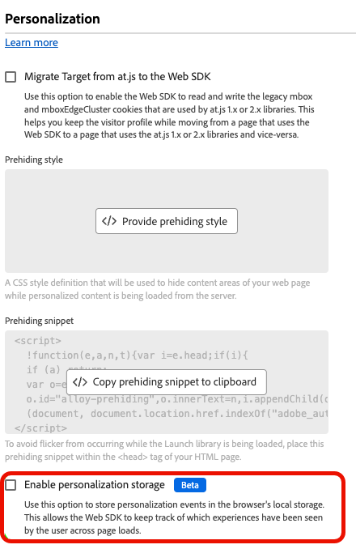
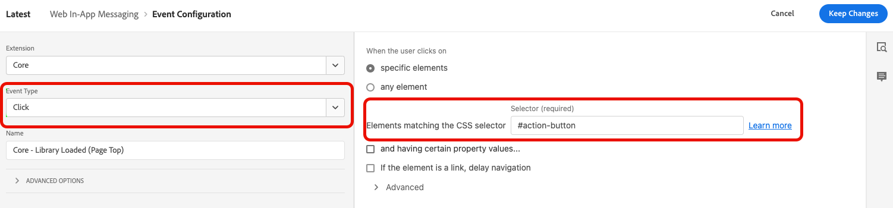

# 在Web SDK中設定網頁應用程式內傳訊支援

應用程式內訊息是通知，您可以在網頁應用程式內傳送給使用者，引導他們前往特定地標。

您可以將這些通知用於不同的目的，例如促銷新功能、提供特殊優惠或協助使用者上線。

透過使用應用程式內訊息，您可以有效地與對象互動，並引導他們前往應用程式的重要層面。

## 先決條件 {#prerequisites}

### Web SDK標籤擴充功能版本 {#extension-version}

Web應用程式內傳訊功能需要最新版的Web SDK標籤擴充功能。

### 設定CSP以傳送網頁應用程式內訊息 {#csp}

設定網頁應用程式內傳訊時，您必須在CSP中加入下列指令：

```
default-src  blob:;
```

如需設定CSP的詳細資訊，請參閱[資料收集檔案](https://experienceleague.adobe.com/docs/experience-platform/edge/use-cases/configuring-a-csp.html){target="_blank"}。

## 使用Web SDK標籤擴充功能設定Web應用程式內訊息 {#tag-extension}

請參閱[網頁SDK標籤擴充功能組態頁面](https://experienceleague.adobe.com/docs/experience-platform/tags/extensions/client/web-sdk/web-sdk-extension-configuration.html){target="_blank"}，瞭解您可在何處找到下述設定。

在您[安裝](https://experienceleague.adobe.com/docs/experience-platform/tags/extensions/client/web-sdk/web-sdk-extension-configuration.html#install-the-web-sdk-tag-extension){target="_blank"} Web SDK標籤擴充功能後，請依照下列步驟設定Web應用程式內傳訊的擴充功能。

在&#x200B;**[!UICONTROL Personalization]**&#x200B;區段中，勾選&#x200B;**[!UICONTROL 啟用個人化儲存空間]**&#x200B;選項。 此選項可讓Web SDK追蹤使用者在頁面載入過程中看過哪些體驗。



Web應用程式內傳訊支援兩種型別的觸發器：

* [傳送資料至Experience Platform](#send-data-platform)
* [手動觸發訊息](#manual-trigger)

請參閱下列章節，根據您想使用的觸發程式設定網頁SDK標籤擴充功能。

### **[!UICONTROL 傳送資料至Experience Platform]**&#x200B;觸發器的設定步驟 {#send-data-platform}

1. 選取包含您的Web SDK擴充功能的標籤屬性，並使用下列設定[建立新規則](https://experienceleague.adobe.com/docs/experience-platform/tags/ui/managing-resources/rules.html#create-a-rule){target="_blank"}：

   * **[!UICONTROL 延伸模組]**： [!UICONTROL 核心]
   * **[!UICONTROL 事件型別]**： [!UICONTROL 載入的程式庫（頁面頂端）]

   

1. 選取&#x200B;**[!UICONTROL 保留變更]**&#x200B;以儲存事件設定。

1. 您現在需要將動作新增至您建立的規則，在[!DNL Actions]區段中，選取&#x200B;**[!UICONTROL 新增]**。

   使用下列&#x200B;**[!UICONTROL 動作]**&#x200B;設定：

   * **[!UICONTROL 擴充功能]**： [!UICONTROL Adobe Experience Platform Web SDK]
   * **[!UICONTROL 動作型別]**： [!UICONTROL 傳送事件]

   

1. 在熒幕右側的&#x200B;**[!UICONTROL Personalization]**&#x200B;區段中，啟用&#x200B;**[!UICONTROL 呈現視覺個人化決策]**&#x200B;選項。

   

1. 在畫面右側的&#x200B;**[!UICONTROL 決定內容]**&#x200B;區段中，定義您用於行銷活動設定的&#x200B;**[!UICONTROL 索引鍵]**/**[!UICONTROL 值]**&#x200B;配對，以符合應用程式內訊息的資格。

   

1. 選取&#x200B;**[!UICONTROL 保留變更]**&#x200B;以儲存您的設定。

1. 接下來，您必須將新建立的規則新增至標籤屬性程式庫。 若要這麼做，請移至&#x200B;**[!UICONTROL 發佈流程]**，並選取您先前建立的規則。

   

1. 將規則新增至程式庫後，請選取&#x200B;**[!UICONTROL 儲存並建置至開發]**。

   

設定程式現已完成，您的訊息已準備好向使用者顯示。

### 使用手動觸發器的設定步驟 {#manual-trigger}

1. 選取包含您Web SDK擴充功能的標籤屬性，並使用下列設定[建立新規則](https://experienceleague.adobe.com/docs/experience-platform/tags/ui/managing-resources/rules.html#create-a-rule){target="_blank"}：

   * **[!UICONTROL 延伸模組]**： [!UICONTROL 核心]
   * **[!UICONTROL 事件型別]**： [!UICONTROL 按一下]

1. 為頁面上的特定元素設定觸發器，由您選擇的CSS選取器識別。

   

1. 您必須將動作新增至您建立的規則。 在[!DNL Actions]區段中，選取&#x200B;**[!UICONTROL 新增]**&#x200B;並使用下列&#x200B;**[!UICONTROL 動作]**&#x200B;設定：

   * **[!UICONTROL 擴充功能]**： [!UICONTROL Adobe Experience Platform Web SDK]
   * **[!UICONTROL 動作型別]**： [!UICONTROL 評估規則集]

   

1. 在熒幕右側，啟用&#x200B;**[!UICONTROL 呈現視覺化個人化決定]**&#x200B;選項。

   

1. 在畫面右側的&#x200B;**[!UICONTROL 決定內容]**&#x200B;區段中，定義您用於行銷活動設定的&#x200B;**[!UICONTROL 索引鍵]**/**[!UICONTROL 值]**&#x200B;配對，以符合應用程式內訊息的資格。

   

1. 選取&#x200B;**[!UICONTROL 保留變更]**&#x200B;以儲存您的設定。

1. 將新建立的規則新增至標籤屬性程式庫。 若要這麼做，請移至&#x200B;**[!UICONTROL 發佈流程]**，並選取您先前建立的規則。

   

1. 將規則新增至程式庫後，請選取&#x200B;**[!UICONTROL 儲存並建置至開發]**。

   

設定程式現已完成，您的訊息已準備好向使用者顯示。

## 使用Web SDK JavaScript資料庫設定應用程式內傳訊 {#js-library}

除了使用Web SDK標籤擴充功能外，您也可以直接從Web SDK JavaScript資料庫設定「Web應用程式內傳訊」 。

您可以透過兩種方式顯示來自Adobe Journey Optimizer的網頁應用程式內訊息。

### 方法1：自動擷取個人化內容 {#automatic}

若要讓網頁SDK在頁面載入時自動擷取個人化內容，請使用`sendEvent`命令，如下列範例所示。

```js
  alloy("sendEvent", {
      renderDecisions: true,
      personalization: {
          surfaces: ['#welcome']
      }
  });
```

### 方法2：根據使用者動作手動擷取個人化內容 {#manual}

若要在使用者執行特定動作之後才顯示個人化內容，請使用`evaluateRulesets`命令，如下列範例所示。

在此範例中，當使用者按一下您網站上的&#x200B;**[!UICONTROL 立即購買]**&#x200B;按鈕時，會顯示個人化內容。

```js
 alloy("evaluateRulesets", {
     renderDecisions: true,
     personalization: {
         decisionContext: {
             "userAction": "buy_now"
         }
     }
 });
```

### 設定個人化儲存空間 {#personalization-storage}

您可以透過`personalizationStorageEnabled`設定選項，選擇在使用者設定次數內或每次造訪頁面時，向使用者顯示應用程式內訊息。

在[網頁SDK組態](https://experienceleague.adobe.com/docs/experience-platform/edge/fundamentals/configuring-the-sdk.html){target="_blank"}中，根據您的需求設定`personalizationStorageEnabled`選項：

* `personalizationStorageEnabled: true`會以您在[行銷活動](create-in-app-web.md#configure-inapp)中定義的頻率觸發應用程式內訊息。
* `personalizationStorageEnabled: false`會在每次頁面載入時觸發應用程式內訊息。
