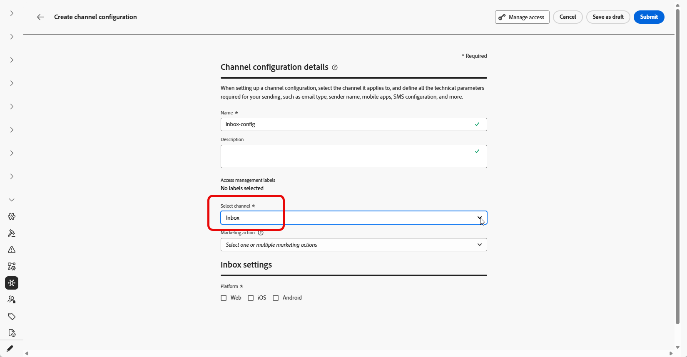

# 設定收件匣 {#inbox-configuration}

您必須先在&#x200B;**頻道設定**&#x200B;中定義&#x200B;**[!UICONTROL 收件匣]**&#x200B;頻道設定，才能透過收件匣傳遞內容卡片體驗。 該設定會將介面與同意、選用存取標籤以及體驗出現在網頁或iOS或Android應用程式中的位置連結起來。 請依照下列步驟建立設定：

1. 存取&#x200B;**[!UICONTROL 頻道]** > **[!UICONTROL 一般設定]** > **[!UICONTROL 頻道設定]**&#x200B;功能表，然後按一下&#x200B;**[!UICONTROL 建立頻道設定]**。

   

1. 輸入設定的名稱和說明（選擇性）。

   >[!NOTE]
   >
   > 名稱必須以字母(A-Z)開頭。 它只能包含英數字元。 您也可以使用底線 `_`、點 `.` 和連字號 `-` 字元。

1. 若要將自訂或核心資料使用標籤指派給組態，您可以選取&#x200B;**[!UICONTROL 管理存取權]**。 [進一步瞭解物件層級存取控制(OLAC)](../administration/object-based-access.md)。

1. 選取&#x200B;**[!UICONTROL 收件匣]**&#x200B;頻道。

   

1. 選取&#x200B;**[!UICONTROL 行銷動作]**，以使用此設定將同意原則與訊息相關聯。 系統會運用與行銷動作相關的所有同意政策，以尊重客戶的偏好設定。 [了解更多](../action/consent.md#surface-marketing-actions)

1. 選取將套用收件匣體驗的平台。

   

1. 針對Web：

   * 在&#x200B;**[!UICONTROL 頁面URL]**&#x200B;中，輸入或選取收件匣應出現的頁面URL。 當體驗僅限一個頁面時，請使用此選項。

   * 在&#x200B;**[!UICONTROL 頁面]**&#x200B;上的位置中，定義頁面內的位置，例如網站用於收件匣表面的區域或識別碼。 [了解更多](../web/web-configuration.md)

     

1. 對於iOS和Android：

   * 在&#x200B;**[!UICONTROL 應用程式ID]**&#x200B;中，輸入或選取應用程式的識別碼，以便設定套用至正確的iOS或Android組建。

   * 在&#x200B;**[!UICONTROL 應用程式]**&#x200B;內的位置或路徑中，指定使用者應開啟收件匣的畫面、路由或容器。

1. 提交變更。

您現在可以在建立收件匣體驗時選取設定。

➡️ [請依照此頁面中詳述的步驟操作](inbox-create.md)
