# 使用 Dynamic Media 工作 {#aem-dynamic}

## 開始使用Dynamic Media {#gs-aem-dynamic}

「資產」選擇器現在支援Dynamic Media，讓您在Journey Optimizer中順暢地選取並使用核准的Dynamic Media轉譯。 對Adobe Experience Manager中的資產所做的變更會立即反映在您的Journey Optimizer內容中，以確保最新版本始終在使用中，而不需要手動更新。

請注意，這項整合僅適用於使用Dynamic Media Manager as a Cloud Service的客戶。

若要進一步瞭解Adobe Experience Manager as a Cloud Service中的Dynamic Media，請參閱[Experience Manager檔案](https://experienceleague.adobe.com/en/docs/experience-manager-cloud-service/content/assets/dynamicmedia/dynamic-media){target="_blank"}。

>[!AVAILABILITY]
>
>對於醫療保健客戶，整合僅在授權Journey Optimizer Healthcare Shield和Adobe Experience Manager增強式安全性附加方案時啟用。

## 新增及管理Dynamic Media {#dynamic-media}

直接從Adobe Experience Manager as a Cloud Service將動態媒體插入您的Journey Optimizer內容，以針對任何熒幕或瀏覽器增強及最佳化您的內容。  然後您可以視需要調整大小、裁切、增強及進行其他調整。

>[!IMPORTANT]
>
>請確定Adobe Experience Manager as a Cloud Service已啟用Dynamic Media with OpenAPI。 [了解更多](https://experienceleague.adobe.com/en/docs/experience-manager-cloud-service/content/assets/dynamicmedia/dynamic-media-open-apis/dynamic-media-open-apis-overview#enable-dynamic-media-open-apis){target="_blank"}。

Dynamic Media與Adobe Journey Optimizer的整合適用於Dynamic Media [Scene7模式](https://experienceleague.adobe.com/en/docs/experience-manager-65/content/assets/dynamic/config-dms7){target="_blank"}和[搭配OpenAPI](https://experienceleague.adobe.com/en/docs/experience-manager-cloud-service/content/assets/dynamicmedia/dynamic-media-open-apis/dynamic-media-open-apis-overview){target="_blank"}。

<!--
>[!AVAILABILITY]
>
>Older versions of Outlook (including 2016) do not support rendering of content with Dynamic Media.  We are actively working on a permanent fix to enhance compatibility. In the meantime, apply the following guidelines:
>
>* For Dynamic Media Scene7 URLs: Append `?bfc=on` to the image URL. This enables automatic format negotiation, ensuring the most compatible image format is delivered based on the client's capabilities.
>
>* For Dynamic Media with Open API: Use the `.avif` format. This format includes built-in fallback mechanisms to deliver a compatible format when necessary.
>
-->

若要在HTML內容中新增Adobe Experience Manager資產，請遵循下列步驟：

1. 將&#x200B;**[!UICONTROL HTML元件]**&#x200B;拖放到您的內容中。

1. 選取&#x200B;**[!UICONTROL 顯示原始程式碼]**。

   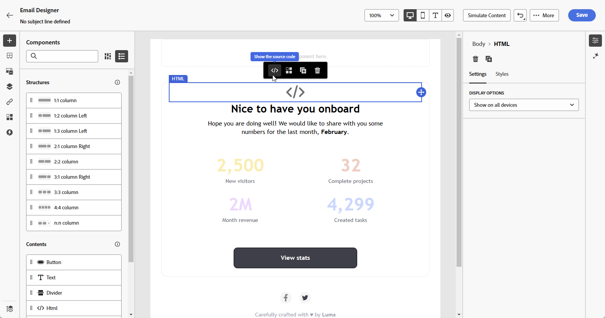

1. 在&#x200B;**[!UICONTROL 編輯HTML]**&#x200B;功能表中，導覽至&#x200B;**[!UICONTROL Assets]**，然後按一下&#x200B;**[!UICONTROL 開啟資產選擇器]**。

   或者，您也可以複製並貼上資產的URL。

   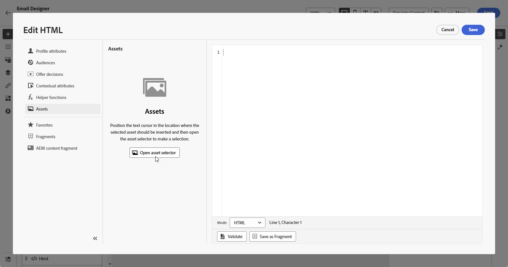

1. 瀏覽您的AEM資產，並選取您要新增至內容的資產。

1. 視需要調整影像引數（例如高度、寬度、旋轉、翻轉、亮度、色相等），以符合您的資產需求。

   如需可新增至URL的影像引數完整清單，請參閱[Experience Manager檔案](https://experienceleague.adobe.com/en/docs/dynamic-media-developer-resources/image-serving-api/image-serving-api/http-protocol-reference/command-reference/c-command-reference){target="_blank"}。

   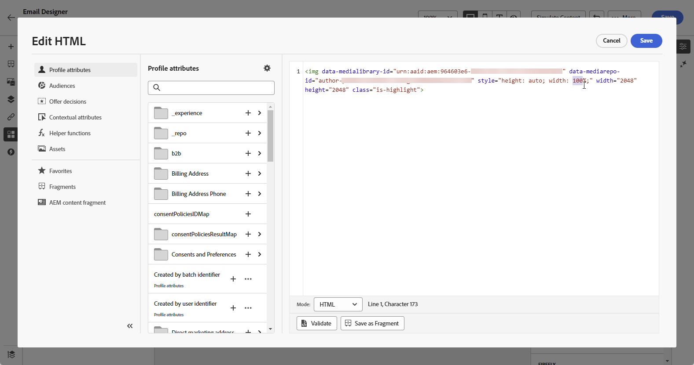

1. 按一下&#x200B;**[!UICONTROL 儲存]**。

您的內容現在包含動態媒體。 您在Experience Manager中所做的任何更新都會自動顯示在Journey Optimizer中。

## 個人化您的文字覆蓋 {#text-overlay}

使用您選擇的新文字取代現有的文字覆蓋圖，輕鬆自訂任何動態媒體，實現順暢的更新及個人化。

例如，使用實驗功能，您可以更新現有的文字覆蓋，方法是為每個處理使用不同的文字來取代，以確保在開啟訊息時為每個設定檔自訂它。

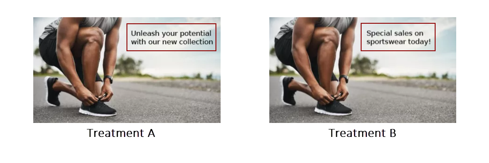

>[!AVAILABILITY]
>
>**文字覆蓋個人化**&#x200B;僅可在Dynamic Media [Scene7模式](https://experienceleague.adobe.com/en/docs/experience-manager-65/content/assets/dynamic/config-dms7){target="_blank"}中使用。 由於Healthcare客戶無法存取Scene7模式，因此內容會使用Journey Optimizer影像的二進位復本轉譯。 如有例外，請聯絡您的Adobe代表。

若要個人化文字覆蓋，請依照下列步驟進行：

1. 將&#x200B;**[!UICONTROL HTML元件]**&#x200B;拖放到您的內容中。

1. 選取&#x200B;**[!UICONTROL 顯示原始程式碼]**。

1. 從&#x200B;**[!UICONTROL 編輯HTML]**&#x200B;功能表，存取&#x200B;**[!UICONTROL Assets]**，然後&#x200B;**[!UICONTROL 開啟資產選擇器]**。

   您也可以直接複製並貼上資產URL。

1. 瀏覽您的AEM資產，並選取您要新增至內容的資產。

1. 將覆蓋圖取代為所需文字。

   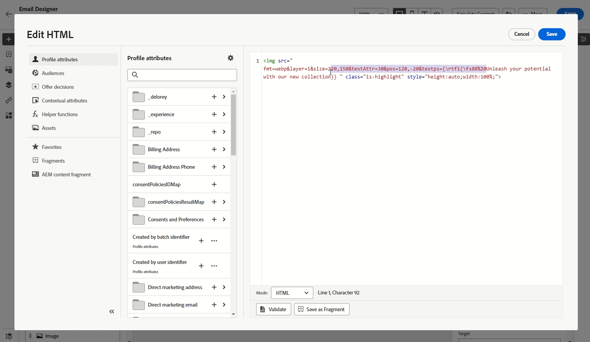

1. 更新影像引數：

   * **Layer**：輸入放置文字的基元素。
   * **大小**：更新文字區塊的大小。
   * **TextAttr**：調整文字字型的大小。
   * **Pos**：設定文字在影像中的位置。

   >[!WARNING]
   >
   >更新動態媒體需要Layer引數。

   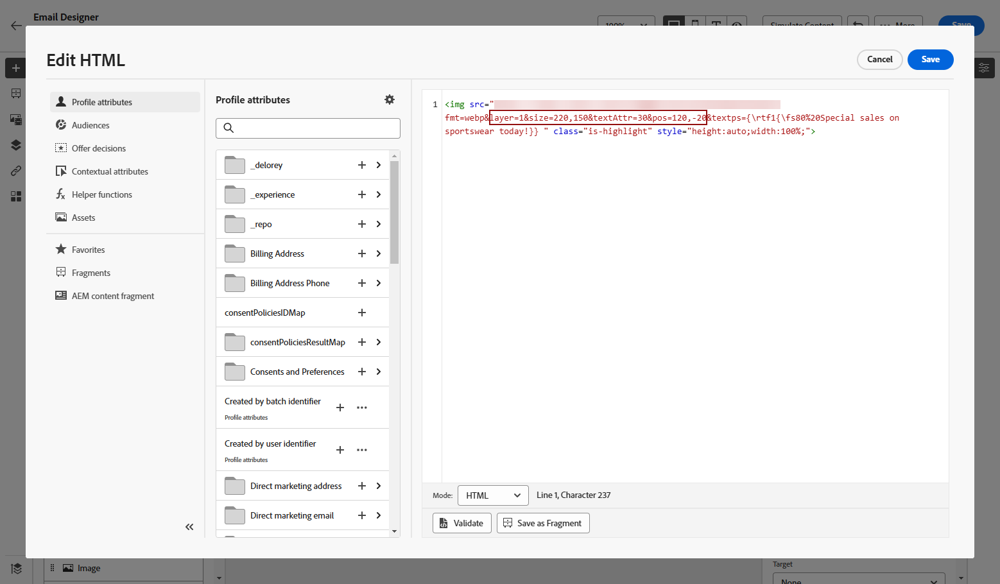

1. 按一下&#x200B;**[!UICONTROL 儲存]**。

您的內容現在包含更新的文字覆蓋。

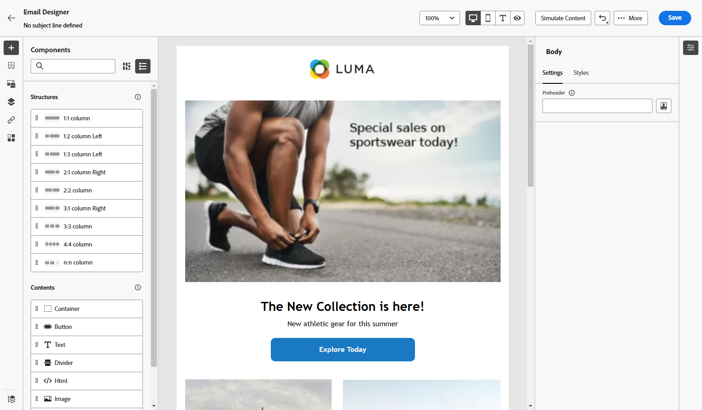

## 新增及管理您的Dynamic Media範本 {#dynamic-media-template}

在Journey Optimizer中輕鬆新增動態媒體範本，並視需要更新媒體內容。 您現在可以將個人化欄位整合到媒體中，讓您在Journey Optimizer中建立更自訂且吸引人的內容。

深入瞭解[動態媒體範本](https://experienceleague.adobe.com/en/docs/dynamic-media-classic/using/template-basics/quick-start-template-basics){target="_blank"}。

>[!AVAILABILITY]
>
>**Dynamic Media範本**&#x200B;僅可在Dynamic Media [Scene7模式](https://experienceleague.adobe.com/en/docs/experience-manager-65/content/assets/dynamic/config-dms7)中使用。 由於Healthcare客戶無法存取Scene7模式，將不會轉譯內容。 如有任何例外，請聯絡Experience Manager支援。

### 使用影像元件 {#image-component}

您可以使用影像元件，直接將動態範本插入內容中：

1. 開啟您的行銷活動或歷程並存取您的內容。

1. 將&#x200B;**影像元件**&#x200B;拖放到您的版面配置中。

   如需影像元件的詳細資訊，請參閱[此頁面](../email/content-components.md)。

   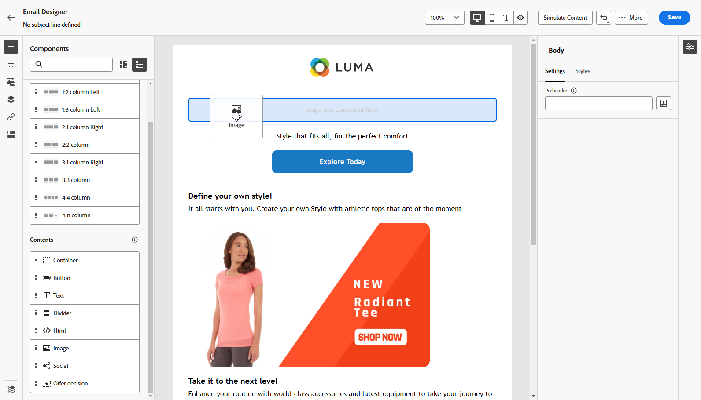

1. 瀏覽您的AEM資產，並選取您要新增至內容的Dynamic Media範本。

   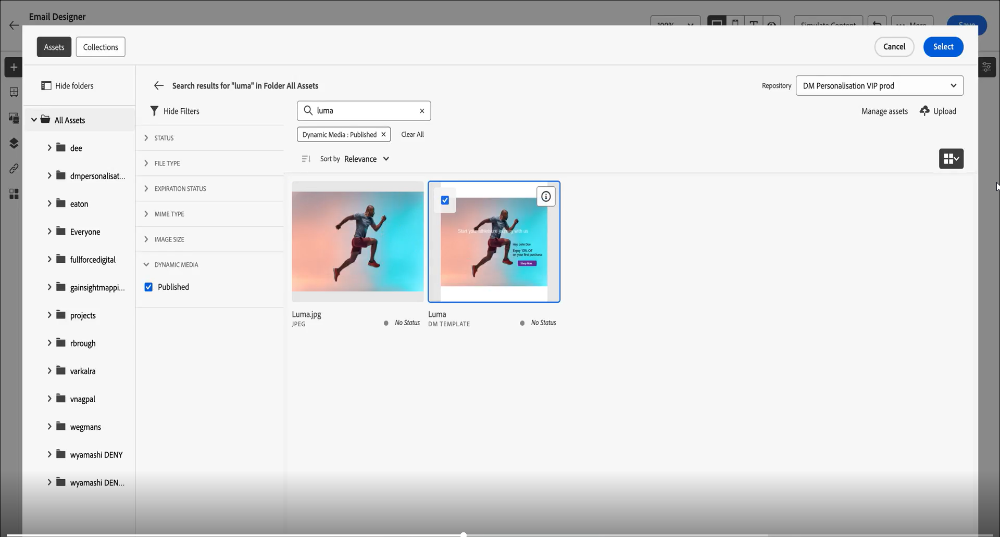

1. 在&#x200B;**影像設定**&#x200B;中，瀏覽以存取動態媒體範本的引數。

   可用的欄位取決於Adobe Experience Manager中[範本建立](https://experienceleague.adobe.com/en/docs/dynamic-media-classic/using/template-basics/creating-template-parameters#creating_template_parameters){target="_blank"}期間新增的引數。

   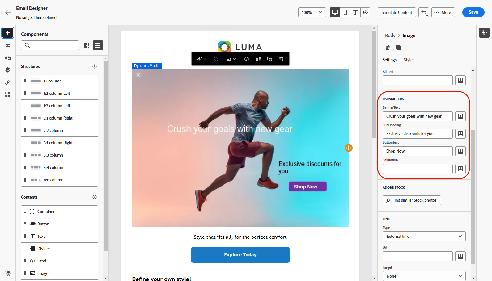

1. 填寫不同的欄位，並使用個人化編輯器新增個人化內容。 您可以使用任何屬性（例如設定檔名稱、城市或其他相關詳細資訊）來建立更自訂的體驗。

   在[此頁面](../personalization/personalize.md)上進一步瞭解個人化。

   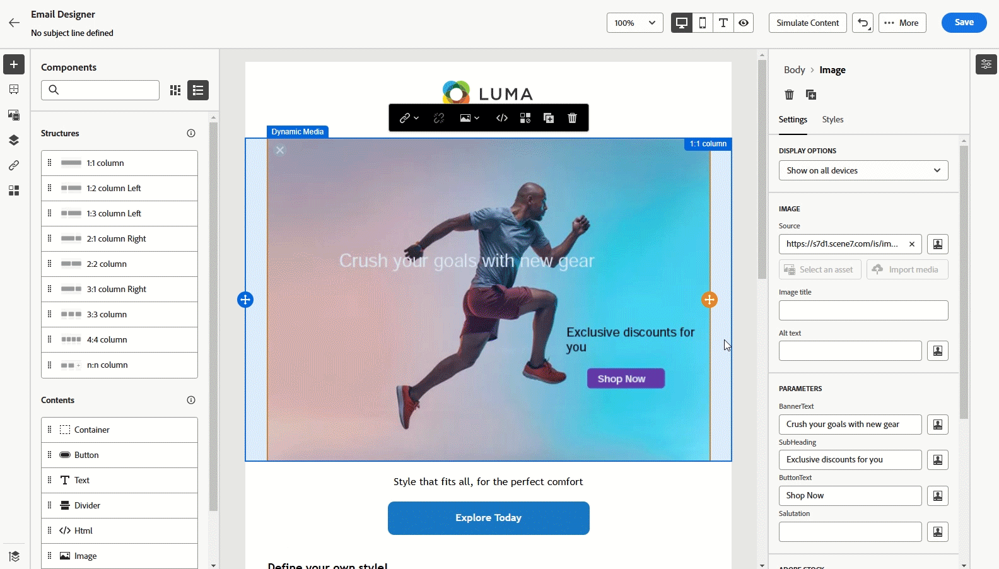

1. 條件式內容可套用至Dynamic Media元件，以產生不同的內容變體。 [了解更多](../personalization/dynamic-content.md)

1. 按一下&#x200B;**[!UICONTROL 儲存]**。

一旦您執行測試並驗證內容後，您就可以將訊息傳送給對象。

### 搭配HTML元件 {#html-component}

您可以使用HTML元件，直接將動態範本插入內容中：

1. 開啟您的行銷活動或歷程並存取您的內容。

1. 將&#x200B;**HTML元件**&#x200B;拖放到您的版面配置中。

   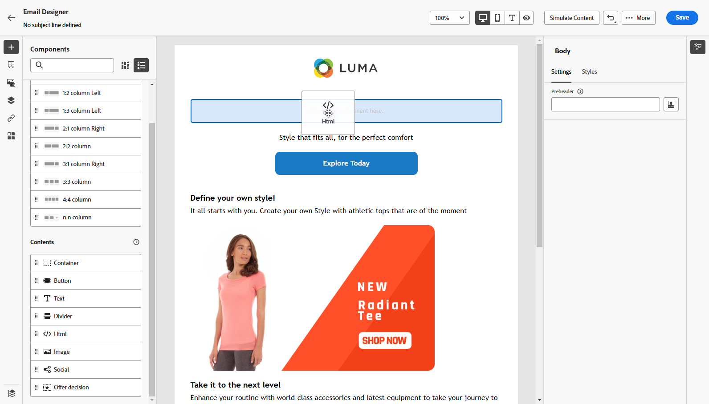

1. 選取&#x200B;**[!UICONTROL 顯示原始程式碼]**。

   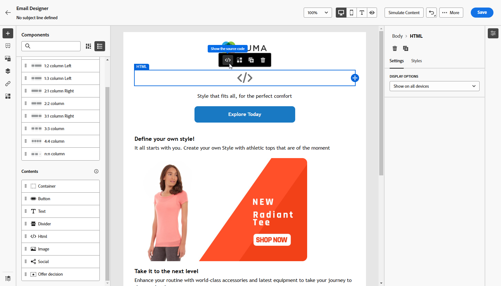

1. 從&#x200B;**[!UICONTROL 編輯HTML]**&#x200B;功能表，存取&#x200B;**[!UICONTROL Assets]**，然後&#x200B;**[!UICONTROL 開啟資產選擇器]**。

   您也可以直接複製並貼上資產URL。

1. 視需要調整影像文字引數，以符合您的資產需求。

   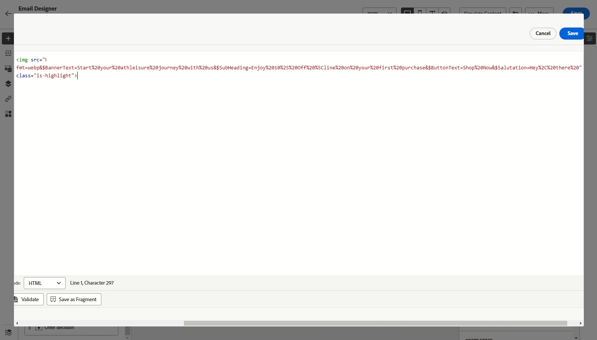

1. 按一下&#x200B;**[!UICONTROL 儲存]**。

一旦您執行測試並驗證內容後，您就可以將訊息傳送給對象。

<!--
## Personalization with Text Overlay

Easily customize any dynamic media by replacing the existing text overlay with new text of your choice, allowing for seamless updates and personalization.

In this example, our goal is to update the existing text overlay by replacing it with a new validity date and adding a personalization block, ensuring it is customized for each profile when they open their messages.

1. Drag and drop an **[!UICONTROL HTML component]** into your content.

1. Select **[!UICONTROL Show the source code]**.

1. From the **[!UICONTROL Edit HTML]** menu, access **[!UICONTROL Assets]** then **[!UICONTROL Open asset selector]**.

    You can also simply copy and paste your assets URL.

1. Browse through your AEM assets and select the one you want to add to your content.

1. Replace the overlay with the desired text.

    Here we change the validity date from 31st December 2024 to the 1st July 2025.

1. Add the required personalization fields to your image.

1. Click **[!UICONTROL Save]**.

Your content now includes your updated text overlay and personalization.

## Add Dynamic media conditional content

Enable conditional content in your dynamic media to better target your audience and deliver a more personalized experience.

1. Drag and drop an **[!UICONTROL HTML component]** into your content.

1. Select **[!UICONTROL Show the source code]**.

1. From the **[!UICONTROL Edit HTML]** menu, access **[!UICONTROL Assets]** then **[!UICONTROL Open asset selector]**.

    You can also simply copy and paste your assets URL.

1. Browse through your AEM assets and select the one you want to add to your content.

1. Once your dynamic media is inserted to your content, select **[!UICONTROL Enable conditional]** content from your HTML component toolbar to create your different user experiences. 

1. From the Variant - 1, click **[!UICONTROL Select condition]** to fine tune your audience.

1. Choose your condition or create a new one if needed and click **[!UICONTROL Select]**.

    [Learn more about conditions](../personalization/create-conditions.md)

1. Select your **[!UICONTROL Component]** and access the **[!UICONTROL Settings]** menu.

1. In the **[!UICONTROL Custom Attributes]** menu, populate the Dynamic Media text and personalization fields to customize the content for your audience.

-->

## 作法影片 {#video}

了解如何將 Adobe Experience Manager Dynamic Media 與 Adobe Journey Optimizer 進行整合，以啟用即時內容更新和個人化。

本教學課程涵蓋如何直接在 AJO 中修改影像、使用 HTML 模式新增文字覆蓋，在 AEM 中建立可用於超個人化的動態媒體範本，還會透過為不同客群區段，量身打造內容，將行銷活動個人化。此整合可讓行銷人員有效建立吸引人的行銷活動，並將行銷活動個人化，不必在應用程式之間切換。

>[!VIDEO](https://video.tv.adobe.com/v/3457695/?learn=on&enablevpops=&autoplay=true)

