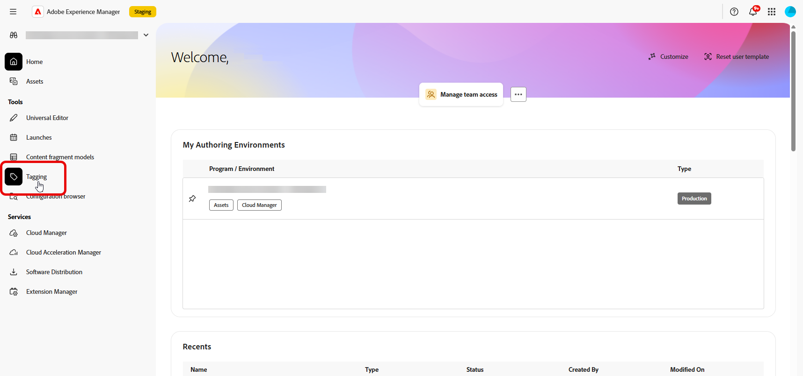
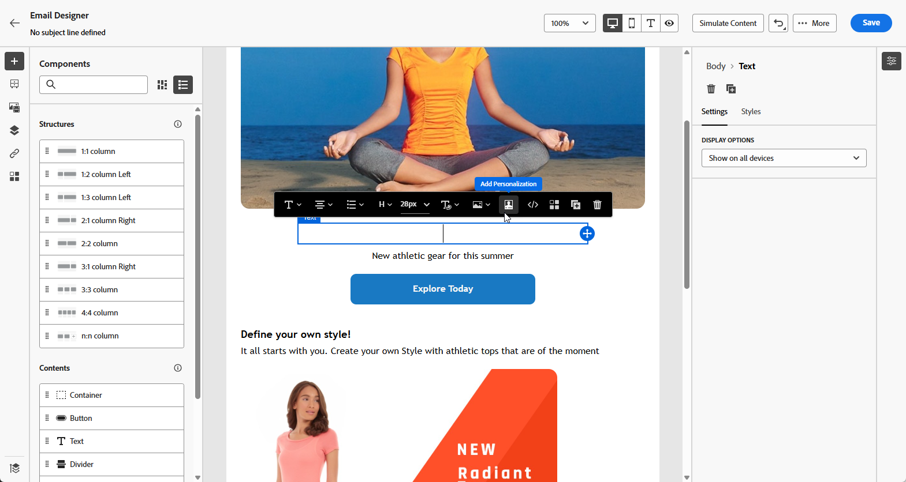
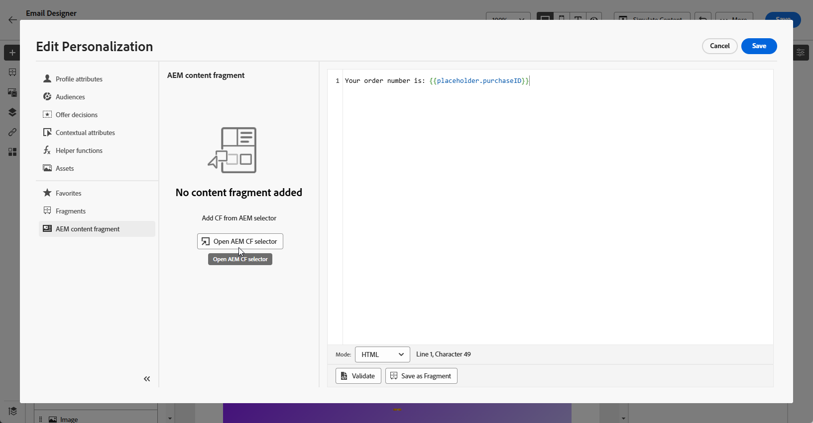
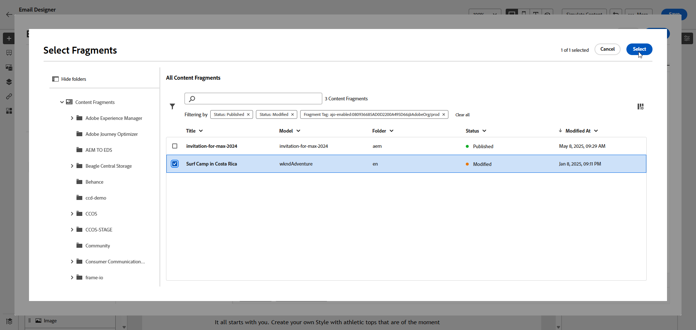
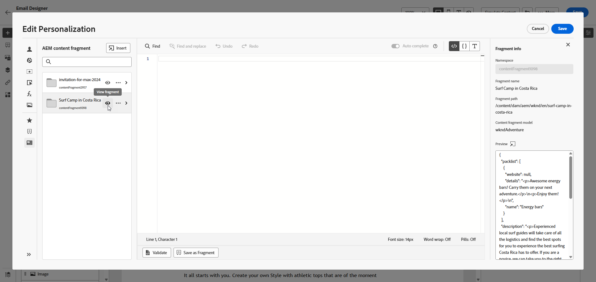
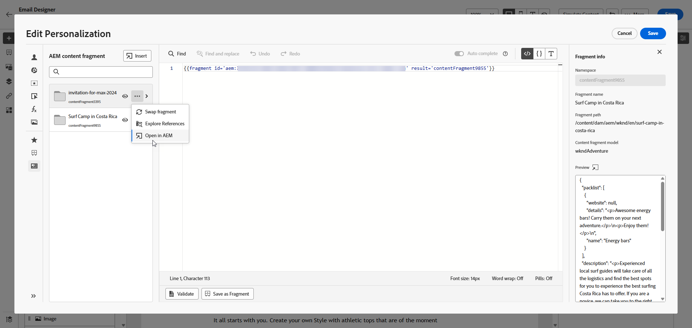
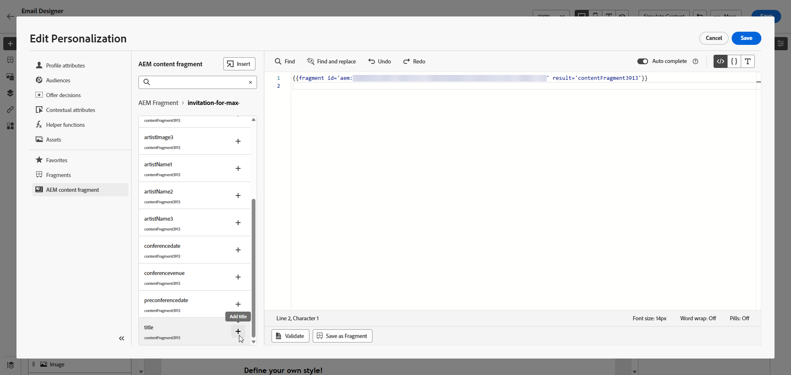
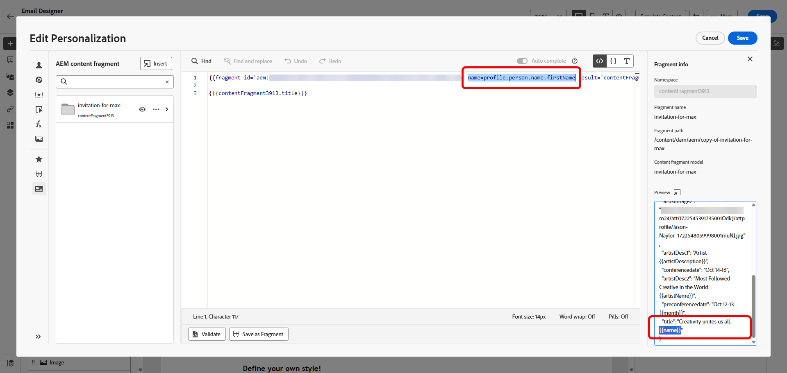

# Adobe Experience Manager 內容片段 {#aem-fragments}

透過將 Adobe Experience Manager as a Cloud Service 與 Adobe Journey Optimizer 整合在一處，您可以立即將 AEM 內容片段順利整合到 Journey Optimizer 內容當中。已簡化的連線可以簡化存取，並運用 AEM 內容的程式，讓您建立個人化的動態行銷活動和歷程。

若要深入瞭解AEM內容片段，請參閱Experience Manager檔案中的[使用內容片段](https://experienceleague.adobe.com/zh-hant/docs/experience-manager-cloud-service/content/sites/administering/content-fragments/content-fragments-with-journey-optimizer){target="_blank"}。

>[!AVAILABILITY]
>
>對於醫療保健客戶，只有在授權Journey Optimizer Healthcare Shield和Adobe Experience Manager增強式安全性附加方案後，才會啟用整合。

## 限制 {#limitations}

* 建議限制有權存取發佈內容片段的使用者人數，以降低意外錯誤的風險。

* 對於多語言內容，僅支援手動流程。

* 目前不支援變數。

* 已發佈行銷活動和歷程的校訂會反映最新Experience Manager內容片段發佈中的資料。

## 在Experience Manager中建立及指派標籤

在Journey Optimizer中使用內容片段之前，您需要建立專門用於Journey Optimizer的標籤：

1. 存取您的&#x200B;**Experience Manager**&#x200B;環境。

1. 從&#x200B;**工具**&#x200B;功能表，選取&#x200B;**標籤**。

   

1. 按一下&#x200B;**建立標籤**。

1. 確定ID遵循下列語法： `ajo-enabled:{AJO-OrgId}/{AJO-SandboxName}`。

1. 按一下&#x200B;**建立**。

1. 定義您的內容片段模式(如[Experience Manager檔案](https://experienceleague.adobe.com/zh-hant/docs/experience-manager-cloud-service/content/sites/administering/content-fragments/content-fragment-models){target="_blank"}中所詳述)，並指派您新建立的Journey Optimizer標籤。

您現在可以開始建立和設定內容片段，以便稍後在Journey Optimizer中使用。 進一步瞭解[Experience Manager檔案](https://experienceleague.adobe.com/zh-hant/docs/experience-manager-cloud-service/content/sites/administering/content-fragments/managing){target="_blank"}。

## 新增Experience Manager內容片段 {#aem-add}

建立並個人化AEM內容片段後，您現在可以將其匯入您的Journey Optimizer行銷活動或歷程。

1. 建立您的[行銷活動](../campaigns/create-campaign.md)或[歷程](../building-journeys/journey-gs.md)。

1. 若要存取您的AEM內容片段，請按一下任何文字欄位中的，或透過HTML內容元件開啟原始程式碼。

   

1. 從左窗格中的&#x200B;**[!UICONTROL AEM內容片段]**&#x200B;功能表，按一下&#x200B;**[!UICONTROL 開啟AEM CF選取器]**。

   

1. 從可用的清單中選取&#x200B;**[!UICONTROL 內容片段]**，以匯入您的Journey Optimizer內容。

1. 按一下「**[!UICONTROL 顯示篩選器]**」以微調您的內容片段清單。

   依預設，內容片段篩選器預設為僅顯示核准的內容。

   

1. 選取您的&#x200B;**[!UICONTROL 內容片段]**&#x200B;後，按一下&#x200B;**[!UICONTROL 選取]**&#x200B;以開啟。

   

1. 按一下&#x200B;**[!UICONTROL 檢視片段]**&#x200B;以顯示您的片段資訊。 請注意，開啟&#x200B;**[!UICONTROL 片段資訊]**&#x200B;功能表會將編輯器置於唯讀模式。

   從右側選單中選取「**[!UICONTROL 預覽]**」，在Adobe Experience Manager中檢視您的片段。

   

1. 按一下以存取片段的進階功能表：

   * **[!UICONTROL 交換片段]**
   * **[!UICONTROL 探索參考]**
   * 在AEM中&#x200B;**[!UICONTROL 開啟]**

   

1. 從您的&#x200B;**[!UICONTROL 片段]**&#x200B;中選擇所需的欄位以新增至您的內容。
   <!--
    Note that if you choose to copy the value, any future updates to the Content Fragment will not be reflected in your campaign or journey. However, using dynamic placeholders ensures real-time updates.-->

   

1. 若要啟用即時個人化，**[!UICONTROL 內容片段]**&#x200B;中使用的所有預留位置，必須由使用者明確宣告為片段協助程式標籤中的引數。 您可以使用下列方法，將這些預留位置對應至設定檔屬性、內容屬性、靜態字串或預先定義的變數：

   1. **設定檔或內容屬性對應**：將預留位置指派給設定檔或內容屬性，例如name = profile.person.name.firstName。

   1. **靜態字串對應**：將固定字串值放在雙引號中，例如名稱= &quot;John&quot;，以指派固定字串值。

   1. **變數對應**：參照同一HTML中先前宣告的變數，例如name = &#39;variableName&#39;。
在此情況下，請確保在新增片段ID之前使用以下語法宣告&#x200B;**_variableName_**：

      ```html
       
      ```

   在下列範例中，**_name_**&#x200B;預留位置對應至片段中的&#x200B;**_profile.person.name.firstName_**&#x200B;屬性。

   {zoomable="yes"}


1. 按一下&#x200B;**[!UICONTROL 「儲存」]**。您現在可以測試並檢查您的訊息內容，如[本節](../content-management/preview.md)所詳述。

執行測試並驗證內容後，您可以[傳送行銷活動](../campaigns/review-activate-campaign.md)或[發佈您的歷程](../building-journeys/publish-journey.md)給您的對象。

Adobe Experience Manager可讓您識別使用內容片段的Journey Optimizer行銷活動或歷程。 進一步瞭解[Adobe Experience Manager檔案](https://experienceleague.adobe.com/zh-hant/docs/experience-manager-cloud-service/content/sites/administering/content-fragments/extension-content-fragment-ajo-external-references)。
