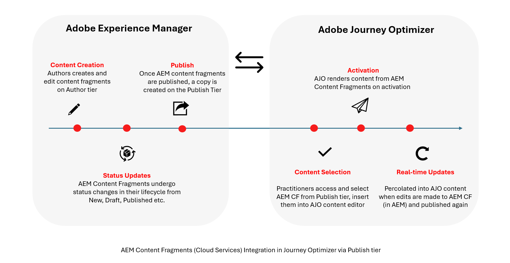

# Adobe Experience Manager 內容片段 {#aem-fragments}

透過將 Adobe Experience Manager as a Cloud Service 與 Adobe Journey Optimizer 整合在一處，您可以立即將 AEM 內容片段順利整合到 Journey Optimizer 內容當中。已簡化的連線可以簡化存取，並運用 AEM 內容的程式，讓您建立個人化的動態行銷活動和歷程。

若要深入瞭解AEM內容片段，請參閱Experience Manager檔案中的[使用內容片段](https://experienceleague.adobe.com/zh-hant/docs/experience-manager-cloud-service/content/sites/administering/content-fragments/content-fragments-with-journey-optimizer){target="_blank"}。

## 開始之前 {#start}

>[!AVAILABILITY]
>
>對於醫療保健客戶，只有在授權Journey Optimizer Healthcare Shield和Adobe Experience Manager增強式安全性附加方案後，才會啟用整合。

### 限制 {#limitations}

在Journey Optimizer中使用Adobe Experience Manager內容片段時，請注意下列限制：

* **內容片段型別**：支援簡單內容片段和巢狀內容片段。 目前不支援內容片段變數。

* **多語言內容**：僅支援手動流程。 每個語言變體都必須在Adobe Experience Manager中獨立撰寫、在Journey Optimizer中標籤、發佈及手動選取。 沒有自動的語言解析或遞補機制。

* **存放庫存取**： Journey Optimizer獨家與Adobe Experience Manager發佈層整合，透過公開、未驗證的端點提供內容片段。 雖然作者存放庫可能會顯示在存放庫選擇器中，但Journey Optimizer中只能使用發佈到發佈層的內容片段。

* **內容片段狀態**： Journey Optimizer會顯示狀態為&#x200B;**已發佈**&#x200B;和&#x200B;**已修改**&#x200B;的內容片段。 在所有情況下，僅會使用最新發佈的版本。 如果片段在發佈後有所修改，這些變更要等到內容片段在Adobe Experience Manager中重新發佈後才會反映在Journey Optimizer中。 Adobe Experience Manager和Journey Optimizer之間沒有自動版本調解。

* **Personalization**：僅支援設定檔屬性、內容屬性、靜態字串以及預先宣告的變數。 不支援衍生或計算屬性。

* **更新和版本設定**：內容片段更新需要從Adobe Experience Manager手動重新發佈。 Adobe Experience Manager和Journey Optimizer之間沒有自動版本調解。 在Adobe Experience Manager中發佈內容片段時，Journey Optimizer會在Journey Optimizer端接收事件並更新。 如果成功，將在5分鐘後提供單一歷程的更新，並在下一個批次批次用於批次使用案例。

* **快取和校樣**：會從Adobe Experience Manager發佈層級即時擷取內容片段。 沒有預先轉譯或快照快取。 行銷活動和歷程的校訂一律反映最新發佈的內容片段版本，且歷史版本無法鎖定以進行校訂。

* **使用者存取**：建議限制可存取發佈內容片段的使用者數目，以降低意外錯誤的風險。

### 內容同步流程 {#content-sync-flow}

Adobe Experience Manager與Journey Optimizer之間的整合會遵循以下資料流程：

1. **[建立和作者](https://experienceleague.adobe.com/zh-hant/docs/experience-manager-cloud-service/content/sites/administering/content-fragments/managing#creating-a-content-fragment)**：內容是在Adobe Experience Manager中建立並設定為內容片段。

1. **[標籤](https://experienceleague.adobe.com/zh-hant/docs/experience-manager-cloud-service/content/sites/administering/content-fragments/managing#manage-tags)**：內容片段必須使用Journey Optimizer特定標籤(`ajo-enabled:{OrgId}/{SandboxName}`)標籤。

1. **[發佈](https://experienceleague.adobe.com/zh-hant/docs/experience-manager-cloud-service/content/sites/administering/content-fragments/managing#publishing-and-previewing-a-fragment)**：內容片段已發佈至Adobe Experience Manager，可供Journey Optimizer使用。

1. **[存取](#aem-add)**： Journey Optimizer會即時從Adobe Experience Manager發佈執行個體擷取並顯示可用的內容片段。

1. **[整合](#aem-add)**：已選取內容片段並整合至行銷活動或歷程中。

在Adobe Experience Manager中發佈內容片段時，會傳送事件以更新Journey Optimizer端的內容。 如果更新成功，內容片段將在大約5分鐘內可用於單一歷程，以及用於批次使用案例的下一個處理批次。 在Journey Optimizer中提供更新後，最新發佈的內容就會用於所有適用的行銷活動和歷程。

### 內容片段生命週期



內容片段會根據其存在的Adobe Experience Manager層級遵循不同的生命週期階段。 [在Adobe Experience Manager檔案中進一步瞭解](https://experienceleague.adobe.com/zh-hant/docs/experience-manager-cloud-service/content/sites/authoring/author-publish)

內容是在&#x200B;**製作層級**&#x200B;上建立和管理的，其中片段可以具有狀態，例如，新增、草稿、已發佈、已修改或已取消發佈。 這些狀態僅適用於&#x200B;**作者階層**，並支援內容建立和檢閱。

發佈內容片段時，會在&#x200B;**發佈階層**&#x200B;上建立復本，並透過公開、未驗證的端點公開。 Journey Optimizer只與此&#x200B;**發佈階層**&#x200B;整合。

因此，Journey Optimizer只會顯示已發佈或已修改的內容片段，並一律使用最新發佈的版本。 發佈後所做的任何變更，在重新發佈內容片段之前都不會反映在Journey Optimizer中。

## 在Experience Manager中建立及指派標籤

在Journey Optimizer中使用內容片段之前，您需要建立專門用於Journey Optimizer的標籤：

1. 存取您的&#x200B;**Experience Manager**&#x200B;環境。

1. 從&#x200B;**工具**&#x200B;功能表，選取&#x200B;**標籤**。

   

1. 按一下&#x200B;**建立標籤**。

1. 確定ID遵循下列語法： `ajo-enabled:{AJO-OrgId}/{AJO-SandboxName}`。

1. 按一下&#x200B;**建立**。

1. 定義您的內容片段模式(如[Experience Manager檔案](https://experienceleague.adobe.com/zh-hant/docs/experience-manager-cloud-service/content/sites/administering/content-fragments/content-fragment-models){target="_blank"}中所詳述)，並指派您新建立的Journey Optimizer標籤。

此即時連線可確保您的內容永遠保持最新，但也意味著對已發佈片段的任何變更都會立即影響作用中的行銷活動和歷程。

您現在可以開始建立和設定內容片段，以便稍後在Journey Optimizer中使用。 進一步瞭解[Experience Manager檔案](https://experienceleague.adobe.com/zh-hant/docs/experience-manager-cloud-service/content/sites/administering/content-fragments/managing){target="_blank"}。

## 新增Experience Manager內容片段 {#aem-add}

建立並個人化AEM內容片段後，您現在可以將其匯入您的Journey Optimizer行銷活動或歷程。

1. 建立您的[行銷活動](../campaigns/create-campaign.md)或[歷程](../building-journeys/journey-gs.md)。

1. 若要存取您的AEM內容片段，請按一下任何文字欄位中的，或透過HTML內容元件開啟原始程式碼。

   

1. 從左窗格中的&#x200B;**[!UICONTROL AEM內容片段]**&#x200B;功能表，按一下&#x200B;**[!UICONTROL 開啟AEM CF選取器]**。

   

1. 從可用的清單中選取&#x200B;**[!UICONTROL 內容片段]**，以匯入您的Journey Optimizer內容。

1. 按一下「**[!UICONTROL 顯示篩選器]**」以微調您的內容片段清單。

   依預設，內容片段篩選器預設為僅顯示核准的內容。

   

1. 選取您的&#x200B;**[!UICONTROL 內容片段]**&#x200B;後，按一下&#x200B;**[!UICONTROL 選取]**&#x200B;以開啟。

   

1. 按一下&#x200B;**[!UICONTROL 檢視片段]**&#x200B;以顯示您的片段資訊。 請注意，開啟&#x200B;**[!UICONTROL 片段資訊]**&#x200B;功能表會將編輯器置於唯讀模式。

   從右側選單中選取「**[!UICONTROL 預覽]**」，在Adobe Experience Manager中檢視您的片段。

   

1. 按一下以存取片段的進階功能表：

   * **[!UICONTROL 交換片段]**
   * **[!UICONTROL 探索參考]**
   * 在AEM中&#x200B;**[!UICONTROL 開啟]**

   

1. 從您的&#x200B;**[!UICONTROL 片段]**&#x200B;中選擇所需的欄位以新增至您的內容。
   <!--
    Note that if you choose to copy the value, any future updates to the Content Fragment will not be reflected in your campaign or journey. However, using dynamic placeholders ensures real-time updates.-->

   

1. 若要啟用即時個人化，**[!UICONTROL 內容片段]**&#x200B;中使用的所有預留位置，必須由使用者明確宣告為片段協助程式標籤中的引數。 您可以使用下列方法，將這些預留位置對應至設定檔屬性、內容屬性、靜態字串或預先定義的變數：

   1. **設定檔或內容屬性對應**：將預留位置指派給設定檔或內容屬性，例如name = profile.person.name.firstName。

   1. **靜態字串對應**：將固定字串值放在雙引號中，例如名稱= &quot;John&quot;，以指派固定字串值。

   1. **變數對應**：參照同一HTML中先前宣告的變數，例如name = &#39;variableName&#39;。
在此情況下，請確保在新增片段ID之前使用以下語法宣告&#x200B;**_variableName_**：

      ```html
       
      ```

   在下列範例中，**_name_**&#x200B;預留位置對應至片段中的&#x200B;**_profile.person.name.firstName_**&#x200B;屬性。

   {zoomable="yes"}

1. 按一下&#x200B;**[!UICONTROL 「儲存」]**。您現在可以測試並檢查您的訊息內容，如[本節](../content-management/preview.md)所詳述。
執行測試並驗證內容後，您可以[傳送行銷活動](../campaigns/review-activate-campaign.md)或[發佈您的歷程](../building-journeys/publish-journey.md)給您的對象。

Adobe Experience Manager可讓您識別使用內容片段的Journey Optimizer行銷活動或歷程。 進一步瞭解[Adobe Experience Manager檔案](https://experienceleague.adobe.com/zh-hant/docs/experience-manager-cloud-service/content/sites/administering/content-fragments/extension-content-fragment-ajo-external-references)。

## 疑難排解 {#troubleshooting}

如果您在Journey Optimizer中使用Adobe Experience Manager內容片段時遇到問題，請參閱下列常見問題和解決方案：

| 問題 | 原因 | 解決方法 |
|-|-|-|
| **找不到標籤**&#x200B;或選擇器中看不到&#x200B;**內容片段** | Adobe Experience Manager標籤語法不符合必要的格式`ajo-enabled:{OrgId}/{SandboxName}` | 驗證標籤ID是否使用正確的&#x200B;**組織識別碼**&#x200B;和&#x200B;**沙箱名稱**。 請確定沒有空格或不正確的分隔符號。 更正標籤後重新發佈內容片段。 |
| **內容片段未出現在清單**&#x200B;中 | 內容片段處於草稿狀態或未核准 | Journey Optimizer選擇器中只會顯示已核准和已發佈的內容片段。 在Adobe Experience Manager中發佈內容片段並確保其狀態為已核准。 |
| **變數未定義錯誤** | Personalization預留位置未在片段協助程式標籤中宣告 | 在片段Helper標籤中新增所有必要引數。 內容片段中使用的每個預留位置都必須透過其對應明確宣告。 |
| **校訂顯示未預期的內容** | 校訂使用最新發佈的Adobe Experience Manager版本 | 校樣一律反映Adobe Experience Manager中內容片段的最新出版物。 如果您最近在Adobe Experience Manager中進行了變更，請重新發佈片段並重新整理您的校訂。 |
| **拒絕存取(CPES)錯誤** | 使用者角色無權存取某些屬性 | 請聯絡您的系統管理員，以確認您的角色具有個人化中所使用之設定檔或內容屬性的適當許可權。 |
| **片段顯示空白或遺漏內容** | 缺少必要的個人化引數或遞補值 | 請確定已提供所有必要引數，並考慮為選用屬性新增遞補值。 |

如果問題仍然存在，請聯絡您的Adobe代表，提供有關您的內容片段ID、行銷活動或歷程ID的詳細資訊，以及任何顯示的錯誤訊息。
