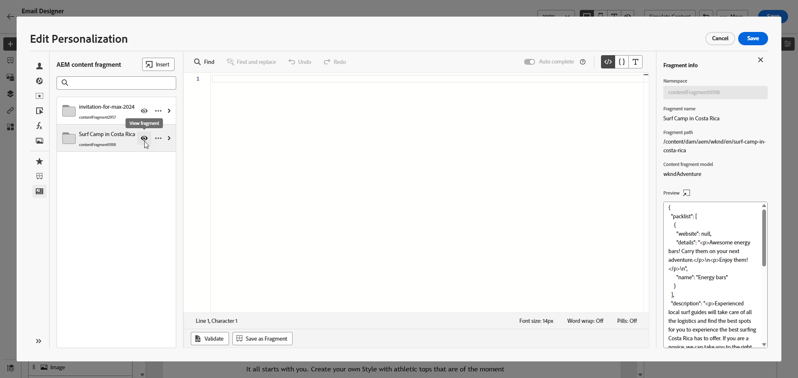

# 使用Adobe Experience Manager內容片段 {#aem-fragments}

>[!BEGINSHADEBOX]

Adobe Journey Optimizer工作流程中的現有&#x200B;**資產選擇器**&#x200B;和&#x200B;**內容片段選擇器**&#x200B;體驗正在由&#x200B;**內容顧問**&#x200B;取代。 內容警告器提供AI支援的統一介面，以便直接在AJO編寫工作流程中探索和選取Assets、內容片段和Dynamic Media。 在轉換期間，現有的整合功能可繼續運作。

>[!ENDSHADEBOX]

Adobe Experience Manager與Journey Optimizer之間的整合會遵循以下資料流程：

1. **[設定Dispatcher](https://experienceleague.adobe.com/zh-hant/docs/experience-manager-cloud-service/content/sites/administering/content-fragments/content-fragments-with-journey-optimizer#dispatcher-configuration){target="_blank"}**：若要讓Journey Optimizer能透過內容片段管理API存取Adobe Experience Manager內容片段，您必須先設定Dispatcher。 這是整合的必備條件。

1. **[建立和作者](https://experienceleague.adobe.com/zh-hant/docs/experience-manager-cloud-service/content/sites/administering/content-fragments/managing#creating-a-content-fragment)**：內容是在Adobe Experience Manager中建立並設定為內容片段。

1. **[標籤](https://experienceleague.adobe.com/zh-hant/docs/experience-manager-cloud-service/content/sites/administering/content-fragments/managing#manage-tags)**：內容片段必須使用Journey Optimizer特定標籤(`ajo-enabled:{OrgId}/{SandboxName}`)標籤。

1. **[發佈](https://experienceleague.adobe.com/zh-hant/docs/experience-manager-cloud-service/content/sites/administering/content-fragments/managing#publishing-and-previewing-a-fragment)**：內容片段已發佈至Adobe Experience Manager，可供Journey Optimizer使用。

1. **[存取](#aem-add)**： Journey Optimizer會即時從Adobe Experience Manager發佈執行個體擷取並顯示可用的內容片段。

1. **[整合](#aem-add)**：已選取內容片段並整合至行銷活動或歷程中。

在Adobe Experience Manager中發佈內容片段時，會傳送事件以更新Journey Optimizer端的內容。 如果更新成功，內容片段將在大約5分鐘內可用於單一歷程，以及用於批次使用案例的下一個處理批次。 在Journey Optimizer中提供更新後，最新發佈的內容就會用於所有適用的行銷活動和歷程。

>[!AVAILABILITY]
>
>對於醫療保健客戶，只有在授權Journey Optimizer Healthcare Shield和Adobe Experience Manager Extended Security for Healthcare附加方案時，才會啟用整合。

## 在Experience Manager中建立及指派標籤 {#create-tag}

>[!IMPORTANT]
>
>若要讓Journey Optimizer能夠透過內容片段管理API存取Adobe Experience Manager內容片段，您必須先[設定Dispatcher](https://experienceleague.adobe.com/zh-hant/docs/experience-manager-cloud-service/content/sites/administering/content-fragments/content-fragments-with-journey-optimizer#dispatcher-configuration){target="_blank"}。

Journey Optimizer只有在包含您&#x200B;**組織**&#x200B;和&#x200B;**沙箱**&#x200B;的標籤時，才會在「內容片段」選擇器中顯示「內容片段」。 此要求是刻意為之：會將不相關或未經核准的Experience Manager內容擋在Journey Optimizer之外。

使用您的Journey Optimizer組織ID和沙箱名稱來指派識別碼接在`ajo-enabled:{AJO-OrgId}/{AJO-SandboxName}`之後的標籤，以取代預留位置，例如`ajo-enabled:123A12A123A123A12A@AdobeOrg/prod`。

若要在Experience Manager中建立標籤：

1. 移至&#x200B;**工具** > **標籤**。

   

1. 建立巢狀標籤結構，讓完整標籤ID符合上述格式：

   1. 在根層級，建立名為`ajo-enabled`的資料夾。

   1. 在`ajo-enabled`底下，為您的組織識別碼建立標籤，例如`123A12A123A123A12A@AdobeOrg`。

   1. 在該組織標籤下，為您的沙箱建立標籤，例如，`prod`。

   合併的路徑會產生標籤ID，例如`ajo-enabled:123A12A123A123A12A@AdobeOrg/prod`。

1. 若要將其套用至內容片段，請在編輯器中開啟內容片段。

1. 在&#x200B;**屬性**&#x200B;中，新增您建立的標籤。

1. 儲存片段。

➡️ [在Adobe Experience Manager檔案中進一步瞭解標籤](https://experienceleague.adobe.com/zh-hant/docs/experience-manager-cloud-service/content/sites/administering/content-fragments/managing#manage-tags)

## 新增Experience Manager內容片段 {#aem-add}

建立並個人化AEM內容片段後，您現在可以將其匯入您的Journey Optimizer行銷活動或歷程。

1. 建立您的[行銷活動](../campaigns/create-campaign.md)或[歷程](../building-journeys/journey-gs.md)。

1. 若要存取您的AEM內容片段，請按一下任何文字欄位中的，或透過HTML內容元件開啟原始程式碼。

   

1. 從左窗格中的&#x200B;**[!UICONTROL AEM內容片段]**&#x200B;功能表，按一下&#x200B;**[!UICONTROL 開啟AEM內容警告器]**。

   

1. 瀏覽清單並選取&#x200B;**[!UICONTROL 內容片段]**，以匯入您的Journey Optimizer內容。

   >[!NOTE]
   >
   > 如果片段有一或多個&#x200B;**已發佈**&#x200B;個變數，則選擇器中會出現&#x200B;**[!UICONTROL 變數]**&#x200B;下拉式清單。 如果未選取任何&#x200B;**[!UICONTROL 變數]**，則會自動使用&#x200B;**主要**&#x200B;變數。 在[使用內容片段變數](#aem-variations)中瞭解更多。

1. 按一下「**[!UICONTROL 顯示篩選器]**」以微調您的內容片段清單。

   依預設，內容片段篩選器預設為僅顯示核准的內容。

   

1. 選取您的&#x200B;**[!UICONTROL 內容片段]**&#x200B;後，按一下&#x200B;**[!UICONTROL 選取]**&#x200B;以新增該片段。

   

1. 按一下&#x200B;**[!UICONTROL 檢視片段]**&#x200B;以顯示您的片段資訊。 請注意，開啟&#x200B;**[!UICONTROL 片段資訊]**&#x200B;功能表會將編輯器置於唯讀模式。

   從右側選單中選取「**[!UICONTROL 預覽]**」，在Adobe Experience Manager中檢視您的片段。

   

1. 按一下以存取片段的進階功能表：

   * **[!UICONTROL 交換片段]**
   * **[!UICONTROL 探索參考]**
   * 在AEM中&#x200B;**[!UICONTROL 開啟]**

   

1. 從您的&#x200B;**[!UICONTROL 片段]**&#x200B;中選擇所需的欄位以新增至您的內容。

   <!--
    Note that if you choose to copy the value, any future updates to the Content Fragment will not be reflected in your campaign or journey. However, using dynamic placeholders ensures real-time updates.
    
    -->

   

1. 若要呈現儲存在內容片段屬性中的影像URL （例如片段模型的路徑或URL欄位），請將其插入您的HTML中，並以``標籤和片段屬性作為來源，例如：

   ```html
   
   ```

   >[!NOTE]
   >
   >不支援來自Adobe Experience Manager的相對影像URL，請使用&#x200B;**絕對** URL。

1. 選取&#x200B;**Picks： Off**，以透過隱藏長屬性路徑來啟用Picks體驗以改善可讀性。

   

1. 若要在片段文字中使用在Adobe Experience Manager中編寫的&#x200B;**個人化預留位置**，請在Adobe Experience Manager的內容片段中定義如下： `{{name}}`。

   在Journey Optimizer中，這些代號為預留位置。 在&#x200B;**Pills**&#x200B;體驗開啟的情況下，它們會出現在右側邊欄的&#x200B;**[!UICONTROL AEM內容片段]**&#x200B;區段中，旁邊是片段欄位。

1. 若要啟用即時個人化，**[!UICONTROL 內容片段]**&#x200B;中使用的所有預留位置，必須由使用者明確宣告為片段協助程式標籤中的引數。 將這些預留位置對應至設定檔屬性、內容屬性、靜態字串或預先定義的變數，如下所示：

   1. **設定檔或內容屬性對應**：將預留位置指派給設定檔或內容屬性，例如name = profile.person.name.firstName。

   1. **靜態字串對應**：將固定字串值放在雙引號中，例如名稱= &quot;John&quot;，以指派固定字串值。

   1. **變數對應**：參照同一HTML中先前宣告的變數，例如name = &#39;variableName&#39;。
在此情況下，請確保在新增片段ID之前使用以下語法宣告&#x200B;**_variableName_**：

      ```html
       
      ```

   在以下範例中，**_month_**&#x200B;預留位置對應至片段中的&#x200B;**_profile.person.birthDate_**&#x200B;屬性。

   {zoomable="yes"}

1. 按一下&#x200B;**[!UICONTROL 「儲存」]**。 您現在可以測試並檢查您的訊息內容，如[本節](../content-management/preview.md)所詳述。

   請注意，您選取的內容片段在此訊息中會維持作用中。 當您在其他欄位或內容區塊中開啟Personalization編輯器時，您可以繼續使用&#x200B;**[!UICONTROL AEM內容片段]**&#x200B;區段的相同片段，並新增更多欄位，而不需要重新開啟&#x200B;**[!UICONTROL 開啟AEM內容警告器]**。

執行測試並驗證內容後，您可以[傳送行銷活動](../campaigns/review-activate-campaign.md)或[發佈您的歷程](../building-journeys/publish-journey.md)給您的對象。

Adobe Experience Manager可讓您識別使用內容片段的Journey Optimizer行銷活動或歷程。 進一步瞭解[Adobe Experience Manager檔案](https://experienceleague.adobe.com/zh-hant/docs/experience-manager-cloud-service/content/sites/administering/content-fragments/extension-content-fragment-ajo-external-references){target="_blank"}。

## 透過Experience Decisioning使用AEM內容片段 {#aem-decisioning}

>[!AVAILABILITY]
>
>此功能在具有Decisioning支援的輸出管道的「有限可用性」中可用。 如欲請求存取權，請和您的 Adobe 代表聯絡。

AEM內容片段也可在&#x200B;**體驗決策**&#x200B;中作為選件專案屬性使用。 透過將內容片段欄位對應到決定專案屬性，您可以使用Journey Optimizer決定模型、公式和排名條件來最佳化為每個設定檔提供哪些片段。

### 先決條件和護欄

* 內容片段必須先在Adobe Experience Manager中使用`ajo-enabled:{OrgId}/{SandboxName}`標籤進行標籤，才會在決策選擇器中顯示。 [瞭解如何建立和指派標籤](#create-tag)
* 只有&#x200B;**已發佈**&#x200B;狀態的內容片段才可使用。
* 您最多可以新增&#x200B;**5個**&#x200B;個AEM內容片段至單一決定專案。

### 在Decisioning中利用AEM內容片段

建立及發佈AEM內容片段後，您需要：

1. 在決策專案的屬性中選取決策專案，將其連結至決策專案。
1. 在決定政策中善用它，將適當的內容呈現給適當的客戶。

➡️ [將AEM內容片段繫結至決定專案](../experience-decisioning/items.md#aem-fragments)

➡️ [在決定原則中利用AEM內容片段](../experience-decisioning/fragments-decision-policies.md#aem-fragments-decisioning)

## 使用內容片段變數 {#aem-variations}

在Adobe Experience Manager中，每個內容片段都由下列專案組成：

* **主要**：片段的核心內容永遠存在、無法刪除，且是所有變數的基礎。
* **變數**：作者為特定管道或情境建立的一或多個&#x200B;**主要**&#x200B;排列。 片段中的變數不是以個別資產形式存在，而且可以與&#x200B;**主要**&#x200B;進行比較和同步。

變數使用案例的範例：

* 推播通知的短版復本，以及電子郵件的較新版本。
* 區域色調調整，而不建立單獨的片段。
* 通道特定訊息（例如網頁與行動裝置的比較）。

➡️ [在Adobe Experience Manager檔案中進一步瞭解](https://experienceleague.adobe.com/zh-hant/docs/experience-manager-65/content/assets/content-fragments/content-fragments-variations)

Journey Optimizer可讓您選擇在插入片段時使用的變數，如此一來，在Adobe Experience Manager中，不同的促銷活動或歷程可依賴相同來源內容的不同轉譯，而不會復製片段。

若要選取變數，請執行下列步驟：

1. 開啟[行銷活動](../campaigns/create-campaign.md)或[歷程](../building-journeys/journey-gs.md)。

1. 在任何文字欄位中按一下，或從HTML內容元件開啟HTML來源。

1. 從&#x200B;**[!UICONTROL AEM內容片段]**，按一下&#x200B;**[!UICONTROL 開啟AEM內容警告器]**。

   

1. 若要在表格檢視中選取地區設定特定的Adobe Experience Manager內容片段，請使用&#x200B;**[!UICONTROL 自訂表格]**&#x200B;新增&#x200B;**[!UICONTROL 語言]**&#x200B;欄。 地區設定值會顯示在表格中，讓您識別和選取適當的片段。

   

1. 選取您的&#x200B;**[!UICONTROL 內容片段]**。

1. 按一下以開啟&#x200B;**[!UICONTROL 詳細資料]**&#x200B;功能表。 如果片段有一或多個已發佈的變數，則片段詳細資料旁會出現&#x200B;**[!UICONTROL 變數]**&#x200B;下拉式清單。

   

1. 從&#x200B;**[!UICONTROL 快速詳細資訊]**&#x200B;功能表，按一下&#x200B;**[!UICONTROL 瀏覽參考]**&#x200B;以在Adobe Experience Manager中開啟相關選項，以取得變化詳細資訊、預覽和校訂（可用時）。

1. 選擇您的變數，然後按一下&#x200B;**[!UICONTROL 選取]**。

   >[!NOTE]
   >
   > 如果您未選取變數，或是在變數支援可用之前新增片段，Journey Optimizer會在傳送時自動使用&#x200B;**主要**&#x200B;變數。

插入含有變數的片段後，在Adobe Experience Manager中重新發佈該片段，並自動在作用中行銷活動或歷程中每&#x200B;**個引用的變數**&#x200B;更新一次。 預覽和校訂仍使用您選擇的變數，以及該變數的最新發佈內容。
