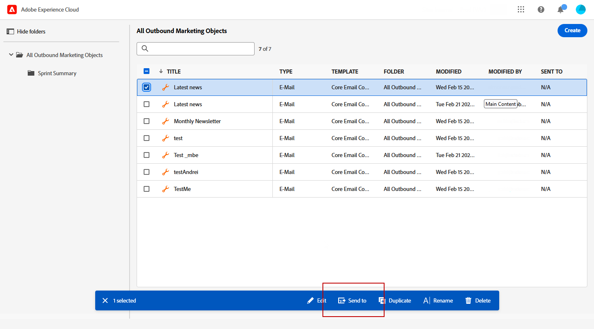
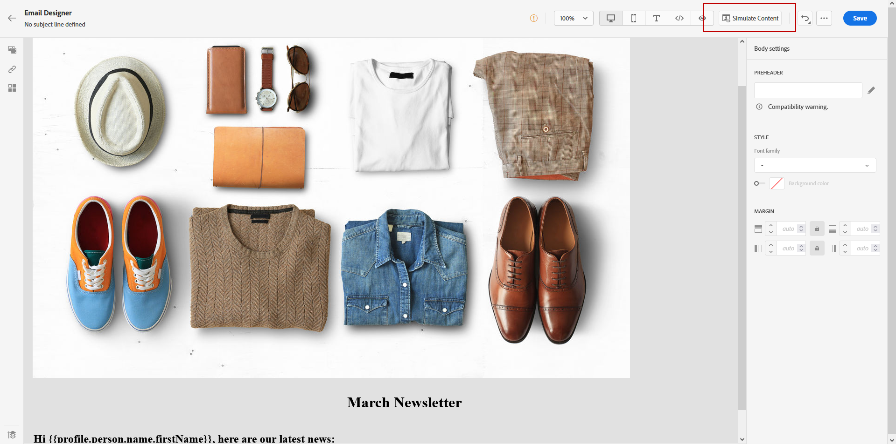

# 使用Adobe Experience Manager範本 {#aem-templates}

## 開始使用Adobe Experience Manager範本 {#gs-aem-templates}

透過Adobe Journey Optimizer，您可以透過Adobe Experience Manager網站建立自訂訊息。 首先，使用Adobe Experience Manager的內容來源設計範本，然後傳送至Adobe Journey Optimizer。 共用後，您可在Adobe Journey Optimizer的電子郵件Designer中存取這些範本，以簡化製作及傳送訊息給所需對象的程式。

>[!AVAILABILITY]
>
>與Adobe Experience Manager的整合目前僅對特定使用者開放Beta版。
>>以測試版使用者身分，使用[此表單](https://forms.office.com/pages/responsepage.aspx?id=Wht7-jR7h0OUrtLBeN7O4Wf0cbVTQ3tCpW_unE-w8-JUN1FaNlAzNkhPSUdaSkJXVFRCNTRJNVRFSy4u){target="_blank"}分享意見。

### 先決條件 {#prerequisites}

開始使用此功能之前，請確定您已符合下列需求：

* **Experience Manager設定**

  此功能適用於[Adobe Experience Manager as a Cloud Service](https://experienceleague.adobe.com/docs/experience-manager-cloud-service/content/overview/introduction.html?lang=zh-Hant){target="_blank"}。

  在Beta版計畫中，Cloud Service設定是由Adobe在Adobe Experience Manager中執行，以連線至Adobe Journey Optimizer。

* **權限**

  若要在Adobe Journey Optimizer中建立、編輯和刪除內容範本，您必須在&#x200B;**[!DNL Manage Library Items]**&#x200B;產品設定檔中包含&#x200B;**[!DNL Content Library Manager]**&#x200B;許可權。 [了解更多](../administration/ootb-product-profiles.md#content-library-manager)

### 護欄與限制{#aem-templates-limitations}

若要進一步最佳化Adobe Experience Manager與Adobe Journey Optimizer搭配的使用，請務必注意下列其他護欄和限制：

* Experience Manager範本中的個人化需有適當的Journey Optimizer語法才能生效。 [了解更多](../personalization/personalization-syntax.md)

* 目前不支援大量範本匯出，範本必須個別匯出。

* 目前無法在Experience Manager和Journey Optimizer之間同步。 如果在將Experience Manager範本傳送至Journey Optimizer後變更了該範本，則使用者需要重新匯出該範本，並將其重新傳送至Journey Optimizer。

## 傳送範本至Journey Optimizer{#aem-templates-send}

若要將Adobe Experience Manager範本匯出至Adobe Journey Optimizer，請遵循下列步驟：

1. 從您的Adobe Experience Manager首頁，選取&#x200B;**[!UICONTROL 對外行銷]**。

   

1. 您可以從內容資料庫使用先前設定的範本或從頭開始建立範本。 [了解更多](https://experienceleague.adobe.com/docs/experience-manager-65/authoring/authoring/managing-pages.html#creating-a-new-page)

1. 將Journey Optimizer個人化語法合併至範本中，即可增強其自訂功能。 [了解更多](../personalization/personalization-syntax.md)

   

1. 選取您要匯出至Journey Optimizer的範本，然後在進階功能表中按一下&#x200B;**[!UICONTROL 傳送至]**。

   

1. 輸入內容範本的&#x200B;**[!UICONTROL Name]**，並選取目標&#x200B;**[!UICONTROL 沙箱]**。

   

1. 在您按一下&#x200B;**[!UICONTROL 傳送]**&#x200B;按鈕後，匯出程式就會開始。 匯出完成後，您會在使用者介面中看到下列訊息：「範本「XX」已成功傳送至AJO」。

範本會新增至所選沙箱的Adobe Journey Optimizer內容範本。

## 使用及個人化Adobe Experience Manager範本{#aem-templates-perso}

在Journey Optimizer中提供Experience Manager範本作為內容範本後，您就可以識別並整合電子郵件的必要內容，包括個人化。

1. 在Journey Optimizer中，從&#x200B;**[!UICONTROL 內容範本]**&#x200B;功能表，存取您匯入的範本。

   

1. 按一下&#x200B;**[!UICONTROL 警示]**&#x200B;按鈕，即可快速檢查是否有任何重要設定遺失。 這可協助確保您的訊息已正確設定，並防止任何潛在錯誤或問題。

   

1. 在&#x200B;**[!UICONTROL 範本屬性]**&#x200B;視窗中，按一下&#x200B;**[!UICONTROL 管理存取權]**&#x200B;按鈕，將自訂或核心資料使用標籤指派給範本。 [進一步瞭解物件層級存取控制(OLAC)](../administration/object-based-access.md)

1. 若要進一步個人化您的Experience Manager範本，並將自訂個人化新增至您的內容，請按一下[編輯內容]。**** 這可讓您輕鬆進行變更，並根據您的特定需求量身打造範本。 [了解更多](../email/get-started-email-design.md)

   >[!WARNING]
   >
   > 如果您想要編輯並個人化範本，則只能使用相容性模式。

1. 當您的內容範本準備就緒時，[測試並驗證它](../content-management/content-templates.md#test-template)。

1. 定義內容後，您可以瀏覽&#x200B;**[!UICONTROL 已儲存的範本]**&#x200B;集合，在建立新電子郵件時使用該內容。 然後，選取&#x200B;**[!UICONTROL 使用此範本]**。

   

1. 您現在可以編輯並個人化您的內容。 如需如何建置電子郵件內容的詳細資訊，請參閱此[頁面](../email/content-from-scratch.md)。

   

1. 如果您已將個人化內容新增至Experience Manager範本，請按一下&#x200B;**[!UICONTROL 模擬內容]**&#x200B;以使用測試設定檔預覽其顯示在訊息中的方式。

[進一步瞭解預覽和測試設定檔](../content-management/preview-test.md)

   

1. 檢視訊息預覽時，任何個人化元素都會自動取代為所選測試設定檔中的對應資料。

   如有需要，可以透過&#x200B;**[!UICONTROL 管理測試設定檔]**&#x200B;按鈕新增其他測試設定檔。

   

當您的電子郵件準備就緒時，請完成您的[歷程](../building-journeys/journey-gs.md)或[行銷活動](../campaigns/create-campaign.md)的設定，並啟動它以傳送訊息。
