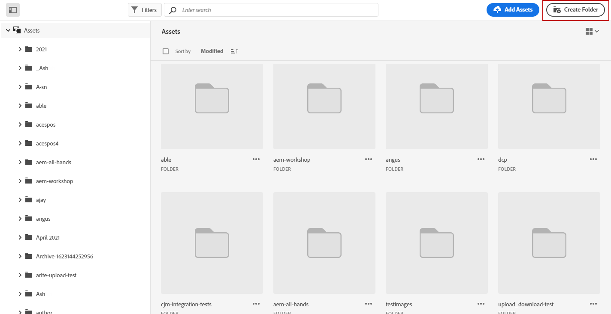

# 使用[!DNL Experience Manager Assets]建立及管理資產{#experience-manager-assets}

## 開始使用 [!DNL Experience Manager Assets] {#get-started-assets}

利用 **[!DNL Adobe Experience Manager Assets]** 將行銷與創意內容工作流程結合在一起。與&#x200B;**[!DNL Adobe Journey Optimizer]**&#x200B;原生整合，存取&#x200B;**[!DNL Assets Essentials]**&#x200B;或&#x200B;**[!DNL Assets as a Cloud Service]**&#x200B;以儲存、管理、探索及散發數位資產。 提供了可用於填入訊息的單一、集中式資產存放庫。

**[!DNL Adobe Experience Manager Assets]**&#x200B;提供兩個合作和集中式資產工作區，可擴充您的創意系統並統一數位資產以進行體驗傳送：

* **[!DNL Assets as a Cloud Service]**： Adobe Experience Manager Assets as a Cloud Service提供簡單易用的雲端解決方案，有助於有效率的數位資產管理和Dynamic Media作業。 它緊密整合了進階功能，包括人工智慧和機器學習。

  進一步瞭解[Adobe Experience Manager as a Cloud Service檔案](https://experienceleague.adobe.com/docs/experience-manager-cloud-service/content/assets/overview.html){target="_blank"}。

* **[!DNL Assets Essentials]**： Experience Manager Assets Essentials是Assets as a Cloud Service輕量型解決方案，適用於統一的資產管理和共同作業。 透過現代化、簡化的介面，其可讓創意和行銷團隊輕鬆儲存、探索和分發數位資產。

  深入瞭解[Adobe Experience Manager Assets Essentials檔案](https://experienceleague.adobe.com/docs/experience-manager-assets-essentials/help/introduction.html){target="_blank"}。

視您的合約而定，可以直接透過左側功能表&#x200B;**[!DNL Adobe Experience Manager Assets Essentials]** Assets **[!DNL Adobe Experience Manager Assets as a Cloud Service]**&#x200B;區段從&#x200B;**[!DNL Adobe Journey Optimizer]**&#x200B;存取&#x200B;**[!UICONTROL 或]**。 您也可以在[設計電子郵件內容](../email/get-started-email-design.md)時存取資產和資料夾。

## 先決條件{#assets-prerequisites}

>[!BEGINTABS]

>[!TAB Adobe Experience Manager Assets Essentials]

在使用[!DNL Adobe Experience Manager Assets Essentials]之前，您必須將使用者新增到&#x200B;**Assets Essentials消費者使用者**&#x200B;或/和&#x200B;**Assets Essentials使用者**&#x200B;產品設定檔。 請參閱[Assets Essentials檔案](https://experienceleague.adobe.com/docs/experience-manager-assets-essentials/help/get-started-admins/deploy-administer.html#add-user-groups){target="_blank"}以深入瞭解。

>[!NOTE]
>針對 2022 年 1 月 6 日之前取得的 Journey Optimizer 產品，您必須為貴組織部署 **[!DNL Adobe Experience Manager Assets Essentials]** 。 在[部署Assets Essentials](https://experienceleague.adobe.com/docs/experience-manager-assets-essentials/help/deploy-administer.html?lang=zh-Hant){target="_blank"}一節中瞭解更多。

>[!TAB Adobe Experience Manager Assets 雲端服務]

在使用&#x200B;**[!DNL Adobe Experience Manager Assets as a Cloud Service]**&#x200B;之前，您必須將使用者新增到Assets雲端服務。 閱讀[Adobe Experience Manager Assets as a Cloud Service](https://experienceleague.adobe.com/docs/experience-manager-cloud-service/content/security/ims-support.html)中的詳細資訊。

>[!ENDTABS]

## 上傳和插入資產{#add-asset}

若要將檔案匯入至&#x200B;**[!DNL Assets Essentials]**&#x200B;或&#x200B;**[!DNL Assets as a Cloud Service]**，您必須先瀏覽或建立要儲存檔案的資料夾。 然後，您就可以將它們插入您的電子郵件內容。

1. 從[!DNL Adobe Journey Optimizer]首頁，選取&#x200B;**[!UICONTROL 內容管理]**&#x200B;功能表下的&#x200B;**[!UICONTROL Assets]**&#x200B;索引標籤以存取&#x200B;**[!DNL Assets Essentials]**&#x200B;或&#x200B;**[!DNL Assets as a Cloud Service]**。

   

1. 選擇Journey Optimizer中Assets的存放庫。 如果您擁有此解決方案，則可以選擇使用&#x200B;**[!DNL Assets Essentials]**&#x200B;或&#x200B;**[!DNL Assets as a Cloud Service]**&#x200B;存放庫。

   

   +++ 瞭解如何切換Assets存放庫。

   若要變更您的Assets存放庫，請選取右上角的「帳戶」圖示，然後按一下&#x200B;**[!UICONTROL 選取存放庫]**。

   

   +++

1. 在中央區段或樹狀檢視中連按兩下資料夾以開啟它。

   您也可以按一下&#x200B;**[!UICONTROL 建立資料夾]**&#x200B;以建立新資料夾。

   

1. 一旦進入選取或建立的資料夾，請按一下&#x200B;**[!UICONTROL 新增Assets]**，將新資產上傳至您的資料夾。

   

1. 從&#x200B;**[!UICONTROL 上傳檔案]**，按一下&#x200B;**[!UICONTROL 瀏覽]**，並選擇要&#x200B;**[!UICONTROL 瀏覽檔案]**&#x200B;或&#x200B;**[!UICONTROL 瀏覽資料夾]**。

1. 選取您要上傳的檔案。 完成時，按一下&#x200B;**[!UICONTROL 上傳]**。 若要進一步瞭解如何管理您的資產，請參閱此[頁面](https://experienceleague.adobe.com/docs/experience-manager-assets-essentials/help/manage-organize.html)。

1. 若要使用Adobe Photoshop Express進一步編輯您的資產，請連按兩下資產。 然後，從右側功能表選取&#x200B;**[!UICONTROL 編輯模式]**&#x200B;圖示。 [了解更多](https://experienceleague.adobe.com/docs/experience-manager-assets-essentials/help/edit-images.html){target="_blank"}。

   

1. 從[!DNL Adobe Journey Optimizer]，從電子郵件Designer的左窗格中選取&#x200B;**[!UICONTROL 資產選擇器]**&#x200B;功能表。

   

1. 選取您先前建立的&#x200B;**[!UICONTROL Assets]**&#x200B;資料夾。 您也可以在搜尋列中搜尋資產或資料夾。

1. 將您的資產拖放到電子郵件內容中。

   

1. 您可以進一步自訂您的資產，例如使用&#x200B;**[!UICONTROL 設定]**&#x200B;和&#x200B;**[!UICONTROL 樣式]**&#x200B;索引標籤新增外部連結或文字。 [進一步瞭解元件設定](../email/content-components.md)

   

   <!--
    After adding your asset to your email, use the **[!UICONTROL Find similar Stock photos]** option to locate Stock photos that match the content, color, and composition of your image. [Learn more about Adobe Stock](stock.md).

    Note that this option is available for licensed/unlicensed Stock images and images from your Assets folder. 

    
    -->

## [!DNL Adobe Experience Manager Assets]常見問題集 {#faq-assets}

+++ 我可以繼續使用Journey Optimizer中的Assets Essentials隨附存放庫嗎？

如果您已在&#x200B;**[!DNL Adobe Experience Manager Assets as a Cloud Service]**&#x200B;上布建，且使用者擁有正確的許可權，則您可同時存取&#x200B;**[!DNL Adobe Experience Manager Assets Essentials]**&#x200B;和&#x200B;**[!DNL Adobe Experience Manager Assets as a Cloud Service]**&#x200B;存放庫。 這些存放庫是分開且不同步。 Journey Optimizer中的使用者將能夠檢視這兩個存放庫，包括他們有權存取的其他環境，例如Stage、Dev等，並且應該能夠使用存放庫選擇器順暢地在它們之間切換。

+++

+++ 如何管理資產？ Assets as a Cloud Service中的變更會反映在Journey Optimizer中嗎？

**[!DNL Adobe Experience Manager Assets as a Cloud Service]**&#x200B;與Journey Optimizer的整合方式與&#x200B;**[!DNL Adobe Experience Manager Assets Essentials]**&#x200B;類似。 對資產進行修改時，會產生二進位副本。 請注意，**[!DNL Assets as a Cloud Service]**&#x200B;中的更新不會自動傳播至即時電子郵件行銷活動。 您必須在電子郵件Designer中手動重新選取任何變更，以確保資產與進行中的電子郵件行銷活動之間的同步。

+++

+++ 在Journey Optimizer中製作電子郵件時，我可以使用Dynamic Media URL嗎？

是，您可以在Journey Optimizer電子郵件製作中使用Dynamic Media URL。 只要貼上URL即可，無需從資產選擇器中選取。

+++

+++ Journey Optimizer使用者可以從Journey Optimizer介面變更Adobe Experience Manager Assets as a Cloud Service存放庫嗎？

只要Journey Optimizer使用者是有許可權的&#x200B;**[!DNL Adobe Experience Manager Assets as a Cloud Service]**&#x200B;標準使用者，並且擁有存放庫的編輯許可權，該使用者就可以編輯&#x200B;**[!DNL Adobe Experience Manager Assets as a Cloud Service]**&#x200B;存放庫。

+++
