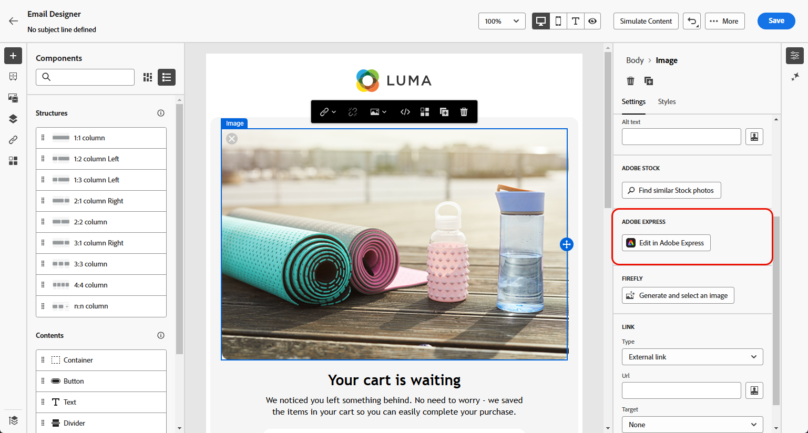
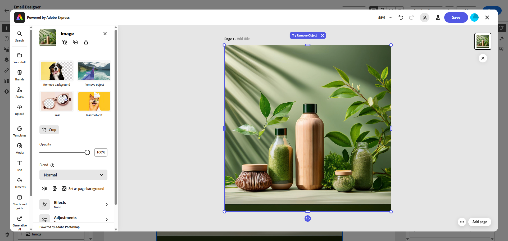
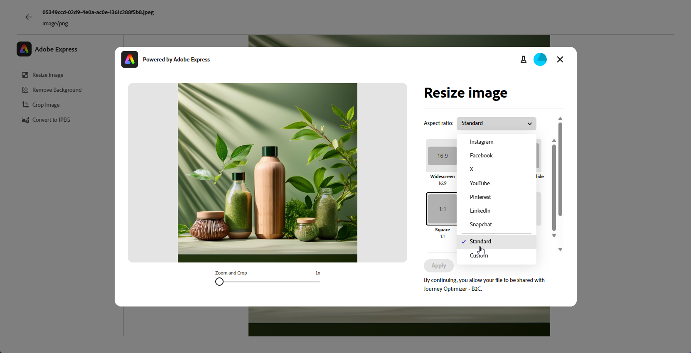
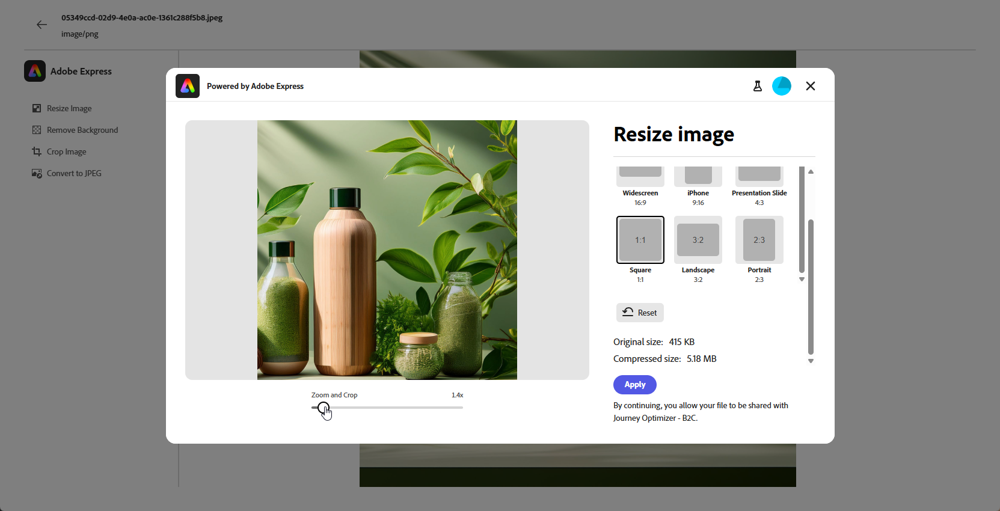
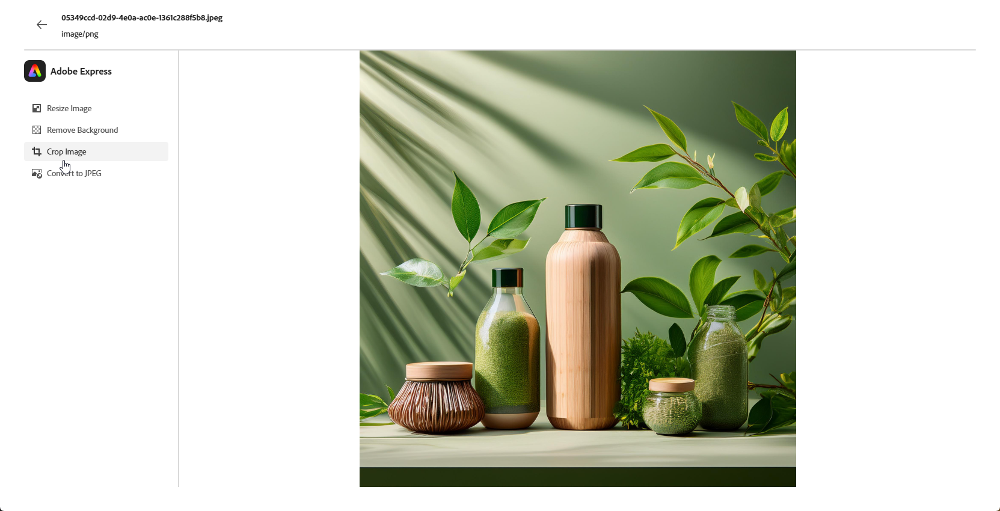
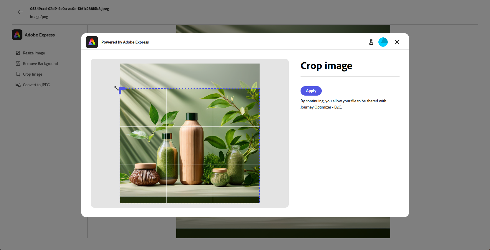
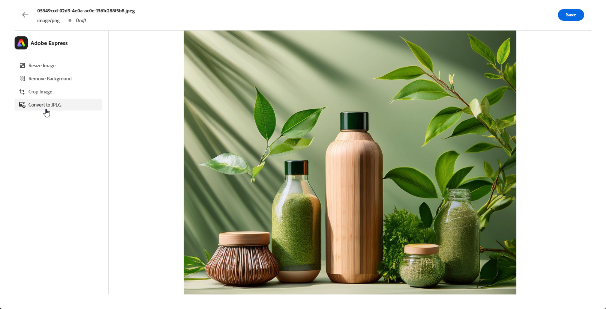
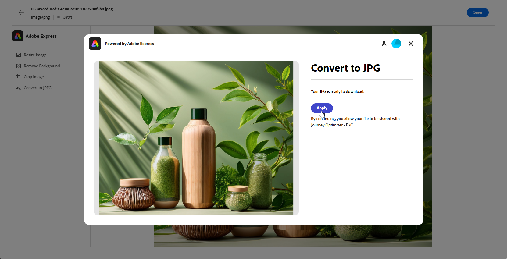
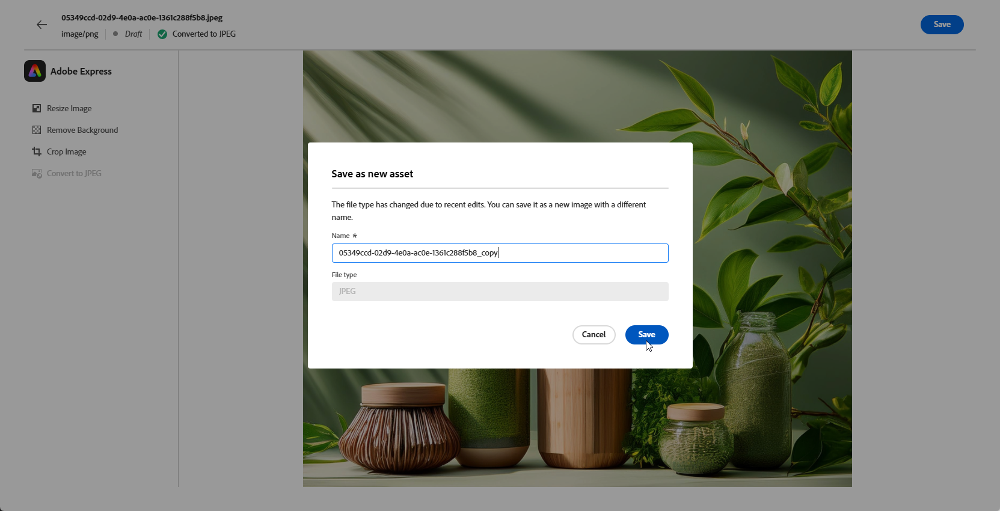

# 使用 [!DNL Adobe Express] 編輯資產{#express}

>[!CONTEXTUALHELP]
>id="ajo_express_menu"
>title="Adobe Express 整合"
>abstract="透過 Adobe Express 整合開始將您的資產個人化。此功能讓您可以調整影像大小、移除背景、裁切視覺效果，以及將資產轉換為 JPEG 或 PNG。"

Adobe Journey Optimizer 中的 Adobe Express 整合讓您可以在建立內容時，輕鬆存取 Adobe Express 強大的編輯工具。 此整合功能讓您可以調整影像大小、移除背景、裁切視覺效果，並將資產轉換成 JPEG 或 PNG 格式，就不必在不同解決方案之間切換。

>[!AVAILABILITY]
>
>Adobe Journey Optimizer中的Adobe Express整合目前不適用於Healthcare Shield或Privacy and Security Shield。

若要進一步瞭解Adobe Express，請參閱[本檔案](https://helpx.adobe.com/tw/express/user-guide.html)。

若要存取&#x200B;**[!DNL Adobe Express]**&#x200B;功能表，請從[電子郵件Designer]存取您的&#x200B;**影像設定**，然後按一下[在Adobe Express中編輯]****。

➡️ [在影片中探索此功能](#video)

## 搭配使用Adobe Express與企業授權 {#licence}

沒有Adobe Express Enterprise授權的使用者可存取以下各節中詳述的功能。

透過企業授權，使用者擁有Adobe Express網頁編輯器的完整存取權，可調整資產設定、使用Firefly產生內容、新增文字及套用其他自訂。

有關擁有Adobe Express企業授權的使用者可用使用案例的詳細資訊，請參閱[Adobe Express網頁檔案](https://helpx.adobe.com/express/web.html)。

## 在沒有企業授權的情況下使用Adobe Express  {#edit}

在沒有Enterprise授權的情況下，使用者可以存取Adobe Express提供的下列使用案例：

* [調整影像大小](#resize)
* [移除背景](#background)
* [裁切影像](#crop-image)
* [轉換為JPEG或PNG](#convert)

### 調整影像大小 {#resize}

1. 在Adobe Express功能表中，選取&#x200B;**[!UICONTROL 調整影像大小]**。

   

1. 選取最符合資產比例的&#x200B;**[!UICONTROL 外觀比例]**。

   

1. 使用滑桿來縮放和裁切您的資產，並拖曳以平移和調整可見區域。

   

1. 按一下&#x200B;**[!UICONTROL 重設]**，將您的資產還原成原始狀態。

1. 當影像大小調整符合您的需求時，請按一下&#x200B;**[!UICONTROL 套用]**。 然後，**[!UICONTROL 儲存]**&#x200B;您修改的資產。

1. 在&#x200B;**[!UICONTROL 上傳影像]**&#x200B;視窗中，按一下&#x200B;**[!UICONTROL 下一步]**，然後選取資料夾以儲存您修改的資產。

   然後，按一下&#x200B;**[!UICONTROL 匯入]**。

您的影像現在已準備好用於內容中。

### 移除背景 {#background}

1. 在Adobe Express功能表中，選取&#x200B;**[!UICONTROL 移除背景]**。

   

1. 系統會自動顯示您的資產，而不會顯示其背景。

   按一下[套用&#x200B;****]以將此用於您的內容。

   

1. 按一下&#x200B;**[!UICONTROL 儲存]**。

1. 在&#x200B;**[!UICONTROL 上傳影像]**&#x200B;視窗中，按一下&#x200B;**[!UICONTROL 下一步]**，然後選取資料夾以儲存您修改的資產。

   然後，按一下&#x200B;**[!UICONTROL 匯入]**。

您的影像現在已準備好用於內容中。

### 裁切影像 {#crop-image}

1. 從Adobe Express功能表選取&#x200B;**[!UICONTROL 裁切影像]**。

   

1. 拖曳角落控點以視需要調整及裁切影像。

   

1. 按一下[套用&#x200B;****]以將此用於您的內容。 然後，**[!UICONTROL 儲存]**&#x200B;您修改的資產。

1. 在&#x200B;**[!UICONTROL 上傳影像]**&#x200B;視窗中，按一下&#x200B;**[!UICONTROL 下一步]**，然後選取資料夾以儲存您修改的資產。

   然後，按一下&#x200B;**[!UICONTROL 匯入]**。

您的影像現在已準備好用於內容中。

### 轉換為JPEG或PNG {#convert}

1. 在Adobe Express功能表中，依影像原始格式選取&#x200B;**[!UICONTROL 轉換成JPEG]**&#x200B;或&#x200B;**[!UICONTROL 轉換成PNG]**。

   

1. 按一下&#x200B;**[!UICONTROL 套用]**&#x200B;開始轉換。

   

1. 按一下&#x200B;**[!UICONTROL 儲存]**。

1. 隨著格式變更，您可以將其儲存為具有不同名稱的新影像。 更新&#x200B;**[!UICONTROL 名稱]**&#x200B;並按一下&#x200B;**[!UICONTROL 儲存]**。

   

1. 在&#x200B;**[!UICONTROL 上傳影像]**&#x200B;視窗中，按一下&#x200B;**[!UICONTROL 下一步]**，然後選取資料夾以儲存您修改的資產。

   然後，按一下&#x200B;**[!UICONTROL 匯入]**。

您的影像現在已準備好用於內容中。

## 作法影片 {#video}

了解如何使用 Adobe Express 工具在 Adobe Journey Optimizer 編輯您的資產。

>[!VIDEO](https://video.tv.adobe.com/v/3455523/?quality=12)

