# 使用整合 {#external-sources}

## 概觀

**整合**&#x200B;功能可將協力廠商資料來源緊密整合至Adobe Journey Optimizer。 此功能可簡化將外部資料和內容來源整合至行銷活動的流程，讓您能夠跨多個管道提供高度個人化的動態訊息。

您可以使用此功能來存取外部資料，以及從第三方工具提取內容，例如：

* **獎勵積分**&#x200B;來自忠誠度系統。
* 產品的&#x200B;**價格資訊**。
* 來自建議引擎的&#x200B;**產品建議**。
* **物流更新**&#x200B;為傳遞狀態。

## 設定您的整合 {#configure}

身為管理員，您可以依照下列步驟設定外部整合：

1. 導覽至左側功能表中的&#x200B;**[!UICONTROL 組態]**&#x200B;區段，然後從&#x200B;**[!UICONTROL 整合]**&#x200B;卡片按一下&#x200B;**[!UICONTROL 管理]**。

   然後，按一下[建立整合] ****&#x200B;以開始新的組態。

   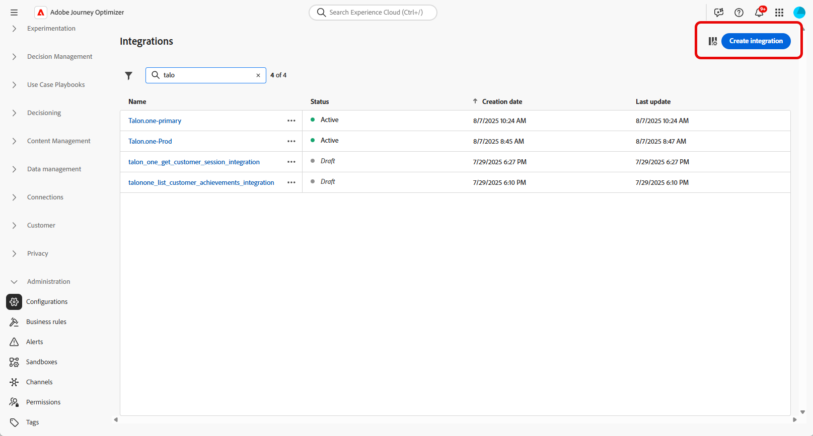

1. 提供整合的&#x200B;**[!UICONTROL 名稱]**&#x200B;和&#x200B;**[!UICONTROL 描述]**。

   >[!NOTE]
   >
   >這些欄位不可包含空格。

1. 輸入API端點&#x200B;**[!UICONTROL URL]**，其中可能包含路徑引數，以及可使用標籤和預設值定義的變數。

1. 使用&#x200B;**[!UICONTROL 名稱]**&#x200B;和&#x200B;**[!UICONTROL 預設值]**&#x200B;設定&#x200B;**[!UICONTROL 路徑範本]**。

   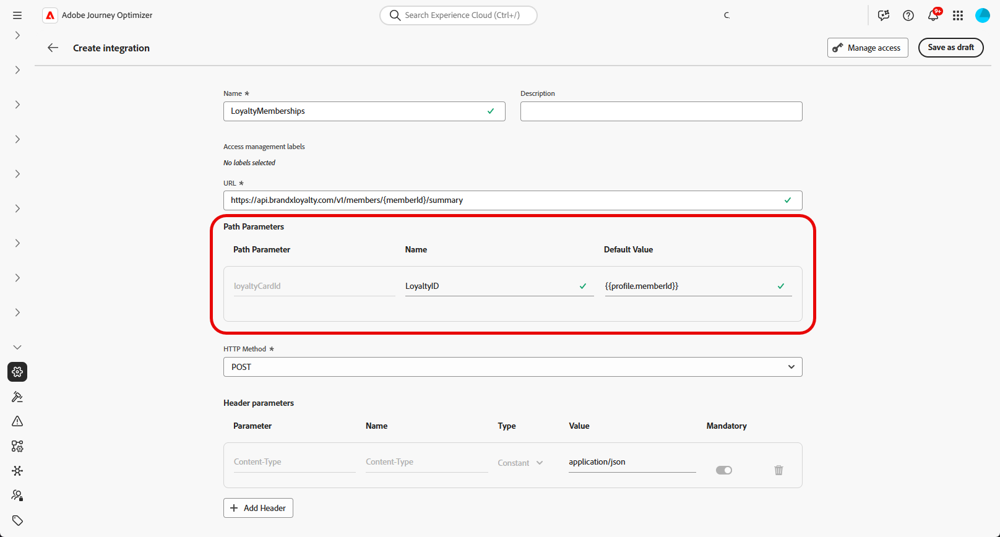

1. 選取GET與POST之間的&#x200B;**[!UICONTROL HTTP方法]**。

1. 視整合需要，按一下&#x200B;**[!UICONTROL 新增標題]**&#x200B;和/或&#x200B;**[!UICONTROL 新增查詢引數]**。 針對每個引數，提供下列詳細資訊：

   * **[!UICONTROL 引數]**：：內部用來參考引數的唯一識別碼。

   * **[!UICONTROL 名稱]**： API預期的引數實際名稱。

   * **[!UICONTROL 型別]**：選擇固定值的&#x200B;**常數**&#x200B;或動態輸入的&#x200B;**變數**。

   * **[!UICONTROL 值]**：直接輸入常數值，或選取變數對應。

   * **[!UICONTROL 必要]**：指定是否需要此引數。

   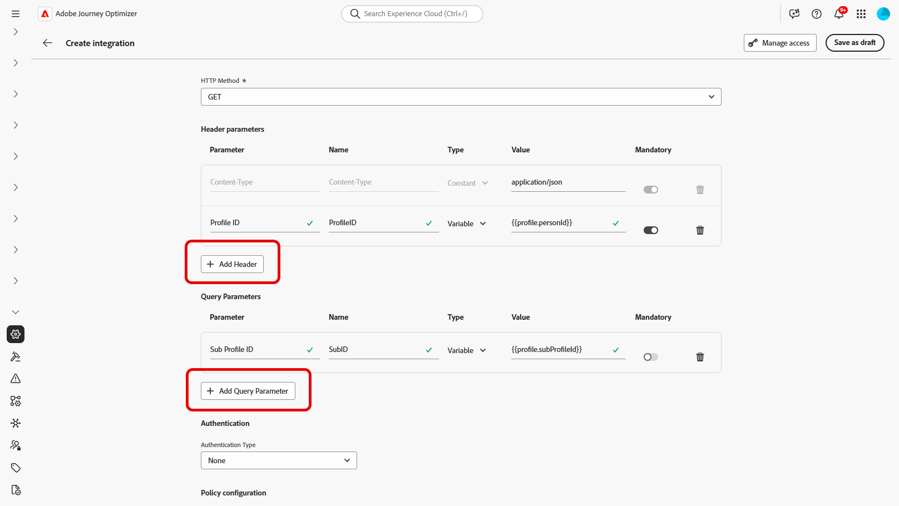

1. 選擇&#x200B;**[!UICONTROL 驗證型別]**：

   * **[!UICONTROL 無驗證]**：適用於不需要任何認證的開放API。

   * **[!UICONTROL API金鑰]**：使用靜態API金鑰驗證請求。 輸入您的&#x200B;**[!UICONTROL API金鑰名稱{1&#x200B;}、]** API金鑰值{3&#x200B;}並指定您的&#x200B;**[!UICONTROL 位置]**。****

   * **[!UICONTROL 基本驗證]**：使用標準HTTP基本驗證。 輸入&#x200B;**[!UICONTROL 使用者名稱]**&#x200B;和&#x200B;**[!UICONTROL 密碼]**。

   * **[!UICONTROL OAuth 2.0]**：使用OAuth 2.0通訊協定進行驗證。 按一下圖示以設定或更新&#x200B;**[!UICONTROL 裝載]**。

   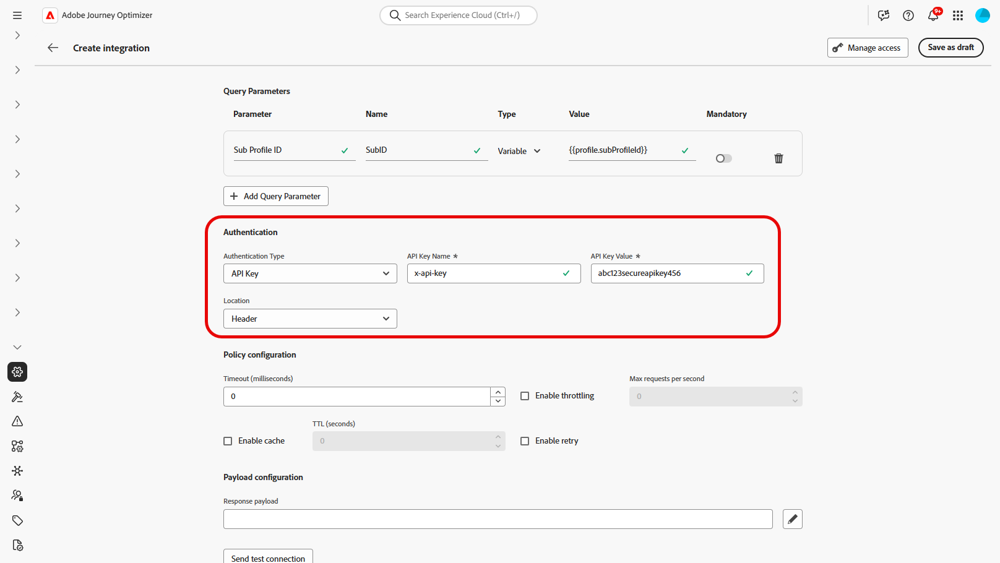

1. 為API要求設定&#x200B;**[!UICONTROL 原則組態]** （例如&#x200B;**[!UICONTROL 逾時]**&#x200B;期間），並選擇啟用節流、快取和/或重試。

1. 透過&#x200B;**[!UICONTROL 回應承載]**&#x200B;欄位，您可以決定樣例輸出的哪些欄位需要用於訊息個人化。

   按一下圖示並貼上範例JSON回應裝載以自動偵測資料型別。

1. 選擇要公開以進行個人化的欄位，並指定其對應的資料型別。

   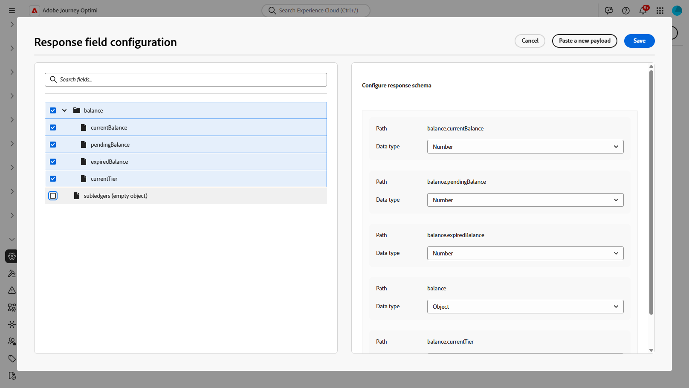

1. 使用&#x200B;**[!UICONTROL 傳送測試連線]**&#x200B;來驗證整合。

   驗證後，按一下&#x200B;**[!UICONTROL 啟動]**。

## 使用外部整合進行個人化 {#personalization}

身為行銷人員，您可以使用已設定的整合來個人化您的內容。 請依照下列步驟操作：

1. 存取您的行銷活動內容，然後按一下[文字]或[HTML **[!UICONTROL 元件]**]中的[新增個人化&#x200B;**。]**

[進一步瞭解元件](../email/content-components.md)

   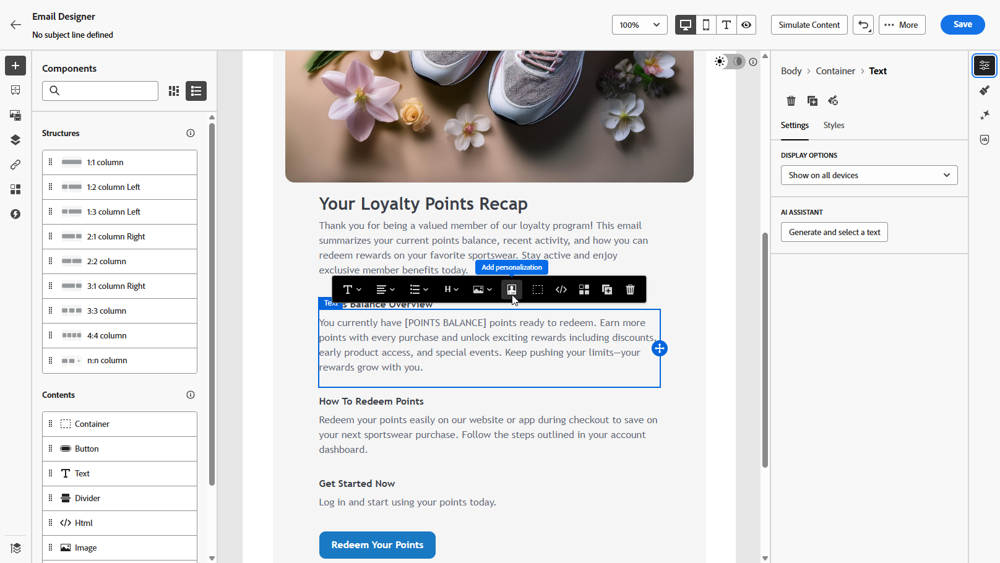

1. 瀏覽至&#x200B;**[!UICONTROL 整合]**&#x200B;區段，然後按一下&#x200B;**[!UICONTROL 開啟整合]**&#x200B;以檢視所有使用中的整合。

   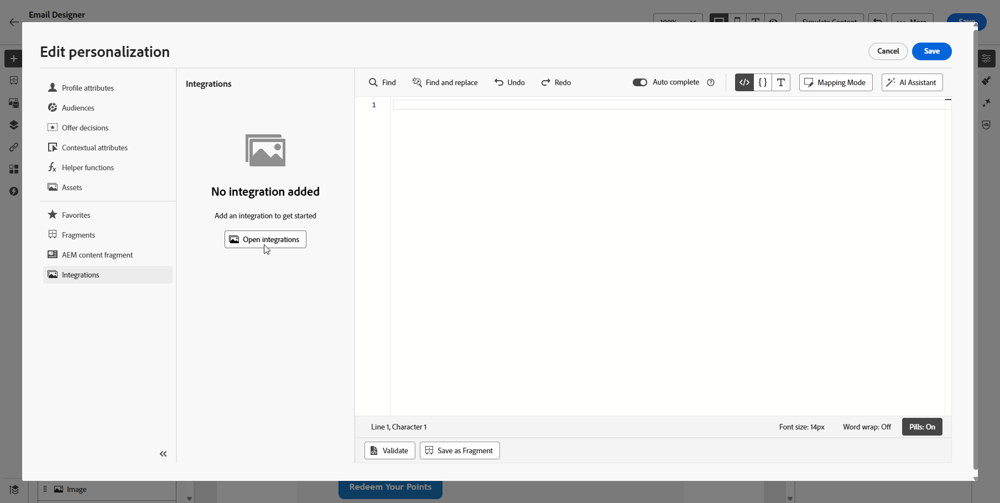

1. 選取整合併按一下&#x200B;**[!UICONTROL 儲存]**。

   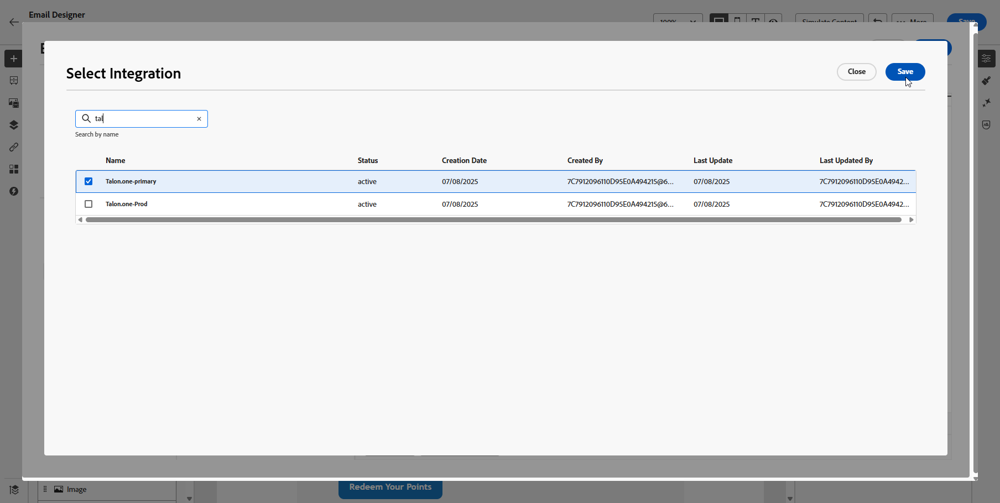

1. 啟用&#x200B;**[!UICONTROL Pills]**&#x200B;模式以解除鎖定進階整合功能表。

   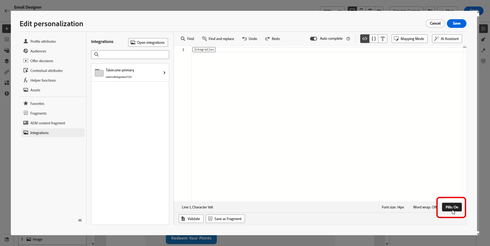

1. 若要完成整合設定，請定義先前在[組態](#configure)期間指定的整合屬性。

   您可以使用靜態值（保持常數）或設定檔屬性（動態地從使用者設定檔中提取資訊）來指派值給這些屬性。

   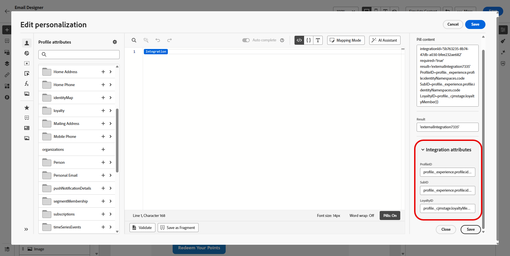

1. 定義整合屬性後，您現在可以按一下圖示，將內容中的整合欄位用於個人化傳訊。

   

1. 按一下&#x200B;**[!UICONTROL 儲存]**。

您的整合個人化現在已成功套用至您的內容，確保每位收件者都能根據您設定的屬性獲得量身打造的相關體驗。

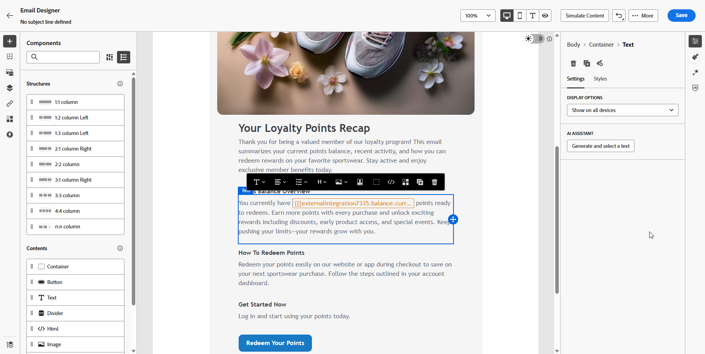

