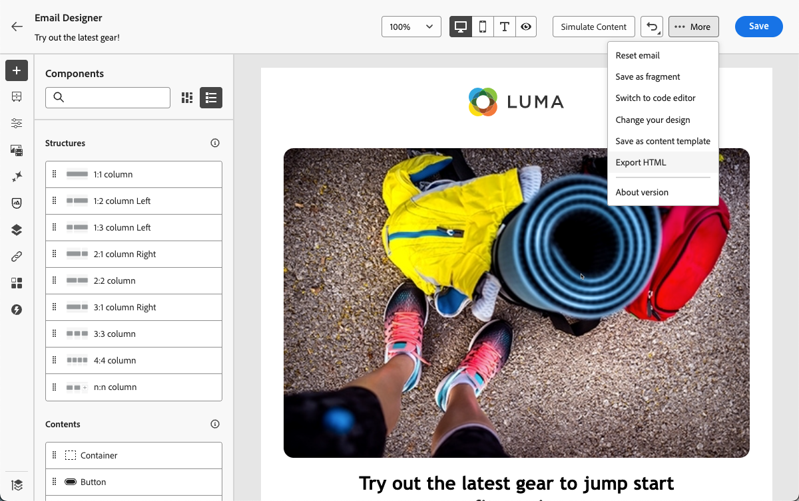
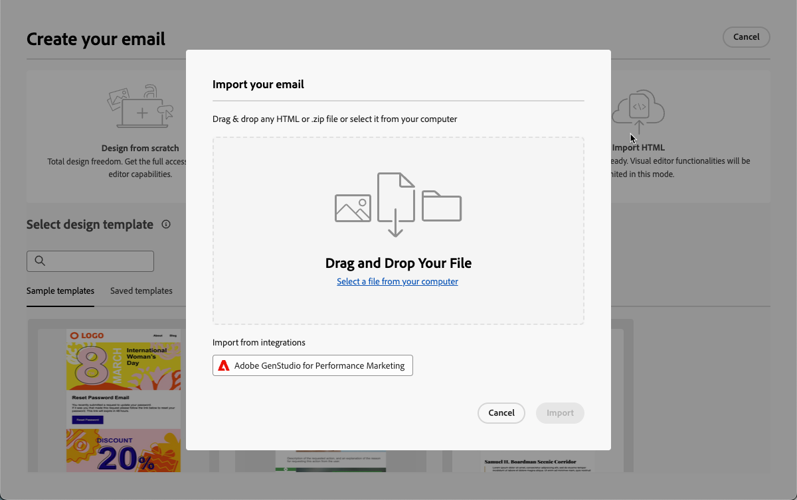
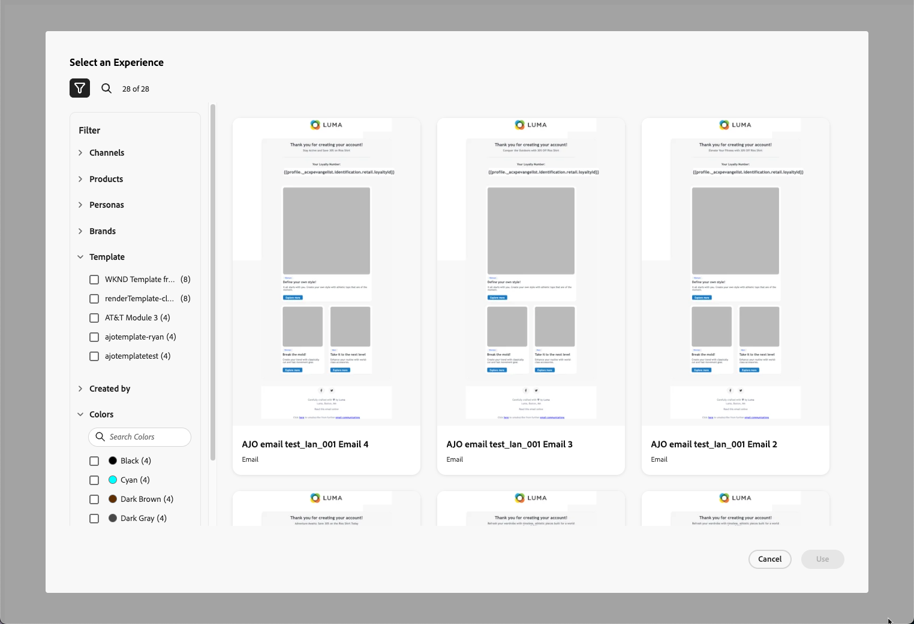
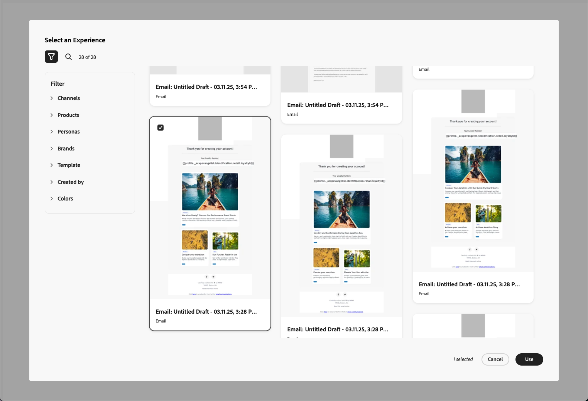
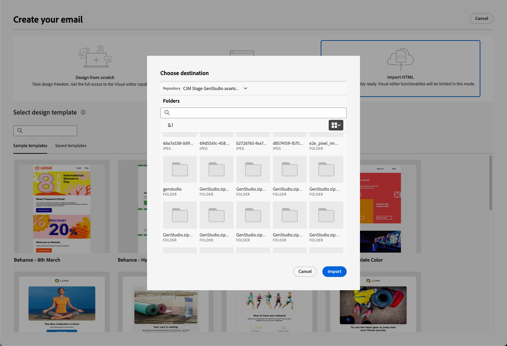
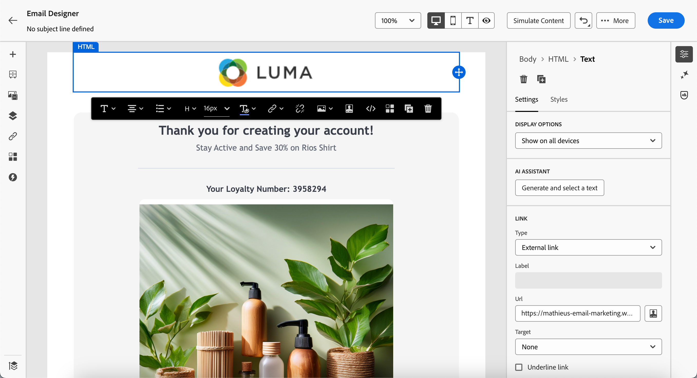
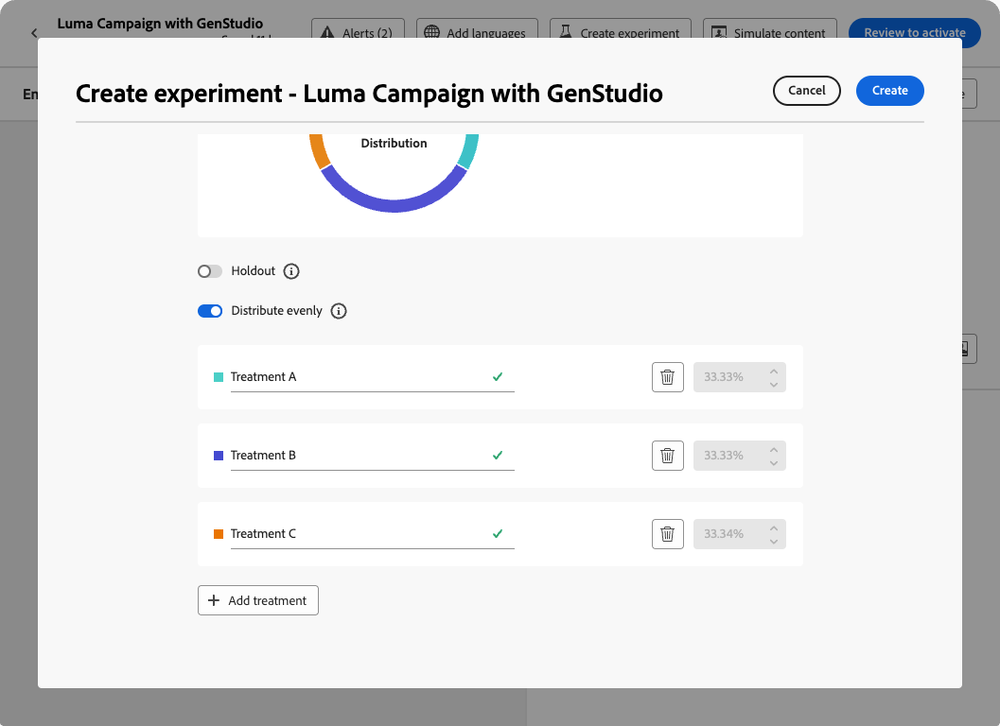
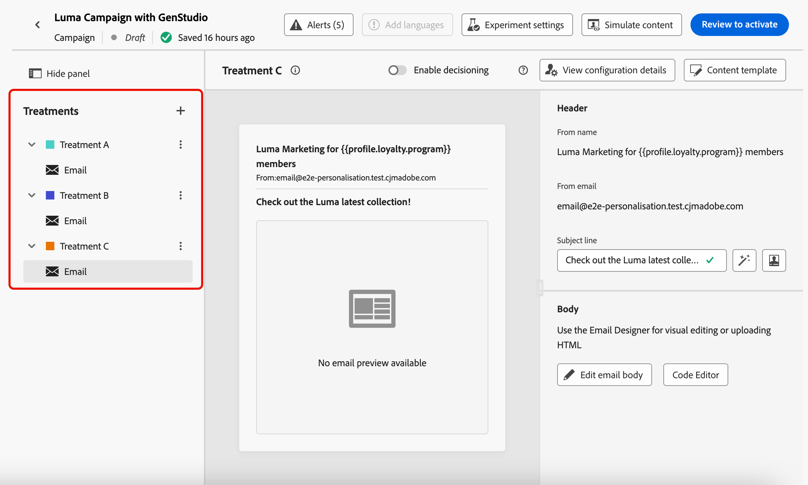

# 使用 GenStudio for Performance Marketing {#ajo-genstudio}

>[!CONTEXTUALHELP]
>id="ajo_genstudio_button"
>title="使用以 GenStudio 建置的範本"
>abstract="由於與 Adobe GenStudio for Performance Marketing 緊密整合，您可以輕鬆匯入透過 Adobe AI 技術增強的 GenStudio 範本。"

## 開始使用GenStudio {#gs-genstudio}

[Adobe GenStudio for Performance Marketing](https://experienceleague.adobe.com/zh-hant/docs/genstudio-for-performance-marketing/user-guide/home){target="_blank"}是創作AI優先的應用程式，可讓行銷團隊建立自己的廣告和電子郵件，以推動具影響力、個人化的行銷活動，符合您的品牌標準並遵守您的企業政策。 透過運用Adobe AI技術，提供一套完整的工具，可簡化內容建立及管理的複雜性，讓創意人員可專注在創新上。

>[!AVAILABILITY]
>
>* [!DNL Adobe Journey Optimizer] 的 GenStudio 整合目前無法搭配 **Healthcare Shield** 或 **Privacy and Security Shield** 附加元件方案使用。
>
>* 此功能僅適用於電子郵件頻道。

若要提升行銷效率並維持品牌一致性，您可以將&#x200B;[!DNL **GenStudio for Performance Marketing**]&#x200B;體驗與&#x200B;[!DNL **Adobe Journey Optimizer**]&#x200B;緊密整合。 這可讓您運用[!DNL GenStudio]的AI支援內容建立以及[!DNL Journey Optimizer]的進階協調功能。

>[!INFO]
>
>若要更進一步，請檢視此[總覽](https://business.adobe.com/products/genstudio-for-performance-marketing.html#watch-overview){target="_blank"}以及[的](https://business.adobe.com/products/genstudio-for-performance-marketing.html#demo){target="_blank"}示範[!DNL Adobe GenStudio for Performance Marketing]。

➡️ [在影片中探索此功能](#video)

<!--To access the GenStudio integration in [!DNL Adobe Journey Optimizer] feature, users need to be granted the **xxx** permission. [Learn more](../administration/permissions.md)

>[!IMPORTANT]
>
>* Before starting using this capability, read out related [Guardrails and Limitations](#generative-guardrails).-->

<!--Guardrails and limitations {#genstudio-guardrails}

General guidelines for using the GenStudio integration in [!DNL Adobe Journey Optimizer] for email generation are listed below:

See if guidelines/limitations such as the ones listed [here](gs-generative.md#generative-guardrails) for AI Assistant can apply.

The following limitations apply to GenStudio integration in [!DNL Adobe Journey Optimizer]:-->

## 在Journey Optimizer中使用GenStudio功能 {#use-genstudio}

[!DNL GenStudio for Performance Marketing]與[!DNL Journey Optimizer]整合可讓您公司的行銷人員更有效地合作，以簡化程式。

例如，使用[!DNL Journey Optimizer]開發和自動化電子郵件行銷活動的技術行銷人員，可以與使用[!DNL GenStudio]建立內容的效能行銷人員共同作業。

透過這項整合，兩者可以共同作業，輕鬆地將[!DNL GenStudio]中的品牌上內容整合到[!DNL Journey Optimizer]中，傳遞吸引人的電子郵件，以鎖定特定客戶細分並提升銷售量。

### 將HTML範本從Journey Optimizer匯出至GenStudio {#export-from-ajo-to-genstudio}

首先，您可以將包含品牌指引的[!DNL Journey Optimizer] HTML範本匯出至[!DNL GenStudio for Performance Marketing]。 請遵循下列步驟。

1. 在[!DNL Journey Optimizer]中，存取歷程或行銷活動中的電子郵件內容。 [了解作法](../email/get-started-email-design.md#key-steps)

1. 在電子郵件Designer中，從&#x200B;**[!UICONTROL 更多]**&#x200B;按鈕中選取&#x200B;**[!UICONTROL 匯出HTML]**。

   {zoomable="yes"}

1. 將此HTML匯出的範本上傳至[!DNL GenStudio for Performance Marketing]。<!--Make sure you detect the fields that the generative AI uses to insert content in order to create an actionable template.-->

   >[!NOTE]
   >
   >在[!DNL GenStudio]HTML使用手冊[專屬區段中，瞭解如何將Adobe GenStudio for Performance Marketing範本上傳至](https://experienceleague.adobe.com/en/docs/genstudio-for-performance-marketing/user-guide/content/templates/use-templates#templates-from-ajo-and-marketo){target="_blank"}。

1. 在GenStudio中，使用此範本建立具有AI提示的多個電子郵件變體並儲存。

   >[!NOTE]
   >
   >瞭解如何在GenStudio專屬的[區段](https://experienceleague.adobe.com/en/docs/genstudio-for-performance-marketing/user-guide/create/create-email-experience){target="_blank"}中建立電子郵件體驗。

### 在Journey Optimizer中善用GenStudio體驗 {#leverage-genstudio-experiences}

若要運用您剛才建立的[!DNL GenStudio]電子郵件變數（透過將其匯入[!DNL Journey Optimizer]中），請遵循下列步驟。

1. 在[!DNL Journey Optimizer]中，[新增電子郵件](../email/create-email.md)至行銷活動。

1. 從行銷活動設定畫面，瀏覽[編輯內容畫面](../email/create-email.md#define-email-content)，然後按一下&#x200B;**[!UICONTROL 編輯電子郵件內文]**&#x200B;以開啟電子郵件Designer。 [了解作法](../email/get-started-email-design.md#key-steps)

1. 在電子郵件Designer首頁上，選取&#x200B;**[!UICONTROL 匯入HTML]**，然後按一下&#x200B;**[!UICONTROL Adobe GenStudio for Performance Marketing]**&#x200B;按鈕。

   {zoomable="yes"}

1. 瀏覽GenStudio體驗以開始建立您的內容。 您可以根據數個條件篩選體驗，例如產品、角色、品牌或甚至顏色。

   <!--{zoomable="yes"}-->

1. 選取體驗並按一下&#x200B;**[!UICONTROL 使用]**。

   {zoomable="yes"}

1. 選取您要匯入GenStudio體驗的資料夾。

   {zoomable="yes"}

1. 選取的內容會顯示在電子郵件Designer中。

   {zoomable="yes"}

   >[!NOTE]
   >
   >從[範本 [!DNL Journey Optimizer] 建立的GenStudio體驗](#export-from-ajo-to-genstudio)會直接匯入電子郵件Designer。 未使用[!DNL Journey Optimizer]範本建立的GenStudio體驗已匯入至[相容性模式](../email/existing-content.md)。

   使用[電子郵件內容編輯工具](../email/content-from-scratch.md)和[個人化欄位](../personalization/personalize.md)，依需要編輯您的電子郵件。 儲存您的內容。

1. 返回行銷活動摘要頁面，然後按一下&#x200B;**[!UICONTROL 建立實驗]**&#x200B;以使用實驗。 [瞭解如何建立內容實驗](../content-management/content-experiment.md)

   <!--{zoomable="yes"}-->

1. 建立數個處理並重複上述步驟，以匯入並快速運用您在[!DNL GenStudio]中建立的其他電子郵件體驗變數。

   {zoomable="yes"}

1. 儲存您的變更並[啟動](../campaigns/review-activate-campaign.md)行銷活動。

執行實驗後，透過[實驗行銷活動報告](../reports/campaign-global-report-cja-experimentation.md)追蹤行銷活動處理的成效。 然後，您可以解譯實驗的結果。 [了解作法](../content-management/get-started-experiment.md#interpret-results)

## 作法影片 {#video}

了解將電子郵件範本從 Journey Optimizer 匯出至 GenStudio 進行績效行銷的過程、使用GenStudio 範本製作符合品牌要求的電子郵件，然後順暢地將其匯回 Journey Optimizer。

>[!VIDEO](https://video.tv.adobe.com/v/3456038/?quality=12)