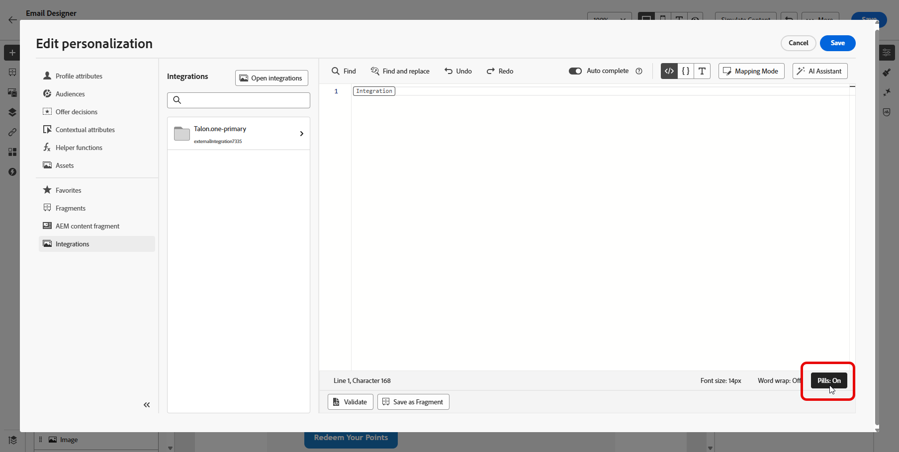
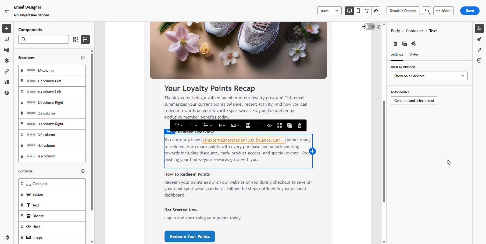

# 使用外部整合進行個人化 {#integrations-personalization}

在內容中使用外部整合之前，請確認管理員已設定&#x200B;**並啟動**&#x200B;每個整合（端點、驗證、原則、回應裝載和啟動），如[使用整合](integrations.md)中所述。

您可以在訊息上新增每個&#x200B;**[!UICONTROL 片段]**&#x200B;最多&#x200B;**3**&#x200B;個整合，以及最多&#x200B;**5**&#x200B;個整合。 僅來自片段的整合不會計入&#x200B;**5**。

## 將整合個人化套用至您的內容 {#apply-integration-personalization}

身為行銷人員，您可以使用已設定的整合來個人化您的內容。 請依照下列步驟操作：

1. 存取您的行銷活動內容，然後按一下[文字]或[HTML **[!UICONTROL 元件]**]中的[新增個人化&#x200B;]&#x200B;**。**

   [進一步瞭解元件](../email/content-components.md)

   

1. 瀏覽至&#x200B;**[!UICONTROL 整合]**&#x200B;區段，然後按一下&#x200B;**[!UICONTROL 開啟整合]**&#x200B;以檢視所有使用中的整合。

   請注意，**Journey Optimizer片段**&#x200B;可與整合搭配使用，但僅支援傳出頻道。 片段發佈後，會停用新增和儲存新的整合，以避免對現有歷程和行銷活動造成影響。

   

1. 選取整合併按一下&#x200B;**[!UICONTROL 儲存]**。

   

1. 啟用&#x200B;**[!UICONTROL Pills]**&#x200B;模式以解除鎖定進階整合功能表。

   

1. 當您編寫整合個人化時，整合協助程式會包含&#x200B;**`required`**&#x200B;欄位，以定義失敗或遺失資料如何與預設內容互動：

   * **`required=true`** （預設）：該訊息的轉譯停止。 此傳送已與&#x200B;**`ExternalDataLookupExclusion`**&#x200B;一起排除，而且此排除記錄在&#x200B;**訊息意見資料集**&#x200B;中。
   * **`required=false`**：結果變數已設為&#x200B;**`null`**，且轉譯作業會繼續進行。 在範本中使用預設文字、後援或條件式邏輯，這樣在整合未傳回資料時，設定檔就不會接收空白內容。

     

1. 若要完成整合設定，請定義先前在[組態](integrations.md#configure)期間指定的整合屬性。

   您可以使用靜態值（保持常數）或設定檔屬性（動態地從使用者設定檔中提取資訊）來指派值給這些屬性。

   

1. 定義整合屬性後，您現在可以按一下圖示，將內容中的整合欄位用於個人化傳訊。

   

   >[!NOTE]
   >
   >範本中的權杖只能使用管理員在整合設定中公開的欄位。 例如，`{{weatherResponse.temperature}}`在`temperature`公開時有效；如果`humidity`未公開，編輯器中會拒絕`{{weatherResponse.humidity}}`。

1. 按一下&#x200B;**[!UICONTROL 儲存]**。

您的整合個人化現在已成功套用至您的內容，確保每位收件者都能根據您設定的屬性獲得量身打造的相關體驗。

<!--

## Map one API call to another {#map-integration-chain}

You can **chain** integrations so that values returned by one active integration drive the inputs (path, headers, or query parameters) of another. That lets you build a real-time data flow in a single message without custom code.

Before you start, make sure that:

* An administrator has configured and activated every integration you need. See [Configure your Integration](integrations.md).
* Variable path placeholders, headers, and query parameters are set up in the integration configuration with marketer-facing labels.
* The administrator exposed the response fields you need in each integration's **[!UICONTROL Response payload]** so they appear when authoring.

In the below example, a reservation system integration returns a flight booking reference from the profile context. A separate flight-information integration expects that reference as a **path variable**. In the personalization editor, you map the second integration's variable to a field from the first integration's response, instead of a static value or profile attribute alone.

1. Open your message or fragment and place the cursor where you want personalized content (for example, a **[!UICONTROL Text]** field).

1. Open the personalization editor and go to **[!UICONTROL Integrations]** → **[!UICONTROL Open integrations]**.

1. Select the integration whose output will supply the downstream input (in the example, the reservation or profile API that returns the flight identifier).

1. Define that integration's inputs as usual—static values, profile attributes, or other allowed mappings—then save so its response is available for chaining.

    >[!NOTE]
    >
    > Fields must appear in the administrator-defined response payload for each integration. You cannot reference response properties that were not exposed in configuration.

1. Select the **second** integration (for example, the API that needs the flight number or booking reference on the URL path).

1. For each input that must come from the first call—often a **path variable** or **variable** header/query parameter—choose the mapping source that references the **first integration's response** (for example, the flight booking reference field from the reservation payload). Do not use a static test value if you need live, profile-specific data.

1. Insert the response tokens you need in the content (for example, destination name from the flight API, loyalty balance from a loyalty integration) using the  control.

1. Save the personalization.

When you **simulate** or send, Journey Optimizer resolves integrations in order: the first call runs with the profile context you configured; its output is used to build the second request. Different integrations may run at simulation time and at send time according to your setup and channel behavior.

-->

## 作法影片 {#video}

此影片說明&#x200B;**整合**&#x200B;如何將Adobe Journey Optimizer連線至外部API，以便您可以將即時資料和內容提取至&#x200B;**傳出頻道**&#x200B;電子郵件、簡訊和推播，以進行更相關的個人化。

>[!VIDEO](https://video.tv.adobe.com/v/3484118/?learn=on)
