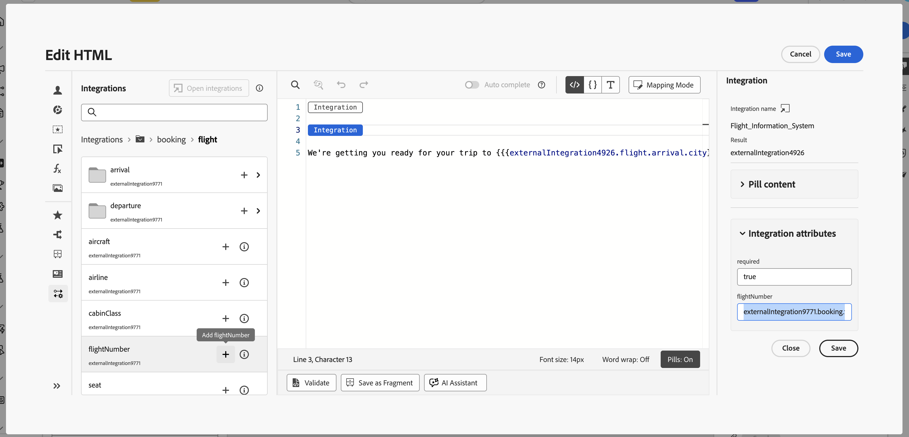

# 使用外部整合進行個人化 {#integrations-personalization}

在內容中使用外部整合之前，請確認管理員已設定&#x200B;**並啟動**&#x200B;每個整合（端點、驗證、原則、回應裝載和啟動），如[使用整合](integrations.md)中所述。

您可以在訊息上新增每個&#x200B;**[!UICONTROL 片段]**&#x200B;最多&#x200B;**3**&#x200B;個整合，以及最多&#x200B;**5**&#x200B;個整合。 僅來自片段的整合不會計入&#x200B;**5**。

## 將整合個人化套用至您的內容 {#apply-integration-personalization}

身為行銷人員，您可以使用已設定的整合來個人化您的內容。 請依照下列步驟操作：

1. 存取您的行銷活動內容，然後按一下[文字]或[HTML **[!UICONTROL 元件]**]中的[新增個人化&#x200B;]&#x200B;**。**

   [進一步瞭解元件](../email/content-components.md)

   

1. 瀏覽至&#x200B;**[!UICONTROL 整合]**&#x200B;區段，然後按一下&#x200B;**[!UICONTROL 開啟整合]**&#x200B;以檢視所有使用中的整合。

   請注意，**Journey Optimizer片段**&#x200B;可與整合搭配使用，但僅支援傳出頻道。 片段發佈後，會停用新增和儲存新的整合，以避免對現有歷程和行銷活動造成影響。

   

1. 選取整合併按一下&#x200B;**[!UICONTROL 儲存]**。

   

1. 啟用&#x200B;**[!UICONTROL Pills]**&#x200B;模式以解除鎖定進階整合功能表。

   

1. 當您編寫整合個人化時，整合協助程式會包含&#x200B;**`required`**&#x200B;欄位，以定義失敗或遺失資料如何與預設內容互動：

   * **`required=true`** （預設）：該訊息的轉譯停止。 此傳送已與&#x200B;**`ExternalDataLookupExclusion`**&#x200B;一起排除，而且此排除記錄在&#x200B;**訊息意見資料集**&#x200B;中。
   * **`required=false`**：結果變數已設為&#x200B;**`null`**，且轉譯作業會繼續進行。 在範本中使用預設文字、後援或條件式邏輯，這樣在整合未傳回資料時，設定檔就不會接收空白內容。

     

1. 若要完成整合設定，請定義先前在[組態](integrations.md#configure)期間指定的整合屬性。

   您可以使用靜態值（保持常數）或設定檔屬性（動態地從使用者設定檔中提取資訊）來指派值給這些屬性。

   

1. 定義整合屬性後，您現在可以按一下圖示，將內容中的整合欄位用於個人化傳訊。

   

   >[!NOTE]
   >
   >範本中的權杖只能使用管理員在整合設定中公開的欄位。 例如，`{{weatherResponse.temperature}}`在`temperature`公開時有效；如果`humidity`未公開，編輯器中會拒絕`{{weatherResponse.humidity}}`。

1. 按一下&#x200B;**[!UICONTROL 儲存]**。

您的整合個人化現在已成功套用至您的內容，確保每位收件者都能根據您設定的屬性獲得量身打造的相關體驗。

## 將一個API呼叫對應至另一個API呼叫 {#map-integration-chain}

您可以連結整合，讓某個呼叫的結果饋送至下一個呼叫，例如路徑區段、標題或查詢引數。 這些呼叫會在相同的訊息中依序執行，支援更豐富的個人化，而不需要自訂程式碼。

開始之前，請確定：

* 管理員已設定並啟動您所需的每項整合。 請參閱[設定整合](integrations.md)。
* 變數路徑預留位置、標題和查詢引數是在具有行銷人員專用標籤的整合設定中設定。
* 管理員會在每個整合的&#x200B;**[!UICONTROL 回應承載]**&#x200B;中公開您所需的回應欄位，以便在編寫時顯示。

以下範例使用訂位整合，從設定檔的預訂傳回航班號碼，然後使用航班資訊整合，將該號碼用於即時狀態（延遲、目的地）。 將第二個整合的輸入對應到第一個呼叫的回應。

1. 開啟您的訊息或片段，然後開啟個人化編輯器。

   

1. 在&#x200B;**[!UICONTROL 整合]**&#x200B;中，按一下&#x200B;**[!UICONTROL 開啟整合]**。

   

1. 新增其回應將饋送下個呼叫的整合，例如，包括航班識別碼的預訂或預訂資料。

   

1. （選用）如果要將具名變數繫結到保留回應，請開啟&#x200B;**[!UICONTROL 協助程式函式]**&#x200B;功能表，並新增協助程式，例如`Let`函式。

   >[!NOTE]
   >
   > 只有管理員定義的&#x200B;**[!UICONTROL 回應承載]**&#x200B;中公開的欄位才可用。 您無法參考設定中未公開的屬性。

1. 如果您使用協助程式變數，請將該變數對應至預訂整合傳回以供下游使用的欄位，例如，乘客或預訂裝載中的航班號碼。

   

1. 從&#x200B;**[!UICONTROL 開啟整合]**&#x200B;功能表，新增第二個整合，例如，航班狀態。

   

1. 在第二個整合中，開啟&#x200B;**[!UICONTROL 整合屬性]**。 對於必須重複使用來自第一次呼叫的資料的每個輸入，例如路徑變數、標題或查詢引數，請從第一次整合回應中選取對應來源。

   在&#x200B;**[!UICONTROL Pills]**&#x200B;體驗中，您可以將第一次呼叫輸出直接對應到第二次呼叫輸入，而不需要`Let`陳述式。 如果您使用`Let`，可以改為透過該變數進行對應。

   

1. 使用控制項（例如航班資訊回應的目的地），將第二次整合的Token插入內容。

   

1. 儲存您的內容。

在&#x200B;**[!UICONTROL 模擬]**&#x200B;或傳送上，Journey Optimizer會依下列順序執行整合：第一個呼叫使用您設定的設定檔內容，其結果會建置第二個要求。 指定的整合是在模擬或傳送時間執行，取決於您的設定和管道。

## 作法影片 {#video}

此影片說明&#x200B;**整合**&#x200B;如何將Adobe Journey Optimizer連線至外部API，以便您可以將即時資料和內容提取至&#x200B;**傳出頻道**&#x200B;電子郵件、簡訊和推播，以進行更相關的個人化。

>[!VIDEO](https://video.tv.adobe.com/v/3484129/?captions=chi_hant&learn=on)
