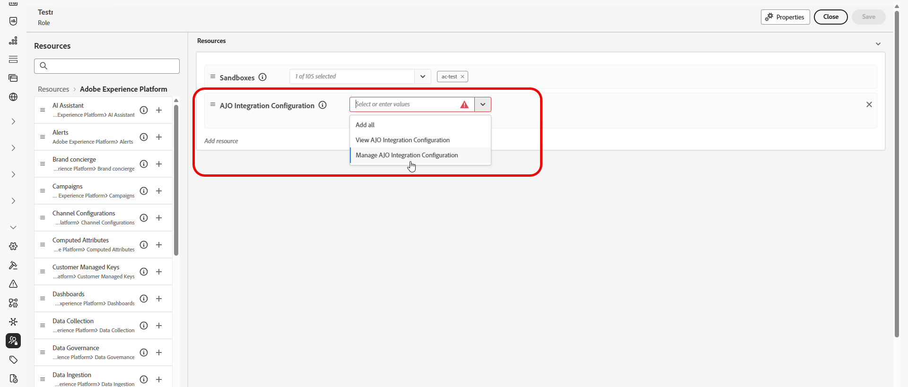
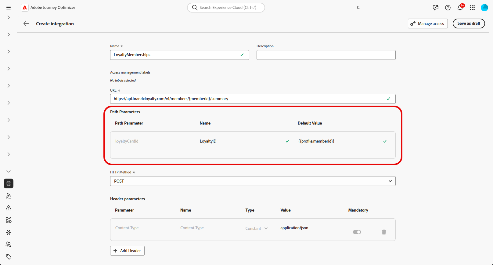

# 使用整合 {#external-sources}

## 概觀

**整合**&#x200B;功能將Adobe Journey Optimizer連結至您已在其他地方管理其資料和可撰寫內容的協力廠商系統。 您可以在編寫期間和傳送時間顯示這些資料，這可跨您在Journey Optimizer中使用的各個管道支援回應速度更快、個人化的體驗。

您可以使用此功能來存取外部資料，以及從第三方工具提取內容，例如：

* **獎勵積分**&#x200B;來自忠誠度系統。
* 產品的&#x200B;**價格資訊**。
* 來自建議引擎的&#x200B;**產品建議**。
* **物流更新**&#x200B;為傳遞狀態。

若要開始使用整合，使用者必須獲授&#x200B;**[!UICONTROL 管理AJO整合設定]**&#x200B;和&#x200B;**[!UICONTROL 檢視AJO整合設定]**&#x200B;許可權。 [進一步瞭解許可權](../administration/permissions.md)

+++ 瞭解如何指派整合的相關許可權

1. 在&#x200B;**[!UICONTROL 權限]**&#x200B;產品中，前往&#x200B;**[!UICONTROL 角色]**&#x200B;標籤，然後選取所需的&#x200B;**[!UICONTROL 角色]**。

1. 按一下&#x200B;**[!UICONTROL 編輯]**&#x200B;以修改權限。

1. 新增&#x200B;**[!UICONTROL AJO整合設定]**&#x200B;資源，然後從下拉式功能表中選取適當的整合許可權。

   

1. 按一下&#x200B;**[!UICONTROL 儲存]**，以套用所做的變更。

   任何已指派給此角色的使用者都會自動更新其權限。

1. 若要將此角色指派給新使用者，請瀏覽至&#x200B;**[!UICONTROL 角色]**&#x200B;儀表板中的&#x200B;**[!UICONTROL 使用者]**&#x200B;標籤，然後按一下&#x200B;**[!UICONTROL 新增使用者]**。

1. 輸入使用者的名稱、電子郵件地址，或從清單當中選擇，然後按一下&#x200B;**[!UICONTROL 儲存]**。

如果使用者先前未建立，請參閱[此檔案](https://experienceleague.adobe.com/zh-hant/docs/experience-platform/access-control/abac/permissions-ui/users)。

+++

## 設定您的整合 {#configure}

>[!AVAILABILITY]
>
> 此整合功能僅限傳出頻道（電子郵件、簡訊和推播）並支援提取JSON或HTML。

身為管理員，您可以依照下列步驟設定外部整合：

1. 導覽至左側功能表中的&#x200B;**[!UICONTROL 組態]**&#x200B;區段，然後從&#x200B;**[!UICONTROL 整合]**&#x200B;卡片按一下&#x200B;**[!UICONTROL 管理]**。

   然後，按一下[建立整合] ****&#x200B;以開始新的組態。

   

1. 選擇性地貼上&#x200B;**cURL**&#x200B;命令以自動填入URL、HTTP方法、標頭和查詢引數。

1. 提供整合的&#x200B;**[!UICONTROL 名稱]**&#x200B;和&#x200B;**[!UICONTROL 描述]**。

   >[!NOTE]
   >
   >**[!UICONTROL 名稱]**&#x200B;欄位不能包含空格。

1. 輸入API端點&#x200B;**[!UICONTROL URL]**。

   對於路徑變數，在URL中以雙大括弧括住標籤，例如`https://api.example.com/v1/products/{{productId}}`，然後在&#x200B;**[!UICONTROL 路徑範本]**&#x200B;中設定每個預留位置。

1. 為您在URL中新增的每個預留位置設定&#x200B;**[!UICONTROL 路徑範本]**&#x200B;的&#x200B;**[!UICONTROL 名稱]**&#x200B;和&#x200B;**[!UICONTROL 預設值]**。

   請注意，**[!UICONTROL Name]**&#x200B;僅是編輯器中面向行銷人員的標籤，不會根據API請求傳送。

   

1. 選取GET與POST之間的&#x200B;**[!UICONTROL HTTP方法]**。

1. 視整合需要，按一下&#x200B;**[!UICONTROL 新增標題]**&#x200B;和/或&#x200B;**[!UICONTROL 新增查詢引數]**。 針對每個引數，提供下列詳細資訊：

   * **[!UICONTROL 引數]**： API預期的實際標頭或查詢引數名稱。

   * **[!UICONTROL 名稱]**：此引數可供行銷人員使用的標籤，作者在對應行銷活動中的值時可加以選取。

   * **[!UICONTROL 型別]**：選擇固定值的&#x200B;**常數**&#x200B;或動態輸入的&#x200B;**變數**。

   * **[!UICONTROL 值]**：直接輸入常數值，或選取變數對應。

   * **[!UICONTROL 必要]**：指定是否需要此引數。 對於強制的&#x200B;**[!UICONTROL 變數]**&#x200B;引數，如果未在執行階段解析任何值且未提供預設值，則產生請求會失敗並出現錯誤，且不會進行傳出API呼叫。

   

1. 選擇&#x200B;**[!UICONTROL 驗證型別]**：

   * **[!UICONTROL 無驗證]**：適用於不需要任何認證的開放API。

   * **[!UICONTROL API金鑰]**：使用靜態API金鑰驗證請求。 輸入您的&#x200B;**[!UICONTROL API金鑰名稱{1&#x200B;}、**[!UICONTROL  API金鑰值{3&#x200B;}並指定您的&#x200B;**[!UICONTROL 位置]**。]**]**

   * **[!UICONTROL 基本驗證]**：使用標準HTTP基本驗證。 輸入&#x200B;**[!UICONTROL 使用者名稱]**&#x200B;和&#x200B;**[!UICONTROL 密碼]**。

   * **[!UICONTROL OAuth 2.0]**：使用OAuth 2.0通訊協定進行驗證。 按一下圖示以設定或更新&#x200B;**[!UICONTROL 裝載]**。

   

1. 設定API要求的&#x200B;**[!UICONTROL 原則組態]** （例如&#x200B;**[!UICONTROL 逾時]**&#x200B;期間），並選擇啟用節流、快取和/或重試。

   >[!NOTE]
   >
   >啟用節流功能後，支援的速率為50至5000 TPS。 限制適用於&#x200B;**整合**，而非每個API端點。
   >
   >啟用重試後，其他失敗預設會重試&#x200B;**三**&#x200B;次，每次嘗試之間會重試&#x200B;**200毫秒**、**400毫秒**&#x200B;和&#x200B;**800毫秒**。

1. 透過&#x200B;**[!UICONTROL 回應承載]**&#x200B;欄位，您可以決定樣例輸出的哪些欄位需要用於訊息個人化。

   按一下圖示並貼上範例JSON回應裝載以自動偵測資料型別。

1. 選擇要公開以進行個人化的欄位，並指定其對應的資料型別。

   

   >[!NOTE]
   >
   >**[!UICONTROL 回應承載]**&#x200B;設定定義了編寫的預期回應，包括該步驟中套用的任何結構描述。 行銷人員只能參考公開的欄位，其他路徑的Token無法在編輯器中驗證。

1. 使用&#x200B;**[!UICONTROL 傳送測試連線]**&#x200B;來驗證整合。 [進一步瞭解如何測試您的連線](#connection)

   驗證後，按一下&#x200B;**[!UICONTROL 啟動]**。

1. 存取您新建立的整合專案：

   * **更新**：僅變更&#x200B;**驗證**&#x200B;詳細資料和&#x200B;**原則組態**。 更新適用於即時歷程和行銷活動。 在儲存變更之前，請使用&#x200B;**[!UICONTROL 瀏覽參考]**&#x200B;功能表來確認整合的使用位置。
   * **封存**：封存整合設定。

   

啟用後，請按一下圖示以存取&#x200B;**[!UICONTROL 探索參考]**&#x200B;功能表，並檢閱此設定的使用狀況，包括相依的歷程與行銷活動。

### 傳送時間限制和行為 {#configure-send-time}

在傳送時，來自外部API的回應預設為最多&#x200B;**4 MB**。 任何大於此值的專案都會被視為整合錯誤，當失敗是由回應大小所導致時，將不會嘗試&#x200B;**次重試**。

呼叫會遵循您設定的&#x200B;**節流**&#x200B;速率：即使外部系統關機或傳回錯誤，Journey Optimizer排程也會嘗試達到該限制。 如果已啟用&#x200B;**快取**，則只會儲存並重複使用&#x200B;**個成功的**&#x200B;回應，直到您定義的快取&#x200B;**TTL**&#x200B;過期為止；絕不會快取失敗的回應。

每個佇列的訊息也包含有效視窗(TTL)。 如果處理延遲，且訊息位於該視窗之後，系統&#x200B;**會捨棄該視窗**&#x200B;並發出&#x200B;**`MessageValidityExclusion`**&#x200B;事件，讓過時的工作從佇列中清除，而資源仍可繼續使用。

## 測試您的連線 {#connection}

**[!UICONTROL 傳送測試連線]**&#x200B;會在啟用之前針對目標API驗證端點URL、驗證及要求結構，以降低訊息處理期間執行階段失敗的風險。

1. 定義URL、HTTP方法、標頭和查詢引數時，按一下[傳送測試連線] ]**以執行連線測試並確認組態。**[!UICONTROL 

1. 在&#x200B;**[!UICONTROL 傳送測試連線]**&#x200B;對話方塊中，為URL路徑、標頭和查詢引數中的任何&#x200B;**[!UICONTROL 變數]**&#x200B;預留位置輸入預設值。

   這些值會包含在測試請求中。 Journey Optimizer會叫用端點，並報告連線成功或失敗。

   

1. 如果測試傳回成功的回應，請選取&#x200B;**[!UICONTROL 使用作為回應承載]**，將回應內文複製到&#x200B;**[!UICONTROL 回應承載]**&#x200B;欄位中，請參閱[設定整合](#configure)下的步驟10，其中可偵測資料型別，並可選取欄位進行個人化。

   

1. 如果測試不成功，請展開&#x200B;**[!UICONTROL 錯誤]**&#x200B;下拉式清單以檢閱失敗詳細資料，視需要更新整合組態，然後再次執行&#x200B;**[!UICONTROL 傳送測試連線]**。

   

測試成功後，在整合組態中選取&#x200B;**[!UICONTROL 啟動]**。 請參閱[設定整合](#configure)。

