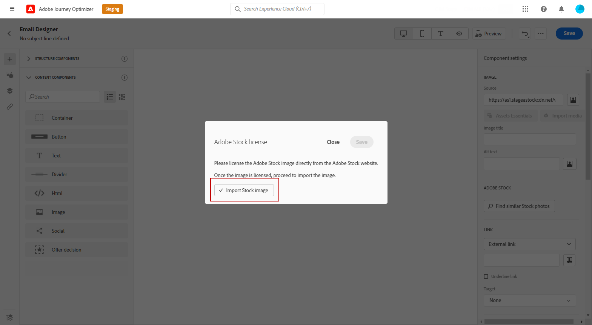

# 使用[!DNL Adobe Stock]個影像 {#stock}

## 開始使用 [!DNL Adobe Stock] {#get-started-stock}

[!DNL Adobe Stock] 和 [!DNL Adobe Journey Optimizer] 電子郵件設計工具整合外掛程式，為客戶提供了用於訊息製作的導覽、授權和儲存影像的簡單方法。

[Adobe Stock](https://helpx.adobe.com/stock/get-started.html){target="_blank"}可讓您存取數百萬張高品質、精選且免版稅的像片、影片、插圖及向量圖形。 您可以選擇購買信用套件以授權資產，或僅購買一個標準或延長授權以授權所需資產。 Adobe Stock也提供免費的資產集合。

使用 [!DNL Adobe Journey Optimizer]，您可直接從 [!DNL Adobe Stock] 將影像上傳到電子郵件，並使用&#x200B;**[!UICONTROL 尋找 Adobe Stock 照片]**&#x200B;選項將其新增到 **[!UICONTROL Assets]** 資料夾。此外，**[!UICONTROL 尋找類似 Stock 照片]**&#x200B;選項可協助您尋找符合傳送中所用資產的內容、顏色與組成的影像。

## 權限{#stock-permissions}

擁有AEM Assets Essentials產品設定檔存取許可權的使用者可以使用&#x200B;**[!UICONTROL 尋找Adobe Stock像片]**&#x200B;和&#x200B;**[!UICONTROL 尋找類似影像]**&#x200B;選項。

如需詳細資訊，請參閱[Experience Manager Assets檔案](https://experienceleague.adobe.com/docs/experience-manager-assets-essentials/help/get-started-admins/deploy-administer.html#add-users-to-essentials){target="_blank"}。

## 從[!DNL Adobe Stock]插入影像 {#add-stock-image}

若要將來自[!DNL Adobe Stock]的影像新增至您的內容，請遵循下列步驟：

1. 從電子郵件Designer的&#x200B;**[!UICONTROL 內容元件]**&#x200B;區段，拖放&#x200B;**影像**。

1. 按一下[電子郵件Designer]左邊的&#x200B;**[!UICONTROL 尋找Adobe Stock像片]**&#x200B;按鈕。

   

1. 瀏覽資料庫或在搜尋欄位中輸入字詞。

   

1. 選取選取的影像，然後按一下&#x200B;**[!UICONTROL 儲存]**。

   如果您選取的影像未獲授權，您必須[取得授權](#license-stock-image)。

## 尋找類似的像片 {#similar-stock-image}

您可以用[!DNL Adobe Stock]的像片取代電子郵件內容中的任何現有影像。 請注意，此選項適用於所有影像：已授權/未授權的Stock影像，以及您Assets資料夾中的影像。

若要瀏覽類似的像片，請遵循下列步驟：

1. 選取要取代的影像。
1. 按一下&#x200B;**[!UICONTROL 尋找類似的Stock像片]**&#x200B;按鈕，在[!DNL Adobe Stock]中顯示符合影像內容、顏色和構成的資產。

   

1. 選取選取的影像，然後按一下&#x200B;**[!UICONTROL 儲存]**。

   

   如果您選取的影像未獲授權，您必須[取得授權](#license-stock-image)。

1. 視需要使用&#x200B;**[!UICONTROL 設定]**&#x200B;和&#x200B;**[!UICONTROL 樣式]**&#x200B;索引標籤自訂您的影像。 [進一步瞭解元件設定](../email/content-components.md)。

## 從[!DNL Adobe Stock]取得授權 {#license-stock-image}

如果您的影像已獲得授權，則會以圖示表示。 如果沒有，您必須授權它。

若要授權並下載影像，請遵循下列步驟：

1. 請選取並按一下&#x200B;**[!UICONTROL 授權Adobe Stock影像]**&#x200B;圖示。

   

   接著您會被重新導向至[!DNL Adobe Stock]網站以購買授權。

   

1. 您必須從[!DNL Adobe Stock]網站購買資產，才能下載影像並移除浮水印。

   此次購買取決於您的Adobe Stock計畫或訂閱。 請注意，如果您有多個Adobe Stock帳戶，系統會將您重新導向至上次使用的Stock ID。 在此情況下，在授權您的資產之前，請確定您已登入正確的帳戶。

   如需Adobe Stock計畫和價格的詳細資訊，請參閱[Adobe Stock檔案](https://stock.adobe.com/plans){target="_blank"}。

   >[!WARNING]
   > 如果傳送了包含未授權影像的電子郵件，該影像會保留含有浮水印的未授權表單。

1. 完成購買後，您現在可以在[!DNL Adobe Journey Optimizer]中返回您的電子郵件，並選取&#x200B;**[!UICONTROL 匯入庫存影像]**&#x200B;以將您的授權影像匯入您的資產。

   

1. 選取要儲存資產的資料夾。 如需[!DNL Experience Manager Assets]的詳細資訊，請參閱此[頁面](assets.md#get-started-assets)。

## 相關主題{#stock-related-topics}

* [Journey Optimizer中的電子郵件設計](../email/get-started-email-design.md)
* [電子郵件設計的元件設定](../email/content-components.md)
* [Adobe Stock快速入門](https://helpx.adobe.com/stock/get-started.html){target="_blank"}。

