# 建立和發佈登陸頁面 {#create-lp}

若要將您的客戶導向至您要在他們按一下特定連結時顯示的已定義網頁，請在[!DNL Journey Optimizer]中建立登陸頁面、設定主要頁面及任何子頁面、測試並發佈。

建立登入頁面的主要步驟如下：

## 建立登陸頁面 {#create-landing-page}

>[!CONTEXTUALHELP]
>id="ajo_lp_create"
>title="定義和設定您的登陸頁面"
>abstract="若要建立登陸頁面，您需要選取一個預設集，然後設定主要頁面和子頁面，最後在發佈頁面之前進行測試。"

>[!CONTEXTUALHELP]
>id="ajo_lp_access_management_labels"
>title="為您的登陸頁面指派標籤"
>abstract="為了保護敏感的數位資產，您可以定義授權，以使用標籤來管理對登陸頁面的資料存取。"
>additional-url="https://experienceleague.adobe.com/docs/journey-optimizer/using/access-control/object-based-access.html?lang=zh-Hant" text="物件等級存取控制"

若要建立登入頁面，您必須選取預設集，然後設定主要頁面和子頁面，最後在發佈頁面之前先測試頁面。 這些步驟詳述如下：

1. 從左側功能表瀏覽至&#x200B;**[!UICONTROL 內容管理]** > **[!UICONTROL 登陸頁面]**。

1. 從登入頁面清單中，按一下&#x200B;**[!UICONTROL 建立登入頁面]**。

   

1. 新增標題。 您可以視需要新增說明。

   

1. 若要指派自訂或核心資料使用標籤給登入頁面，請選取&#x200B;**[!UICONTROL 管理存取權]**。 [進一步瞭解物件層級存取控制(OLAC)](../administration/object-based-access.md)

1. 從&#x200B;**[!UICONTROL 標籤]**&#x200B;欄位選取或建立Adobe Experience Platform標籤，將您的登入頁面分類以改善搜尋。 [了解更多](../start/search-filter-categorize.md#tags)

1. 選取預設集。 瞭解如何在[本節](../landing-pages/lp-presets.md#lp-create-preset)中建立登陸頁面預設集。

   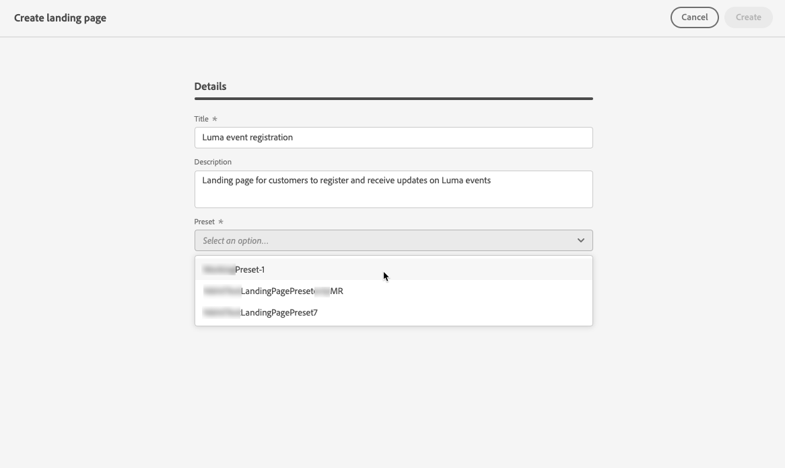

1. 按一下&#x200B;**[!UICONTROL 建立]**。

1. 主要頁面及其屬性隨即顯示。 在[這裡](#configure-primary-page)瞭解如何設定主要頁面設定。

   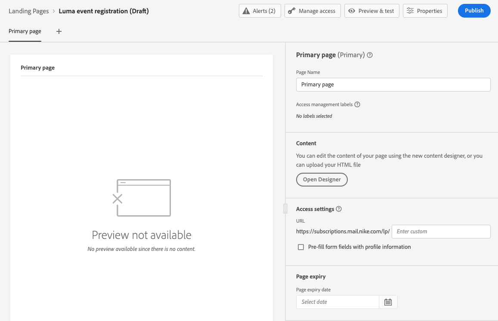

1. 按一下+圖示以新增子頁面。 瞭解如何在[這裡](#configure-subpages)設定子頁面設定。

   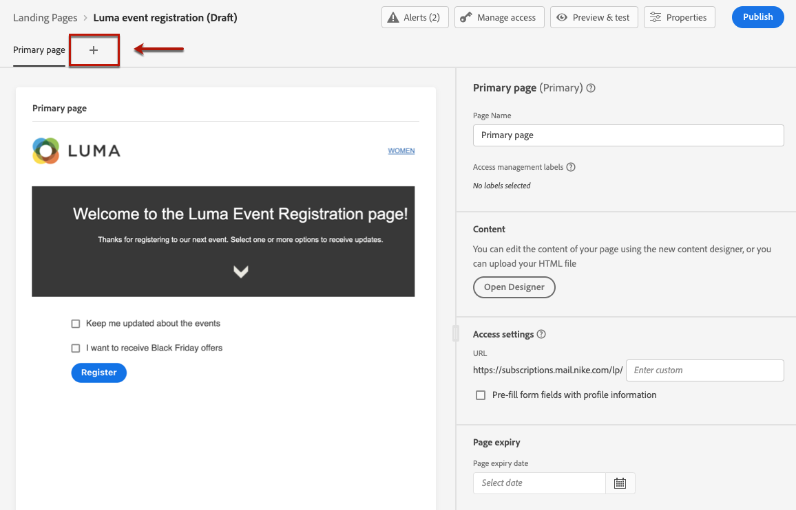

設定並設計[主要頁面](#configure-primary-page)和[子頁面](#configure-subpages) （如果有的話）後，您可以[測試](#test-landing-page)和[發佈](#publish-landing-page)您的登陸頁面。

>[!CAUTION]
>
>即使已發佈，僅將定義的URL複製貼到網頁瀏覽器中，仍無法存取您的登入頁面。 您可以改用預覽函式來測試，如[此區段](#test-landing-page)中所述。

## 設定主要頁面 {#configure-primary-page}

>[!CONTEXTUALHELP]
>id="ajo_lp_primary_page"
>title="定義您的主要頁面設定"
>abstract="使用者點選您的登陸頁面連結 (例如從電子郵件或網站) 後，主要頁面會隨即向使用者顯示。"
<!--
>additional-url="https://experienceleague.adobe.com/docs/journey-optimizer/using/landing-pages/landing-pages-design/design-lp.html?lang=zh-Hant" text="Design the landing page content"-->

>[!CONTEXTUALHELP]
>id="ajo_lp_access_settings"
>title="定義您的登陸頁面 URL"
>abstract="在本區段中，定義一個唯一的登陸頁面 URL。URL 的第一部分需要您預先設定一個登陸頁面子網域作為您選取的預設集的一部分。"
>additional-url="https://experienceleague.adobe.com/zh-hant/docs/journey-optimizer/using/content-management/landing-pages/lp-configuration/lp-subdomains" text="設定登陸頁面子網域"
>additional-url="https://experienceleague.adobe.com/zh-hant/docs/journey-optimizer/using/content-management/landing-pages/lp-configuration/lp-presets#lp-create-preset" text="建立登陸頁面預設集"

主要頁面是使用者按一下登陸頁面連結後（例如從電子郵件或網站）立即顯示給使用者的頁面。

若要定義主要頁面設定，請遵循下列步驟。

1. 您可以變更頁面名稱，預設為&#x200B;**[!UICONTROL 主要頁面]**。

1. 使用內容設計工具編輯頁面的內容。 在[此處](design-lp.md)瞭解如何定義登入頁面內容。

   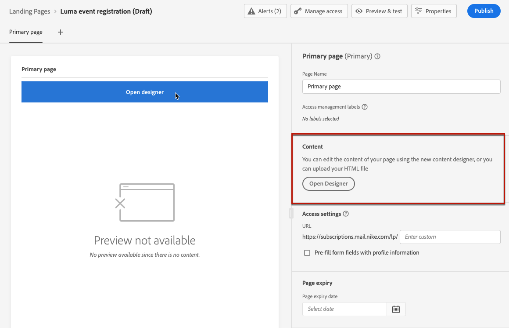

1. 定義您的登陸頁面URL。 URL的第一個部分要求您先前設定登陸頁面子網域，作為您選取的[預設集](../landing-pages/lp-presets.md#lp-create-preset)的一部分。 [了解更多](../landing-pages/lp-subdomains.md)

   >[!CAUTION]
   >
   >登陸頁面URL必須是唯一的。
   >
   >您無法將此URL複製貼入網頁瀏覽器，即使已發佈，仍可存取您的登入頁面。 您可以改用預覽函式來測試，如[此區段](#test-landing-page)中所述。

   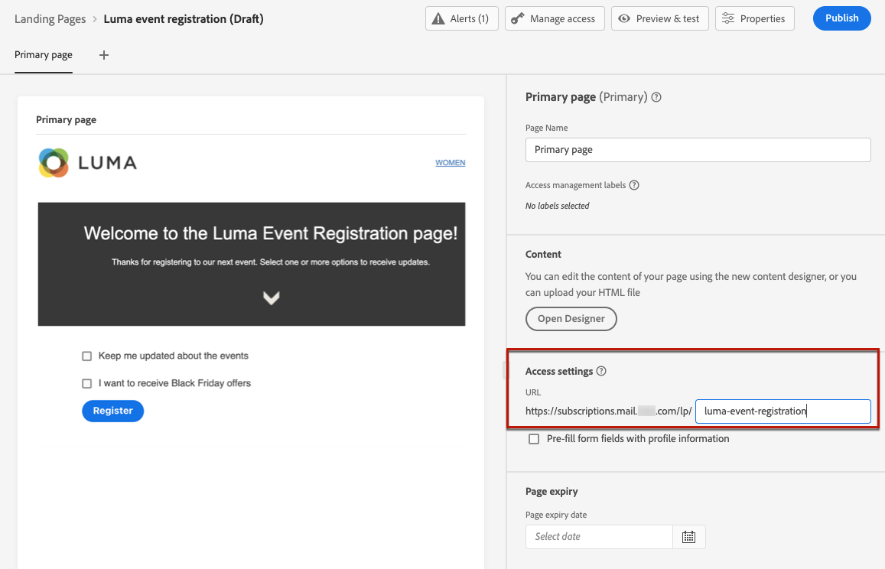

1. 如果您希望登入頁面預先載入現有的表單資料，請選取&#x200B;**[!UICONTROL 預先填寫包含設定檔資訊的表單欄位]**。

   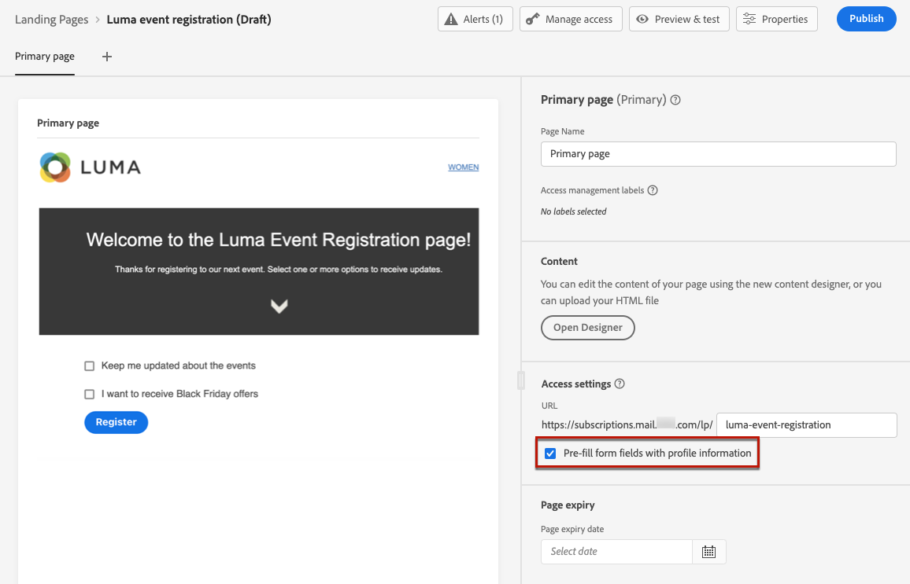

   啟用此選項時，如果設定檔已選擇加入/退出或已新增至訂閱清單，則其選擇會在顯示登入頁面時反映出來。

   例如，如果設定檔已選擇加入以接收有關未來事件的通訊，則下次向該設定檔顯示登入頁面時，將會選取相對應的核取方塊。

   

1. 您可以定義頁面的到期日。 在這種情況下，您必須在頁面到期時選取動作：

   * **[!UICONTROL 重新導向URL]**：輸入當頁面過期時，會將使用者重新導向的頁面URL。
   * **[!UICONTROL 自訂頁面]**： [設定子頁面](#configure-subpages)，並從顯示的下拉式清單中選取它。
   * **[!UICONTROL 瀏覽器錯誤]**：輸入要顯示的錯誤文字，而非頁面。

   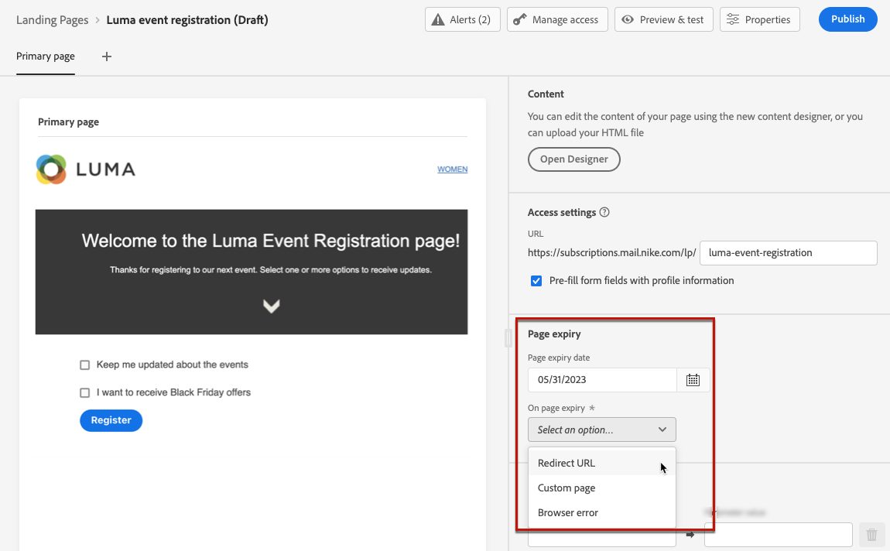

<!--1. In the **[!UICONTROL Additional data]** section, define one or more keys and their corresponding parameter values. You will be able to leverage these keys in the content of your primary page and subpages using the [personalization editor](../personalization/personalization-build-expressions.md). Learn more in [this section](lp-content.md#use-additional-data).

    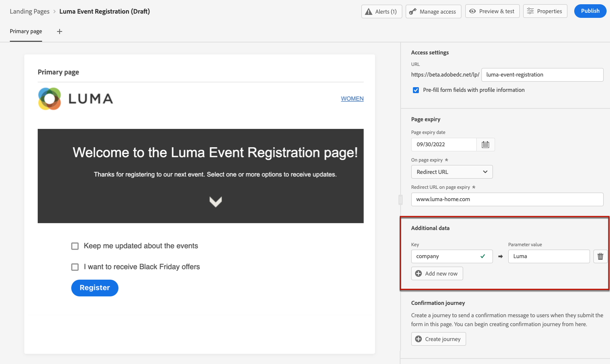-->

1. 如果您在[設計主要頁面](design-lp.md)時選取一或多個訂閱清單，它們會顯示在&#x200B;**[!UICONTROL 訂閱清單]**&#x200B;區段中。

   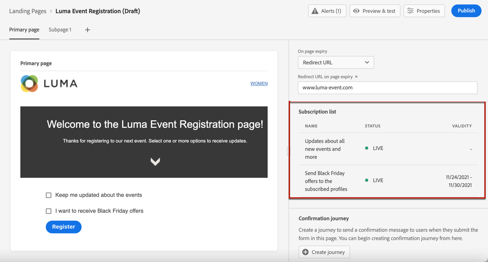

1. 從登入頁面，您可以直接[建立歷程](../building-journeys/journey-gs.md#jo-build)，當使用者提交表單時，歷程會傳送確認訊息給使用者。 瞭解如何在此[使用案例](lp-use-cases.md#subscription-to-a-service)的結尾建立這類歷程。

   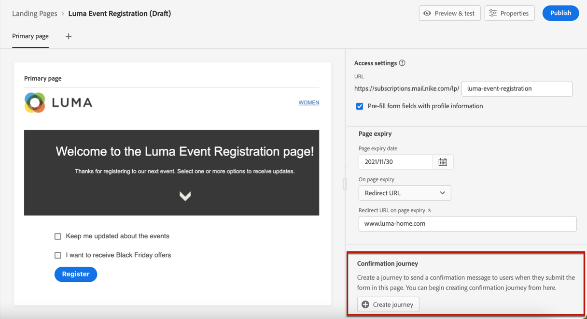

   按一下&#x200B;**[!UICONTROL 建立歷程]**&#x200B;以重新導向至&#x200B;**[!UICONTROL 歷程管理]** > **[!UICONTROL 歷程]**&#x200B;清單。

## 設定子頁面 {#configure-subpages}

>[!CONTEXTUALHELP]
>id="ajo_lp_subpage"
>title="定義子頁面設定"
>abstract="您最多可新增 2 個子頁面。例如，您可以建立一個「感謝」頁面，該頁面將在使用者提交表單後顯示，而且您可以定義一個錯誤頁面，如果登陸頁面出現問題，將呼叫該頁面。"
>additional-url="https://experienceleague.adobe.com/zh-hant/docs/journey-optimizer/using/content-management/landing-pages/landing-pages-design/design-lp" text="設計登陸頁面內容"

>[!CONTEXTUALHELP]
>id="ajo_lp_access_settings-subpage"
>title="定義您的登陸頁面 URL"
>abstract="在本區段中，定義一個唯一的登陸頁面 URL。URL 的第一部分需要您預先設定一個登陸頁面子網域作為您選取的預設集的一部分。"
>additional-url="https://experienceleague.adobe.com/docs/journey-optimizer/using/content-management/landing-pages/lp-configuration/lp-subdomains.html?lang=zh-Hant" text="設定登陸頁面子網域"
>additional-url="https://experienceleague.adobe.com/docs/journey-optimizer/using/content-management/landing-pages/lp-configuration/lp-presets.html?lang=zh-Hant#lp-create-preset" text="建立登陸頁面預設集"

您最多可新增 2 個子頁面。例如，您可以建立一個「感謝」頁面，該頁面將在使用者提交表單後顯示，而且您可以定義一個錯誤頁面，如果登陸頁面出現問題，將呼叫該頁面。

若要定義子頁面設定，請遵循下列步驟。

1. 您可以變更頁面名稱，預設為&#x200B;**[!UICONTROL 子頁面1]**。

1. 使用內容設計工具編輯頁面的內容。 在[此處](design-lp.md)瞭解如何定義登入頁面內容。

   >[!NOTE]
   >
   >您可以從相同登入頁面的任何子頁面插入主要頁面的連結。 例如，若要重新導向發生錯誤而想要再次訂閱的使用者，您可以從確認子頁面新增連結至訂閱主要頁面。 瞭解如何在[本節](../email/message-tracking.md#insert-links)中插入連結。

1. 定義您的登陸頁面URL。 URL的第一部分要求您先前設定登陸頁面子網域。 [了解更多](../landing-pages/lp-subdomains.md)

   >[!CAUTION]
   >
   >登陸頁面URL必須是唯一的。
   >
   >您無法將此URL複製並貼至網頁瀏覽器，即使已發佈，仍無法存取您的子頁面。 您可以改用預覽函式來測試，如[此區段](#test-landing-page)中所述。

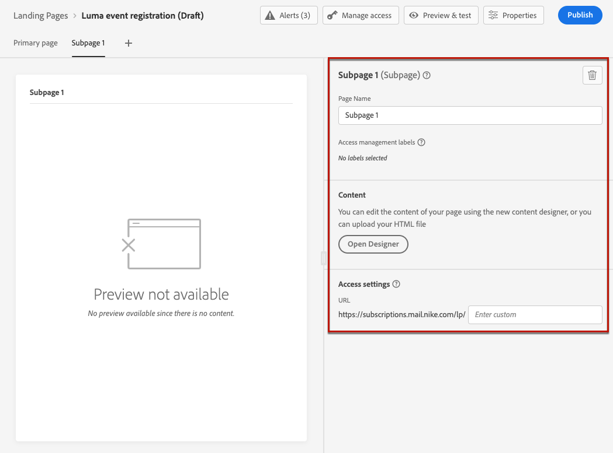

## 測試登陸頁面 {#test-landing-page}

>[!CONTEXTUALHELP]
>id="ac_preview_lp_profiles"
>title="預覽和測試您的登陸頁面"
>abstract="定義登陸頁面設定和內容後，您就可以使用測試設定檔進行預覽。"
>additional-url="https://experienceleague.adobe.com/docs/journey-optimizer/using/audiences-profiles-identities/profiles/creating-test-profiles.html?lang=zh-Hant" text="選取測試輪廓"

定義登入頁面設定和內容後，您就可以使用測試設定檔來預覽。 如果您已插入[個人化內容](../personalization/personalize.md)，您可以使用測試設定檔資料檢查此內容在登入頁面中的顯示方式。

>[!CAUTION]
>
>若要能夠測試登入頁面，您必須擁有&#x200B;**[!UICONTROL 發佈訊息]**&#x200B;許可權。
>
>您必須有可用的測試設定檔，才能預覽訊息和傳送校樣。 瞭解如何[建立測試設定檔](../audience/creating-test-profiles.md)。

1. 從登入頁面介面，按一下&#x200B;**[!UICONTROL 模擬內容]**&#x200B;按鈕以存取測試設定檔選項。

   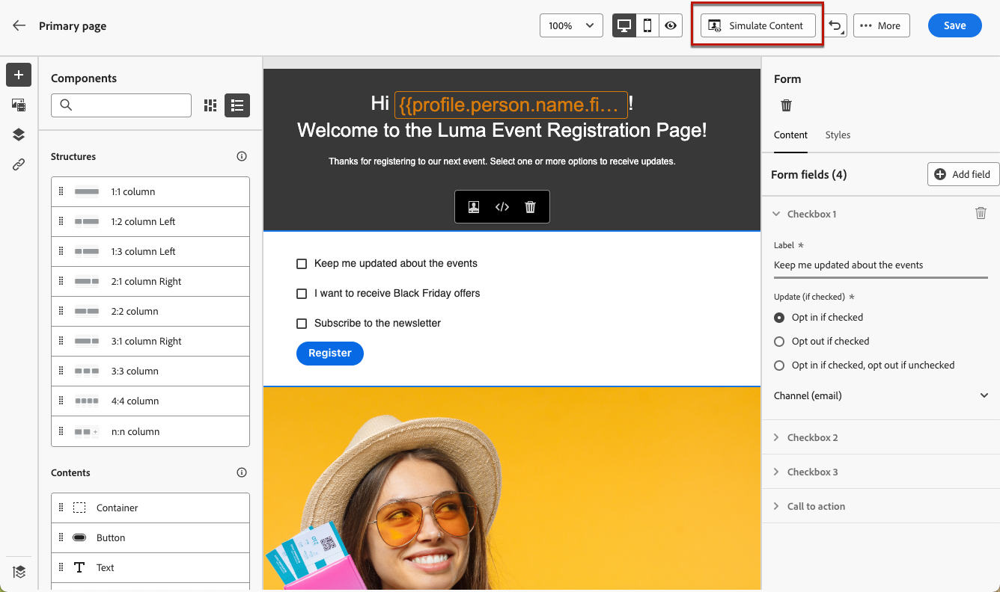

   >[!NOTE]
   >
   >也可以從內容設計工具存取&#x200B;**[!UICONTROL 模擬內容]**&#x200B;按鈕。

1. 從&#x200B;**[!UICONTROL 模擬]**&#x200B;畫面中，選取一或多個測試設定檔。

   

   選取測試設定檔的步驟與測試訊息時相同。 在[內容管理](../content-management/test-profiles.md)區段中會詳細說明這些專案。

1. 選取&#x200B;**[!UICONTROL 開啟預覽]**&#x200B;以測試您的登陸頁面。

   

1. 登入頁面的預覽會在新標籤中開啟。 個人化元素會由選取的測試設定檔資料取代。

   <!---->

1. 選取其他測試設定檔以預覽登陸頁面每個變體的呈現。

## 檢查警報 {#check-alerts}

當您建立登入頁面時，發佈之前必須執行重要動作時，系統會發出警告。

警示會顯示在畫面的右上方，如下所示：

>[!NOTE]
>
>如果您沒有看到此按鈕，則表示未偵測到任何警報。

可能會發生兩種型別的警報：

* **警告**&#x200B;參考建議和最佳實務。<!--For example, a message will display if -->

* **錯誤**&#x200B;只要尚未解決，您就無法發佈登入頁面。 例如，如果缺少主要頁面URL，您會收到警告。

<!--All possible warnings and errors are detailed [below](#alerts-and-warnings).-->

>[!CAUTION]
>
> 您必須先解決所有&#x200B;**錯誤**&#x200B;警示，才能發佈。

<!--The settings and elements checked by the system are listed below. You will also find information on how to adapt your configuration to resolve the corresponding issues.

**Warnings**:

* 

**Errors**:

-->

## 發佈登陸頁面 {#publish-landing-page}

>[!CAUTION]
>
>若要發佈登入頁面，使用者必須擁有&#x200B;**[!UICONTROL 發佈訊息]**&#x200B;許可權。

一旦登入頁面準備就緒後，您就可以發佈該頁面，以供訊息使用。

>[!CAUTION]
>
>發佈之前，請先檢查並解決警報。 [了解更多](#check-alerts)

您的登入頁面發佈後，會以&#x200B;**[!UICONTROL 已發佈]**&#x200B;狀態新增至登入頁面清單。

它現在已上線並準備好用於將透過[!DNL Journey Optimizer]歷程[傳送的](../building-journeys/journey.md)訊息中。

>[!NOTE]
>
>您無法將建立頁面[時所定義的URL複製貼入網頁瀏覽器，即使已發佈，也無法存取您的登入頁面。 &#x200B;](#create-landing-page)您可以改用預覽函式來測試，如[此區段](#test-landing-page)中所述。

您可以透過特定報告監控您的登入頁面影響。 [了解更多](../reports/lp-report-live.md)
