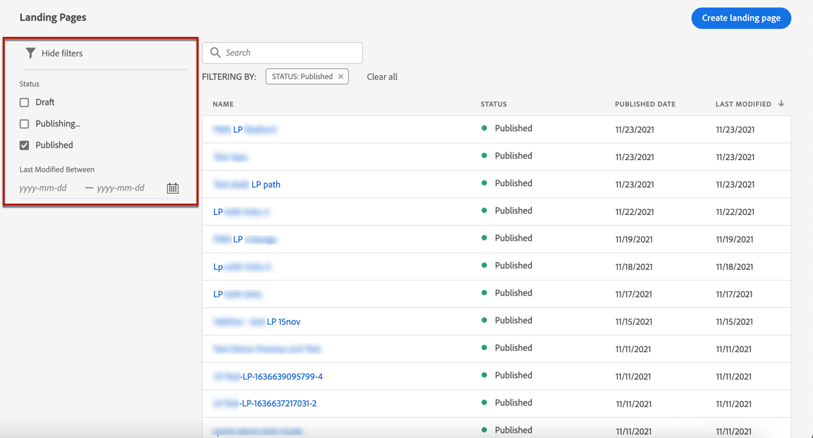
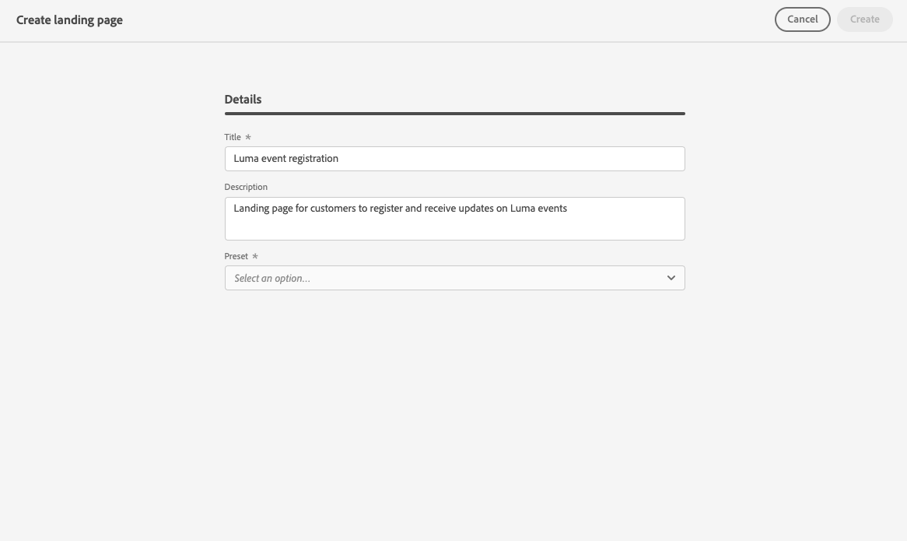
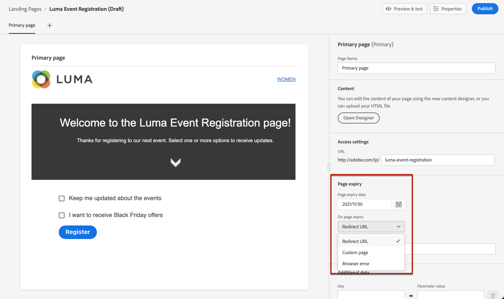

# 建立和發佈登錄頁面 {#create-lp}

>[!CAUTION]
>
>登錄頁面目前僅供選取使用者提早存取。 如果您想要運用此功能，請連絡您的Adobe客戶主管。

## 存取登錄頁面

若要存取登錄頁面清單，請選取 **[!UICONTROL Journey Management]** > **[!UICONTROL Landing pages]** 的上界。

此 **[!UICONTROL Landing Pages]** 清單會顯示所有已建立的項目。 您可以根據狀態或修改日期來篩選這些變數。

## 設定登陸頁面

建立登錄頁面的步驟如下。

1. 在登錄頁面清單中，按一下 **[!UICONTROL Create landing page]**.

   

1. 新增標題。 您可以視需要新增說明。

   

1. 按一下「**[!UICONTROL Create]**」。

1. 主要頁面及其屬性隨即顯示。 了解如何配置頁面設定 [此處](#configure-primary-page).

   

1. 按一下+圖示以新增子頁面。 了解如何配置其設定 [此處](#configure-subpages).

   

在您設定並設計 [主要頁面](#configure-primary-page) 和 [子頁面](#configure-subpages) 若有，您可以 [測試](#test) 和 [發佈](#publish) 您的登錄頁面。

## 設定主要頁面 {#configure-primary-page}

主要頁面是使用者按一下登陸頁面的連結時（例如來自電子郵件或網站的連結）會立即顯示給他們的頁面。

若要定義主要頁面設定，請遵循下列步驟。

1. 您可以變更頁面名稱，即 **[!UICONTROL Primary page]** 依預設。

1. 使用內容設計工具編輯頁面的內容。 了解如何設計登錄頁面內容 [此處](design-lp.md).

   

1. 定義您的登錄頁面URL。

   >[!CAUTION]
   >
   >登錄頁面URL必須是唯一的。

   

   URL的第一部分已預填，無法透過使用者介面編輯。 若要設定，請連絡您的Adobe帳戶代表，或 [Adobe客戶服務支援團隊](https://helpx.adobe.com/tw/enterprise/admin-guide.html/enterprise/using/support-for-experience-cloud.ug.html){target=&quot;_blank&quot;}。

1. 您可以定義頁面的到期日。 在此情況下，您必須在頁面過期時選取動作：

   * **[!UICONTROL Redirect URL]**:輸入頁面過期時，系統會將使用者重新導向至的頁面URL。
   * **[!UICONTROL Custom page]**: [設定子頁面](#configure-subpages) 並從顯示的下拉式清單中選取。
   * **[!UICONTROL Browser error]**:輸入將顯示的錯誤文本，而非頁面。

   

   <!--1. In the **[!UICONTROL Additional data]** section, define a **[!UICONTROL Key]** and the corresponding **[!UICONTROL Parameter value]**. // you can define how the data entered in the landing page is managed once it has been submitted by a user??-->

1. 如果您為主要頁面選取一或多個訂閱清單，這些訂閱清單會顯示在 **[!UICONTROL Subscription list]** 區段。

   

1. 從登錄頁面，您可以直接建立歷程，在使用者提交表單時，傳送確認訊息給使用者。

   

   按一下 **[!UICONTROL Create journey]** 開始 [設定此歷程](../building-journeys/journey-gs.md#jo-build). 系統會將您重新導向至 **[!UICONTROL Journey Management]** > **[!UICONTROL Journeys]** 清單。

## 設定子頁面 {#configure-subpages}

您可以視需要新增多個子頁面。 例如，您可以建立感謝頁面，在使用者提交表單後就會顯示。 您也可以定義錯誤頁面，當登錄頁面發生錯誤時，將呼叫該錯誤頁面。

若要定義子頁面設定，請遵循下列步驟。

1. 您可以變更頁面名稱，即 **[!UICONTROL Subpage 1]** 依預設。

1. 使用內容設計工具編輯頁面的內容。 了解如何設計登錄頁面內容 [此處](design-lp.md).

1. 定義您的登錄頁面URL。

   URL的第一部分已預填，無法透過使用者介面編輯。 若要設定，請連絡您的Adobe帳戶代表，或 [Adobe客戶服務支援團隊](https://helpx.adobe.com/enterprise/admin-guide.html/enterprise/using/support-for-experience-cloud.ug.html){target=&quot;_blank&quot;}。

   >[!CAUTION]
   >
   >登錄頁面URL必須是唯一的。

## 測試登錄頁面 {#test}

定義登錄頁面設定和內容後，您就可以使用測試設定檔來預覽。 如果您已插入 [個人化內容](../personalization/personalize.md)，您將可以運用測試設定檔資料，檢查此內容在登錄頁面中的顯示方式。

>[!CAUTION]
>
>您必須有可用的測試設定檔，才能預覽訊息並傳送校樣。 了解如何在 [本頁](../building-journeys/creating-test-profiles.md).

1. 在登錄頁面介面或內容設計器中，按一下 **[!UICONTROL Preview & test]** 按鈕來存取測試設定檔選取項目。

   

1. 選取一或多個測試設定檔。

   

   選取測試設定檔的步驟與測試訊息時的步驟相同。 詳細資訊於 [本節](../preview.md#select-test-profiles).

1. 按一下 **[!UICONTROL Preview]** 標籤來測試您的登錄頁面。

   <!---->

1. 個人化元素會由選取的測試設定檔資料取代。 選取其他測試設定檔，以預覽登錄頁面每個變體的呈現。

## 檢查警報 {#alerts}

建立登錄頁面時，當您在發佈前需要採取重要動作時，會發出警告。

警報會顯示在畫面右上方，如下所示：

>[!NOTE]
>
>如果未看到此按鈕，則未檢測到任何警報。

可能會發生兩種警報：

* **警告** 請參閱建議和最佳實務。 <!--For example, a message will display if -->

* **錯誤** 只要訊息未解決，就無法發佈訊息。 例如，訊息會警告您主要頁面URL遺失。

<!--All possible warnings and errors are detailed [below](#alerts-and-warnings).-->

>[!CAUTION]
>
> 你需要解決所有 **錯誤** 發佈前發出警報。

<!--The settings and elements checked by the system are listed below. You will also find information on how to adapt your configuration to resolve the corresponding issues.

**Warnings**:

* 

**Errors**:

* 

>[!CAUTION]
>
> To be able to publish your message, you need to resolve all **error** alerts.
-->

## 發佈登錄頁面 {#publish}

當您的登錄頁面準備就緒後，您可以發佈它，以便用於訊息或網站。

>[!CAUTION]
>
>發佈前，請檢查並解決警報。 [了解更多](#alerts)

登錄頁面發佈後，就會以 **[!UICONTROL Published]** 狀態。

它現在已上線，且連結可供 [訊息](../create-message.md) 並透過 [歷程](../building-journeys/journey.md).
