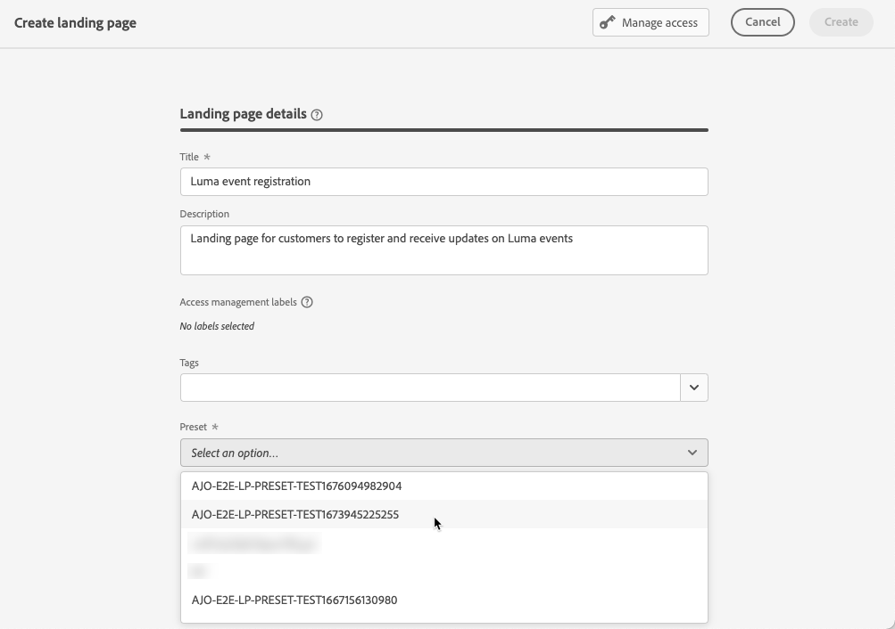

# 建立和發佈登錄頁面 {#create-lp}

## 存取登錄頁面 {#access-landing-pages}

若要存取登錄頁面清單，請選取 **[!UICONTROL 歷程管理]** > **[!UICONTROL 登錄頁面]** 的上界。

此 **[!UICONTROL 登錄頁面]** 清單會顯示所有已建立的項目。 您可以根據狀態或修改日期來篩選這些變數。

從此清單，您可以存取 [登陸頁面即時報表](../reports/lp-report-live.md) 或 [登陸頁面全域報表](../reports/lp-report-global.md) 的URL。

您也可以刪除、複製和取消發佈登錄頁面。

>[!CAUTION]
>
>如果您取消發佈訊息中參考的登錄頁面，登陸頁面的連結將會損毀，並顯示錯誤頁面。

按一下登錄頁面旁的三個點，以選取所需的動作。

>[!NOTE]
>
>您無法刪除 [已發佈](#publish-landing-page) 登陸頁面。 若要刪除，您必須先取消發佈。

## 建立登陸頁面 {#create-landing-page}

>[!CONTEXTUALHELP]
>id="ajo_lp_create"
>title="定義並設定登錄頁面"
>abstract="若要建立登錄頁面，您需要選取預設集，然後設定主要頁面和子頁面，最後在發佈頁面之前測試頁面。"
>additional-url="https://experienceleague.adobe.com/docs/journey-optimizer/using/configuration/lp-configuration/lp-presets.html#lp-create-preset" text="建立登錄頁面預設集"
>additional-url="https://experienceleague.adobe.com/docs/journey-optimizer/using/landing-pages/create-lp.html#publish-landing-page" text="發佈登錄頁面"

建立登錄頁面的步驟如下。

1. 在登錄頁面清單中，按一下 **[!UICONTROL 建立登錄頁面]**.

   

1. 新增標題。 您可以視需要新增說明。

   

1. 若要將自訂或核心資料使用量標籤指派至登陸頁面，請選取 **[!UICONTROL 管理存取]**. [進一步了解物件層級存取控制(OLAC)](../administration/object-based-access.md)

   <!--You can add a tag. See AEP documentation?-->

1. 選取預設集。 了解如何在中建立登錄頁面預設集 [本節](../configuration/lp-presets.md#lp-create-preset).

   

1. 按一下&#x200B;**[!UICONTROL 建立]**。

1. 主要頁面及其屬性隨即顯示。 了解如何設定主要頁面設定 [此處](#configure-primary-page).

   

1. 按一下+圖示以新增子頁面。 了解如何設定子頁面設定 [此處](#configure-subpages).

   

在您設定並設計 [主要頁面](#configure-primary-page)，和 [子頁面](#configure-subpages) 若有，您可以 [測試](#test-landing-page) 和 [發佈](#publish-landing-page) 您的登錄頁面。

## 設定主要頁面 {#configure-primary-page}

>[!CONTEXTUALHELP]
>id="ajo_lp_primary_page"
>title="定義主要頁面設定"
>abstract="使用者點按登錄頁面的連結（例如來自電子郵件或網站）後，主要頁面會立即顯示給使用者。"
>additional-url="https://experienceleague.adobe.com/docs/journey-optimizer/using/landing-pages/landing-pages-design/design-lp.html" text="設計登錄頁面內容"

>[!CONTEXTUALHELP]
>id="ajo_lp_access_settings"
>title="定義登錄頁面URL"
>abstract="在本節中，定義唯一的登錄頁面URL。 URL的第一部分需要您先前設定登錄頁面子網域，作為您選取之預設集的一部分。"
>additional-url="https://experienceleague.adobe.com/docs/journey-optimizer/using/configuration/lp-configuration/lp-subdomains.html" text="設定登陸頁面子網域"
>additional-url="https://experienceleague.adobe.com/docs/journey-optimizer/using/configuration/lp-configuration/lp-presets.html#lp-create-preset" text="建立登錄頁面預設集"

主要頁面是使用者點按登錄頁面的連結（例如來自電子郵件或網站）後，立即顯示給他們的頁面。

若要定義主要頁面設定，請遵循下列步驟。

1. 您可以變更頁面名稱，即 **[!UICONTROL 主要頁面]** 依預設。

1. 使用內容設計工具編輯頁面的內容。 了解如何定義登錄頁面內容 [此處](design-lp.md).

   

1. 定義您的登錄頁面URL。 URL的第一部分需要您先前設定登錄頁面子網域，作為 [預設集](../configuration/lp-presets.md#lp-create-preset) 您已選取。 [了解更多](../configuration/lp-subdomains.md)

   >[!CAUTION]
   >
   >登錄頁面URL必須是唯一的。

   

   >[!NOTE]
   >
   >您無法只將此URL複製貼入網頁瀏覽器，即使已發佈亦然，以存取登錄頁面。 反之，您可以使用預覽函式來測試，如 [本節](#test-landing-page).

1. 如果您希望登錄頁面預先載入已可用的表單資料，請選取 **[!UICONTROL 使用設定檔資訊預先填寫表單欄位]**.

   

   啟用此選項時，如果設定檔已選擇加入/退出或已新增至訂閱清單，則顯示登錄頁面時會反映其選擇。

   例如，如果設定檔已選擇接收有關未來事件的通訊，則下次將登錄頁面顯示給該設定檔時，將會選取對應的核取方塊。

   

1. 您可以定義頁面的到期日。 在此情況下，您必須在頁面過期時選取動作：

   * **[!UICONTROL 重新導向URL]**:輸入頁面過期時，系統會將使用者重新導向至的頁面URL。
   * **[!UICONTROL 自訂頁面]**: [設定子頁面](#configure-subpages) 並從顯示的下拉式清單中選取。
   * **[!UICONTROL 瀏覽器錯誤]**:輸入將顯示的錯誤文本，而非頁面。

   

1. 在 **[!UICONTROL 其他資料]** 部分，定義一個或多個鍵及其相應的參數值。 您將能在主要頁面和子頁面的內容中，運用這些索引鍵，使用 [運算式編輯器](../personalization/personalization-build-expressions.md). 請參閱[此章節](lp-content.md#use-form-component#use-additional-data)深入瞭解。

   

1. 如果您在 [設計主要頁面](design-lp.md)，則會顯示在 **[!UICONTROL 訂閱清單]** 區段。

   

1. 從登錄頁面，您可以直接 [建立歷程](../building-journeys/journey-gs.md#jo-build) 會在使用者提交表單時傳送確認訊息給使用者。 了解如何在此結尾建立此類歷程 [使用案例](lp-use-cases.md#subscription-to-a-service).

   

   按一下 **[!UICONTROL 建立歷程]** 被重定向到 **[!UICONTROL 歷程管理]** > **[!UICONTROL 歷程]** 清單。

## 設定子頁面 {#configure-subpages}

>[!CONTEXTUALHELP]
>id="ajo_lp_subpage"
>title="定義子頁面設定"
>abstract="您最多可以新增2個子頁面。 例如，您可以建立「感謝」頁面，在使用者提交表單後顯示，而您可以定義錯誤頁面，在登錄頁面發生問題時呼叫該錯誤頁面。"
>additional-url="https://experienceleague.adobe.com/docs/journey-optimizer/using/landing-pages/landing-pages-design/design-lp.html" text="設計登錄頁面內容"

>[!CONTEXTUALHELP]
>id="ajo_lp_access_settings-subpage"
>title="定義登錄頁面URL"
>abstract="在本節中，定義唯一的登錄頁面URL。 URL的第一部分需要您先前設定登錄頁面子網域，作為您選取之預設集的一部分。"
>additional-url="https://experienceleague.adobe.com/docs/journey-optimizer/using/configuration/lp-configuration/lp-subdomains.html" text="設定登陸頁面子網域"
>additional-url="https://experienceleague.adobe.com/docs/journey-optimizer/using/configuration/lp-configuration/lp-presets.html#lp-create-preset" text="建立登錄頁面預設集"

您最多可以新增2個子頁面。 例如，您可以建立「感謝」頁面，在使用者提交表單後顯示，而您可以定義錯誤頁面，在登錄頁面發生問題時呼叫該錯誤頁面。

若要定義子頁面設定，請遵循下列步驟。

1. 您可以變更頁面名稱，即 **[!UICONTROL 子頁面1]** 依預設。

1. 使用內容設計工具編輯頁面的內容。 了解如何定義登錄頁面內容 [此處](design-lp.md).

   >[!NOTE]
   >
   >您可以從相同登錄頁面的任何子頁面插入主要頁面的連結。 例如，若要將發生錯誤且想要重新訂閱的使用者重新導向，您可以從確認子頁面新增連結至訂閱主要頁面。 了解如何在 [本節](../design/message-tracking.md#insert-links).

1. 定義您的登錄頁面URL。 URL的第一部分需要您先前設定登錄頁面子網域。 [了解更多](../configuration/lp-subdomains.md)

   >[!CAUTION]
   >
   >登錄頁面URL必須是唯一的。

## 測試登錄頁面 {#test-landing-page}

定義登錄頁面設定和內容後，您就可以使用測試設定檔來預覽。 如果您已插入 [個人化內容](../personalization/personalize.md)，您將可以運用測試設定檔資料，檢查此內容在登錄頁面中的顯示方式。

>[!CAUTION]
>
>您必須有可用的測試設定檔，才能預覽訊息並傳送校樣。 了解如何 [建立測試設定檔](../segment/creating-test-profiles.md).

1. 在登錄頁面介面中，按一下 **[!UICONTROL 預覽和測試]** 按鈕來存取測試設定檔選取項目。

   

   >[!NOTE]
   >
   >此 **[!UICONTROL 預覽]** 按鈕也可從內容設計器存取。

1. 從 **[!UICONTROL 預覽和測試]** 螢幕上，選取一或多個測試設定檔。

   

   選取測試設定檔的步驟與測試訊息時的步驟相同。 詳細資訊於 [本節](../design/preview.md#select-test-profiles).

1. 選取 **[!UICONTROL 預覽]** 按一下 **[!UICONTROL 開啟預覽]** 來測試您的登錄頁面。

   

1. 登錄頁面的預覽會在新索引標籤中開啟。 個人化元素會由選取的測試設定檔資料取代。

   

1. 選取其他測試設定檔，以預覽登錄頁面每個變體的呈現。

## 檢查警報 {#check-alerts}

建立登錄頁面時，當您必須在發佈前採取重要動作時，系統會發出警告。

警報會顯示在畫面右上方，如下所示：

>[!NOTE]
>
>如果未看到此按鈕，則未檢測到任何警報。

可能會發生兩種警報：

* **警告** 請參閱建議和最佳實務。 <!--For example, a message will display if -->

* **錯誤** 只要登錄頁面未解析，就無法加以發佈。 例如，如果主要頁面URL遺失，則會收到警告。

<!--All possible warnings and errors are detailed [below](#alerts-and-warnings).-->

>[!CAUTION]
>
> 您必須解決所有 **錯誤** 發佈前發出警報。

<!--The settings and elements checked by the system are listed below. You will also find information on how to adapt your configuration to resolve the corresponding issues.

**Warnings**:

* 

**Errors**:

* 

>[!CAUTION]
>
> To be able to publish your message, you must resolve all **error** alerts.
-->

## 發佈登錄頁面 {#publish-landing-page}

登錄頁面準備就緒後，您就可以發佈它，以便在訊息中使用。

>[!CAUTION]
>
>發佈前，請檢查並解決警報。 [了解更多](#check-alerts)

登錄頁面發佈後，就會以 **[!UICONTROL 已發佈]** 狀態。

它現在已上線，且已準備好用於 [!DNL Journey Optimizer] [訊息](../messages/get-started-content.md) 會透過 [歷程](../building-journeys/journey.md).

>[!NOTE]
>
>您可以透過特定報告來監控登錄頁面的影響。 [了解更多](../reports/lp-report-live.md)

