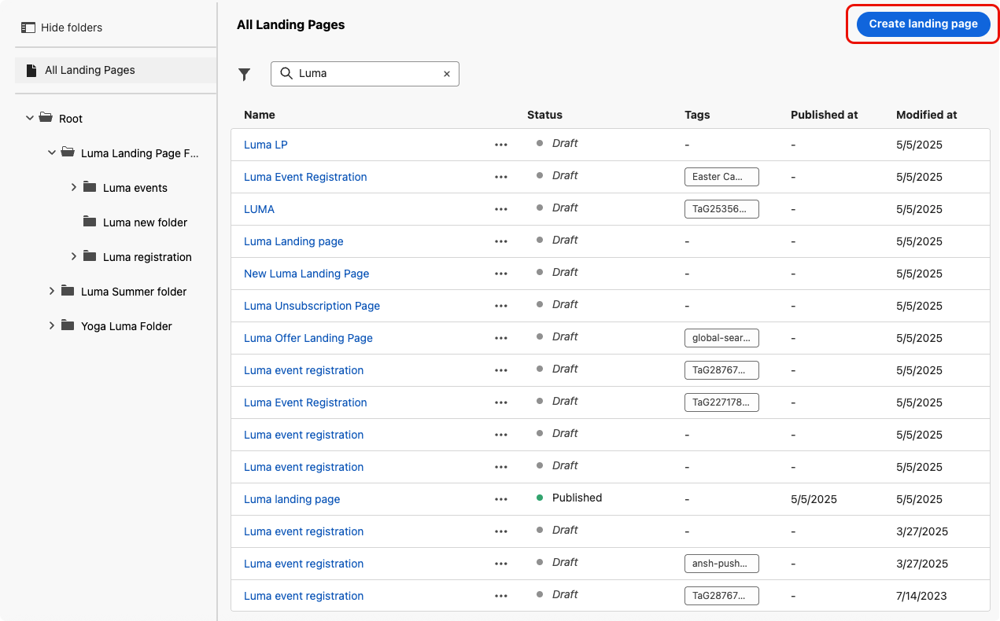

# 建立並發佈登入頁面 {#create-lp}

>[!CAUTION]
>
>若要能夠測試和發佈登入頁面，您必須擁有 **[!UICONTROL 發佈訊息]** 許可權。

## 存取登入頁面 {#access-landing-pages}

若要存取登入頁面清單，請選取「 」 **[!UICONTROL 歷程管理]** > **[!UICONTROL 登陸頁面]** 從左側功能表。

此 **[!UICONTROL 登陸頁面]** 清單會顯示所有已建立的專案。 您可以根據它們的狀態或修改日期來篩選它們。

從此清單，您可以存取 [登陸頁面即時報告](../reports/lp-report-live.md) 或 [登陸頁面全域報告](../reports/lp-report-global.md) （已發佈專案）。

您也可以刪除、複製和取消發佈登入頁面。

>[!CAUTION]
>
>如果您取消發佈訊息中參照的登入頁面，則連結至登入頁面的連結會中斷，並顯示錯誤頁面。

按一下登入頁面旁的三個點，以選取所需的動作。

>[!NOTE]
>
>您無法刪除 [已發佈](#publish-landing-page) 登陸頁面。 若要刪除它，您必須先取消發佈。

## 建立登陸頁面 {#create-landing-page}

>[!CONTEXTUALHELP]
>id="ajo_lp_create"
>title="定義和設定您的登陸頁面"
>abstract="若要建立登陸頁面，您需要選取一個預設集，然後設定主要頁面和子頁面，最後在發佈頁面之前進行測試。"
>additional-url="https://experienceleague.adobe.com/docs/journey-optimizer/using/landing-pages/lp-configuration/lp-presets.html#lp-create-preset" text="建立登陸頁面預設集"
>additional-url="https://experienceleague.adobe.com/docs/journey-optimizer/using/landing-pages/create-lp.html#publish-landing-page" text="發佈登陸頁面"

>[!CONTEXTUALHELP]
>id="ajo_lp_access_management_labels"
>title="為您的登陸頁面指派標籤"
>abstract="為了保護敏感的數位資產，您可以定義授權，以使用標籤來管理對登陸頁面的資料存取。"
>additional-url="https://experienceleague.adobe.com/docs/journey-optimizer/using/access-control/object-based-access.html" text="物件等級存取控制"

建立登入頁面的主要步驟如下：

1. 從登入頁面清單中，按一下 **[!UICONTROL 建立登陸頁面]**.

   

1. 新增標題。 您可以視需要新增說明。

   

1. 若要將自訂或核心資料使用標籤指派給登陸頁面，請選取 **[!UICONTROL 管理存取權]**. [進一步瞭解物件層級存取控制(OLAC)](../administration/object-based-access.md)

   <!--You can add a tag. See AEP documentation?-->

1. 選取預設集。 瞭解如何在中建立登入頁面預設集 [本節](../landing-pages/lp-presets.md#lp-create-preset).

   

1. 按一下&#x200B;**[!UICONTROL 建立]**。

1. 主要頁面及其屬性隨即顯示。 瞭解如何設定主要頁面設定 [此處](#configure-primary-page).

   

1. 按一下+圖示以新增子頁面。 瞭解如何設定子頁面設定 [此處](#configure-subpages).

   

設定並設計 [主要頁面](#configure-primary-page)，以及 [子頁面](#configure-subpages) 如果有的話，您可以 [測試](#test-landing-page) 和 [發佈](#publish-landing-page) 您的登陸頁面。

## 設定主要頁面 {#configure-primary-page}

>[!CONTEXTUALHELP]
>id="ajo_lp_primary_page"
>title="定義您的主要頁面設定"
>abstract="使用者點選您的登陸頁面連結 (例如從電子郵件或網站) 後，主要頁面會隨即向使用者顯示。"
>additional-url="https://experienceleague.adobe.com/docs/journey-optimizer/using/landing-pages/landing-pages-design/design-lp.html" text="設計登陸頁面內容"

>[!CONTEXTUALHELP]
>id="ajo_lp_access_settings"
>title="定義您的登陸頁面 URL"
>abstract="在本區段中，定義一個唯一的登陸頁面 URL。URL 的第一部分需要您預先設定一個登陸頁面子網域作為您選取的預設集的一部分。"
>additional-url="https://experienceleague.adobe.com/docs/journey-optimizer/using/landing-pages/lp-configuration/lp-subdomains.html" text="設定登陸頁面子網域"
>additional-url="https://experienceleague.adobe.com/docs/journey-optimizer/using/landing-pages/lp-configuration/lp-presets.html#lp-create-preset" text="建立登陸頁面預設集"

主要頁面是使用者點按登陸頁面連結後（例如從電子郵件或網站）立即顯示給使用者的頁面。

若要定義主要頁面設定，請遵循下列步驟。

1. 您可以變更頁面名稱，即 **[!UICONTROL 主要頁面]** 依預設。

1. 使用內容設計工具編輯頁面的內容。 瞭解如何定義登入頁面內容 [此處](design-lp.md).

   

1. 定義您的登陸頁面 URL. URL的第一部分要求您先前將登陸頁面子網域設定為 [預設集](../landing-pages/lp-presets.md#lp-create-preset) 您已選取。 [了解更多](../landing-pages/lp-subdomains.md)

   >[!CAUTION]
   >
   >登陸頁面URL必須是唯一的。

   

   >[!NOTE]
   >
   >您無法將此URL複製貼上至網頁瀏覽器，即使已發佈，仍可存取您的登入頁面。 相反地，您可以使用預覽函式來測試它，如中所述 [本節](#test-landing-page).

1. 如果您希望登入頁面預先載入已可用的表單資料，請選取 **[!UICONTROL 使用設定檔資訊預先填寫表單欄位]**.

   

   啟用此選項時，如果設定檔已選擇加入/退出或已新增至訂閱清單，其選擇將在顯示登入頁面時反映出來。

   例如，如果設定檔已選擇加入以接收有關未來事件的通訊，則下次向該設定檔顯示登入頁面時，將會選取對應的核取方塊。

   

1. 您可以定義頁面的到期日。 在這種情況下，您必須在頁面到期時選取動作：

   * **[!UICONTROL 重新導向URL]**：輸入當頁面過期時，會將使用者重新導向到的頁面URL。
   * **[!UICONTROL 自訂頁面]**： [設定子頁面](#configure-subpages) 並從顯示的下拉式清單中選取它。
   * **[!UICONTROL 瀏覽器錯誤]**：輸入將顯示而非頁面的錯誤文字。

   

1. 在 **[!UICONTROL 其他資料]** 區段，定義一或多個索引鍵及其對應的引數值。 您將能夠使用以下工具在首頁面和子頁面的內容中運用這些金鑰 [運算式編輯器](../personalization/personalization-build-expressions.md). 請參閱[此章節](lp-content.md#use-form-component#use-additional-data)深入瞭解。

   

1. 如果您在下列情況下選取一或多個訂閱清單： [設計主要頁面](design-lp.md)，它們會顯示在 **[!UICONTROL 訂閱清單]** 區段。

   

1. 從登入頁面，您可以直接 [建立歷程](../building-journeys/journey-gs.md#jo-build) 會在使用者提交表單時傳送確認訊息給他們。 瞭解如何在本課程結束時建立這類歷程 [使用案例](lp-use-cases.md#subscription-to-a-service).

   

   按一下 **[!UICONTROL 建立歷程]** 重新導向至 **[!UICONTROL 歷程管理]** > **[!UICONTROL 歷程]** 清單。

## 設定子頁面 {#configure-subpages}

>[!CONTEXTUALHELP]
>id="ajo_lp_subpage"
>title="定義子頁面設定"
>abstract="您最多可新增 2 個子頁面。例如，您可以建立一個「感謝」頁面，該頁面將在使用者提交表單後顯示，而且您可以定義一個錯誤頁面，如果登陸頁面出現問題，將呼叫該頁面。"
>additional-url="https://experienceleague.adobe.com/docs/journey-optimizer/using/landing-pages/landing-pages-design/design-lp.html" text="設計登陸頁面內容"

>[!CONTEXTUALHELP]
>id="ajo_lp_access_settings-subpage"
>title="定義您的登陸頁面 URL"
>abstract="在本區段中，定義一個唯一的登陸頁面 URL。URL 的第一部分需要您預先設定一個登陸頁面子網域作為您選取的預設集的一部分。"
>additional-url="https://experienceleague.adobe.com/docs/journey-optimizer/using/landing-pages/lp-configuration/lp-subdomains.html" text="設定登陸頁面子網域"
>additional-url="https://experienceleague.adobe.com/docs/journey-optimizer/using/landing-pages/lp-configuration/lp-presets.html#lp-create-preset" text="建立登陸頁面預設集"

您最多可新增 2 個子頁面。例如，您可以建立一個「感謝」頁面，該頁面將在使用者提交表單後顯示，而且您可以定義一個錯誤頁面，如果登陸頁面出現問題，將呼叫該頁面。

若要定義子頁面設定，請遵循下列步驟。

1. 您可以變更頁面名稱，即 **[!UICONTROL 子頁面1]** 依預設。

1. 使用內容設計工具編輯頁面的內容。 瞭解如何定義登入頁面內容 [此處](design-lp.md).

   >[!NOTE]
   >
   >您可以從相同登陸頁面的任何子頁面插入主要頁面的連結。 例如，若要重新導向發生錯誤並想要再次訂閱的使用者，您可以從確認子頁面新增連結至訂閱主要頁面。 瞭解如何在中插入連結 [本節](../email/message-tracking.md#insert-links).

1. 定義您的登陸頁面 URL. URL的第一部分要求您先前設定登陸頁面子網域。 [了解更多](../landing-pages/lp-subdomains.md)

   >[!CAUTION]
   >
   >登陸頁面URL必須是唯一的。

## 測試登入頁面 {#test-landing-page}

>[!CONTEXTUALHELP]
>id="ac_preview_lp_profiles"
>title="預覽和測試您的登陸頁面"
>abstract="定義登陸頁面設定和內容後，您就可以使用測試設定檔進行預覽。 "
>additional-url="https://experienceleague.adobe.com/docs/journey-optimizer/using/segment/profiles/creating-test-profiles.html" text="選取測試設定檔"

定義登入頁面設定和內容後，您就可以使用測試設定檔來預覽。 如果您已插入 [個人化內容](../personalization/personalize.md)，您將能使用測試設定檔資料檢查此內容在登入頁面中的顯示方式。

>[!CAUTION]
>
>若要能夠測試登入頁面，您必須擁有 **[!UICONTROL 發佈訊息]** 許可權。
>
>您必須有可用的測試設定檔，才能預覽訊息和傳送校樣。 瞭解如何 [建立測試設定檔](../segment/creating-test-profiles.md).

1. 從登入頁面介面，按一下 **[!UICONTROL 模擬內容]** 按鈕以存取測試設定檔選項。

   

   >[!NOTE]
   >
   >此 **[!UICONTROL 模擬內容]** 按鈕也可以從內容設計工具存取。

1. 從 **[!UICONTROL 模擬]** 畫面，選取一或多個測試設定檔。

   

   選取測試設定檔的步驟與測試訊息時的步驟相同。 如需詳細資訊，請參閱 [本節](../email/preview.md#select-test-profiles).

1. 選取 **[!UICONTROL 開啟預覽]** 以測試您的登入頁面。

   

1. 登入頁面的預覽會在新標籤中開啟。 個人化元素會由選取的測試設定檔資料取代。

   <!---->

1. 選取其他測試設定檔以預覽登陸頁面每個變體的呈現。

## 檢查警報 {#check-alerts}

當您建立登入頁面時，發佈之前必須採取重要動作時，系統會發出警告。

警示會顯示在畫面的右上方，如下所示：

>[!NOTE]
>
>如果您沒有看到此按鈕，則表示未偵測到任何警示。

可能會發生兩種型別的警報：

* **警告** 請參閱建議和最佳實務。 <!--For example, a message will display if -->

* **錯誤** 只要登入頁面未解決，防止您發佈登入頁面。 例如，如果缺少主要頁面URL，您會收到警告。

<!--All possible warnings and errors are detailed [below](#alerts-and-warnings).-->

>[!CAUTION]
>
> 您必須全部解析 **錯誤** 發佈前的警示。

<!--The settings and elements checked by the system are listed below. You will also find information on how to adapt your configuration to resolve the corresponding issues.

**Warnings**:

* 

**Errors**:

* 

>[!CAUTION]
>
> To be able to publish your message, you must resolve all **error** alerts.
-->

## 發佈登陸頁面 {#publish-landing-page}

>[!CAUTION]
>
>若要能夠發佈登入頁面，您必須擁有 **[!UICONTROL 發佈訊息]** 許可權。

一旦登入頁面準備就緒後，您就可以發佈該頁面，以供訊息使用。

>[!CAUTION]
>
>發佈之前，請先檢查並解決警報。 [了解更多](#check-alerts)

您的登入頁面發佈後，會透過新增至登入頁面清單 **[!UICONTROL 已發佈]** 狀態。

它現在已上線，並準備好用於 [!DNL Journey Optimizer] 將透過 [歷程](../building-journeys/journey.md).

>[!NOTE]
>
>您可以透過特定報告監控您的登入頁面影響。 [了解更多](../reports/lp-report-live.md)

