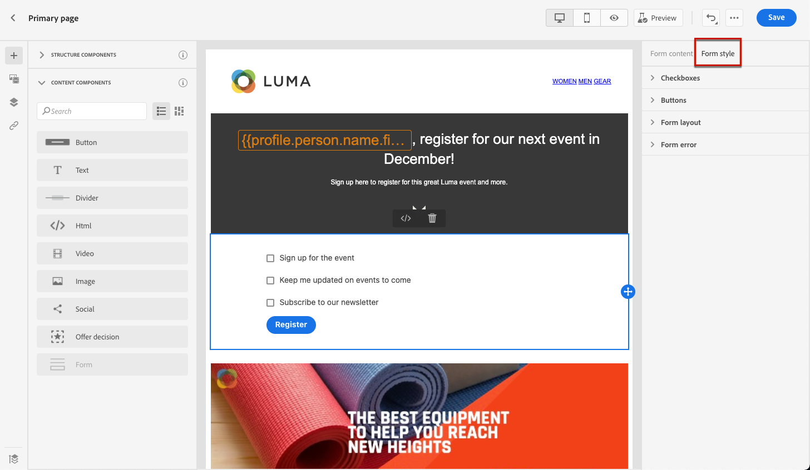

# 設計登錄頁面內容 {#design-lp-content}

若要開始建立登錄內容 [主要頁面](create-lp.md#configure-primary-page) 或 [子頁面](create-lp.md#configure-subpages)，將滑鼠移至主要頁面內容上，然後按一下 **[!UICONTROL Open Designer]**. 您也可以按一下右側浮動視窗中對應的按鈕。

從那裡，您可以：

* **從草稿開始設計您的登錄頁面** 透過內容設計工具的介面，並運用 [Adobe Experience Manager Assets Essentials](../assets-essentials.md). 了解如何設計內容或使用內建範本 [在本節](../create-email-content.md).

* **程式碼或貼上原始HTML** 直接進入內容設計工具。 了解如何編寫您自己的內容 [在本節](../existing-content.md#import-raw-html-code).

* **匯入現有HTML內容** 或.zip資料夾。 了解如何匯入內容 [在本節](../existing-content.md#import-html-content-from-file).

>[!NOTE]
>
>登錄頁面內容設計工具大多與電子郵件設計工具類似。 深入了解 [設計內容 [!DNL Journey Optimizer]](../design-emails.md).

## 定義登錄頁面特定內容 {#define-lp-specific-content}

若要定義特定內容，讓使用者從您的登錄頁面選取並提交其選擇，請遵循下列步驟。

1. 拖放登錄頁面專用 **[!UICONTROL Form]** 元件從左側浮動視窗移入主工作區。

   

   >[!NOTE]
   >
   >此 **[!UICONTROL Form]** 元件在相同頁面上只能使用一次。

1. 請選取模式。此 **[!UICONTROL Form content]** 標籤會顯示在右側浮動視窗中，讓您編輯表單的不同欄位。

   

   >[!NOTE]
   >
   >切換至 **[!UICONTROL Form style]** 頁簽，隨時編輯表單元件內容的樣式。 [了解更多](#define-lp-styles)

1. 從 **[!UICONTROL Checkbox 1]** 區段中，您可以編輯與此核取方塊對應的標籤。

1. 定義此核取方塊是要選擇使用者加入或退出：他們是否同意接收通信？還是要求不再聯繫？

   

1. 在下列三個選項之間選擇要更新的項目：

   

   * **[!UICONTROL Subscription list]**:如果配置檔案選中此複選框，則必須選擇要更新的訂閱清單。 深入了解 [訂閱清單](subscription-list.md).

      

   * **[!UICONTROL Channel (email)]**:選擇加入或選擇退出會套用至整個管道。 例如，如果選擇退出的設定檔有兩個電子郵件地址，則這兩個地址都將從您的所有通訊中排除。

   * **[!UICONTROL Email identity]**:選擇加入或選擇退出僅適用於用來存取登錄頁面的電子郵件地址。 例如，如果設定檔有兩個電子郵件地址，則只有用來選擇加入的電子郵件地址才會收到來自您品牌的通訊。

1. 按一下 **[!UICONTROL Add field]** > **[!UICONTROL Checkbox]** 添加其他複選框。 重複上述步驟以定義其屬性。

   

1. 新增所有需要的核取方塊後，按一下 **[!UICONTROL Call to action]** 以展開對應的區段。 它可讓您定義 **[!UICONTROL Form]** 元件。

   

1. 定義按一下按鈕後將發生的事項：

   * **[!UICONTROL Redirect URL]**:輸入將使用者重新導向的頁面URL。
   * **[!UICONTROL Confirmation text]**:輸入將顯示的確認文本。
   * **[!UICONTROL Link to a subpage]**:設定 [子頁面](create-lp.md#configure-subpages) 並從顯示的下拉式清單中選取。

   

1. 定義發生錯誤時按一下按鈕後會發生什麼事：

   * **[!UICONTROL Redirect URL]**:輸入將使用者重新導向的頁面URL。
   * **[!UICONTROL Error text]**:輸入將顯示的錯誤文本。 定義 [表單樣式](#define-lp-styles).

   * **[!UICONTROL Link to a subpage]**:設定 [子頁面](create-lp.md#configure-subpages) 並從顯示的下拉式清單中選取。

   

1. 如果要在提交表單時進行其他更新，請選擇 **[!UICONTROL Opt in]** 或 **[!UICONTROL Opt out]**，並定義您是否要更新訂閱清單、通道或僅使用的電子郵件地址。

   

1. 儲存您的內容，然後按一下頁面名稱旁的箭頭，返回 [登陸頁面屬性](create-lp.md#configure-primary-page).

   

<!--Will the name Email Designer be kept if you can also design LP with the same tool? > To modify in Messages section > content designer or Designer-->

## 定義登錄頁面表單樣式 {#define-lp-styles}

1. 若要修改表單元件內容的樣式，請隨時切換至 **[!UICONTROL Form style]** 標籤。

   

1. 展開 **[!UICONTROL Checkboxes]** 區段來定義核取方塊的外觀和對應文字。 例如，您可以調整字型系列或大小，以及核取方塊邊框顏色。

   

1. 展開 **[!UICONTROL Buttons]** 區段，修改元件表單中按鈕的外觀。 例如，您可以新增邊框、在暫留時編輯標籤顏色，或調整按鈕的對齊方式。

   

   您可以使用 **[!UICONTROL Preview]** 按鈕。 進一步了解測試登錄頁面 [此處](create-lp.md#test).

   

1. 展開 **[!UICONTROL Form layout]** 區段來編輯版面設定，例如背景顏色、邊框間距或邊界。

   

1. 展開 **[!UICONTROL Form error]** 區段來調整在發生問題時顯示的錯誤訊息的顯示。 核取對應的選項，以預覽表單上的錯誤文字。

   

