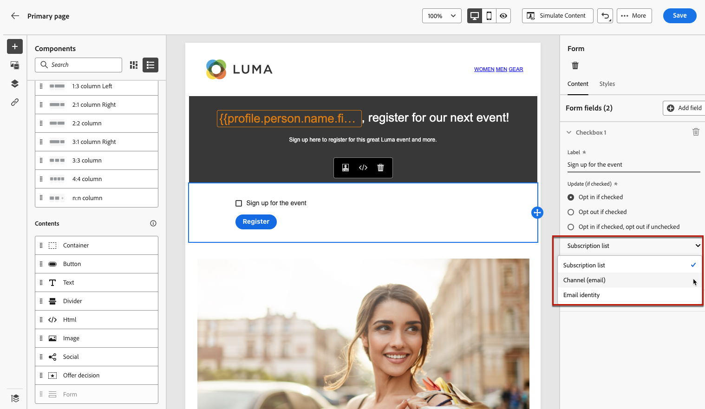
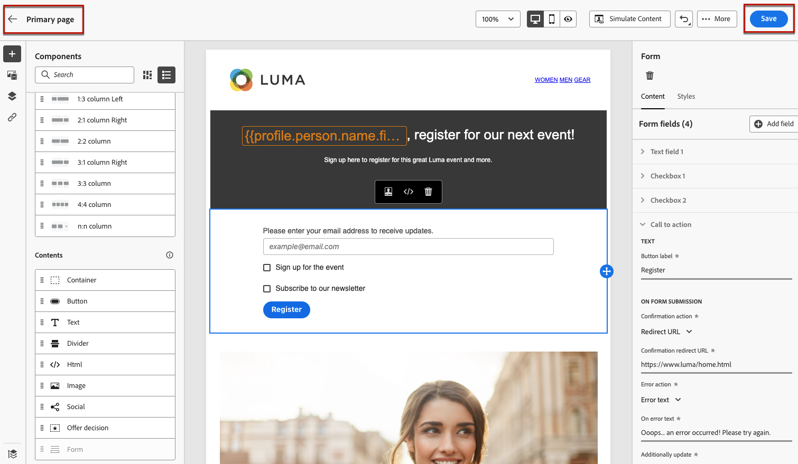

# 設計登錄頁內容 {#design-lp-content}

開始建立內容以便登錄 [首頁](create-lp.md#configure-primary-page) 或 [子頁](create-lp.md#configure-subpages)，將滑鼠懸停在首頁面內容上，然後按一下 **[!UICONTROL Open Designer]**。 也可以從右調色板中按一下相應的按鈕。

從那裡，您可以：

* **從頭開始設計登錄頁** 通過內容設計器的介面，並利用 [Adobe Experience Manager Assets Essentials](../messages/assets-essentials.md)。 瞭解如何設計內容或使用內置模板 [此部分](../messages/create-email-content.md)。

* **代碼或貼上原始HTML** 直接進入內容設計器。 瞭解如何編碼您自己的內容 [此部分](../messages/existing-content.md#import-raw-html-code)。

* **導入現有HTML內容** 檔案或.zip資料夾。 瞭解如何導入內容 [此部分](../messages/existing-content.md#import-html-content-from-file)。

>[!NOTE]
>
>登錄頁內容設計器與電子郵件設計器大體相似。 瞭解更多 [設計內容 [!DNL Journey Optimizer]](../messages/design-emails.md)。

## 定義特定於登錄頁的內容 {#define-lp-specific-content}

要定義特定內容，使用戶能夠從登錄頁中選擇和提交其選擇，請執行以下步驟。

1. 拖放特定於登錄頁的 **[!UICONTROL Form]** 元件從左調色板移入主工作區。

   

   >[!NOTE]
   >
   >的 **[!UICONTROL Form]** 元件只能在同一頁上使用一次。

1. 請選取模式。的 **[!UICONTROL Form content]** 頁籤顯示在右側的調色板中，以便您編輯窗體的不同欄位。

   

   >[!NOTE]
   >
   >切換到 **[!UICONTROL Form style]** 的子菜單。 [了解更多](#define-lp-styles)

1. 從 **[!UICONTROL Checkbox 1]** 部分，可編輯與此複選框對應的標籤。

1. 定義此複選框是選擇用戶加入還是退出：他們是同意接收通信，還是要求不再聯繫？

   

1. 選擇以下三個選項之間將更新的內容：

   

   * **[!UICONTROL Subscription list]**:如果配置檔案選中此複選框，則必須選擇將更新的訂閱清單。 瞭解更多 [訂閱清單](subscription-list.md)。

      

   * **[!UICONTROL Channel (email)]**:選擇加入或選擇退出適用於整個頻道。 例如，如果一個開啟的配置檔案有兩個電子郵件地址，則這兩個地址將從您的所有通信中排除。

   * **[!UICONTROL Email identity]**:選擇加入或選擇退出僅適用於用於訪問登錄頁的電子郵件地址。 例如，如果一個配置檔案有兩個電子郵件地址，則只有用於選擇加入的電子郵件地址才會從您的品牌接收通信。

1. 按一下 **[!UICONTROL Add field]** > **[!UICONTROL Checkbox]** 複選框。 重複上述步驟以定義其屬性。

   

1. 添加所有所需複選框後，按一下 **[!UICONTROL Call to action]** 展開相應的部分。 它使您能夠定義 **[!UICONTROL Form]** 元件。

   

1. 定義按一下按鈕後將發生的情況：

   * **[!UICONTROL Redirect URL]**:輸入用戶將重定向到的頁面的URL。
   * **[!UICONTROL Confirmation text]**:鍵入將顯示的確認文本。
   * **[!UICONTROL Link to a subpage]**:配置 [子頁](create-lp.md#configure-subpages) 並從顯示的下拉清單中選擇它。

   

1. 定義在發生錯誤時按一下按鈕時將發生的情況：

   * **[!UICONTROL Redirect URL]**:輸入用戶將重定向到的頁面的URL。
   * **[!UICONTROL Error text]**:鍵入將顯示的錯誤文本。 定義錯誤文本時，可以預覽錯誤文本 [樣式](#define-lp-styles)。

   * **[!UICONTROL Link to a subpage]**:配置 [子頁](create-lp.md#configure-subpages) 並從顯示的下拉清單中選擇它。

   

1. 如果要在提交表單時進行其他更新，請選擇 **[!UICONTROL Opt in]** 或 **[!UICONTROL Opt out]**，並定義要更新訂閱清單、渠道還是僅使用的電子郵件地址。

   

1. 保存您的內容，然後按一下頁面名稱旁的箭頭返回至 [登錄頁屬性](create-lp.md#configure-primary-page)。

   

<!--Will the name Email Designer be kept if you can also design LP with the same tool? > To modify in Messages section > content designer or Designer-->

## 定義登錄頁表單樣式 {#define-lp-styles}

1. 要修改窗體元件內容的樣式，請隨時切換到 **[!UICONTROL Form style]** 頁籤。

   

1. 展開 **[!UICONTROL Checkboxes]** 的子菜單。 例如，可以調整字型系列或大小以及複選框邊框顏色。

   

1. 展開 **[!UICONTROL Buttons]** 按鈕。 例如，可以添加邊框、在懸停時編輯標籤顏色或調整按鈕的對齊。

   

   使用 **[!UICONTROL Preview]** 按鈕 瞭解有關測試登錄頁的詳細資訊 [這裡](create-lp.md#test-landing-page)。

   

1. 展開 **[!UICONTROL Form layout]** 的子菜單。

   

1. 展開 **[!UICONTROL Form error]** 的子菜單。 選中相應選項以預覽窗體上的錯誤文本。

   

