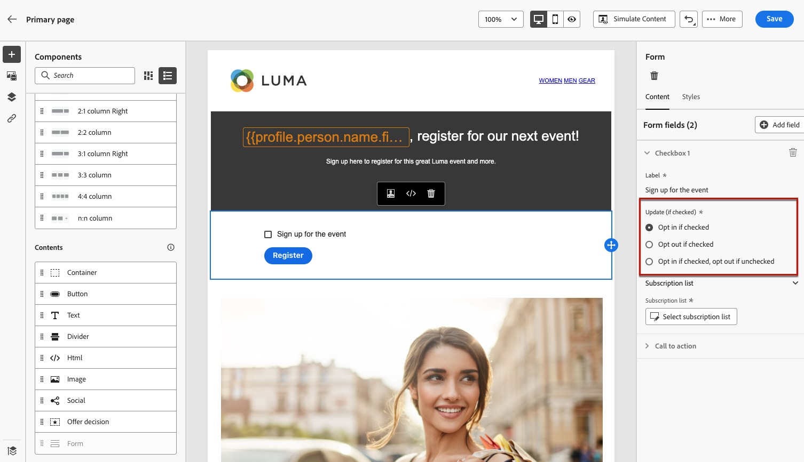
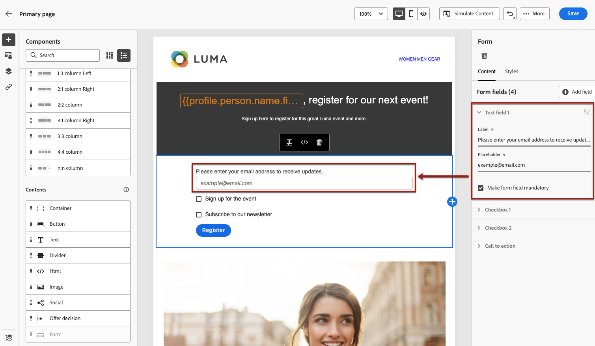

# 定義特定於著陸頁面的內容 {#lp-content}

>[!CONTEXTUALHELP]
>id="ac_lp_components"
>title="使用內容元件"
>abstract="內容元件是可以用來建立登陸頁面版面的空白內容預留位置。若要定義讓使用者能夠選取並提交他們的選擇的特定內容，請使用表單元件。"
>additional-url="https://experienceleague.adobe.com/zh-hant/docs/journey-optimizer/using/channels/email/design-email/add-content/content-components#add-content-components" text="新增內容元件"

若要設計登入頁面內容，您可以使用與電子郵件的相同元件。 [了解更多](../email/content-components.md#add-content-components)

若要設計特定內容，讓使用者能夠選取並提交其選擇，[請使用表單元件](#use-form-component)並定義其[登陸頁面特定樣式](#lp-form-styles)。

>[!NOTE]
>
>您也可以建立不含&#x200B;**[!UICONTROL Form]**&#x200B;元件的點進登入頁面。 在此情況下，登入頁面會顯示給使用者，但使用者不需要提交任何表單。 如果您只想顯示登入頁面，不需要收件者採取任何動作（例如選擇加入或選擇退出），或想提供不需要使用者輸入的資訊，就可以使用此功能。

使用登入頁面內容設計工具，您也可以運用來自子頁面中主要頁面的內容資料。 [了解更多](#use-primary-page-context)

>[!NOTE]
>
>[歐洲協助工具法](https://eur-lex.europa.eu/legal-content/EN/TXT/?uri=CELEX%3A32019L0882){target="_blank"}規定所有數位通訊都應該可供存取。 在[中設計內容時，請務必遵循](../email/accessible-content.md)此頁面[!DNL Journey Optimizer]上列出的特定准則。

## 使用表單元件 {#use-form-component}

>[!CONTEXTUALHELP]
>id="ac_lp_formfield"
>title="設定表單元件欄位"
>abstract="定義您的收件者將如何從您的登陸頁面查看和提交他們的選擇。"
>additional-url="https://experienceleague.adobe.com/zh-hant/docs/journey-optimizer/using/landing-pages/landing-pages-design/lp-content#lp-form-styles" text="定義登陸頁面表單樣式"

>[!CONTEXTUALHELP]
>id="ac_lp_submission"
>title="按一下按鈕時會發生什麼事"
>abstract="定義使用者提交登陸頁面表單後會發生什麼事。"

若要定義可讓使用者從您的登入頁面選取並提交其選擇的特定內容，請使用&#x200B;**[!UICONTROL Form]**&#x200B;元件。 若要執行此操作，請遵循下列步驟。

1. 將登入頁面特定的&#x200B;**[!UICONTROL Form]**&#x200B;元件從左側浮動視窗拖放至主要工作區。

   

   >[!NOTE]
   >
   >**[!UICONTROL Form]**&#x200B;元件只能在同一個頁面上使用一次。

1. 選取它。 **[!UICONTROL 表單內容]**&#x200B;索引標籤會顯示在右側的浮動視窗中，讓您編輯表單的不同欄位。

   

   >[!NOTE]
   >
   >隨時切換至&#x200B;**[!UICONTROL 樣式]**&#x200B;索引標籤，以編輯表單元件內容的樣式。 [了解更多](#define-lp-styles)

1. 從&#x200B;**[!UICONTROL 核取方塊1]**&#x200B;區段，您可以編輯對應至此核取方塊的標籤。

1. 定義此核取方塊是否要將使用者選擇加入或退出：他們是否同意接收通訊或要求不再聯絡？

   

   從下列三個選項中選取：

   * **[!UICONTROL 如果勾選則選擇加入]**：使用者需要勾選方塊才能同意（選擇加入）。
   * **[!UICONTROL 如果勾選則選擇退出]**：使用者需要勾選方塊以移除其同意（選擇退出）。
   * **[!UICONTROL 選取時選擇加入，取消選取時選擇退出]**：此選項可讓您插入選擇加入/選擇退出的單一核取方塊。 使用者需要勾選方塊同意（選擇加入），並取消勾選方塊移除其同意（選擇退出）。

1. 選擇要在下列三個選項之間更新的專案：

   

   * **[!UICONTROL 訂閱清單]**：如果設定檔選取此核取方塊，您必須選取要更新的訂閱清單。 深入瞭解[訂閱清單](subscription-list.md)。

     <!---->

   * **[!UICONTROL 管道（電子郵件）]**：選擇加入或選擇退出適用於整個管道。 例如，如果選擇退出的設定檔有兩個電子郵件地址，則這兩個地址都會從您的所有通訊中排除。

   * **[!UICONTROL 電子郵件身分]**：選擇加入或選擇退出僅適用於用來存取登入頁面的電子郵件地址。 例如，如果設定檔有兩個電子郵件地址，則只有用於選擇加入的電子郵件地址會收到您品牌的通訊。

1. 按一下「**[!UICONTROL 新增欄位]** > **[!UICONTROL 核取方塊]**」以新增另一個核取方塊。 重複上述步驟以定義其屬性。

   

1. 您也可以新增&#x200B;**[!UICONTROL 文字欄位]**。

   

   * 輸入將顯示在表單欄位頂端的&#x200B;**[!UICONTROL 標籤]**。

   * 輸入&#x200B;**[!UICONTROL 預留位置]**&#x200B;文字 它將顯示在欄位中，然後使用者填寫欄位。

   * 視需要核取&#x200B;**[!UICONTROL 將表單欄位設為必填]**&#x200B;選項。 在此情況下，只有在使用者已填入此欄位時，才能提交登入頁面。 如果未填入必填欄位，當使用者提交頁面時會顯示錯誤訊息。

   

1. 新增所有需要的核取方塊和/或文字欄位後，按一下&#x200B;**[!UICONTROL Call to action]**&#x200B;以展開對應的區段。 它可讓您定義&#x200B;**[!UICONTROL 表單]**&#x200B;元件中按鈕的行為。

   

1. 定義按一下按鈕後會發生什麼動作：

   * **[!UICONTROL 重新導向URL]**：輸入要重新導向使用者的頁面URL。
   * **[!UICONTROL 確認文字]**：輸入要顯示的確認文字。
   * **[!UICONTROL 連結至子頁面]**：設定[子頁面](create-lp.md#configure-subpages)，並從顯示的下拉式清單中選取它。

   

1. 定義發生錯誤時，按一下按鈕後會發生什麼情況：

   * **[!UICONTROL 重新導向URL]**：輸入要重新導向使用者的頁面URL。
   * **[!UICONTROL 錯誤文字]**：輸入要顯示的錯誤文字。 定義[表單樣式](#define-lp-styles)時，您可以預覽錯誤文字。

   * **[!UICONTROL 連結至子頁面]**：設定[子頁面](create-lp.md#configure-subpages)，並從顯示的下拉式清單中選取它。

   

1. 如果您想在提交表單時進行額外的更新，請選取&#x200B;**[!UICONTROL 選擇加入]**&#x200B;或&#x200B;**[!UICONTROL 選擇退出]**，並定義您是否要更新訂閱清單、頻道或只是使用的電子郵件地址。

   

1. 儲存您的內容並按一下頁面名稱旁的箭頭，以返回[登陸頁面屬性](create-lp.md#configure-primary-page)。

   

## 定義登陸頁面表單樣式 {#lp-form-styles}

1. 若要修改表單元件內容的樣式，請隨時切換至&#x200B;**[!UICONTROL 樣式]**&#x200B;索引標籤。

   

1. **[!UICONTROL 欄位]**&#x200B;區段預設為展開，可讓您編輯文字欄位的外觀，例如標籤與預留位置字型、標籤位置、欄位背景顏色或欄位邊框。

   

1. 展開&#x200B;**[!UICONTROL 核取方塊]**&#x200B;區段以定義核取方塊和對應文字的外觀。 例如，您可以調整字型系列或大小，或是核取方塊框線顏色。

   

1. 展開&#x200B;**[!UICONTROL 按鈕]**&#x200B;區段以修改元件表單中按鈕的外觀。 例如，您可以變更字型、新增框線、在游標停留時編輯標籤顏色，或調整按鈕的對齊方式。

   

   您可以使用&#x200B;**[!UICONTROL 模擬內容]**&#x200B;按鈕來預覽某些設定，例如暫留時的按鈕標籤顏色。 在[此處](create-lp.md#test-landing-page)進一步瞭解測試登入頁面。

   <!---->

1. 展開&#x200B;**[!UICONTROL 表單版面配置]**&#x200B;區段以編輯版面配置設定，例如背景顏色、邊框間距或邊界。

   

1. 展開&#x200B;**[!UICONTROL 表單錯誤]**&#x200B;區段以調整發生問題時顯示的錯誤訊息顯示。 核取對應的選項，以在表單上預覽錯誤文字。

   

## 使用主要頁面內容 {#use-primary-page-context}

您可以使用來自相同登陸頁面內其他頁面的內容資料。

例如，如果您將核取方塊<!-- or the submission of the page-->連結至主要登陸頁面上的[訂閱清單](subscription-list.md)，則可以在「感謝您」子頁面上使用該訂閱清單。

假設您將主要頁面上的兩個核取方塊連結至兩個不同的訂閱清單。 如果使用者訂閱其中一個，您想要根據他們選取的核取方塊，在提交表單時顯示特定訊息。

要執行此操作，請遵循下列步驟：

1. 在首頁面上，將&#x200B;**[!UICONTROL 表單]**&#x200B;元件的每個核取方塊連結至相關的訂閱清單。 [了解更多](#use-form-component)。

   

1. 在子頁面上，將滑鼠指標放在您要插入文字的位置，然後從內容工具列選取&#x200B;**[!UICONTROL 新增個人化]**。

   

1. 在&#x200B;**[!UICONTROL 編輯個人化]**&#x200B;視窗中，選取&#x200B;**[!UICONTROL 內容屬性]** > **[!UICONTROL 登陸頁面]** > **[!UICONTROL 主要頁面內容]** > **[!UICONTROL 訂閱]**。

1. 主要頁面上選取的所有訂閱清單都會列出。 使用+圖示選取相關專案。

   

1. 使用個人化編輯器協助程式功能新增相關條件。 [了解更多](../personalization/functions/functions.md)

   

   >[!CAUTION]
   >
   >如果運算式中有特殊字元（例如連字型大小），您必須將包含連字型大小的文字逸出。

1. 儲存您的變更。

現在，當使用者選取其中一個核取方塊時，

與所選核取方塊對應的訊息會在提交表單時顯示。

<!---->

>[!NOTE]
>
>如果使用者選取兩個核取方塊，則兩個文字都會顯示。

<!--
## Use landing page additional data {#use-additional-data}

When [configuring the primary page](create-lp.md#configure-primary-page), you can create additional data to enable storing information when the landing page is being submitted.

>[!NOTE]
>
>This data may not be visible to users who visit the page.

If you defined one or more keys with their corresponding values when [configuring the primary page](create-lp.md#configure-primary-page), you can leverage these keys in the content of your primary page and subpages using the [personalization editor](../personalization/personalization-build-expressions.md).

///When you reuse the same text on a page, this enables you to dynamically change that text if needed, without going through each occurrence.

For example, if you define the company name as a key, you can quickly update it everywhere (on all the pages of a given landing page) by changing it only once in the [primary page settings](create-lp.md#configure-primary-page).///

To leverage these keys in a landing page, follow the steps below:

1. When configuring the primary page, define a key and its corresponding value in the **[!UICONTROL Additional data]** section. [Learn more](create-lp.md#configure-primary-page)

    

1. When editing your primary page with the designer, place the pointer of your mouse where you want to insert your key and select **[!UICONTROL Add personalization]** from the contextual toolbar.

    

1. In the **[!UICONTROL Edit Personalization]** window, select **[!UICONTROL Contextual attributes]** > **[!UICONTROL Landing Pages]** > **[!UICONTROL Additional Context]**.

    

1. All the keys that you created when configuring the primary page are listed. Select the key of your choice using the + icon.

    

1. Save your changes and repeat the steps above as many times as needed.

    

    You can see that the personalization item corresponding to your key is now displayed everywhere you inserted it.
-->