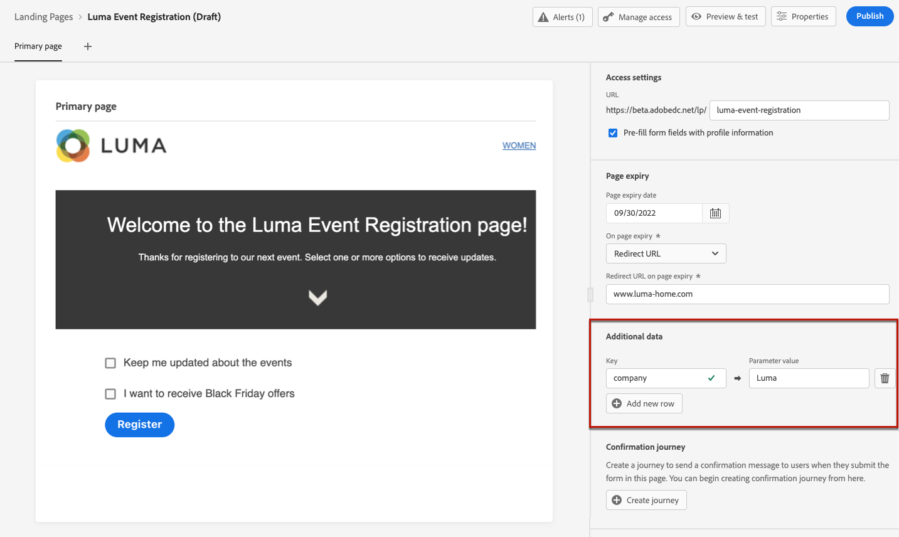

# 定義登錄頁面特定內容 {#lp-content}

若要定義特定內容，讓使用者從您的登錄頁面選取並提交其選擇，請使用 **[!UICONTROL Form]** 元件。 若要這麼做，請遵循下列步驟。

>[!NOTE]
>
>您也可以建立點進登錄頁面，不使用 **[!UICONTROL Form]** 元件。 在這種情況下，登錄頁面會向使用者顯示，但使用者不需要提交任何表單。 如果您只想要展示登錄頁面，而不要求收件者採取任何動作（例如選擇加入或選擇退出），或想要提供不需要使用者輸入的資訊，這個功能會很實用。

## 使用表單元件 {#use-form-component}

1. 拖放登錄頁面專用 **[!UICONTROL Form]** 元件從左側浮動視窗移入主工作區。

   

   >[!NOTE]
   >
   >此 **[!UICONTROL Form]** 元件在相同頁面上只能使用一次。

1. 選取它。 此 **[!UICONTROL Form content]** 標籤會顯示在右側浮動視窗中，讓您編輯表單的不同欄位。

   

   >[!NOTE]
   >
   >切換至 **[!UICONTROL Form style]** 頁簽，隨時編輯表單元件內容的樣式。 [深入了解](#define-lp-styles)

1. 從 **[!UICONTROL Checkbox 1]** 區段中，您可以編輯與此核取方塊對應的標籤。

1. 定義此核取方塊是要選擇使用者加入或退出：他們是否同意接收通信？還是要求不再聯繫？

   

   在下列三個選項中選取：

   * **[!UICONTROL Opt in if checked]**:使用者需要核取「同意」方塊（選擇加入）。
   * **[!UICONTROL Opt out if checked]**:使用者需要核取方塊以移除其同意（選擇退出）。
   * **[!UICONTROL Opt in if checked, opt out if unchecked]**:此選項可讓您插入單一核取方塊以選取加入/選擇退出。 使用者必須核取同意（選擇加入）方塊，並取消勾選以移除其同意（選擇退出）。

1. 在下列三個選項之間選擇要更新的項目：

   

   * **[!UICONTROL Subscription list]**:如果配置檔案選中此複選框，則必須選擇要更新的訂閱清單。 深入了解 [訂閱清單](subscription-list.md).

      

   * **[!UICONTROL Channel (email)]**:選擇加入或選擇退出會套用至整個管道。 例如，如果選擇退出的設定檔有兩個電子郵件地址，則這兩個地址都將從您的所有通訊中排除。

   * **[!UICONTROL Email identity]**:選擇加入或選擇退出僅適用於用來存取登錄頁面的電子郵件地址。 例如，如果設定檔有兩個電子郵件地址，則只有用來選擇加入的電子郵件地址才會收到來自您品牌的通訊。

1. 按一下 **[!UICONTROL Add field]** > **[!UICONTROL Checkbox]** 添加其他複選框。 重複上述步驟以定義其屬性。

   

1. 新增所有需要的核取方塊後，按一下 **[!UICONTROL Call to action]** 以展開對應的區段。 它可讓您定義 **[!UICONTROL Form]** 元件。

   

1. 定義按一下按鈕後將發生的事項：

   * **[!UICONTROL Redirect URL]**:輸入將使用者重新導向的頁面URL。
   * **[!UICONTROL Confirmation text]**:輸入將顯示的確認文本。
   * **[!UICONTROL Link to a subpage]**:設定 [子頁面](create-lp.md#configure-subpages) 並從顯示的下拉式清單中選取。

   

1. 定義發生錯誤時按一下按鈕後會發生什麼事：

   * **[!UICONTROL Redirect URL]**:輸入將使用者重新導向的頁面URL。
   * **[!UICONTROL Error text]**:輸入將顯示的錯誤文本。 定義 [表單樣式](#define-lp-styles).

   * **[!UICONTROL Link to a subpage]**:設定 [子頁面](create-lp.md#configure-subpages) 並從顯示的下拉式清單中選取。

   

1. 如果要在提交表單時進行其他更新，請選擇 **[!UICONTROL Opt in]** 或 **[!UICONTROL Opt out]**，並定義您是否要更新訂閱清單、通道或僅使用的電子郵件地址。

   

1. 儲存您的內容，然後按一下頁面名稱旁的箭頭，返回 [登陸頁面屬性](create-lp.md#configure-primary-page).

   

## 定義登錄頁面表單樣式 {#lp-form-styles}

1. 若要修改表單元件內容的樣式，請隨時切換至 **[!UICONTROL Form style]** 標籤。

   

1. 展開 **[!UICONTROL Checkboxes]** 區段來定義核取方塊的外觀和對應文字。 例如，您可以調整字型系列或大小，以及核取方塊邊框顏色。

   

1. 展開 **[!UICONTROL Buttons]** 區段，修改元件表單中按鈕的外觀。 例如，您可以新增邊框、在暫留時編輯標籤顏色，或調整按鈕的對齊方式。

   

   您可以使用 **[!UICONTROL Preview]** 按鈕。 進一步了解測試登錄頁面 [此處](create-lp.md#test-landing-page).

   

1. 展開 **[!UICONTROL Form layout]** 區段來編輯版面設定，例如背景顏色、邊框間距或邊界。

   

1. 展開 **[!UICONTROL Form error]** 區段來調整在發生問題時顯示的錯誤訊息的顯示。 核取對應的選項，以預覽表單上的錯誤文字。

   

## 使用主要頁面內容 {#use-primary-page-context}

您可以使用來自相同登陸頁面內其他頁面的內容資料。

例如，如果您連結核取方塊<!-- or the submission of the page--> 到 [訂閱清單](subscription-list.md) 在主要登陸頁面上，您可以在「感謝您」子頁面上使用該訂閱清單。

假設您將主要頁面上的兩個核取方塊連結至兩個不同的訂閱清單。 如果使用者訂閱其中一個表單，您會根據使用者選取的核取方塊，在提交表單時顯示特定訊息。

若要這麼做，請遵循下列步驟：

1. 在主要頁面上，將每個核取方塊連結至相關的訂閱清單。 [深入了解](#use-form-component).

   

1. 在子頁面上，將滑鼠的指標置於要插入文字的位置並選取 **[!UICONTROL Add personalization]** 中。

   

1. 在 **[!UICONTROL Edit personalization]** 窗口，選擇 **[!UICONTROL Contextual attributes]** > **[!UICONTROL Landing Pages]** > **[!UICONTROL Primary Page Context]** > **[!UICONTROL Subscription]**.

1. 會列出您在主要頁面上選取的所有訂閱清單。 使用+圖示選取相關項目。

   

1. 使用運算式編輯器協助程式函式新增相關條件。 [深入了解](../personalization/functions/functions.md)

   

   >[!CAUTION]
   >
   >如果運算式中有連字型大小等特殊字元，您必須逸出包含連字型大小的文字。

1. 儲存您的變更。

現在，當使用者選取其中一個核取方塊時，在提交表單時，會顯示與所選核取方塊對應的訊息。

>[!NOTE]
>
>如果用戶選擇了兩個複選框，則兩個文本都將顯示。

<!--
## Use landing page additional data {#use-additional-data}

When [configuring the primary page](create-lp.md#configure-primary-page), you can create additional data to enable storing information when the landing page is being submitted.

>[!NOTE]
>
>This data may not be visible to users who visit the page.

If you defined one or more keys with their corresponding values when [configuring the primary page](create-lp.md#configure-primary-page), you can leverage these keys in the content of your primary page and subpages using the [Expression editor](../personalization/personalization-build-expressions.md).

///When you reuse the same text on a page, this enables you to dynamically change that text if needed, without going through each occurrence.

For example, if you define the company name as a key, you can quickly update it everywhere (on all the pages of a given landing page) by changing it only once in the [primary page settings](create-lp.md#configure-primary-page).///

To leverage these keys in a landing page, follow the steps below:

1. When configuring the primary page, define a key and its corresponding value in the **[!UICONTROL Additional data]** section. [Learn more](create-lp.md#configure-primary-page)

    

1. When editing your primary page with the designer, place the pointer of your mouse where you want to insert your key and select **[!UICONTROL Add personalization]** from the contextual toolbar.

    

1. In the **[!UICONTROL Edit Personalization]** window, select **[!UICONTROL Contextual attributes]** > **[!UICONTROL Landing Pages]** > **[!UICONTROL Additional Context]**.

    

1. All the keys that you created when configuring the primary page are listed. Select the key of your choice using the + icon.

    

1. Save your changes and repeat the steps above as many times as needed.

    

    You can see that the personalization item corresponding to your key is now displayed everywhere you inserted it.
-->