# 在您的登入頁面中使用表單 {#lp-forms}

>[!AVAILABILITY]
>
>此功能目前以「限量」形式向美國和澳洲的客戶發行。請聯絡您的 Adobe 代表以取得存取權。

若要使用您的[!DNL Journey Optimizer]登陸頁面擷取設定檔資料並擴充[!DNL Experience Platform]資料集，您可以在登陸頁面中運用表單。

## 建立表單預設集 {#create-form-preset}

>[!CONTEXTUALHELP]
>id="ajo_lp_form_connection"
>title="選取要使用的端點"
>abstract="定義在提交表單時傳送資料的串流端點。"
>additional-url="https://experienceleague.adobe.com/en/docs/experience-platform/sources/ui-tutorials/create/streaming/http" text="建立HTTP API串流連線"

>[!CONTEXTUALHELP]
>id="ajo_lp_form_dataset"
>title="選取資料集"
>abstract="定義要儲存並反映表單回應的資料集。 您可以輸入以搜尋特定資料集，或從清單中選取它。"

建立表單前，您需要先建立專屬的預設集，您可在其中選取傳送表單提交資料的連線端點，以及儲存透過表單擷取之資料的資料集。

資料一旦登陸串流端點，就會與資料集資訊連結。 然後會使用產生的來源/目標連線和來源流程，將資料推送至資料集。

建立預設集時：

* 您可以使用不同的資料集和串流連線組合，設定多個預設集。
* 相同的資料集或串流連線可在多個預設集中重複使用。
* 每個串流連線都會自動產生資源，例如：
   * **Source連線** — 資料來源。
   * **目標連線** — 資料儲存或使用的位置。
   * **Source流程** — 將資料從來源連線移至[!DNL Experience Platform]、處理對應、轉換和驗證的管道。

<!--
>[!NOTE]
>
> To access and edit form presets, you must have the **[!UICONTROL Manage form presets]** permission on the production sandbox. Learn more about permissions in [this section](../administration/high-low-permissions.md#administration-permissions).TBC
-->

若要建立表單預設集，請遵循下列步驟。

1. 若要存取&#x200B;**[!UICONTROL 表單預設集]**&#x200B;詳細目錄，請從左側功能表選取&#x200B;**[!UICONTROL 管理]** > **[!UICONTROL 管道]** >**[!UICONTROL 表單設定]**。

1. 按一下&#x200B;**[!UICONTROL 建立表單預設集]**。

1. 更新名稱以更輕鬆地擷取它，並視需要新增說明。

   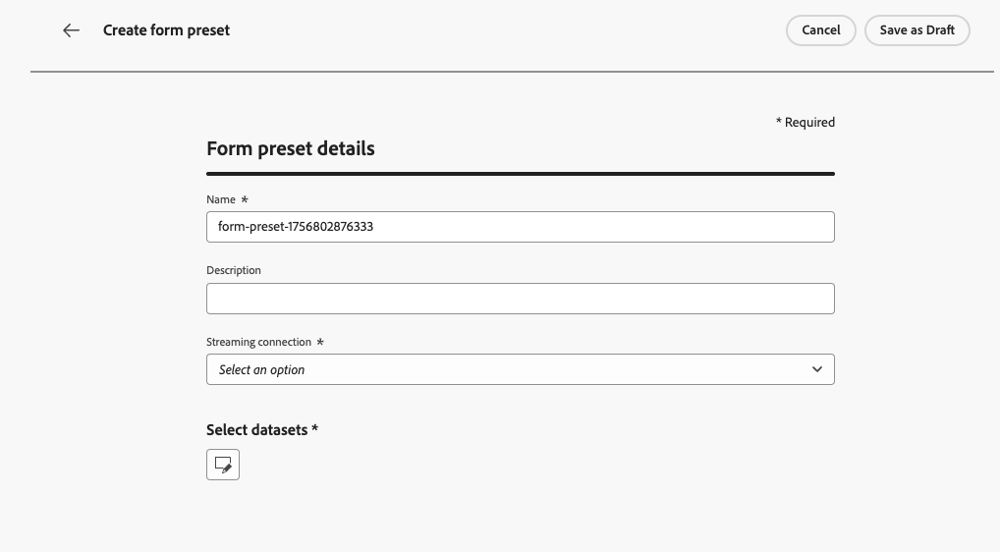{width=80%}

1. 選取&#x200B;**[!UICONTROL 串流連線]**&#x200B;以用於該表單。 這是串流端點，資料會在提交表單時傳送至此處。

   在[Experience Platform檔案](https://experienceleague.adobe.com/en/docs/experience-platform/sources/ui-tutorials/create/streaming/http){target="_blank"}中進一步瞭解如何建立串流來源連線。

   >[!IMPORTANT]
   >
   >若要讓HTTP API串流連線顯示在下拉式清單中，它在Adobe Experience Platform中建立時必須符合下列要求：
   >
   >* **資料型別**&#x200B;必須設定為&#x200B;**XDM** （不是原始資料）
   >* **驗證**&#x200B;必須為&#x200B;**已停用** （未驗證的連線）
   >
   >如果您的串流連線未出現在清單中，請確認同時符合這兩個條件。<!--Learn how to [create a non-authenticated connection with XDM data type](https://experienceleague.adobe.com/en/docs/experience-platform/sources/ui-tutorials/create/streaming/http#create-a-streaming-connection){target="_blank"}.-->

1. 選取&#x200B;**[!UICONTROL 資料集]**&#x200B;以連結表單。 這是將儲存並反映表單回應的位置。 您可以輸入以搜尋特定資料集，或從清單中選取它。

   >[!NOTE]
   >
   >目前只有[!DNL Adobe Experience Platform]個資料集可供選取。 一次可以選取一個資料集。 [進一步瞭解資料集](../data/get-started-datasets.md)

1. 按一下&#x200B;**[!UICONTROL 發佈]**。 您的預設集現已準備就緒，可用於表單中。

## 存取及管理表單 {#access-forms}

若要存取表單清單，請從左側功能表選取&#x200B;**[!UICONTROL 內容管理]** > **[!UICONTROL Forms]**。

所有現有表單都會顯示。 您可以根據表單的狀態、建立或修改日期來篩選表單。

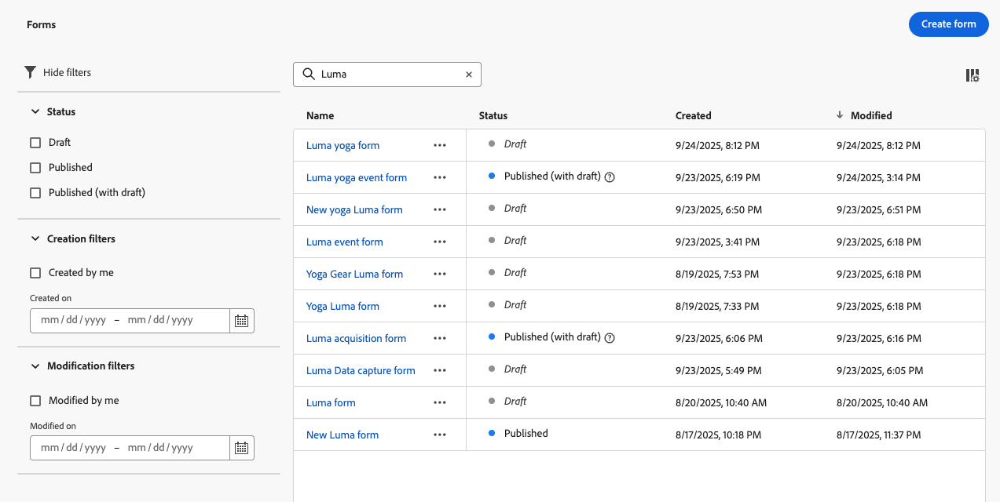

## 建立及設計表單 {#create-form}

>[!CONTEXTUALHELP]
>id="ajo_lp_form_preset"
>title="選取預設集"
>abstract="選擇預先定義的預設集，其中包含要使用的連線，以及表單預先定義的資料集。"
>additional-url="https://experienceleague.adobe.com/en/docs/journey-optimizer/using/content-management/landing-pages/lp-forms#create-form-preset" text="建立表單預設集"

若要建立表單，請遵循下列步驟。

1. 從&#x200B;**[!UICONTROL Forms]**&#x200B;清單中，按一下&#x200B;**[!UICONTROL 建立表單]**。

1. 新增名稱。 您可以視需要新增說明。

   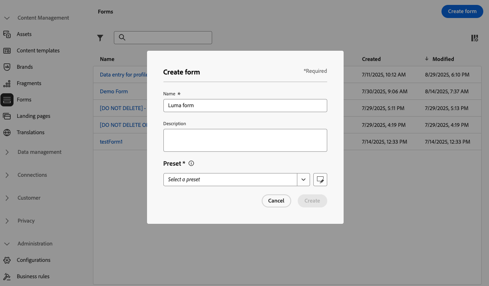

1. 選取&#x200B;**[!UICONTROL 預設集]**，其中包含要使用的連線以及表單的預先定義資料集。 [瞭解如何建立表單預設集](#create-form-preset)

1. 按一下 **[!UICONTROL 建立]**。表單設計工具開啟，可讓您新增結構和內容[元件](../email/content-components.md#add-content-components)以建置您的內容。 您可以使用[Text](../email/content-components.md#text)和&#x200B;**[!UICONTROL Field]**&#x200B;元件。

1. 若要擷取設定檔資料和屬性，請新增特定欄位至您的表單。 [了解更多](#define-fields)

1. 設定並設計這些欄位。 [了解更多](#configure-fields)

1. 您可以使用&#x200B;**[!UICONTROL 樣式]**&#x200B;窗格，視需要調整表單的版面、樣式和維度。 [進一步瞭解樣式](../email/get-started-email-style.md)

1. 設定所有欄位後，按一下&#x200B;**[!UICONTROL 儲存並關閉]**。

1. 設定感謝頁面。 [了解作法](#thank-you-page)

1. **[!UICONTROL 發佈]**&#x200B;表單，使其可在登陸頁面中選擇。

### 定義特定欄位 {#define-fields}

若要新增特定欄位至您的表單，請將結構拖放至畫布中，並將&#x200B;**[!UICONTROL Field]**&#x200B;元件拖曳到裡面。<!--**[!UICONTROL Select field attribute]** or **[!UICONTROL Add custom field]**.-->

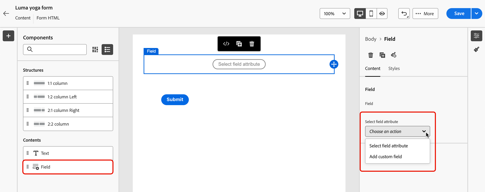

然後選取下列其中一個選項：

>[!BEGINTABS]

>[!TAB 選取欄位屬性]

使用此選項可根據連結至表單的資料集結構選取屬性。

>[!NOTE]
>
>資料集是在為您的表單選取的預設集中定義。 [了解更多](#create-form-preset)

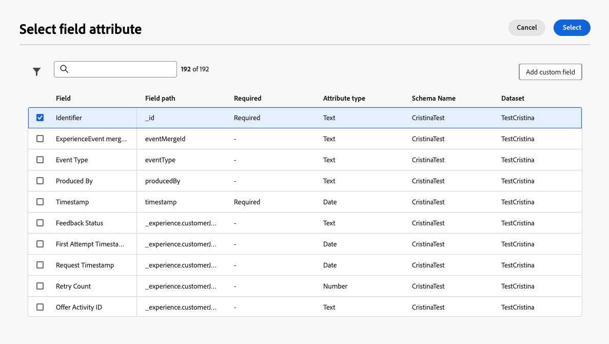{width=100%}

例如，您可以設定電子郵件和人員ID。 當使用者填寫這些欄位時，輸入的資訊會儲存到所選的資料集。

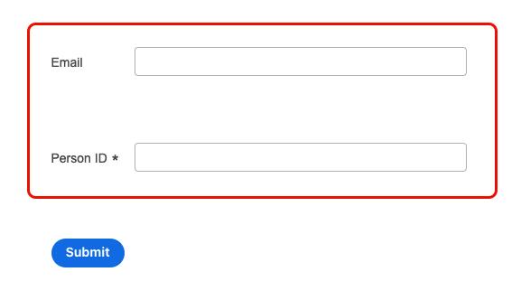{width=55%}

若要將收集的資料與設定檔對應，請選取設定檔身分欄位。 身分欄位在屬性清單中標示為&#x200B;**[!UICONTROL 必要]** — 您可以篩選它們。

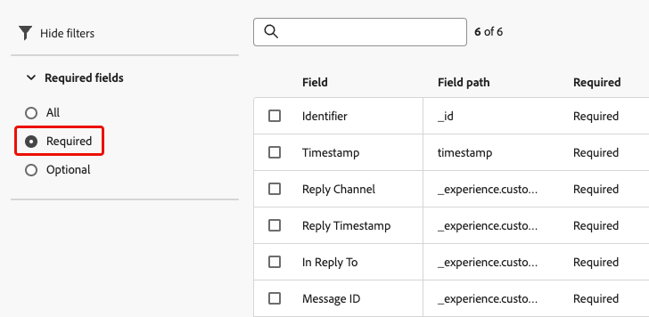{width=65%}

>[!TAB 新增自訂欄位]

使用此選項，您可以只定義自由欄位，而不需將其對應至連結資料集中的欄位。

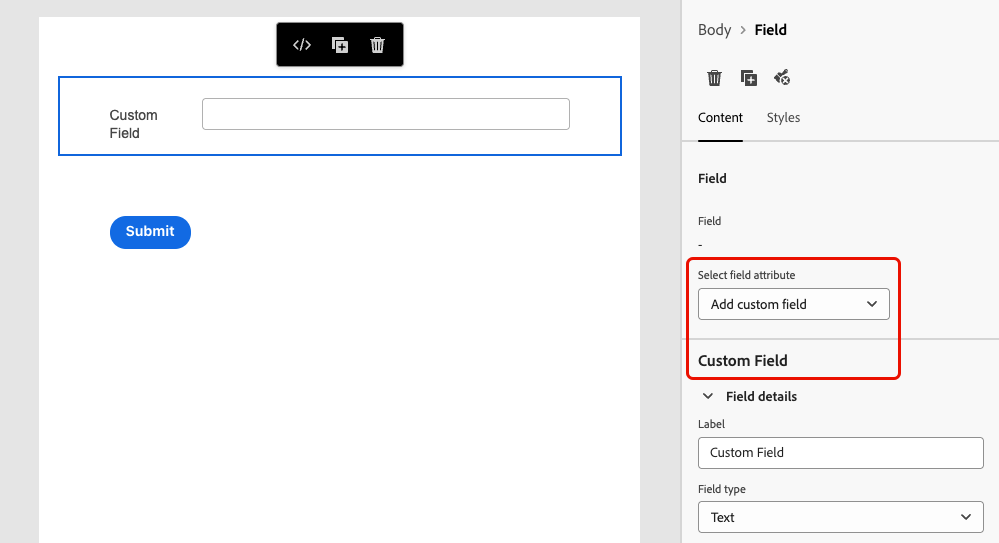{width=85%}

>[!ENDTABS]

### 設定和設計欄位 {#configure-fields}

選取欄位屬性或新增自訂欄位後，您可以在提交表單時進一步調整其詳細資訊及其行為。

1. 在右側&#x200B;**[!UICONTROL Content]**&#x200B;索引標籤的&#x200B;**[!UICONTROL 欄位詳細資料]**&#x200B;區段中，您可以視需要指定下列元素：

   * 調整&#x200B;**[!UICONTROL 標籤]**，讓表單的收件者清楚瞭解。
   * 根據您的需求變更&#x200B;**[!UICONTROL 欄位型別]**。 可以是核取方塊、貨幣、日期、滑桿、URL等。

     >[!NOTE]
     >
     >其他欄位詳細資料可能會因選取的欄位型別而異。

   * 新增&#x200B;**[!UICONTROL 預留位置]**.<!--To explain-->
   * 指定&#x200B;**[!UICONTROL 指示]**.<!--How will they be displayed in the form? To explain-->
   * 輸入&#x200B;**[!UICONTROL 預設值]**，此預設值會在表單使用者填寫欄位之前顯示。
   * 您可以定義自訂&#x200B;**[!UICONTROL 驗證訊息]**。
   * 設定&#x200B;**[!UICONTROL 最大長度]**。 如果表單的收件者在填寫欄位時超過限制，則會顯示錯誤訊息。

   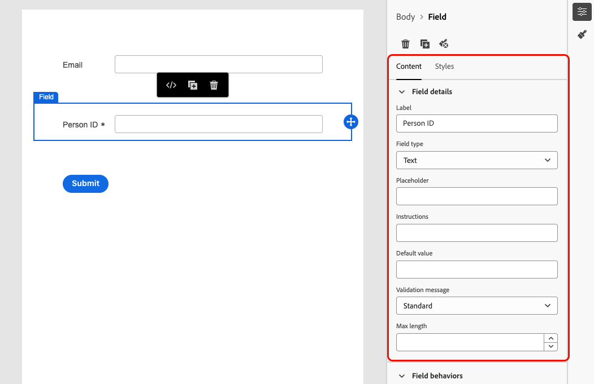{width=85%}

1. 在&#x200B;**[!UICONTROL 欄位行為]**&#x200B;區段中，您可以定義下列專案：

   * 選取&#x200B;**[!UICONTROL 必要]**&#x200B;以強制此欄位。 如果使用者未填寫欄位，他們將無法提交表單。
   * 選取&#x200B;**[!UICONTROL 區分大小寫]**，讓欄位區分大小寫。<!--To confirm - do you mean retain capitalization when added to the dataset?-->
   * 選取&#x200B;**[!UICONTROL 已啟用預填]**&#x200B;以從設定檔資訊填入欄位（若有）。<!--Even for a custom field, or a field not mapped to a profile? What happens if no data is available?-->
   * 選取&#x200B;**[!UICONTROL 啟用輸入遮罩]**，以一般字元取代使用者的輸入。 您可以使用&#x200B;*9*&#x200B;表示任何數字，*a*&#x200B;表示任何字母，或*表示任何數字或字母。<!--Not sure how you define that in the form-->

   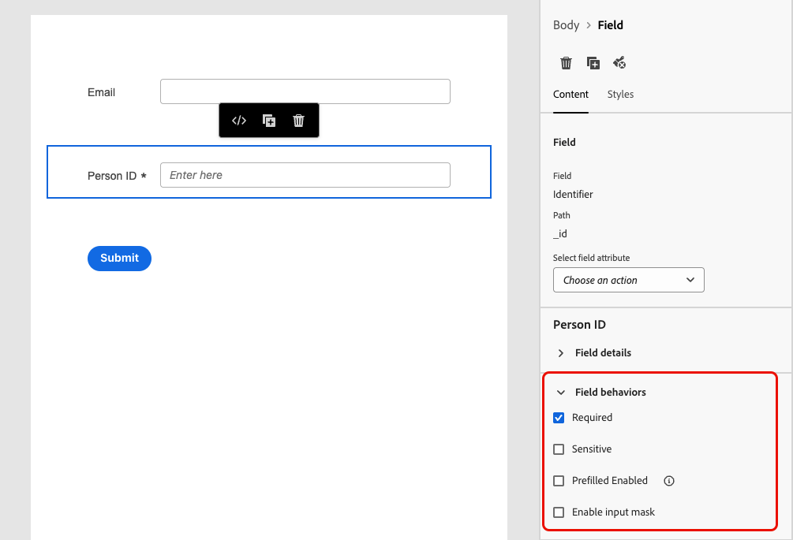{width=75%}

### 設定感謝頁面 {#thank-you-page}

>[!CONTEXTUALHELP]
>id="ajo_lp_forms_thankyou_page"
>title="感謝頁面"
>abstract="設定某人填寫或轉寄表單時所發生的情況。"

返回表單詳細資料，從&#x200B;**[!UICONTROL 感謝頁面]**&#x200B;區段，設定使用者填寫表單時會發生什麼情況。

設定下列其中一個動作：

* **[!UICONTROL 停留在頁面]** — 此選項可讓訪客在提交表單時停留在相同頁面。
* **[!UICONTROL 登陸頁面]** — 選取已發佈的[登陸頁面](create-lp.md)，使用者在提交表單後會重新導向該頁面。
* **[!UICONTROL 外部URL]** — 輸入您要作為後續頁面的完整URL。 使用者提交表單後，系統會將他們導向指定的URL。
* **[!UICONTROL 條件式重新導向]** — 設定規則，以根據表單回應動態顯示不同的後續動作。

  您可以為每個特定對象定義規則。 例如，您可以為美國居民顯示特定登陸頁面、為加拿大居民顯示另一個頁面，以此類推。 最後，針對未落入您定義之任何規則的使用者，設定預設動作。

  >[!NOTE]
  >
  >系統會依序讀取規則中定義的條件。

  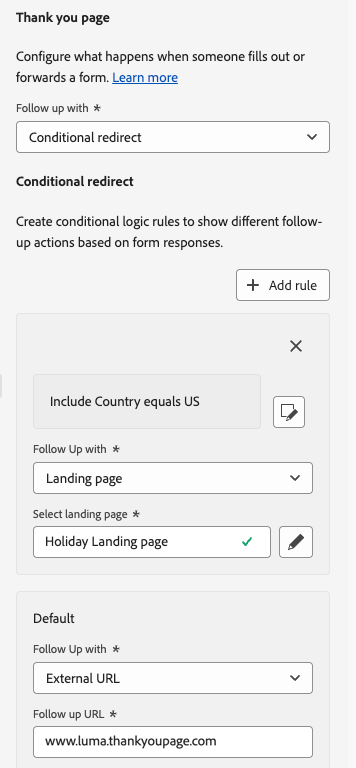{width=40%}

## 編輯已發佈的表單 {#edit-form}

表單發佈後，您仍可加以編輯。 請遵循下列步驟。

1. 存取[表單清單](#access-forms)並選取已發佈的表單。

1. 按一下&#x200B;**[!UICONTROL 編輯表單]**&#x200B;按鈕。

   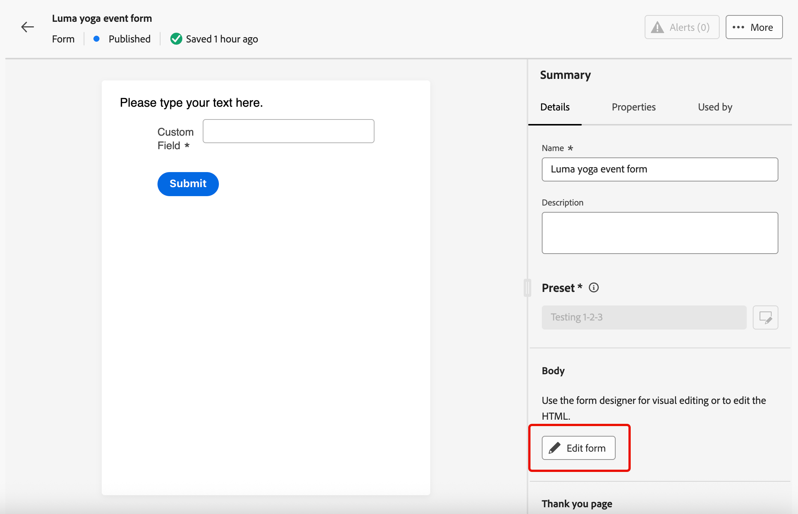{width=90%}

1. 新版本的表單會以草稿狀態建立。 按一下&#x200B;**[!UICONTROL 建立草稿版本]**。

1. 視需要更新表單，然後按一下&#x200B;**[!UICONTROL 儲存]**。 表單現在具有&#x200B;**[!UICONTROL 已發佈（含草稿）]**&#x200B;狀態：

   * 目前版本繼續具有&#x200B;**[!UICONTROL 已發佈]**&#x200B;狀態，直到您發佈更新的版本為止。

   * 更新的版本具有&#x200B;**[!UICONTROL 草稿]**&#x200B;狀態。

1. 回到表單摘要，您可以在表單的兩個版本之間導覽。

   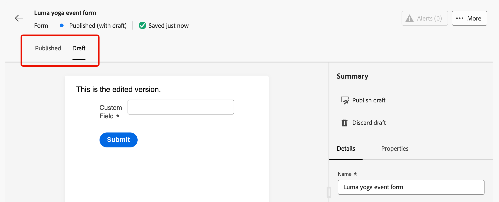{width=70%}

1. 在&#x200B;**[!UICONTROL 草稿]**&#x200B;區段中，您可以發佈或捨棄草稿，以及編輯表單的詳細資訊或內容。

   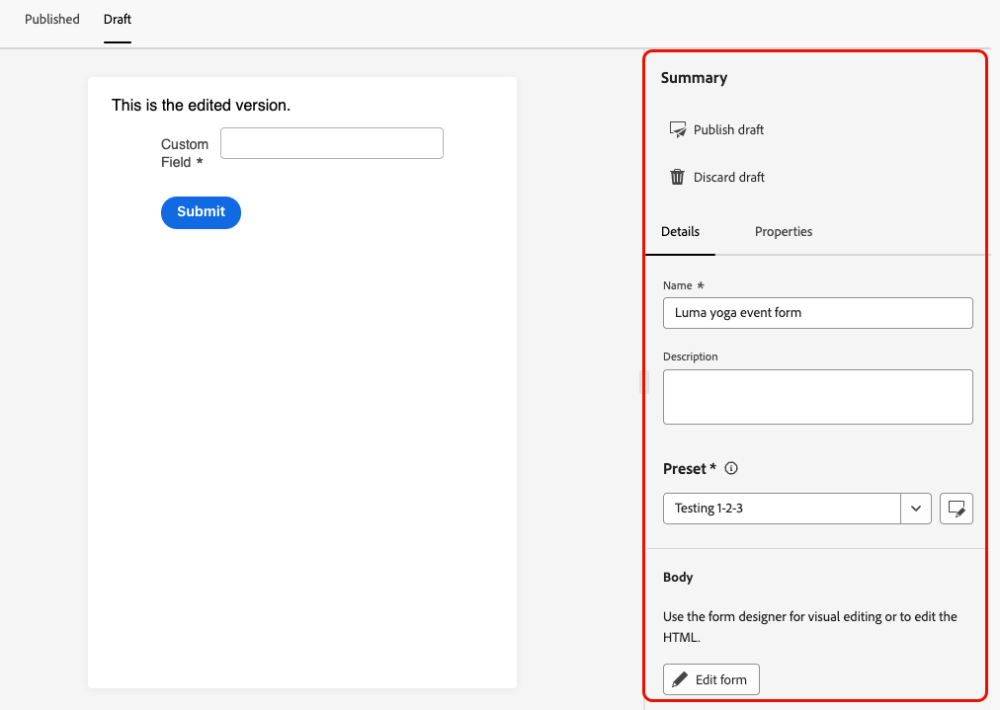{width=75%}

## 在登入頁面中運用表單 {#leverage-form-in-lp}

您現在可以將此表單內嵌至登入頁面，以擷取與您在表單中定義的屬性對應的資料，並將其儲存至選取的資料集。 請遵循下列步驟。

1. 建立登入頁面。 [了解作法](create-lp.md#create-landing-page)

1. 選取&#x200B;**[!UICONTROL 資料擷取]**&#x200B;做為登陸頁面型別，然後按一下&#x200B;**[!UICONTROL 建立]**。

   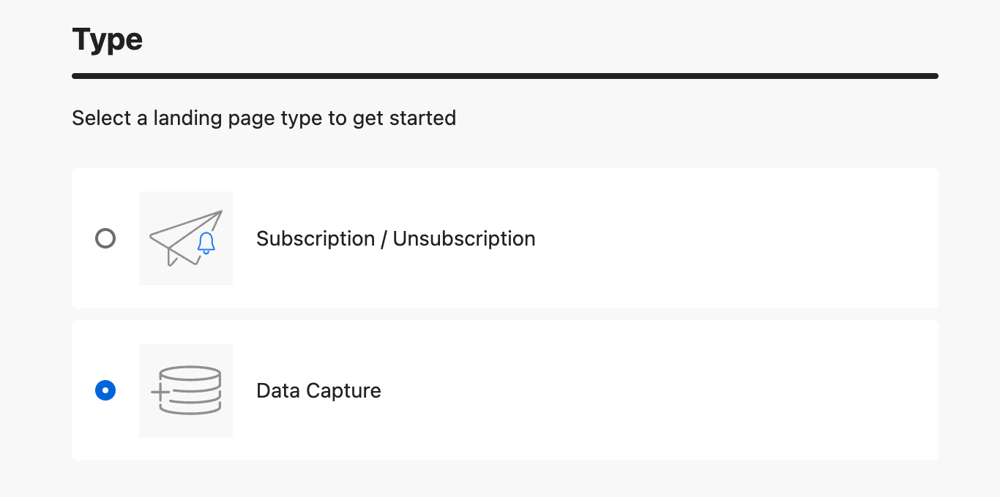{width=65%}

1. 設定主要頁面。 [了解作法](create-lp.md#configure-primary-page)

1. 開啟[登陸頁面設計工具](design-lp.md)。

1. 將&#x200B;**[!UICONTROL 結構元件]**&#x200B;拖放到您的內容中。 將&#x200B;**[!UICONTROL Form]**&#x200B;元件拖放到該結構中。

   >[!NOTE]
   >
   >登入頁面中只能選取已發佈的表單。

1. 在&#x200B;**[!UICONTROL 內嵌表單]**&#x200B;區段中，選取您建立的表單。

   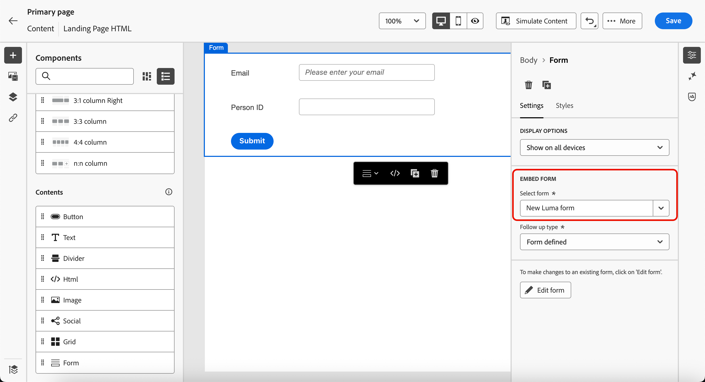

   >[!NOTE]
   >
   >您可以使用&#x200B;**[!UICONTROL 編輯表單]**&#x200B;按鈕更新選取的表單。 表單會在新標籤中開啟。 編輯表單內容的步驟在[本節](#create-form)中有詳細說明。

1. 在&#x200B;**[!UICONTROL 後續追蹤型別]**&#x200B;區段中，設定使用者填寫表單時會發生什麼情況：

   * 選擇&#x200B;**[!UICONTROL 已定義的表單]**&#x200B;以選取內嵌表單中已定義的動作。 [了解更多](#thank-you-page)

   * 您也可以選取已發佈的[登陸頁面](create-lp.md)，使用者在提交表單後會重新導向該頁面。

   * 或者，將&#x200B;**[!UICONTROL 外部URL]**&#x200B;定義為後續頁面，當使用者提交表單時，會導向該頁面。

1. 儲存並測試您的登入頁面。 [了解作法](create-lp.md#test-landing-page)

一旦您的登入頁面已[發佈](create-lp.md#publish-landing-page)並用於歷程中，當使用者填寫表單時，輸入的資訊會擷取到選取的資料集中。

>[!NOTE]
>
>如果您取消發佈用於登入頁面的表單，編輯此表單並再次發佈，則登入頁面一律使用最新發佈的表單版本。
