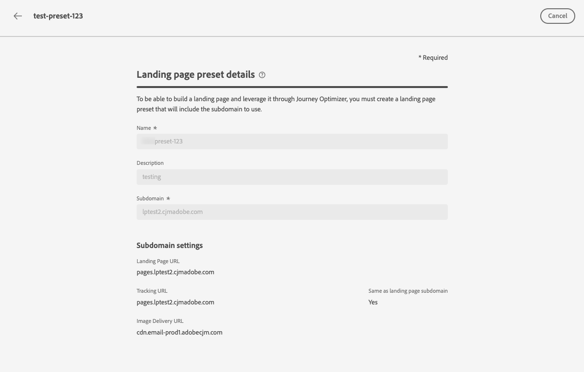

# 定義登陸頁面預設集 {#lp-presets}

>[!CONTEXTUALHELP]
>id="ajo_admin_config_lp_subdomain_header"
>title="建立一個登陸頁面預設集"
>abstract="為了建置登陸頁面並透過 Journey Optimizer 加以利用，您必須建立一個包含要使用的子網域的登陸頁面預設集。"

## 開始使用登陸頁面預設集 {#gs-lp-presets}

當[建立登陸頁面](../landing-pages/create-lp.md#create-a-lp)時，您必須選取登陸頁面預設集，才能建立登陸頁面並透過&#x200B;**[!DNL Journey Optimizer]**&#x200B;運用。 預設集包含根據此預設集用於登陸頁面的子網域。

建立預設集之前，請確定您先前已設定至少一個登陸頁面子網域。 [瞭解如何建立登陸頁面子網域](lp-subdomains.md)。

## 存取登陸頁面預設集 {#access-lp-presets}

若要存取登入頁面預設集，請遵循下列步驟：

1. 存取&#x200B;**[!UICONTROL 管理]** > **[!UICONTROL 管道]**&#x200B;功能表。

1. 選取&#x200B;**[!UICONTROL 登陸頁面設定]** > **[!UICONTROL 登陸頁面預設集]**。

   

1. 按一下任何預設集標籤以存取登陸頁面預設集詳細資料。

   

## 建立一個登陸頁面預設集 {#lp-create-preset}

若要建立登入頁面預設集，請遵循下列步驟：

1. 瀏覽&#x200B;**[!UICONTROL 管理]** > **[!UICONTROL 管道]**&#x200B;功能表，然後選取&#x200B;**[!UICONTROL 登陸頁面設定]** > **[!UICONTROL 登陸頁面預設集]**。

1. 選取&#x200B;**[!UICONTROL 建立登陸頁面預設集]**。

   

1. 輸入預設集的名稱和說明。

   名稱必須以字母(A-Z)開頭，且僅包含英數字元、底線`_`、點`.`和連字型大小`-`字元。

1. 從下拉式清單中選取登陸頁面子網域。

   

   >[!NOTE]
   >
   >若要能夠選取子網域，請確定您先前已設定至少一個登陸頁面子網域。 [了解作法](lp-subdomains.md)

   與所選子網域對應的設定隨即顯示。

1. 您可以核取&#x200B;**[!UICONTROL 與登陸頁面子網域相同]**&#x200B;選項，以選取&#x200B;**[!UICONTROL 追蹤URL]**&#x200B;的登陸頁面子網域。 [進一步瞭解追蹤](../email/message-tracking.md)

   

   例如，如果登陸頁面URL是「pages.mail.luma.com」，而追蹤URL是「data.mail.luma.com」，您可以選擇使用「pages.mail.luma.com」做為追蹤子網域。

   >[!CAUTION]
   >
   >選取的登陸頁面子網域是用來指定&#x200B;**[!UICONTROL 追蹤URL]** <!--and **[!UICONTROL Image Delivery URL]** --> （如果該子網域是使用[現有的子網域](lp-subdomains.md#lp-use-existing-subdomain)建立的）。
   >
   >如果子網域是使用[新增您自己的網域](lp-subdomains.md#lp-configure-new-subdomain)選項建立的，則會改用主要子網域（亦即第一個委派的子網域）。

1. 按一下&#x200B;**[!UICONTROL 提交]**&#x200B;以確認建立登陸頁面預設集。<!--You can also save the preset as draft and resume its configuration later on.-->

   <!---->

1. 建立登入頁面預設集後，預設集會顯示在狀態為&#x200B;**[!UICONTROL 作用中]**&#x200B;的清單中。 已準備好用於您的登入頁面。

您現在已準備好在[中](../landing-pages/create-lp.md)建立登入頁面[!DNL Journey Optimizer]。
<!--
>[!NOTE]
>
>Learn how to create channel configurations for push notifications and emails in [this section](channel-surfaces.md).-->

**相關主題**：

* [開始使用登陸頁面](../landing-pages/get-started-lp.md)
* [建立登陸頁面](../landing-pages/create-lp.md#create-a-lp)
