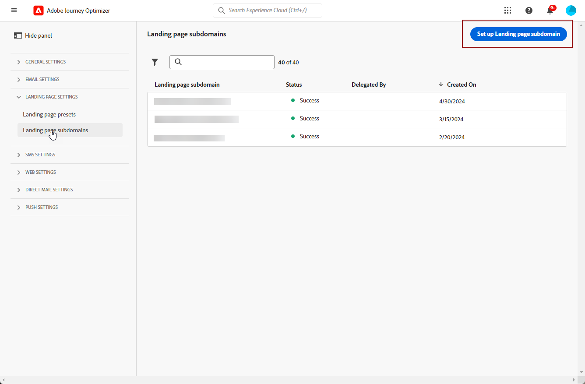

# 設定登陸頁面子網域 {#lp-subdomains}

>[!CONTEXTUALHELP]
>id="ajo_admin_subdomain_lp_header"
>title="委派登陸頁面子網域"
>abstract="您將設定您的子網域以供登陸頁面使用。您可以使用已委派給 Adobe 的子網域，或設定另一個子網域。"

>[!CONTEXTUALHELP]
>id="ajo_admin_subdomain_lp"
>title="委派登陸頁面子網域"
>abstract="您必須設定要用於登陸頁面的子網域，因為您需要此子網域才能建立登陸頁面預設集。 您可以使用已委派給 Adobe 的子網域，或設定新的子網域。"
>additional-url="https://experienceleague.adobe.com/docs/journey-optimizer/using/landing-pages/lp-configuration/lp-presets.html?lang=zh-Hant#lp-create-preset" text="建立登陸頁面預設集"

>[!CONTEXTUALHELP]
>id="ajo_admin_config_lp_subdomain"
>title="建立一個登陸頁面預設集"
>abstract="為了能夠建立登陸頁面預設集，請確保您之前已設定了至少一個登陸頁面子網域，才能從子網域名稱清單中挑選。"
>additional-url="https://experienceleague.adobe.com/docs/journey-optimizer/using/landing-pages/lp-configuration/lp-presets.html?lang=zh-Hant#lp-create-preset" text="建立登陸頁面預設集"

若要能夠[建立登陸頁面預設集](lp-presets.md)，您必須設定您將用於登陸頁面的子網域。

您可以使用已委派給Adobe的子網域，也可以設定另一個子網域。 在[本節](../configuration/delegate-subdomain.md)中進一步瞭解將子網域委派給Adobe。

>[!CAUTION]
>
>登陸頁面子網域設定對所有環境都是通用的。 因此：
>
>* 若要存取及編輯登陸頁面子網域，您必須對生產沙箱具有&#x200B;**[!UICONTROL 管理登陸頁面子網域]**&#x200B;許可權。
>
> * 對登陸頁面子網域所做的任何修改也會影響生產沙箱。

## 使用現有的子網域 {#lp-use-existing-subdomain}

若要使用已委派給Adobe的子網域，請遵循下列步驟。

1. 存取&#x200B;**[!UICONTROL 管理]** > **[!UICONTROL 管道]**&#x200B;功能表，然後選取&#x200B;**[!UICONTROL 登陸頁面設定]** > **[!UICONTROL 登陸頁面子網域]**。

1. 按一下&#x200B;**[!UICONTROL 設定子網域]**。

   

1. 從&#x200B;**[!UICONTROL 組態型別]**&#x200B;區段中選取&#x200B;**[!UICONTROL 使用委派網域]**。

   

1. 輸入要顯示在登入頁面URL中的前置詞。

   >[!NOTE]
   >
   >只允許使用英數字元和連字型大小。

1. 從清單中選取委派的子網域。

   >[!NOTE]
   >
   >您無法選取已用作登陸頁面子網域的子網域。

   <!--Capital letters are not allowed in subdomains. TBC by PM-->

   

   請注意，您無法使用相同上層網域的多個委派子網域。 例如，如果已針對您的登入頁面將「marketing1.yourcompany.com」委派給Adobe，您將無法使用「marketing2.yourcompany.com」。 不過，支援登陸頁面的多層子網域可繼續使用「marketing1.yourcompany.com」的子網域（例如「email.marketing1.yourcompany.com」）或不同的上層網域。

   >[!CAUTION]
   >
   >如果您選取使用[CNAME方法](../configuration/delegate-subdomain.md#cname-subdomain-delegation)委派給Adobe的網域，您必須在您的代管平台上建立DNS記錄。 若要產生DNS記錄，此程式與您設定新登陸頁面子網域時的程式相同。 在[本節](#lp-configure-new-subdomain)中瞭解如何操作。

1. 按一下&#x200B;**[!UICONTROL 提交]**。

1. 提交後，子網域會顯示在狀態為&#x200B;**[!UICONTROL 處理中]**&#x200B;的清單中。 如需子網域狀態的詳細資訊，請參閱[本區段](../configuration/about-subdomain-delegation.md#access-delegated-subdomains).<!--Same statuses?-->

   

   >[!NOTE]
   >
   >您必須等到Adobe執行必要的檢查，才能使用該子網域傳送訊息，最多可能需要4小時。<!--Learn more in [this section](delegate-subdomain.md#subdomain-validation).-->

1. 檢查成功後，子網域會取得&#x200B;**[!UICONTROL Success]**&#x200B;狀態。 它已準備好用來建立登入頁面預設集。

## 設定新的子網域 {#lp-configure-new-subdomain}

>[!CONTEXTUALHELP]
>id="ajo_admin_lp_subdomain_dns"
>title="產生相符的 DNS 記錄"
>abstract="若要設定新的登陸頁面子網域，您需要將 Journey Optimizer 介面中顯示的 Adobe 名稱伺服器資訊複製後貼到您的網域託管解決方案中，以產生相符的 DNS 記錄。一旦檢查成功，子網域就準備好可用於建立登陸頁面預設集了。"

若要設定新的子網域，請遵循下列步驟。

1. 存取&#x200B;**[!UICONTROL 管理]** > **[!UICONTROL 管道]**&#x200B;功能表，然後選取&#x200B;**[!UICONTROL 登陸頁面設定]** > **[!UICONTROL 登陸頁面子網域]**。

1. 按一下&#x200B;**[!UICONTROL 設定子網域]**。

1. 從&#x200B;**[!UICONTROL 組態型別]**&#x200B;區段中選取&#x200B;**[!UICONTROL 新增您自己的網域]**。

   

1. 指定要委派的子網域。

   >[!CAUTION]
   >
   >您無法使用現有的登陸頁面子網域。
   >
   >子網域中不允許使用大寫字母。

   不允許將無效的子網域委派給Adobe。 請務必輸入貴組織所擁有的有效子網域，例如marketing.yourcompany.com。

   >[!NOTE]
   >
   >對於登入頁面，支援多層級子網域。 例如，您可以使用「email.marketing.yourcompany.com」。

1. 將會顯示要放置在DNS伺服器中的記錄。 複製此記錄或下載CSV檔案，然後導覽至您的網域託管解決方案，以產生相符的DNS記錄。

1. 請確定已在您的網域託管解決方案中產生DNS記錄。 如果所有專案皆已正確設定，請勾選「我確認……」方塊，然後按一下&#x200B;**[!UICONTROL 提交]**。

   

   >[!NOTE]
   >
   >當您設定新的登陸頁面子網域時，它將永遠指向CNAME記錄。

1. 提交子網域委派後，子網域會顯示在狀態為&#x200B;**[!UICONTROL 處理中]**&#x200B;的清單中。 如需子網域狀態的詳細資訊，請參閱[本區段](../configuration/about-subdomain-delegation.md#access-delegated-subdomains).<!--Same statuses?-->

   >[!NOTE]
   >
   >您必須先等到Adobe執行必要的檢查，才能將該子網域用於登入頁面，最多可能需要4小時。<!--Learn more in [this section](#subdomain-validation).-->

1. 檢查成功後，子網域會取得&#x200B;**[!UICONTROL Success]**&#x200B;狀態。 它已準備好用來建立登入頁面預設集。

   請注意，如果您無法在託管解決方案上建立驗證記錄，子網域將會標示為&#x200B;**[!UICONTROL 失敗]**。
