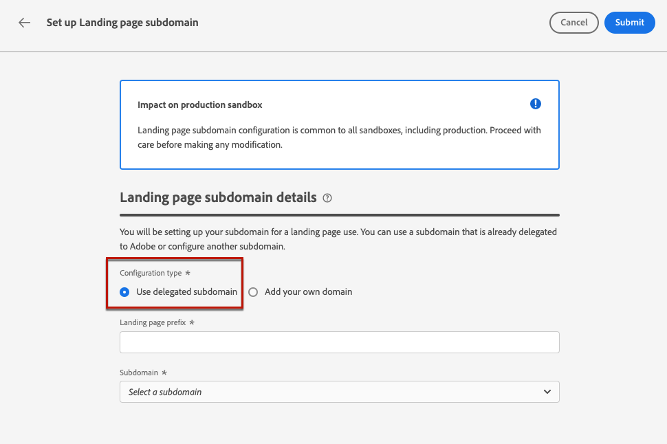

# 設定登陸頁面子網域 {#lp-subdomains}

>[!CONTEXTUALHELP]
>id="ajo_admin_subdomain_lp_header"
>title="委派登陸頁面子網域"
>abstract="您將設定您的子網域以供登陸頁面使用。您可以使用已委派給 Adobe 的子網域，或設定另一個子網域。"

>[!CONTEXTUALHELP]
>id="ajo_admin_subdomain_lp"
>title="委派登陸頁面子網域"
>abstract="您必須設定要用於登陸頁面的子網域，因為您需要此子網域才能建立登陸頁面預設集。 您可以使用已委派給 Adobe 的子網域，或設定新的子網域。"
>additional-url="https://experienceleague.adobe.com/docs/journey-optimizer/using/landing-pages/lp-configuration/lp-presets.html#lp-create-preset" text="建立登陸頁面預設集"

>[!CONTEXTUALHELP]
>id="ajo_admin_config_lp_subdomain"
>title="建立一個登陸頁面預設集"
>abstract="為了能夠建立登陸頁面預設集，請確保您之前已設定了至少一個登陸頁面子網域，才能從子網域名稱清單中挑選。"
>additional-url="https://experienceleague.adobe.com/docs/journey-optimizer/using/landing-pages/lp-configuration/lp-presets.html#lp-create-preset" text="建立登陸頁面預設集"

能夠 [建立登錄頁預設](lp-presets.md)，必須設定用於登錄頁的子域。

可以使用已委派給Adobe的子域，或配置其他子域。 瞭解有關將子域委託給Adobe的詳細資訊 [此部分](../configuration/delegate-subdomain.md)。

>[!CAUTION]
>
>登錄頁子域配置對所有環境都是通用的。 因此，對登錄頁子域的任何修改也會影響生產沙箱。

## 使用現有子域 {#lp-use-existing-subdomain}

要使用已委託給Adobe的子域，請執行以下步驟。

1. 訪問 **[!UICONTROL 管理]** > **[!UICONTROL 頻道]** ，然後選擇 **[!UICONTROL 電子郵件配置]** > **[!UICONTROL 登錄頁子域]**。

   

1. 按一下 **[!UICONTROL 設定子域]**。

   

1. 選擇 **[!UICONTROL 使用委託域]** 從 **[!UICONTROL 配置類型]** 的子菜單。

   

1. 輸入將在登錄頁URL中顯示的前置詞。

   >[!NOTE]
   >
   >只允許使用字母數字字元和連字元。

1. 從清單中選擇委派的子域。

   >[!NOTE]
   >
   >不能選擇已用作登錄頁子域的子域。

   <!--Capital letters are not allowed in subdomains. TBC by PM-->

   

   請注意，不能使用同一父域的多個委託子域。 例如，如果已將「marketing1.yourcompany.com」委託給登錄頁的Adobe，則您將無法使用「marketing2.yourcompany.com」。 但是，登錄頁支援多級子域，您可以繼續使用「marketing1.yourcompany.com」（如「email.marketing1.yourcompany.com」）的子域或其他父域。

   >[!CAUTION]
   >
   >如果您選擇的域是使用 [CNAME方法](../configuration/delegate-subdomain.md#cname-subdomain-delegation)，必須在托管平台上建立DNS記錄。 要生成DNS記錄，該過程與配置新登錄頁子域時的過程相同。 瞭解 [此部分](#lp-configure-new-subdomain)。

1. 按一下&#x200B;**[!UICONTROL 提交]**。

1. 提交後，子域將顯示在清單中 **[!UICONTROL 處理]** 狀態。 有關子域狀態的詳細資訊，請參閱 [此部分](../configuration/about-subdomain-delegation.md#access-delegated-subdomains)。<!--Same statuses?-->

   

   >[!NOTE]
   >
   >在能夠使用該子域發送消息之前，必須等待Adobe執行所需的檢查，這可能需要4小時。<!--Learn more in [this section](delegate-subdomain.md#subdomain-validation).-->

1. 檢查成功後，子域將 **[!UICONTROL 成功]** 狀態。 它已準備好用於建立登錄頁預設。

## 配置新子域 {#lp-configure-new-subdomain}

>[!CONTEXTUALHELP]
>id="ajo_admin_lp_subdomain_dns"
>title="產生相符的 DNS 記錄"
>abstract="若要設定新的登陸頁面子網域，您需要將 Journey Optimizer 介面中顯示的 Adobe 名稱伺服器資訊複製後貼到您的網域託管解決方案中，以產生相符的 DNS 記錄。一旦檢查成功，子網域就準備好可用於建立登陸頁面預設集了。"

要配置新子域，請執行以下步驟。

1. 訪問 **[!UICONTROL 管理]** > **[!UICONTROL 頻道]** ，然後選擇 **[!UICONTROL 電子郵件配置]** > **[!UICONTROL 登錄頁子域]**。

1. 按一下 **[!UICONTROL 設定子域]**。

1. 選擇 **[!UICONTROL 添加您自己的域]** 從 **[!UICONTROL 配置類型]** 的子菜單。

   

1. 指定要委託的子域。

   >[!CAUTION]
   >
   >不能使用現有登錄頁子域。
   >
   >子域中不允許使用大寫字母。

   不允許將無效的子域委託給Adobe。 確保輸入組織擁有的有效子域，如marketing.yourcompany.com。

   >[!NOTE]
   >
   >對於登錄頁，支援多級子域。 例如，您可以使用「email.marketing.yourcompany.com」。

1. 將顯示要放置在DNS伺服器中的記錄。 複製此記錄，或下載CSV檔案，然後導航到域托管解決方案以生成匹配的DNS記錄。

1. 確保已在域托管解決方案中生成DNS記錄。 如果所有內容都配置正確，請選中「I confirm...（我確認……）」框，然後按一下 **[!UICONTROL 提交]**。

   

   >[!NOTE]
   >
   >配置新登錄頁子域時，它始終指向CNAME記錄。

1. 提交子域委派後，子域將顯示在清單中， **[!UICONTROL 處理]** 狀態。 有關子域狀態的詳細資訊，請參閱 [此部分](../configuration/about-subdomain-delegation.md#access-delegated-subdomains)。<!--Same statuses?-->

   >[!NOTE]
   >
   >在能夠將該子域用於登錄頁之前，您必須等待Adobe執行所需的檢查，這可能需要4小時。<!--Learn more in [this section](#subdomain-validation).-->

1. 檢查成功後，子域將 **[!UICONTROL 成功]** 狀態。 它已準備好用於建立登錄頁預設。

   請注意，子域將標籤為 **[!UICONTROL 失敗]** 如果您未能在托管解決方案上建立驗證記錄。
