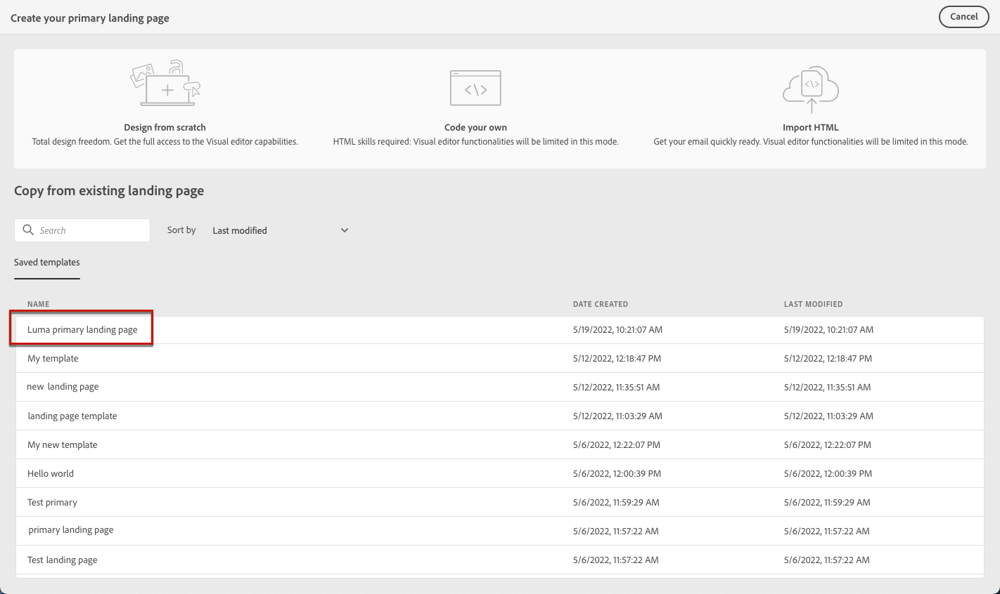

# 使用登錄頁面範本 {#work-with-templates}

## 將頁面儲存為範本 {#save-as-template}

在您設計 [登陸頁面內容](lp-content.md)，您可以儲存它以供日後重複使用。 若要這麼做，請遵循下列步驟。

1. 按一下螢幕右上方的刪節號。

1. 選擇 **[!UICONTROL Save design template]** 從下拉式功能表。

   

1. 為此模板添加名稱。

   

1. 按一下 **[!UICONTROL Save]**.

下次您建立登錄頁面時，可以使用此範本來建置內容。 了解 [節](#use-saved-template) 下方。

## 使用已儲存的範本 {#use-saved-template}

1. 開啟 [登陸頁面內容設計工具](design-lp.md). 隨即顯示所有先前儲存的範本清單。

1. 你可以對它們進行排序 **[!UICONTROL By name]**, **[!UICONTROL Last modified]** 和 **[!UICONTROL Last created]**.

   

1. 從清單中選取您選取的範本。

1. 選取後，您可以使用左右箭頭在所有儲存的範本之間導覽。

   

1. 按一下 **[!UICONTROL Use this landing page]**.

1. 使用登錄頁面設計工具，視需要編輯內容。

>[!NOTE]
>
>主要頁面範本和子頁面範本是分別管理的，這表示您無法使用主要頁面範本來建立子頁面，反之亦然。
