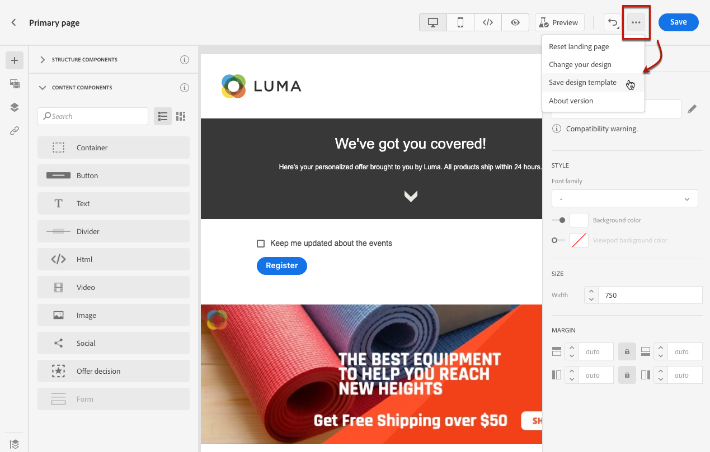
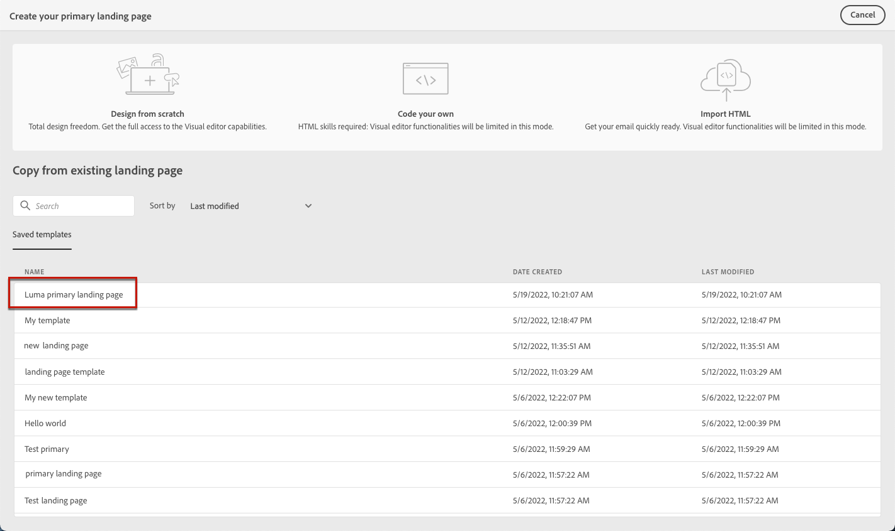

# 使用登陸頁面範本 {#work-with-templates}

## 將頁面儲存為範本 {#save-as-template}

一旦您設計[登陸頁面內容](lp-content.md)後，您就可以儲存它以供日後重複使用。 請依照下列步驟以執行此操作。

1. 按一下畫面右上方的省略符號。

1. 從下拉式功能表中選取&#x200B;**[!UICONTROL 另存為內容範本]**。

   

1. 為此範本新增名稱。

   

1. 按一下&#x200B;**[!UICONTROL 儲存]**。

下次建立登入頁面時，您可以使用此範本建立內容。 在以下[小節](#use-saved-template)中瞭解如何操作。

## 使用儲存的範本 {#use-saved-template}

1. 開啟[登陸頁面內容設計工具](design-lp.md)。 所有先前儲存的範本清單隨即顯示。

1. 你可以&#x200B;**[!UICONTROL 依名稱]**、**[!UICONTROL 上次修改日期]**&#x200B;和&#x200B;**[!UICONTROL 上次建立日期]**&#x200B;來排序儲存的範本。

   

1. 從清單中選取您選擇的範本。

1. 選取後，您可以使用左右箭頭在所有儲存的範本之間導覽。

   

1. 按一下&#x200B;**[!UICONTROL 使用此範本]**。

1. 使用登入頁面設計工具，視需要編輯您的內容。

>[!NOTE]
>
>主要頁面範本和子頁面範本是分開管理的，這表示您無法使用主要頁面範本建立子頁面，反之亦然。
