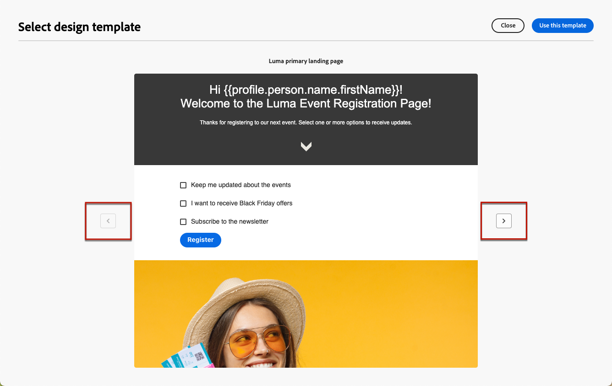

# 使用登錄頁模板 {#work-with-templates}

## 將頁面另存為模板 {#save-as-template}

一旦你設計好 [登錄頁內容](lp-content.md)，您可以保存它以備將來重新使用。 請依照下列步驟以執行此操作。

1. 按一下螢幕右上角的省略號。

1. 選擇 **[!UICONTROL Save design template]** 的下界。

   

1. 為此模板添加名稱。

   

1. 按一下「**[!UICONTROL Save]**」。

下次建立登錄頁時，可以使用此模板構建內容。 瞭解 [節](#use-saved-template) 下。

## 使用保存的模板 {#use-saved-template}

1. 開啟 [登錄頁內容設計](design-lp.md)。 將顯示所有先前保存的模板的清單。

1. 你可以對它們進行排序 **[!UICONTROL By name]**。 **[!UICONTROL Last modified]** 和 **[!UICONTROL Last created]**。

   

1. 從清單中選擇您選擇的模板。

1. 選中後，可以使用左和右箭頭在所有保存的模板之間導航。

   

1. 按一下「**[!UICONTROL Use this landing page]**」。

1. 使用登錄頁設計器根據需要編輯內容。

>[!NOTE]
>
>首頁模板和子頁模板是單獨管理的，這意味著不能使用首頁模板建立子頁，反之亦然。
