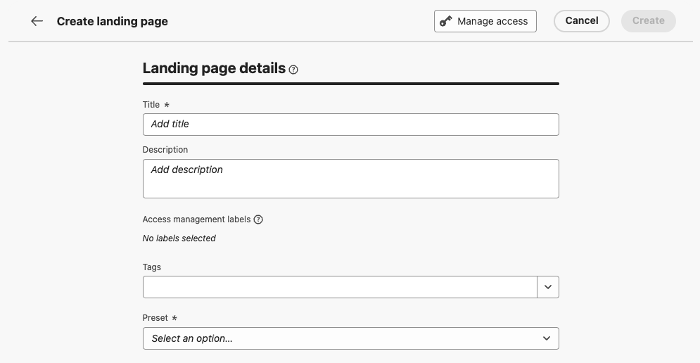
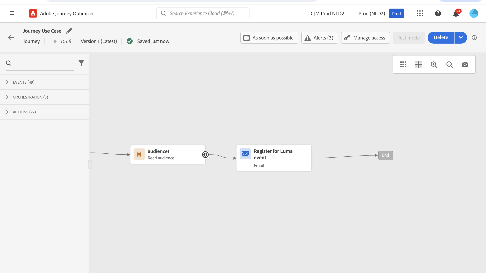
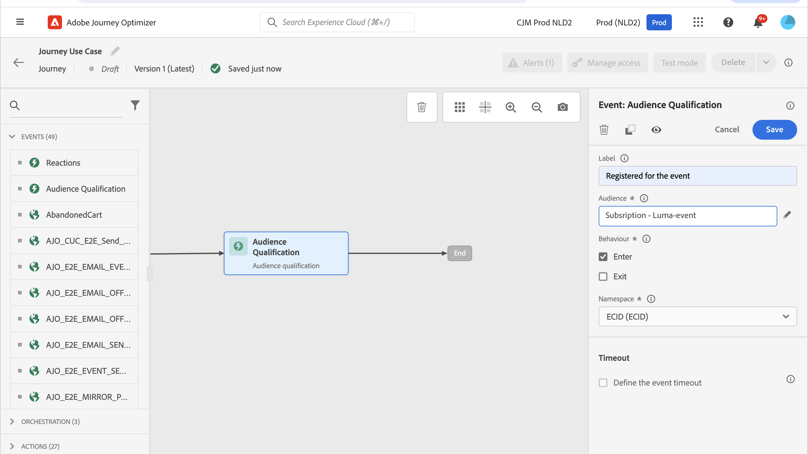
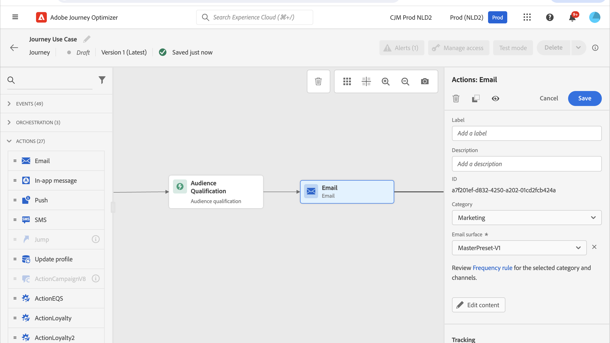
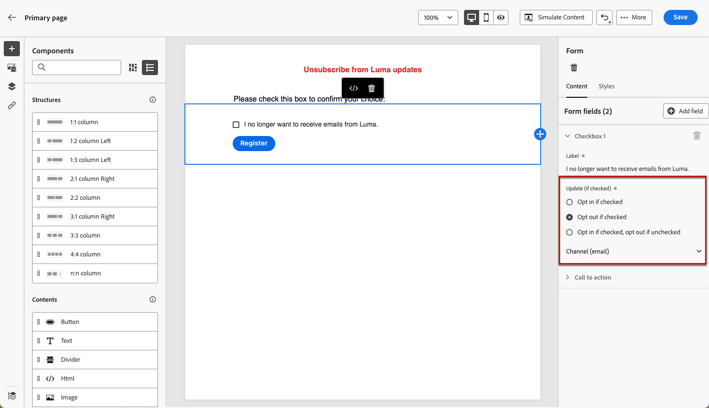
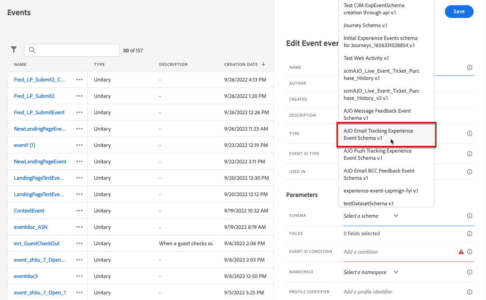
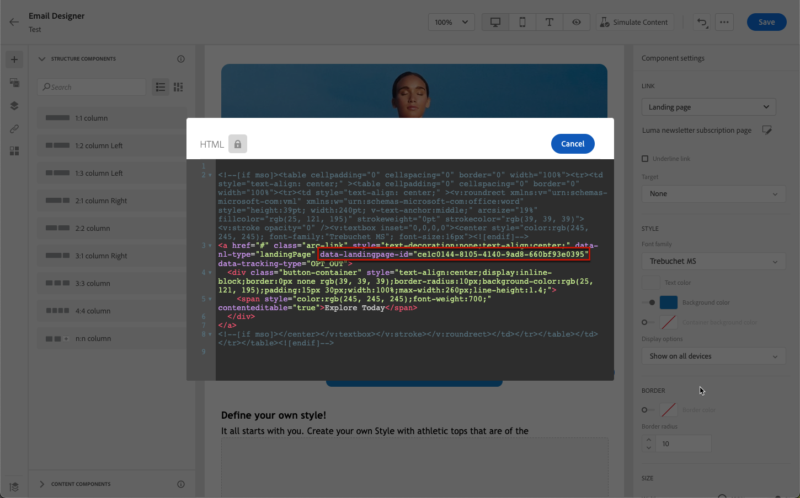

# 登陸頁面使用案例 {#lp-use-cases}

以下是如何使用[!DNL Journey Optimizer]登陸頁面，讓客戶選擇加入/退出接收部分或全部通訊的部分範例。

## 訂閱服務 {#subscription-to-a-service}

最常見的使用案例之一，就是透過登入頁面，邀請您的客戶[訂閱服務](subscription-list.md) （例如電子報或活動）。 主要步驟如下圖所示：

例如，假設您在下個月組織活動，且您要啟動活動註冊行銷活動<!--to keep your customers that are interested updated on that event-->。 為此，您將傳送一封電子郵件，其中包含登陸頁面的連結，可讓您的收件者註冊此事件。 註冊的使用者將新增至您為此目的建立的訂閱清單中。

### 設定登入頁面 {#set-up-lp}

若要設定事件註冊的登入頁面，請建立訂閱清單、設計包含登錄檔單的登入頁面，並設定必要的頁面和設定。 請依照下列步驟操作：

1. 建立事件註冊的訂閱清單，此清單將儲存註冊的使用者。 在[此處](subscription-list.md#define-subscription-list)瞭解如何建立訂閱清單。

   

1. [建立登入頁面](create-lp.md)，讓您的收件者註冊您的活動。

   

1. 設定註冊[主要登陸頁面](create-lp.md#configure-primary-page)。

1. 設計[登入頁面內容](design-lp.md)時，請選取您建立的訂閱清單，以使用選取註冊核取方塊的設定檔進行更新。

   

1. 建立「感謝您」頁面，在收件者提交登錄檔單後，此頁面就會顯示給收件者。 在[此處](create-lp.md#configure-subpages)瞭解如何設定登入子頁面。

   

1. [發佈](create-lp.md#publish-landing-page)登入頁面。

1. 在[歷程](../building-journeys/journey.md)中，新增&#x200B;**電子郵件**&#x200B;活動以將流量引導至註冊登入頁面。

   

1. [設計電子郵件](../email/get-started-email-design.md)以宣告您的活動已開放註冊。

1. [將連結](../email/message-tracking.md#insert-links)插入您的訊息內容。 選取&#x200B;**[!UICONTROL 登陸頁面]**&#x200B;作為&#x200B;**[!UICONTROL 連結型別]**，並選擇您為註冊建立的[登陸頁面](create-lp.md#configure-primary-page)。

   

   >[!NOTE]
   >
   >若要能夠傳送您的訊息，請確定您選取的登入頁面尚未過期。 在本節[中瞭解如何更新到期日](create-lp.md#configure-primary-page)。

   收到電子郵件後，如果您的收件者按一下登陸頁面的連結，則會被導向至「感謝您」頁面，且會將其新增至訂閱清單。

### 傳送確認電子郵件 {#send-confirmation-email}

此外，您也可以傳送確認電子郵件給註冊了您事件的收件者。 若要執行此操作，請遵循下列步驟。

1. 建立另一個[歷程](../building-journeys/journey.md)。 您可以按一下&#x200B;**[!UICONTROL 建立歷程]**&#x200B;按鈕，直接從登入頁面執行此作業。 [了解更多](create-lp.md#configure-primary-page)

   

1. 展開&#x200B;**[!UICONTROL 事件]**&#x200B;類別，並將&#x200B;**[!UICONTROL 對象資格]**&#x200B;活動放入您的畫布中。 [了解更多](../building-journeys/audience-qualification-events.md)

1. 按一下&#x200B;**[!UICONTROL 對象]**&#x200B;欄位，然後選取您建立的訂閱清單。

   

1. 新增您選擇的確認電子郵件，並透過歷程傳送。

   

所有註冊您事件的使用者都會收到確認電子郵件。

<!--The event registration's subscription list tracks the profiles who registered and you can send them targeted event updates.-->

## 選擇退出登陸頁面 {#opt-out}

若要讓收件者取消訂閱您的通訊內容，您可以在電子郵件中加入選擇退出登陸頁面的連結。

>[!NOTE]
>
>在[本節](../privacy/opt-out.md)中進一步瞭解如何管理收件者的同意，以及為什麼這很重要。

### 選擇退出管理 {#opt-out-management}

法律規定必須讓收件者提供能夠取消訂閱來自品牌的通訊。 進一步瞭解 [Experience Platform 文件](https://experienceleague.adobe.com/docs/experience-platform/privacy/regulations/overview.html?lang=zh-Hant){target="_blank"}中的適用法規。

因此，您必須在每封寄送給收件者的電子郵件中一律包含&#x200B;**取消訂閱連結**：

* 按一下此連結後，收件者會被導向至包含確認選擇退出按鈕的登陸頁面。
* 按一下選擇退出按鈕後，設定檔資料將會更新並包含此資訊。

### 設定電子郵件選擇退出 {#configure-opt-out}

若要讓電子郵件的收件者透過登入頁面取消訂閱您的通訊，請遵循下列步驟：

1. 建立您的登陸頁面。 [了解更多](create-lp.md)

1. 定義主要頁面。 [了解更多](create-lp.md#configure-primary-page)

1. [設計](design-lp.md)主要頁面內容：使用登入頁面特定的&#x200B;**[!UICONTROL Form]**&#x200B;元件、定義&#x200B;**[!UICONTROL 選擇退出]**&#x200B;核取方塊並選擇更新&#x200B;**[!UICONTROL 管道（電子郵件）]**：在您的登入頁面上檢查選擇退出方塊的設定檔將會從您的所有通訊中選擇退出。

   

   <!--You can also build your own landing page and host it on the third-party system of your choice.-->

1. 新增將向提交表單的使用者顯示的確認[子頁面](create-lp.md#configure-subpages)。

   

   >[!NOTE]
   >
   >請確定您參考&#x200B;**[!UICONTROL 表單]**&#x200B;元件之主要頁面&#x200B;**[!UICONTROL Call to action]**&#x200B;區段中的子頁面。 [了解更多](design-lp.md)

1. 設定並定義頁面內容後，[發佈](create-lp.md#publish-landing-page)登入頁面。

1. [在歷程中建立電子郵件訊息](../email/get-started-email-design.md)。

1. 選取內容中的文字，並使用內容相關工具列[插入連結](../email/message-tracking.md#insert-links)。 您也可以在按鈕上使用連結。

1. 從&#x200B;**[!UICONTROL 連結型別]**&#x200B;下拉式清單中選取&#x200B;**[!UICONTROL 登陸頁面]**，並選取您為選擇退出而建立的[登陸頁面](create-lp.md#configure-primary-page)。

   

   >[!NOTE]
   >
   >若要能夠傳送您的訊息，請確定您選取的登入頁面尚未過期。 在本節[中瞭解如何更新到期日](create-lp.md#configure-primary-page)。

1. 發佈並執行歷程。 [了解更多](../building-journeys/journey.md)。

1. 收到訊息後，如果收件者按一下電子郵件中的取消訂閱連結，就會顯示您的登陸頁面。

   

   如果收件者勾選方塊並提交表單：

   * 系統會將選擇退出的收件者重新導向至確認訊息畫面。

   * 設定檔資料已更新，除非再次訂閱，否則將不會收到您品牌的通訊。

若要檢查對應的輪廓選擇是否已更新，請前往 Experience Platform，並透過選取身分識別命名空間和對應的身分識別值來存取輪廓。 進一步瞭解 [Experience Platform 文件](https://experienceleague.adobe.com/docs/experience-platform/profile/ui/user-guide.html?lang=zh-Hant){target="_blank"}。

在&#x200B;**[!UICONTROL 屬性]**&#x200B;索引標籤中，您可以看到&#x200B;**[!UICONTROL 選擇]**&#x200B;的值已變更為&#x200B;**[!UICONTROL no]**。

選擇退出資訊儲存在&#x200B;**同意服務資料集**&#x200B;中。 [進一步瞭解資料集](../data/get-started-datasets.md)

>[!NOTE]
>
>如果您的預設[Adobe Experience Platform](https://experienceleague.adobe.com/docs/experience-platform/profile/home.html?lang=zh-Hant){target="_blank"} **[!UICONTROL 設定檔]**&#x200B;合併原則的合併方法是&#x200B;**[!UICONTROL 資料集優先順序]**，請務必啟用&#x200B;**[!UICONTROL AJO同意服務資料集]**，並在合併原則中將其優先順序化。 [了解更多](https://experienceleague.adobe.com/docs/experience-platform/profile/merge-policies/ui-guide.html?lang=zh-Hant#dataset-precedence-profile){target="_blank"}
>
>即使未將任何批次新增至此資料集，它仍會包含選擇加入/選擇退出資訊。

**另請參閱：**

* [一鍵選擇退出](../email/email-opt-out.md#one-click-opt-out)
* [電子郵件標題中的選擇退出連結](../email/email-opt-out.md#unsubscribe-header)

<!--

### Other ways to opt out

You can also enable your recipients to unsubscribe whithout using landing pages.

* **One-click opt-out**

    You can add a one-click opt-out link into your email content. This will enable your recipients to quickly unsubscribe from your communications, without being redirected to a landing page where they need to confirm opting out. [Learn more](../privacy/opt-out.md#opt-out-personalization)

* **Unsubscribe link in header**

    If the recipients' email client supports displaying an unsubscribe link in the email header, emails sent with [!DNL Journey Optimizer] automatically include this link. [Learn more](../email/email-opt-out.md#unsubscribe-header)

-->

## 善用登陸頁面提交事件 {#leverage-lp-event}

您可以使用在登入頁面上提交的資訊來執行進一步的動作。 例如，如果使用者訂閱指定的訂閱清單，您可以利用該資訊傳送電子郵件來建議該使用者的其他訂閱清單。

若要這麼做，您必須根據包含提交資訊的[AJO電子郵件追蹤體驗事件結構描述](../event/about-creating.md)，建立&#x200B;**[!UICONTROL 規則型單一事件]**，並[在歷程中使用此事件](../building-journeys/general-events.md)。

>[!NOTE]
>
>使用登入頁面提交事件時，請注意，事件`interactionType`欄位可能不會一律準確地反映特定使用者動作。 若要準確判斷使用者是否已選擇退出、訂閱或執行其他動作，請一律驗證實際的設定檔屬性（例如同意偏好設定）或表單欄位值，而非僅依賴事件`interactionType`。

<!--DETAILED STEPS TBC:

Follow the steps below.

1. Go to **[!UICONTROL Administration]** > **[!UICONTROL Configurations]**, and in the **[!UICONTROL Events]** section, select **[!UICONTROL Manage]**.

    

1. The list of events displays. Select **[!UICONTROL Create Event]**.

    

1. The event configuration pane opens on the right side of the screen. Configure a rule-based unitary event. [Learn more](../event/about-creating.md)

1. Define the schema: select **[!UICONTROL AJO Email Tracking Experience Event Schema v.1]** (available by default in [!DNL Journey Optimizer]).

    

1. In the **[!UICONTROL Fields]** section, select the following elements:

    * **[!UICONTROL _experience]** > **[!UICONTROL customerJourneyManagement]** > **[!UICONTROL messageInteraction]** > **[!UICONTROL Interaction Type]**
    
    * **[!UICONTROL _experience]** > **[!UICONTROL customerJourneyManagement]** > **[!UICONTROL messageInteraction]** > **[!UICONTROL Landing Page Details]** > **[!UICONTROL Landing Page ID]**

    

1. Click inside the **[!UICONTROL Event ID condition]** field. Using the simple personalization editor, define the condition for the **[!UICONTROL Interaction Type]** and **[!UICONTROL Landing Page ID]** fields. This will be used by the system to identify the events that will trigger your journey.

    

    >[!NOTE]
    >
    >To find the landing page ID, you can insert the landing page as a link into an email and select the source code from the contextual toolbar to display the landing page information.
    >
    >

1. Save your changes.

1. Create a [journey](../building-journeys/journey.md). You can do it directly from the landing page by clicking the **[!UICONTROL Create journey]** button. Learn more [here](create-lp.md#configure-primary-page)

    

1. In the journey, unfold the **[!UICONTROL Events]** category and drop the event that you created into the canvas. Learn more [here](../building-journeys/audience-qualification-events.md)

    

1. Unfold the **[!UICONTROL Actions]** category and drop an email action into the canvas.

    

///How do you use the information from the event to send an email to the users? -->
