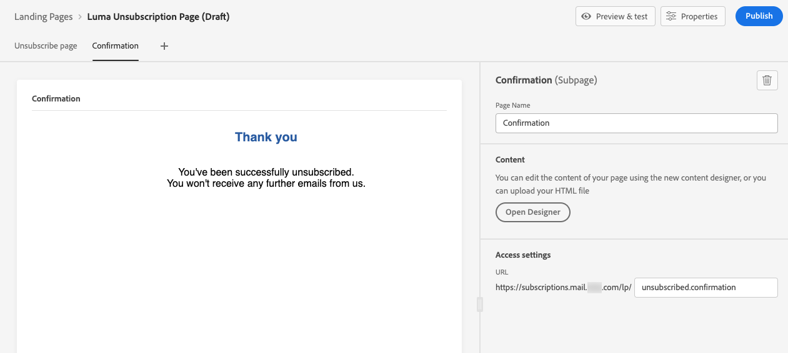

# 登錄頁面使用案例 {#lp-use-cases}

以下是一些可以使用的範例 [!DNL Journey Optimizer] 登錄頁面，讓您的客戶選擇加入/退出，拒絕接收您的部分或全部通訊。

## 訂閱服務 {#subscription-to-a-service}

最常見的使用案例之一是邀請客戶 [訂閱服務](subscription-list.md) （例如電子報或事件）。 主要步驟如下圖所示：

例如，假設您下月組織一個活動，而您想要啟動事件註冊促銷活動<!--to keep your customers that are interested updated on that event-->. 為此，您將傳送電子郵件，其中包含登錄頁面的連結，可讓您的收件者註冊此事件。 註冊的用戶將添加到您為此目的建立的訂閱清單中。

### 設定登錄頁面 {#set-up-lp}

1. 建立事件註冊的訂閱清單，該清單將儲存註冊的用戶。 了解如何建立訂閱清單 [此處](subscription-list.md#define-subscription-list).

   

1. [建立登錄頁面](create-lp.md) 讓收件者註冊您的事件。

   

1. 配置註冊 [主要登陸頁面](create-lp.md#configure-primary-page).

1. 設計 [登陸頁面內容](design-lp.md)，選取您建立的訂閱清單，以使用選取註冊核取方塊的設定檔來更新。

   

1. 建立「感謝」頁面，收件者提交註冊表單後，就會向收件者顯示該頁面。 了解如何設定登錄子頁面 [此處](create-lp.md#configure-subpages).

   

1. [發佈](create-lp.md#publish) 登陸頁面。

1. 在 [歷程](../building-journeys/journey.md)，新增 **電子郵件** 活動，將流量導向註冊登錄頁面。

   

1. [設計電子郵件](../messages/get-started-content.md) 宣佈您的活動現在已開放註冊。

1. [插入連結](../design/message-tracking.md#insert-links) 填入訊息內容。 選擇 **[!UICONTROL 登陸頁面]** 作為 **[!UICONTROL 連結類型]** 並選擇 [登陸頁面](create-lp.md#configure-primary-page) 您為註冊而建立的。

   

   >[!NOTE]
   >
   >若要傳送訊息，請確定您選取的登錄頁面尚未過期。 了解如何更新到期日 [在本節](create-lp.md#configure-primary-page).

   收到電子郵件後，如果您的收件者按一下登陸頁面的連結，會將他們導向至「感謝」頁面，並將他們新增至訂閱清單。

### 傳送確認電子郵件 {#send-confirmation-email}

此外，您也可以傳送確認電子郵件給已註冊參加您活動的收件者。 若要這麼做，請遵循下列步驟。

1. 建立其他 [歷程](../building-journeys/journey.md). 您可以按一下 **[!UICONTROL 建立歷程]** 按鈕。 深入了解 [此處](create-lp.md#configure-primary-page)

   

1. 展開 **[!UICONTROL 事件]** 類別和拖放 **[!UICONTROL 區段資格]** 活動進入您的畫布。 深入了解 [此處](../building-journeys/segment-qualification-events.md)

1. 按一下 **[!UICONTROL 區段]** 欄位，然後選取您建立的訂閱清單。

   

1. 新增您選擇的確認電子郵件，並透過歷程傳送。

   

所有註冊您事件的使用者都會收到確認電子郵件。

<!--The event registration's subscription list tracks the profiles who registered and you can send them targeted event updates.-->

## 選擇退出 {#opt-out}

若要讓收件者取消訂閱您的通訊內容，您可以在電子郵件中加入退出登錄頁面的連結。

進一步了解如何管理收件者的同意，以及為何這在 [本節](../messages/consent.md).

### 選擇退出管理 {#opt-out-management}

法律規定必須讓收件者提供能夠取消訂閱來自品牌的通訊。 進一步了解 [Experience Platform 文件](https://experienceleague.adobe.com/docs/experience-platform/privacy/regulations/overview.html?lang=zh-Hant){target=&quot;_blank&quot;} 中的適用法規。

因此，您必須在每封傳送給收件者的電子郵件中一律包含&#x200B;**取消訂閱連結**：

* 按一下此連結後，收件者會被導向至包含確認選擇退出按鈕的登陸頁面。
* 按一下選擇退出按鈕後，設定檔資料將會隨此資訊更新。

### 設定選擇退出 {#configure-opt-out}

若要讓電子郵件的收件者透過登錄頁面取消訂閱您的通訊內容，請遵循下列步驟。

1. 建立您的登錄頁面。 [了解更多](create-lp.md)

1. 定義主要頁面。 [了解更多](create-lp.md#configure-primary-page)

1. [設計](design-lp.md) 主要頁面內容：使用登錄頁面特定 **[!UICONTROL 表單]** 元件，定義 **[!UICONTROL 選擇退出]** 複選框和選擇更新 **[!UICONTROL 通道（電子郵件）]**:會從您的所有通訊中選擇退出，而會在您的登陸頁面上勾選退出方塊的設定檔。

   

   <!--You can also build your own landing page and host it on the third-party system of your choice.-->

1. 新增確認 [子頁面](create-lp.md#configure-subpages) 會顯示給提交表單的使用者。

   

   >[!NOTE]
   >
   >請務必參考主要頁面 **[!UICONTROL 行動要求]** 區段 **[!UICONTROL 表單]** 元件。 [了解更多](design-lp.md)

1. 設定並定義頁面內容後， [發佈](create-lp.md#publish) 登陸頁面。

   

1. [建立電子郵件訊息](../messages/get-started-content.md) 在歷程中。

1. 選擇內容中的文字，並使用內容相關工具列[插入連結](../design/message-tracking.md#insert-links)。您也可以在按鈕上使用連結。

   

1. 選擇 **[!UICONTROL 登陸頁面]** 從 **[!UICONTROL 連結類型]** 下拉式清單，然後選取 [登陸頁面](create-lp.md#configure-primary-page) 您為選擇退出而建立的。

   

   >[!NOTE]
   >
   >若要傳送訊息，請確定您選取的登錄頁面尚未過期。 了解如何更新到期日 [在本節](create-lp.md#configure-primary-page).

1. 發佈並執行歷程。 [了解更多](../building-journeys/journey.md)。

1. 收到訊息後，如果收件者按一下電子郵件中的取消訂閱連結，則會顯示您的登錄頁面。

   

   如果收件者核取方塊並提交表單：

   * 退出的收件者會重新導向至確認訊息畫面。

   * 設定檔資料會更新，除非再次訂閱，否則將不會從您的品牌接收通訊。

若要檢查對應的設定檔選擇是否已更新，請前往 Experience Platform，並透過選取識別名稱空間和對應的識別值來存取設定檔。 在 [Experience Platform 文件](https://experienceleague.adobe.com/docs/experience-platform/profile/ui/user-guide.html?lang=zh-Hant){target=&quot;_blank&quot;}中進一步瞭解。

在 **[!UICONTROL 屬性]** 標籤，您可以看到 **[!UICONTROL 選擇]** 已變更為 **[!UICONTROL no]**.

<!--

### Other ways to opt out

You can also enable your recipients to unsubscribe whithout using landing pages.

* **One-click opt-out**

    You can add a one-click opt-out link into your email content. This will enable your recipients to quickly unsubscribe from your communications, without being redirected to a landing page where they need to confirm opting out. [Learn more](../messages/consent.md#one-click-opt-out-link)

* **Unsubscribe link in header**

    If the recipients' email client supports displaying an unsubscribe link in the email header, emails sent with [!DNL Journey Optimizer] automatically include this link. [Learn more](../messages/consent.md#unsubscribe-header)

////////

## Leverage landing page submission event {#leverage-lp-event}

You can use information that was submitted on a landing page to send communications to your customers. For example, if a user subscribes to a given subscription list, you can leverage that information to send an email recommending other subscription lists to that user.

To do this, you need to create an event containing the landing page submission information and use it in a journey. Follow the steps below.

1. Go to **[!UICONTROL Administration]** > **[!UICONTROL Configurations]**, and in the **[!UICONTROL Events]** section, select **[!UICONTROL Manage]**.

    

1. The list of events displays. Select **[!UICONTROL Create Event]**.

    

1. The event configuration pane opens on the right side of the screen. Configure a rule-based unitary event. [Learn more](../event/about-creating.md)

1. Define the schema: select **[!UICONTROL AJO Email Tracking Experience Event Schema v.1]** (available by default in [!DNL Journey Optimizer]).

    

1. In the **[!UICONTROL Fields]** section, select the following elements:

    * **[!UICONTROL _experience]** > **[!UICONTROL customerJourneyManagement]** > **[!UICONTROL messageInteraction]** > **[!UICONTROL Interaction Type]**
    
    * **[!UICONTROL _experience]** > **[!UICONTROL customerJourneyManagement]** > **[!UICONTROL messageInteraction]** > **[!UICONTROL Landing Page Details]** > **[!UICONTROL Landing Page ID]**

    

1. Click inside the **[!UICONTROL Event ID condition]** field. Using the simple expression editor, define the condition for the **[!UICONTROL Interaction Type]** and **[!UICONTROL Landing Page ID]** fields. This will be used by the system to identify the events that will trigger your journey.

    

    >[!NOTE]
    >
    >To find the landing page ID, you can insert the landing page as a link into an email and select the source code from the contextual toolbar to display the landing page information.
    >
    >

1. Save your changes.

1. Create a [journey](../building-journeys/journey.md). You can do it directly from the landing page by clicking the **[!UICONTROL Create journey]** button. Learn more [here](create-lp.md#configure-primary-page)

    

1. In the journey, unfold the **[!UICONTROL Events]** category and drop the event that you created into the canvas. Learn more [here](../building-journeys/segment-qualification-events.md)

    

1. Unfold the **[!UICONTROL Actions]** category and drop an email action into the canvas.

    

///How do you use the information from the event to send an email to the users? -->
