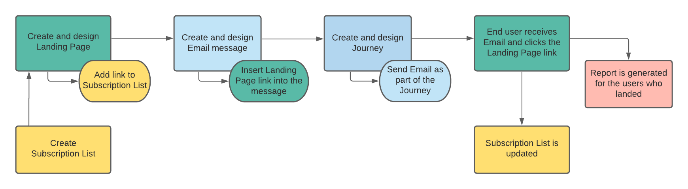
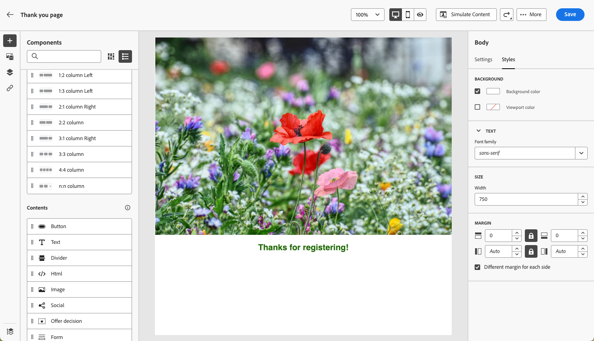
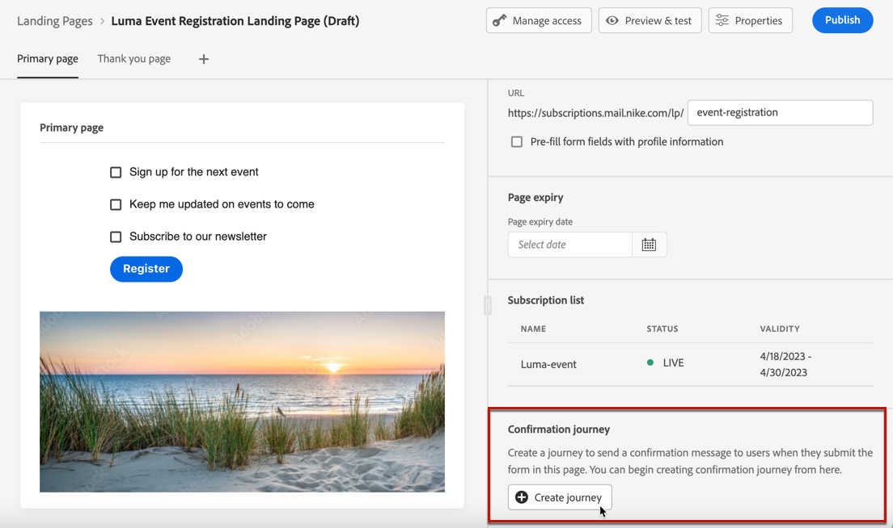
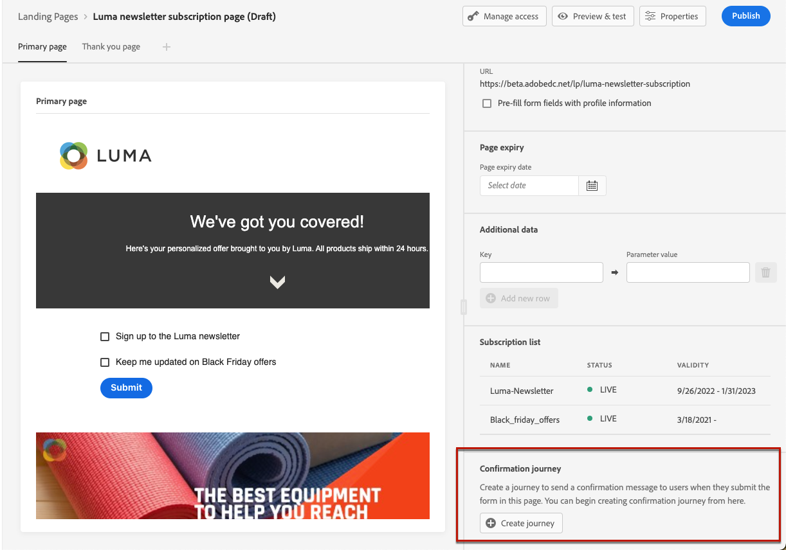

# 登陸頁面使用案例 {#lp-use-cases}

以下是如何使用的一些範例 [!DNL Journey Optimizer] 登陸頁面，讓您的客戶選擇加入/退出接收部分或全部通訊。

## 訂閱服務 {#subscription-to-a-service}

最常見的使用案例之一是邀請客戶 [訂閱服務](subscription-list.md) （例如電子報或事件）瀏覽登陸頁面。 主要步驟如下圖所示：

例如，假設您在下個月組織活動，且您要啟動事件註冊行銷活動<!--to keep your customers that are interested updated on that event-->. 若要這麼做，您將會傳送包含登陸頁面連結的電子郵件，讓您的收件者註冊此事件。 註冊的使用者將新增到您為此目的建立的訂閱清單中。

### 設定登入頁面 {#set-up-lp}

1. 建立事件註冊的訂閱清單，該清單將儲存註冊的使用者。 瞭解如何建立訂閱清單 [此處](subscription-list.md#define-subscription-list).

   

1. [建立登入頁面](create-lp.md) 讓您的收件者註冊您的事件。

   

1. 設定註冊 [主要登陸頁面](create-lp.md#configure-primary-page).

1. 設計時 [登陸頁面內容](design-lp.md)，選取您建立的訂閱清單，以使用選取註冊核取方塊的設定檔來更新它。

   

1. 建立「感謝您」頁面，在收件者提交登錄檔單後，此頁面就會顯示給收件者。 瞭解如何設定登入子頁面 [此處](create-lp.md#configure-subpages).

   

1. [發佈登陸頁面.](create-lp.md#publish)

1. 在 [歷程](../building-journeys/journey.md)，新增 **電子郵件** 將流量引導至註冊登入頁面的活動。

   

1. [設計電子郵件](../email/get-started-email-design.md) 以宣佈您的活動已開放報名。

1. [插入連結](../email/message-tracking.md#insert-links) 放入您的訊息內容。 選取 **[!UICONTROL 登陸頁面]** 作為 **[!UICONTROL 連結型別]** 並選擇 [登陸頁面](create-lp.md#configure-primary-page) 您為註冊而建立的。

   

   >[!NOTE]
   >
   >若要能夠傳送您的訊息，請確定您選取的登入頁面尚未過期。 瞭解如何更新到期日 [在本節中](create-lp.md#configure-primary-page).

   收到電子郵件後，如果您的收件者按一下登陸頁面的連結，則會被導向至「感謝您」頁面，且會將其新增至訂閱清單。

### 傳送確認電子郵件 {#send-confirmation-email}

此外，您也可以傳送確認電子郵件給註冊了您事件的收件者。 若要執行此操作，請遵循下列步驟。

1. 建立另一個 [歷程](../building-journeys/journey.md). 您可以按一下「 」，直接從登入頁面執行此操作 **[!UICONTROL 建立歷程]** 按鈕。 [了解更多](create-lp.md#configure-primary-page)

   

1. 展開 **[!UICONTROL 事件]** 類別與拖放 **[!UICONTROL 對象資格]** 活動放入您的畫布。 [了解更多](../building-journeys/audience-qualification-events.md)

1. 按一下 **[!UICONTROL 對象]** 欄位並選取您建立的訂閱清單。

   

1. 新增您選擇的確認電子郵件，並透過歷程傳送。

   

所有註冊您事件的使用者都會收到確認電子郵件。

<!--The event registration's subscription list tracks the profiles who registered and you can send them targeted event updates.-->

## 選擇退出 {#opt-out}

若要讓收件者取消訂閱您的通訊，您可以在電子郵件中加入選擇退出登陸頁面的連結。

進一步瞭解管理收件者的同意，以及這在中為何重要 [本節](../privacy/opt-out.md).

### 選擇退出管理 {#opt-out-management}

法律規定必須讓收件者能夠取消訂閱來自品牌的通訊。 進一步瞭解 [Experience Platform 文件](https://experienceleague.adobe.com/docs/experience-platform/privacy/regulations/overview.html?lang=zh-Hant)的適用法規。{target="_blank"}

因此，您必須在每封寄送給收件者的電子郵件中一律包含&#x200B;**取消訂閱連結**：

* 按一下此連結後，收件者會被導向至包含確認選擇退出按鈕的登陸頁面。
* 按一下選擇退出按鈕後，設定檔資料將會更新並包含此資訊。

### 設定選擇退出 {#configure-opt-out}

若要讓電子郵件的收件者透過登入頁面取消訂閱您的通訊，請遵循下列步驟。

1. 建立您的登陸頁面。 [了解更多](create-lp.md)

1. 定義主要頁面。 [了解更多](create-lp.md#configure-primary-page)

1. [設計](design-lp.md) 主要頁面內容：使用登入頁面特定的 **[!UICONTROL 表單]** 元件，定義 **[!UICONTROL 選擇退出]** 核取方塊並選擇以更新 **[!UICONTROL 頻道（電子郵件）]**：檢查登陸頁面上選擇退出方塊的設定檔將會選擇退出您的所有通訊。

   

   <!--You can also build your own landing page and host it on the third-party system of your choice.-->

1. 新增確認 [子頁面](create-lp.md#configure-subpages) 會向提交表單的使用者顯示。

   

   >[!NOTE]
   >
   >請確定您在主要頁面的 **[!UICONTROL 行動號召]** 部分 **[!UICONTROL 表單]** 元件。 [了解更多](design-lp.md)

1. 設定並定義頁面的內容後， [發佈](create-lp.md#publish) 登陸頁面。

1. [建立電子郵件訊息](../email/get-started-email-design.md) 在歷程中。

1. 選擇內容中的文字，並使用內容相關工具列[插入連結](../email/message-tracking.md#insert-links)。您也可以在按鈕上使用連結。

1. 選取 **[!UICONTROL 登陸頁面]** 從 **[!UICONTROL 連結型別]** 下拉式清單並選取 [登陸頁面](create-lp.md#configure-primary-page) 您為選擇退出而建立的區段。

   

   >[!NOTE]
   >
   >若要能夠傳送您的訊息，請確定您選取的登入頁面尚未過期。 瞭解如何更新到期日 [在本節中](create-lp.md#configure-primary-page).

1. 發佈並執行歷程。 [了解更多](../building-journeys/journey.md)。

1. 收到訊息後，如果收件者按一下電子郵件中的取消訂閱連結，就會顯示您的登陸頁面。

   

   如果收件者核取該方塊並提交表單：

   * 選擇退出的收件者會重新導向至確認訊息畫面。

   * 設定檔資料已更新，除非再次訂閱，否則將不會收到您品牌的通訊。

若要檢查對應的設定檔選擇是否已更新，請前往 Experience Platform，並透過選取識別名稱空間和對應的識別值來存取設定檔。 進一步瞭解 [Experience Platform檔案](https://experienceleague.adobe.com/docs/experience-platform/profile/ui/user-guide.html?lang=zh-Hant){target="_blank"}.

在 **[!UICONTROL 屬性]** 標籤中，您可以看到的值 **[!UICONTROL 選擇]** 已變更為 **[!UICONTROL 否]**.

選擇退出資訊會儲存在 **同意服務資料集**. [進一步瞭解資料集](../data/get-started-datasets.md)

>[!NOTE]
>
>如果您預設的合併方法 [Adobe Experience Platform](https://experienceleague.adobe.com/docs/experience-platform/profile/home.html?lang=zh-Hant){target="_blank"} **[!UICONTROL Profiles]** merge policy is **[!UICONTROL Dataset Precedence]**, make sure to enable the **[!UICONTROL AJO Consent Service Dataset]** and to prioritize it in the merge policy. [Learn more](https://experienceleague.adobe.com/docs/experience-platform/profile/merge-policies/ui-guide.html#dataset-precedence-profile){target="_blank"}
>
>即使未將任何批次新增至此資料集，仍會包含選擇加入/選擇退出資訊。

<!--

### Other ways to opt out

You can also enable your recipients to unsubscribe whithout using landing pages.

* **One-click opt-out**

    You can add a one-click opt-out link into your email content. This will enable your recipients to quickly unsubscribe from your communications, without being redirected to a landing page where they need to confirm opting out. [Learn more](../privacy/opt-out.md#one-click-opt-out-link)

* **Unsubscribe link in header**

    If the recipients' email client supports displaying an unsubscribe link in the email header, emails sent with [!DNL Journey Optimizer] automatically include this link. [Learn more](../privacy/opt-out.md#unsubscribe-header)

////////

## Leverage landing page submission event {#leverage-lp-event}

You can use information that was submitted on a landing page to send communications to your customers. For example, if a user subscribes to a given subscription list, you can leverage that information to send an email recommending other subscription lists to that user.

To do this, you need to create an event containing the landing page submission information and use it in a journey. Follow the steps below.

1. Go to **[!UICONTROL Administration]** > **[!UICONTROL Configurations]**, and in the **[!UICONTROL Events]** section, select **[!UICONTROL Manage]**.

    

1. The list of events displays. Select **[!UICONTROL Create Event]**.

    

1. The event configuration pane opens on the right side of the screen. Configure a rule-based unitary event. [Learn more](../event/about-creating.md)

1. Define the schema: select **[!UICONTROL AJO Email Tracking Experience Event Schema v.1]** (available by default in [!DNL Journey Optimizer]).

    

1. In the **[!UICONTROL Fields]** section, select the following elements:

    * **[!UICONTROL _experience]** > **[!UICONTROL customerJourneyManagement]** > **[!UICONTROL messageInteraction]** > **[!UICONTROL Interaction Type]**
    
    * **[!UICONTROL _experience]** > **[!UICONTROL customerJourneyManagement]** > **[!UICONTROL messageInteraction]** > **[!UICONTROL Landing Page Details]** > **[!UICONTROL Landing Page ID]**

    

1. Click inside the **[!UICONTROL Event ID condition]** field. Using the simple expression editor, define the condition for the **[!UICONTROL Interaction Type]** and **[!UICONTROL Landing Page ID]** fields. This will be used by the system to identify the events that will trigger your journey.

    

    >[!NOTE]
    >
    >To find the landing page ID, you can insert the landing page as a link into an email and select the source code from the contextual toolbar to display the landing page information.
    >
    >

1. Save your changes.

1. Create a [journey](../building-journeys/journey.md). You can do it directly from the landing page by clicking the **[!UICONTROL Create journey]** button. Learn more [here](create-lp.md#configure-primary-page)

    

1. In the journey, unfold the **[!UICONTROL Events]** category and drop the event that you created into the canvas. Learn more [here](../building-journeys/audience-qualification-events.md)

    

1. Unfold the **[!UICONTROL Actions]** category and drop an email action into the canvas.

    

///How do you use the information from the event to send an email to the users? -->
