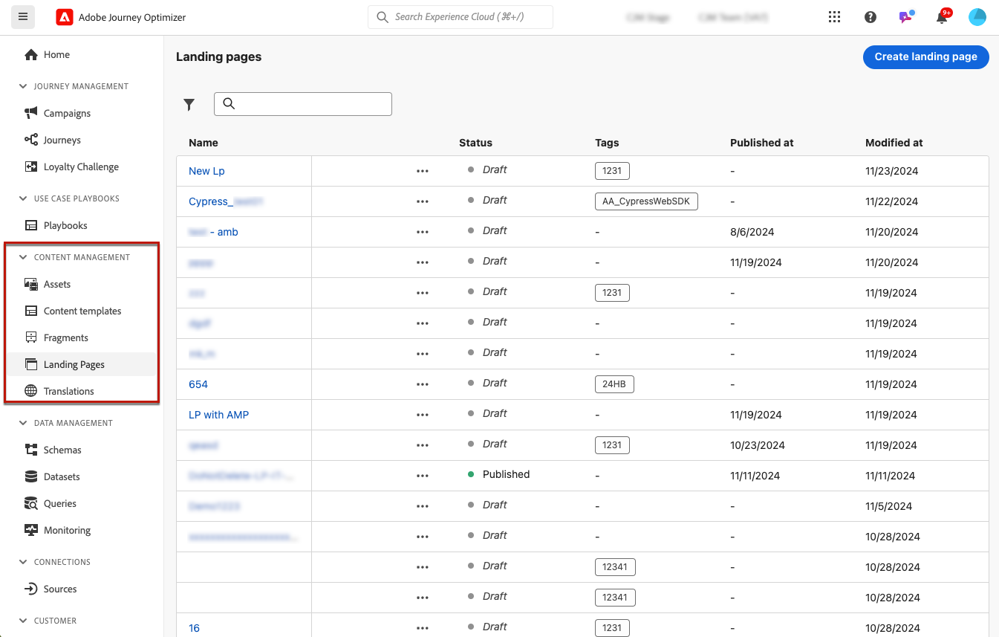
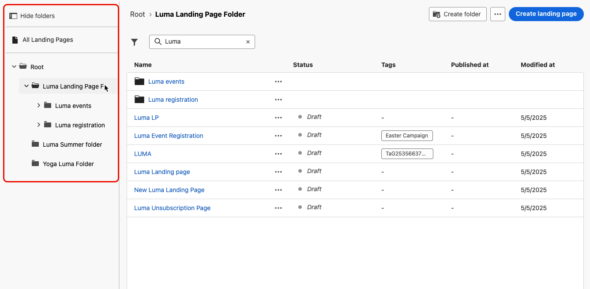
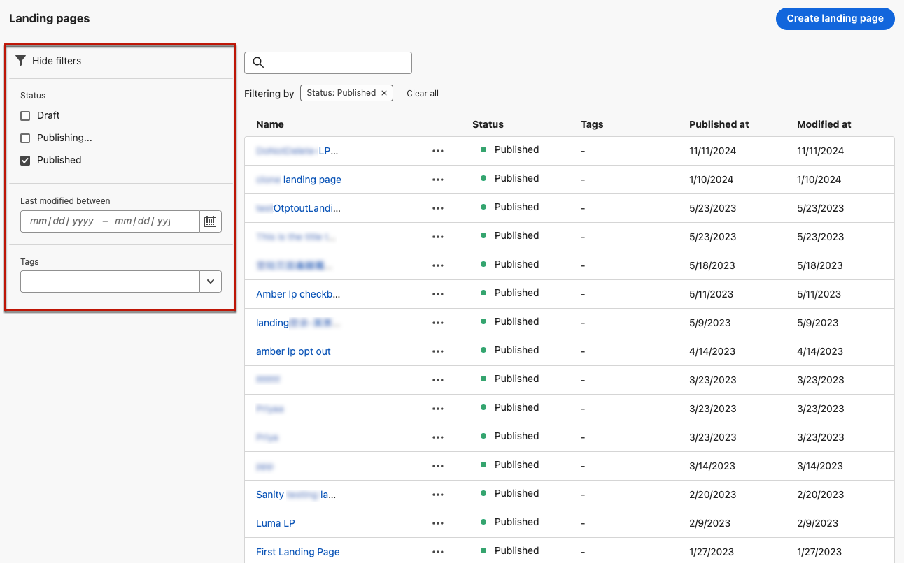
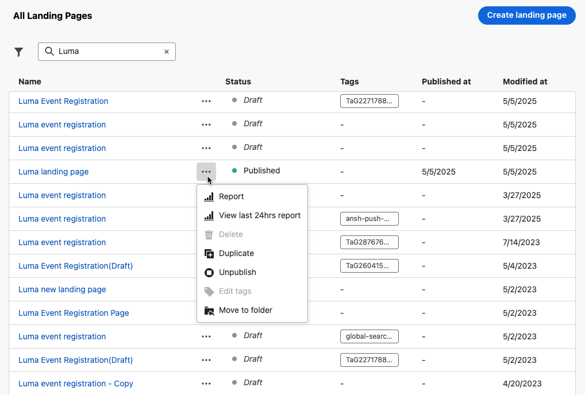
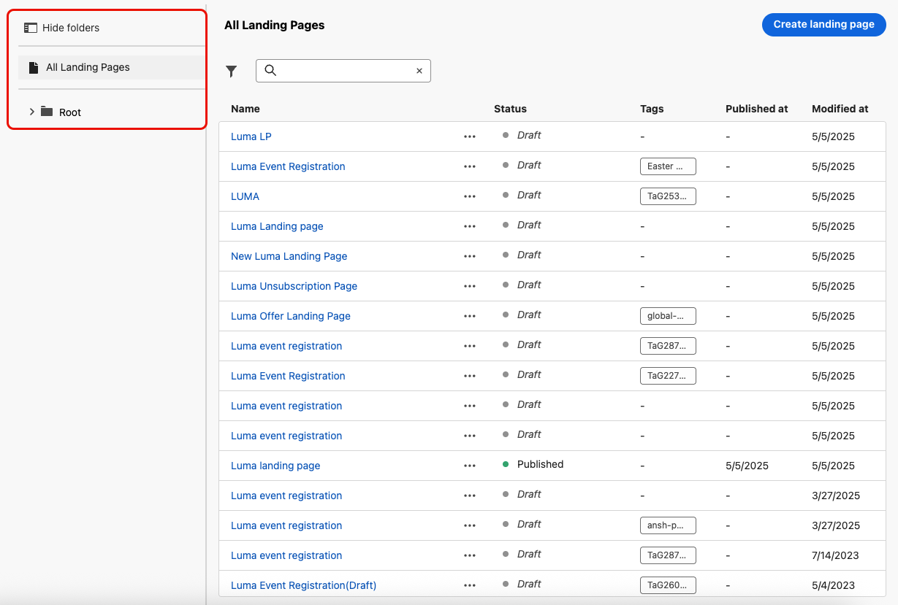
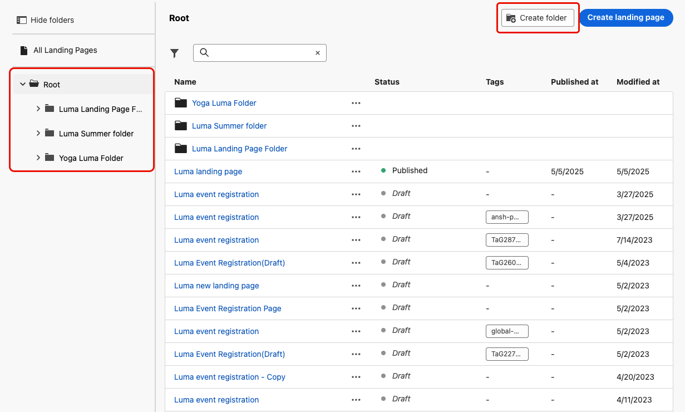
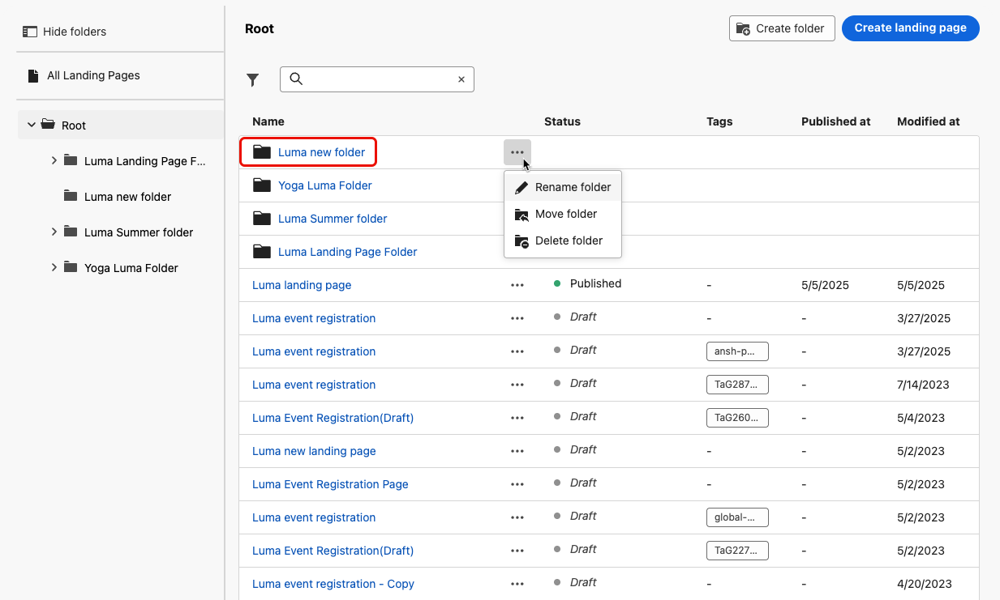
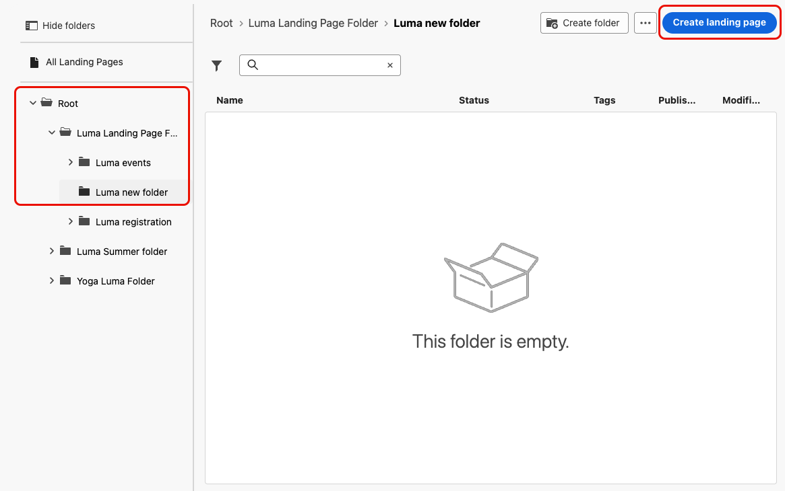

# 管理登陸頁面 {#manage-lp}

## 存取登陸頁面 {#access-landing-pages}

若要存取登入頁面清單，請從左側功能表選取&#x200B;**[!UICONTROL 內容管理]** > **[!UICONTROL 登入頁面]**。

所有現有登入頁面都會顯示。

左側的窗格可讓您將登入頁面整理到資料夾中。 預設情況下，所有項目都會顯示。 選取資料夾時，只會顯示所選資料夾中包含的登入頁面和資料夾。 [了解更多](#folders)

若要尋找特定專案，請在搜尋欄位中開始輸入名稱。 選取[資料夾](#folders)時，搜尋將套用至該資料夾<!--(not nested items)-->階層第一層級中的所有登陸頁面或資料夾。

您可以根據登入頁面的狀態、修改日期或標籤來篩選登入頁面。

從此清單中，您可以按一下登入頁面旁的三個點，然後選取所需的動作：

* 針對[已發佈](create-lp.md#publish-landing-page)登陸頁面，存取[登陸頁面報告](../reports/lp-report-global-cja.md)和[過去24小時的即時報告](../reports/lp-report-live.md)。

* **刪除**&#x200B;及&#x200B;**取消發佈**&#x200B;登入頁面。 您無法刪除[已發佈](create-lp.md#publish-landing-page)登陸頁面。 若要刪除它，您必須先取消發佈。

  >[!CAUTION]
  >
  >如果您取消發佈訊息中參照的登陸頁面，則連結至登陸頁面的連結將會中斷，且使用者嘗試存取該頁面時，將會收到錯誤頁面。

* **複製**&#x200B;任何登陸頁面。

* 編輯登入頁面的相關[標籤](../start/search-filter-categorize.md#tags)。

* 將登入頁面移至資料夾。 [了解更多](#folders)

## 使用資料夾來管理登陸頁面 {#folders}

>[!CONTEXTUALHELP]
>id="ajo_lp_folders"
>title="將您的登陸頁面整理至資料夾"
>abstract="根據組織的需求，使用資料夾來分類和管理您的登陸頁面。"

若要輕鬆導覽您的登入頁面，您可以使用資料夾更有效地將其組織到結構化階層中。 這可讓您根據組織需求將專案分類和管理。

1. 按一下&#x200B;**[!UICONTROL 所有登陸頁面]**&#x200B;按鈕，以顯示先前建立的所有專案，而不使用資料夾分組。

   

1. 按一下&#x200B;**[!UICONTROL Root]**&#x200B;資料夾以顯示所有已建立的資料夾。

   >[!NOTE]
   >
   >如果您尚未建立資料夾，則會顯示所有登陸頁面。

1. 按一下&#x200B;**[!UICONTROL 根]**&#x200B;資料夾內的任何資料夾以顯示其內容。

1. 按一下&#x200B;**[!UICONTROL 根]**&#x200B;資料夾或任何其他資料夾後，**[!DNL Create folder]**&#x200B;按鈕就會顯示。 選取它。

   

1. 輸入新資料夾的名稱，然後按一下[儲存]。**** 新資料夾會顯示在&#x200B;**[!UICONTROL 根]**&#x200B;資料夾內，或目前選取的資料夾內。

1. 您可以按一下&#x200B;**[!UICONTROL 其他動作]**&#x200B;按鈕，重新命名或刪除資料夾。

   

1. 使用&#x200B;**[!UICONTROL 更多動作]**&#x200B;按鈕，您也可以將登入頁面移至其他現有資料夾。

1. 現在您可以導覽至您剛建立的資料夾。 您[從此處](create-lp.md#create-landing-page)建立的每個新登入頁面都會儲存至目前資料夾。

   
